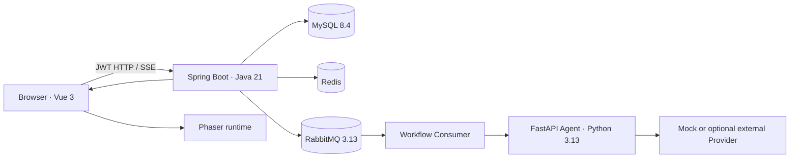

# GameDev Agent Workbench

一个面向单一 `arcade_collect` 玩法的 **LLM 可玩原型与平衡实验平台**。它把自然语言 Brief 转换为受契约约束的 GameConfig、可试玩版本和可复现导出，并围绕版本化试玩数据形成“生成—验证—试玩—调参—比较”的工程闭环。

Java 负责业务状态、事务、可靠消息、权限和遥测事实；Python 负责受控 LLM 调用与 RAG 上下文协议；Vue/Phaser 负责工作台、运行中心和可玩实验端。当前项目不宣称通用游戏生成、自主多 Agent 或生产级语义 RAG。

```powershell
# Windows PowerShell 5.1+ or PowerShell 7 + Docker Desktop
.\start-docker.ps1
# 浏览器打开 http://127.0.0.1:5173/
```

> 当前结论：**V3 轻量原型发布验收已通过**。该结论只适用于单机 `arcade_collect` 原型闭环，不代表生产高可用、模型质量、真实语义检索质量或容量承诺。下一阶段不扩展多个半成品 Runtime，而是深化平衡实验闭环，并把现有 RAG 检索桩升级为可评测、可持久化的语义检索。详见 [B 路线与 RAG 升级路线图](docs/roadmap-balance-lab-rag.md)。

## 它解决什么问题

普通的模型调用 Demo 很难回答状态如何恢复、重复请求会不会重复执行、输出能否追溯、失败时如何诊断，以及试玩数据能否对应到准确版本。这个项目把这些问题拆成一条持久化工程链路：

```text
用户 / 项目 / Prototype Brief / 知识文档
  -> 幂等提交 WorkflowRun + Outbox
  -> RabbitMQ Consumer 执行冻结的四步工作流
  -> AgentRun / Metric / RetrievalRecord / EvaluationReport
  -> Artifact / GameConfig / PrototypeVersion
  -> Phaser 试玩与服务端遥测复算
  -> 平衡建议 / 子版本 / 指标对比 / 确定性导出
```

它当前解决的是**受限玩法的快速实验和工程治理**，而不是从任意创意生成任意游戏代码。模型只生成白名单数据，Runtime 由仓库固定实现。

## 架构一览



完整组件边界、提交/执行/SSE/RAG/评测时序和数据关系见[架构与核心链路](docs/architecture/system-architecture.md)。

## 已实现能力与证据边界

| 能力 | 当前实现 | 可核验证据 |
| --- | --- | --- |
| 身份与项目隔离 | JWT、用户/项目归属校验、Artifact/Document/Retrieval/Version 等读写边界 | [R7 安全审计](docs/reports/R7-security-release-audit.md)与当前安全测试；不等价于正式合规审计 |
| 工作流领域与 Runner | 版本化定义快照、StepRun 状态、固定四步 `GAME_GENERATE` Workflow、结构化 Artifact | [R1 领域报告](docs/reports/R1-workflow-domain-report.md)、[R2 Runner 报告](docs/reports/R2-workflow-runner-report.md)、[V3 验收](docs/reports/V3-release-acceptance.md) |
| 异步可靠性骨架 | Idempotency-Key、短事务提交、Outbox、RabbitMQ Consumer、重试与恢复审计 | [R3 Harness](docs/reports/R3-08-async-integration-concurrency-harness.md)与[V3 主链路验收](docs/reports/V3-release-acceptance.md)；不宣称 exactly-once 或生产 SLA |
| 运行中心 | 服务端快照、持久化事件序号、SSE 重放、取消/重试、刷新恢复 | [R4 运行中心报告](docs/reports/R4-run-center-report.md) |
| Prompt/评测/指标 | PromptVersion 快照、Schema/Rule、Metric、mock 分层统计 | [R5 报告](docs/reports/R5-prompt-evaluation-metrics-report.md)；真实模型质量、token/cost 完整性和固定评测集仍不足 |
| 知识与 RAG 证据 | 上传、Chunk、项目隔离、实际引用记录和 RAG-on/off 协议已存在；Embedding/Vector Search 仍为确定性检索桩 | [R6 报告](docs/reports/R6-rag-knowledge-report.md)与[升级路线图](docs/roadmap-balance-lab-rag.md) |
| 可玩产物 | GameConfig 契约、Artifact eligibility、Phaser 桌面/移动 smoke | [R2 报告](docs/reports/R2-workflow-runner-report.md)、[R6 报告](docs/reports/R6-rag-knowledge-report.md) |
| V3 轻量原型闭环 | `arcade_collect` 生成、不可变版本、试玩指标、建议、确定性离线 ZIP | [V3 发布验收报告](docs/reports/V3-release-acceptance.md) |
| 可观测与安全加固 | 关联 ID、低基数指标、health/readiness、生产端点关闭、内部服务鉴权 | [R7 可观测报告](docs/reports/R7-observability-operations-report.md)、[R7 安全审计](docs/reports/R7-security-release-audit.md) |

“已实现”不等于“发布 gate 已通过”。报告中的 `BLOCKED`、环境跳过和 `NOT RUN` 均保留原义。

## 快速启动

### 前置条件

- Windows 10/11、PowerShell 7、Git、Docker Engine/Compose v2
- 至少 4 个逻辑 CPU、8 GiB 内存、20 GiB 可用磁盘
- 默认端口可用：Vue `5173`、Java `8080`、Python `8000`、MySQL `3307`

### 启动、检查、停止

```powershell
.\start-docker.ps1
docker compose ps
.\tools\verify.ps1 -Profile quick
.\tools\stop-docker.ps1
```

首次启动会生成仅供本机使用且被 Git 忽略的 `.env`，默认使用明确标记的 mock fallback，不要求个人模型凭据。详细健康门禁、端口覆盖、已有 volume 升级和安全停止方式见[Docker 一键启动](docs/docker-one-click-start.md)。

## 主链路

异步入口要求 `Idempotency-Key`：

```http
POST /api/v1/projects/{projectUuid}/workflow-runs
GET  /api/v1/workflow-runs/{workflowRunUuid}
GET  /api/v1/workflow-runs/{workflowRunUuid}/events
GET  /api/v1/workflow-runs/{workflowRunUuid}/rag-evidence
POST /api/v1/workflow-runs/{workflowRunUuid}/cancel
POST /api/v1/workflow-runs/{workflowRunUuid}/retry
```

提交只负责鉴权、幂等创建 `WorkflowRun` 和 `OutboxEvent`；Consumer 读取冻结定义执行四步 Agent，持久化 Step/Agent/Metric/Retrieval/Evaluation/Artifact。浏览器依靠快照与 SSE 序号恢复展示，不以页面内存作为事实源。详见[核心时序](docs/architecture/system-architecture.md#核心时序)。

V3 在成功生成后自动创建不可变 PrototypeVersion。试玩事件绑定具体版本并由 Java 复算指标；调参只创建子版本。平衡建议生成后，可导出包含设计、任务、GameConfig、资源 manifest、试玩摘要、建议与本地 H5 Demo 的 ZIP。相同冻结输入和幂等键返回同一作业与内容摘要，失败重试不重新调用模型。

下一阶段的产品主线是公开分享试玩、匿名遥测、样本进度、建议依据、一键派生候选版本和 A/B 对比。RAG 作为这条主线的支撑能力，用于注入项目设计约束、历史实验结论和策划知识；它必须通过固定数据集证明检索和生成增益，而不是仅凭接口存在宣称有效。

## Demo

默认 Demo 是 **DEMO / MOCK**，不能作为真实模型效果或性能证据：

```powershell
.\tools\prepare-demo.ps1
.\tools\verify-demo.ps1
.\tools\reset-demo.ps1
```

V3 主链路可用 `npm run test:e2e:main` 在已启动的 Compose 环境复现。操作口播、离线包打开方式和录屏脱敏清单见[3–5 分钟 Demo 脚本](docs/demo-script.md)。

## 如何验证

```powershell
# 快速回归：Java tests、Python compile、Vue build、Compose config
.\tools\verify.ps1 -Profile quick

# 依赖 Docker 的集成与浏览器主链路
.\tools\verify.ps1 -Profile integration
.\tools\verify.ps1 -Profile e2e

# R7 专项；结果和环境资格必须与报告一起阅读
.\tools\run-performance-baseline.ps1
.\tools\run-fault-injection.ps1
# 安全审计命令矩阵见对应报告；仓库没有一键安全脚本
```

测试退出码为 0 也不能自动证明所有 Docker 用例执行过；报告会把环境跳过单列。完整命令、结果、证据路径和归属见[报告索引](docs/reports/README.md)。

## 技术栈

- Java 21、Spring Boot 3、Spring Security/JWT、MyBatis-Plus、Flyway、Micrometer
- MySQL 8.4、Redis 7.4、RabbitMQ 3.13、Outbox + Consumer
- Python 3.13、FastAPI、Pydantic、受控 LLM Workflow/RAG 协议
- Vue 3、Vite、SSE、Playwright、Phaser
- Docker Compose、Maven、npm、PowerShell Harness

## 已知限制

- V3 只支持单场景 `arcade_collect`；不包含第二模板、复杂战斗、多关卡、原生微信包、Unity/Godot 工程或云端发布平台。
- 导出包是固定本地 Canvas Runtime，不执行 AI 生成代码；站内试玩仍由 Phaser 3 Runtime 承载。
- V3 性能数据是单机 Compose 发布基线，不是并发容量或生产 SLA。
- RAG 当前是检索协议桩：8 维确定性 fake embedding、进程内 vector store，检索没有真实语义排序且重启丢失；PDF 提取、正确 context budget、可恢复索引 job 和文档失效写 capability 尚未完成。
- 四个“Agent”是冻结定义驱动的串行 LLM Workflow，不具备模型自主工具调用、动态规划、反思或多 Agent 协商能力。
- 公开 Demo 尚未形成外部测试者可回传匿名遥测的分享闭环；现有平衡样本主要由项目所有者在受保护页面内产生。
- R7 安全 gate 缺少完整 Compose 双用户、镜像和 Maven/Python CVE 扫描；Python 生产模式关闭 mock capability 的证据缺失。
- Testcontainers 在部分历史运行中因 Docker API 兼容性跳过。性能报告没有形成可发布的 P50/P95/P99、吞吐或容量结论。
- 这是单机 Compose 工程样例，不是生产高可用、多租户 SaaS 或线上收入/用户规模证明。

## 文档导航

- [架构与核心链路](docs/architecture/system-architecture.md)
- [报告索引与复现命令](docs/reports/README.md)
- [运维 Runbook](docs/operations-runbook.md)
- [Docker 一键启动](docs/docker-one-click-start.md)
- [Demo 脚本](docs/demo-script.md)
- [面试问答](docs/interview-qa.md)
- [简历描述](docs/resume-project-description.md)
- [3–5 分钟项目讲解](docs/project-narrative.md)
- [B 路线与 RAG 升级路线图](docs/roadmap-balance-lab-rag.md)
- [AI 协作规范](docs/AI_COLLABORATION.md)与[工程陷阱](docs/PITFALLS.md)

## AI 协作与贡献说明

本项目采用“人定义契约和边界，AI 辅助探索/实现/审查，Harness 与报告裁决结果”的协作方式。AI 产出不能替代代码审查、失败归属、数据边界判断或证据验证；失败报告同样提交，不把未通过项改写成亮点。用于面试或简历时，应按实际参与情况说明自己负责的需求拆解、设计取舍、AI 变更审查、自动化验证和文档沉淀，不应声称全部代码均为未经辅助的个人手写成果。

具体工作流见[AI 协作规范](docs/AI_COLLABORATION.md)，可核验的表述模板见[面试问答](docs/interview-qa.md)和[简历描述](docs/resume-project-description.md)。
