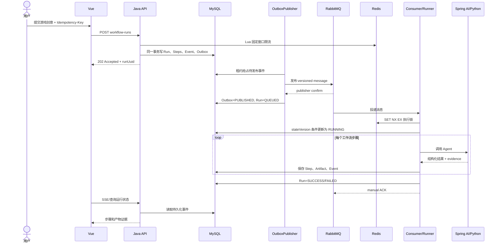

# GameDev Agent Workbench 项目深度分析与面试准备

> 分析日期：2026-08-14
> 目标岗位：Java 后端开发实习生（中小厂）
> 证据口径：本文只陈述代码、配置、迁移、测试和仓库报告能够支持的事实。

## 0. 先说结论

这是一个“受约束的小型游戏生成与自动试玩实验平台”，而不是普通 CRUD，也不是“一句话生成任意游戏”的成熟产品。用户输入游戏创意后，系统可以通过版本化工作流或 Spring AI 生成结构化规格，由 Java 做权威校验和状态控制，再驱动固定游戏运行时、自动 Player、实验 Director、人工审批及产物导出。

- 【代码确认】V4 主链路包含工作流、不可变原型版本、确定性模拟、Player 批量试玩、Director 类型化工具、人工审批、遥测和导出。证据：`backend-java/src/main/resources/db/migration/V27__add_game_generate_workflow_definition.sql` 至 `V36__add_director_experiment_loop.sql`，以及对应 Controller/Service。
- 【代码确认】V5 已实现 `GameSpec -> Java 编译/诊断 -> Runtime IR -> Cocos 构建 -> ZIP 产物` 的垂直切片，当前只支持 `arcade_collect`。证据：`GameSpecCompiler`、`GenerationRunService`、`CocosBuildWorker`、`PlayableArtifactAssembler`。
- 【代码确认】异步工作流确实使用 MySQL Outbox、RabbitMQ publisher confirm、手动 ACK、Redis 锁、数据库乐观抢占、延迟重试队列、DLQ 和恢复扫描，不是“只在 pom 里加了依赖”。
- 【代码确认】本次本机实跑：Java 232 项通过、跳过 1 项；前端 76 项通过；Python 48 项通过。测试只能证明测试覆盖的契约，不能证明生产级高并发或真实模型效果。
- 【未发现实现】V5 `GenerationRun` 状态定义包含 `AWAITING_APPROVAL/APPROVED/REJECTED`，但目前控制器只有创建、查询、构建和下载；构建成功停在 `PLAYTESTING`，没有发现 V5 同状态机内的 Player 切流、审批和发布接口。证据：`GenerationRunController`、`GenerationRunService`、`V37__add_v5_generation_control_plane.sql`。
- 【代码确认】RAG 是 fake-hash 8 维嵌入加进程内检索基线，不能写成生产级语义检索。证据：`FakeEmbeddingProvider`、`InMemoryVectorStore`。

最适合你的项目叙事不是“我做了很多微服务组件”，而是：**我把不可靠的模型输出约束成可校验、可追踪、可恢复、可人工审批的工程流水线。**

---

## 1. 项目用途

### 1.1 要解决的问题

【代码确认】LLM 可以生成游戏设计内容，但自由文本或自由代码存在幻觉、不可复现、不可审计和越权执行风险。本项目用封闭的 `GameConfig/GameSpec` 契约、Java 校验器、能力白名单、摘要、版本快照、状态机和审批门禁，把模型限制在固定能力范围内。

目标用户主要是：

1. 想快速验证小型游戏创意的独立开发者或策划；
2. 希望比较不同配置、Player Persona 或 Agent 策略的实验者；
3. 需要查看运行证据、失败诊断和可下载原型的项目所有者。

典型场景：输入一个“限时收集并到达出口”的创意，生成规格，Java 拒绝不支持的字段或越界参数，模型根据诊断最多修复三轮，构建固定 Cocos Runtime，自动 Player 运行多组 seed/persona，最后由人审批候选版本。

### 1.2 核心与辅助功能

核心功能：

- 版本化多步骤 Agent 工作流；
- 受约束 GameConfig/GameSpec 的生成、校验和编译；
- 确定性模拟、回放和机器 Player；
- Director 选择白名单工具、控制预算并保存检查点；
- 不可变原型版本、人工审批及带证据导出。

辅助功能：

- JWT 登录和项目级资源隔离；
- Redis 限流、缓存和防重锁；
- RabbitMQ 异步执行、Outbox、重试/DLQ；
- SSE 运行事件、traceId、Micrometer/Prometheus；
- 知识文档生命周期和 RAG 证据基线；
- Docker Compose、本地演示和故障/性能脚本。

### 1.3 完成度判断

| 能力 | 判断 | 证据与边界 |
|---|---|---|
| V4 工作流生成 | 【代码确认】可运行 | Java/Python/Vue 均有实现和测试；旧 Phaser 运行时被 README 标为 legacy |
| 异步消息链路 | 【代码确认】主体实现 | 首次投递可靠性较完整；执行失败重试存在 P1 状态机缺陷 |
| 确定性 Simulation/Replay | 【代码确认】较完整 | 前端单元测试含 100 次同输入同 hash 校验 |
| Player Agent | 【代码确认】可运行 | 支持确定性与逐步 LLM 策略；真实模型质量未被证明 |
| Director | 【代码确认】有真实 Spring AI 与 Python 回退 | 工具结果与幂等缓存仍为内存，重启恢复边界有限 |
| V5 Cocos 构建 | 【代码确认】垂直切片已实现 | 依赖本机 Cocos 配置；构建在 HTTP 线程同步等待，审批闭环未接上 |
| RAG | 【代码确认】原型基线 | fake embedding + 内存检索，不能作为核心卖点 |
| 生产高可用 | 【未发现实现】 | 单机 Compose、本地磁盘/内存存储，无多租户和集群证明 |

### 1.4 三种项目介绍

一句话：

> 一个用 Java 控制模型边界、工作流可靠性和产物门禁的 Agentic 小游戏生成与自动试玩平台。

30 秒：

> 我做了一个面向小游戏创意验证的 Agent 工作台。用户输入创意后，Agent 生成受约束的 GameSpec，Java 负责能力白名单、语义校验、状态机和 Cocos 构建，Python Player 会用不同 Persona 和 seed 自动试玩，Director 再根据证据选择工具或请求人工审批。后端还实现了 MySQL Outbox、RabbitMQ、Redis 防重、幂等、重试恢复和 SSE 事件。项目目前是单机工程实验台，只支持 arcade_collect，不宣称生产高并发或任意游戏生成。

2 分钟：

> 这个项目最初是一个四步 LLM 游戏设计工作流，后来我把重点从“模型能生成什么”转成“怎样让生成过程可控”。在 V4 中，Java 会冻结工作流定义和 Prompt 版本，把任务与 Outbox 在同一事务里写入 MySQL，再由 RabbitMQ 异步消费。Consumer 用 Redis 短租约锁和数据库状态版本抢占，Runner 串行执行步骤并把产物、验证结果和事件持久化。前端通过 SSE 展示运行证据。游戏侧有固定步长、固定 seed 的 Simulation Core，可以回放相同行为并校验 state hash；Python Player 支持确定性策略和逐步 LLM 策略，Director 只能调用 Java 注册的类型化工具，并受到轮次、调用数、episode、token 和时间预算限制。V5 又加入了封闭 GameSpec、Java 编译器、确定性 Runtime IR 和本地 Cocos Web Mobile 构建。我的项目亮点是用契约、状态机、摘要和人工审批约束 AI，而不是让模型直接执行任意代码。当前限制是只支持一种玩法，RAG 还是 fake embedding，Cocos 构建和部分工具结果是单机存储，MQ 执行失败重试还有一个需要修复的状态机断层。

---

## 2. 项目结构、技术栈与启动

```text
GameDev Agent Workbench/
├─ backend-java/          Spring Boot 控制面、领域状态、数据持久化、消息与构建
│  ├─ controller/         HTTP API
│  ├─ application/        工作流 Runner、Step Executor、Artifact Writer
│  ├─ service/            业务服务、Redis、Outbox、Player、遥测、导出
│  ├─ director/           Director 状态、决策客户端、工具注册和授权
│  ├─ gamespec/           V5 能力注册表、Spec Author 和 Java 编译器
│  ├─ messaging/          RabbitMQ Consumer、消息契约、错误分类
│  ├─ mapper/entity/      MyBatis-Plus 数据访问与持久化对象
│  └─ resources/db/       Flyway V1～V37 迁移
├─ python-agent/          FastAPI Agent、Player、LangGraph Director 回退
├─ frontend-vue/          Vue 3 UI、V4 Phaser Runtime、Simulation Core、E2E
├─ cocos-runtime-shell/   Cocos Creator 3.8 固定运行时壳
├─ docker/                MySQL 初始化和 Prometheus 配置
├─ tools/                 演示、E2E、故障注入、并发基线脚本
├─ docs/                  架构、需求、报告、证据和面试文档
├─ docker-compose.yml     本地七服务编排
└─ start-docker.ps1       Windows 一键启动入口
```

技术栈及实际用途：

| 技术 | 实际用途 |
|---|---|
| Java 21 / Spring Boot 3.5.16 | API、状态机、工作流、权限、构建控制面 |
| Spring AI 1.1.8 | GameSpec 结构化输出和 Director tool calling |
| Spring Security / JWT / BCrypt | 无状态鉴权、密码哈希、项目资源隔离 |
| MyBatis-Plus / MySQL 8.4 | 运行、步骤、产物、版本、事件、遥测和审计持久化 |
| Flyway | V1～V37 增量迁移和启动校验 |
| Redis 7.4 | 用户缓存、固定窗口限流、工作流与旧 SSE 短租约锁 |
| RabbitMQ 3.13 | `async` profile 下的工作流执行、延迟队列和 DLQ |
| Micrometer / Prometheus | 队列、执行、重试、RAG、模型调用等指标 |
| Python 3.13 / FastAPI | Agent API、Player 运行器、Director 回退接口 |
| asyncio | Player batch 使用 Semaphore 限制并发并 `gather` 汇总 |
| LangGraph | Python Director 的确定性状态图；当前 evidence 明确标 mock |
| Vue 3 / Pinia / Router | 项目、生成、运行、版本、Director 和证据 UI |
| Phaser 3 | V4 固定浏览器运行时，README 已标 legacy |
| Cocos Creator 3.8 | V5 固定 Runtime Shell 和本地 Web Mobile 构建 |
| Docker Compose | 单机开发/演示环境，不等于生产编排 |

启动流程：`start-docker.ps1` 校验环境并执行 Compose；MySQL 先启动，bootstrap 创建应用用户，RabbitMQ/Redis 启动；Java 读取 `.env` 注入 DB、JWT、内部 token 和模型配置，Flyway 校验迁移，`async` profile 启用消息拓扑与调度器；Python 暴露 8000，模拟服务和前端分别提供运行环境与 UI。前端入口为 `http://127.0.0.1:5173/`。

配置原则：敏感值通过环境变量注入；`.env` 被 `.gitignore` 排除，Git 只跟踪 `.env.example`。Java 主配置位于 `application.yml`，RabbitMQ 位于 `application-async.yml`，生产覆盖位于 `application-prod.yml`。

---

## 3. 五条核心业务链路

### 链路 A：异步游戏设计工作流

**用户操作：** 在创作台提交 idea。
**入口：** `POST /api/v1/projects/{projectUuid}/workflow-runs`，`AsyncWorkflowController.submit`。
**调用顺序：** Controller → `AsyncWorkflowSubmissionServiceImpl` 校验用户/项目/幂等键 → Redis Lua 限流和 DB backlog gate → 读取 active workflow 与 Prompt 版本 → `AsyncWorkflowSubmitCommandService.create` 在同一事务写 Run、StepRun、RunEvent、Outbox → `OutboxPublisher` 抢占并发布 RabbitMQ → broker confirm 后 Run 变 `QUEUED` → `WorkflowMessageConsumer` 获取 Redis 锁与 DB 执行权 → `SynchronousWorkflowRunner` → `AgentStepExecutor` → `AgentRunService` → Spring AI 或 Python Agent → `DefaultArtifactWriter`。
**数据变化：** `PENDING -> QUEUED -> RUNNING -> SUCCESS/FAILED`；每步保存输入/上下文/输出快照和产物摘要。
**外部依赖：** MySQL、Redis、RabbitMQ、LLM/Python Agent。
**异常路径：** 发布失败回到 `RETRY_PENDING`；消费异常尝试延迟队列/DLQ；过期 PENDING/QUEUED/RUNNING 被恢复扫描。当前 Runner 与 Consumer 的失败状态存在 P1 断层。
**最终结果：** 查询 API 或 SSE 返回持久化事件、步骤和产物。
**关键代码：** `AsyncWorkflowSubmissionServiceImpl:45-116`、`AsyncWorkflowSubmitCommandService:26-60`、`OutboxPublisher:53-126`、`WorkflowMessageConsumer:48-189`、`SynchronousWorkflowRunner:51-134`。

### 链路 B：自然语言生成并修复 GameSpec

**用户操作：** 在 V5 生成台输入创意并点击“生成/修复”。
**入口：** `POST /api/v5/projects/{projectUuid}/gamespec/author`。
**调用顺序：** Vue `gameGenerationApi.author` → `GameSpecController.author` → `SpecAuthorService.author` → 先调用编译器验证项目所有权 → `SpringAiSpecAuthorModel` 通过 Spring AI、结构化输出 Advisor、项目上下文和能力边界调用模型 → `GameSpecCompiler` 编译 → 失败诊断回灌模型，最多三轮。
**数据变化：** 每轮保存候选 spec、诊断、accepted 和 model evidence 于响应中；此 API 本身没有持久化 author 尝试。
**外部依赖：** OpenAI-compatible 模型服务。
**异常路径：** 模型缺失/结构错误映射为业务错误；三轮仍失败则返回 `FAILED` 与全部尝试。
**最终结果：** 合法 canonical spec 或带定位 path/code 的诊断。
**关键代码：** `SpecAuthorService:12-43`、`SpringAiSpecAuthorModel:33-132`、`GameSpecCompiler:35-274`。

### 链路 C：V5 Cocos 可玩包构建

**用户操作：** 提交通过编译的 spec 并点击构建/下载。
**入口：** `POST /api/v5/projects/{projectUuid}/generation-runs`，随后 `POST .../{runUuid}/build?expectedVersion=0`。
**调用顺序：** `GenerationRunService.create` 再次编译并持久化 canonical spec、Runtime IR、build request 和 digest → `build` 校验状态版本 → `CocosBuildWorker` 复制固定 Runtime Shell 到临时工作区、写入 IR、启动 Cocos CLI → `PlayableArtifactAssembler` 扫描路径/大小/秘密、加入 provenance/manifest 并确定性 ZIP → `PlayableArtifactStore` 原子写本地文件 → DB 乐观迁移到 `PLAYTESTING`。
**数据变化：** `BUILDING -> PLAYTESTING` 或 `FAILED`，保存 package digest。
**外部依赖：** 本机 Cocos Creator 可执行文件和文件系统。
**异常路径：** 未配置 Cocos 保留 `BUILDING` 便于重试；构建失败转 `FAILED`；并发 build 会重复消耗资源，仅最终状态更新能乐观排他。
**最终结果：** 下载带 manifest、源 spec、IR 和构建证据的 ZIP。
**关键代码：** `GenerationRunService:46-129`、`CocosBuildWorker:48-171`、`PlayableArtifactAssembler`、`PlayableArtifactStore`。

### 链路 D：Player 自动试玩与轨迹持久化

**用户操作：** 对某个不可变 PrototypeVersion 提交 Persona、策略、seed 和并发度。
**入口：** `POST /api/projects/{projectUuid}/player-runs`。
**调用顺序：** `PlayerRunServiceImpl` 校验版本和配置 digest、构造 `episode/1.0` 快照并写 `PENDING` → 事务提交事件触发 `PlayerRunWorker @Async` → DB claim → `PlayerApiClient` 携内部 token 调 Python `/player/episodes/batch` → Python 用 Semaphore 限并发，每个 episode 执行 reset/observe/policy/step 循环 → Java 保存原响应并通过 `MachineEpisodeService` 持久化 batch、episode、step → 完成 PlayerRun。
**数据变化：** 保存策略/persona digest、state hash、trajectory digest、每步 observation/decision/transition/reward 和 token evidence。
**外部依赖：** Python Agent 与 Simulation Service；LLM policy 还依赖模型服务。
**异常路径：** Python 对超时、非法 persona/policy、模拟依赖错误做显式分类；Java Worker 最多尝试三次并有 30 秒恢复扫描。
**最终结果：** 可查询批次、episode 摘要和分页步骤证据。
**关键代码：** `PlayerRunServiceImpl:56-106`、`PlayerRunWorker:32-66`、`python-agent/app/services/player/runner.py`。

### 链路 E：Director 工具调用、实验与人工审批

**用户操作：** 提交目标、事实和预算。
**入口：** `POST /api/projects/{projectUuid}/director-runs`。
**调用顺序：** `DirectorApplicationService` 幂等创建并转 `RUNNING` → after-commit `DirectorExecutionWorker @Async` → DB stateVersion + claim token 抢占 → Spring AI Director 或 Python 回退输出一项决策 → Java 校验 round、预算和 tool schema → `DefaultDirectorToolRegistry` 授权并限时执行 → 持久化决策、工具调用、event 和 checkpoint → 实验完成后唤醒；需要人工判断时进入 `WAITING_APPROVAL` → `PrototypeApprovalService` 写审批并唤醒 Director。
**数据变化：** 状态、检查点、usage、决策 digest、工具输入输出 digest、审批引用持续持久化。
**外部依赖：** LLM/Python、Player 实验、MySQL；工具正文结果当前在内存。
**异常路径：** claim 超时可恢复；预算耗尽终止；工具超时取消 Future；内存结果在重启后丢失。
**最终结果：** DRAFT 候选、审批请求、成功/失败结论和可审计证据。
**关键代码：** `DirectorApplicationService`、`DirectorExecutionWorker:47-105`、`DefaultDirectorToolRegistry`、`PrototypeApprovalService`。

### 最核心链路时序图



---

## 4. 真正值得讲的亮点

### 4.1 核心亮点

#### 亮点 1：用 Java 契约约束 AI，而不是相信 Prompt

- 解决问题：模型可能输出未知字段、越界参数、不支持组件或不可达胜利条件。
- 实现：`GameSpecCompiler` 使用封闭字段集合、能力注册表、数值范围、实体唯一性和胜利条件校验，输出稳定诊断码与 JSON path，再把诊断回灌 `SpecAuthorService` 最多修复三轮。
- 收益：同一 spec 规范化后有稳定 SHA-256，可绑定 Runtime IR 和 build request；模型不能绕过 Java 门禁。
- 局限：仅支持一个 archetype，校验器目前是手写单类，能力扩展成本会升高。
- 追问：为什么不用 JSON Schema？答：JSON Schema 适合结构校验，但实体数量、类型相关字段、世界边界和胜利条件属于跨字段语义，因此仍需 Java 语义编译阶段；未来可以“Schema 做结构 + Compiler 做语义”。

#### 亮点 2：Outbox + 幂等 + 状态版本的异步工作流

- 解决问题：写 DB 成功但发 MQ 失败造成任务丢失，以及消息重复造成重复执行。
- 实现：提交事务同时写 Run/Step/Event/Outbox；Publisher 使用数据库租约抢占和 Rabbit confirm；Consumer 使用 message/event id、Redis owner-token 锁和 DB `status_version` 条件更新；API 使用幂等键与请求指纹区分安全重放和冲突。
- 收益：首次投递意图不会因事务与 Broker 双写而丢失；重复消息大多被终态/attempt/stateVersion 拦截。
- 局限：业务步骤异常自动重试存在 P1 断层，不能称“完整 exactly-once”；系统实质是 at-least-once 投递 + 业务幂等趋近 exactly-once effect。
- 追问：Redis 锁和 DB claim 为什么都要？答：Redis 先低成本挡重复并发，DB 条件更新才是持久化最终所有权；即使 Redis 锁过期，DB 状态也应保护核心状态，但长步骤和恢复仍需设计好租约续期。

#### 亮点 3：确定性 Simulation、Replay 与机器证据

- 解决问题：AI 试玩结果难复现，无法判断策略变化还是环境随机性导致差异。
- 实现：固定 50ms tick、显式 PRNG 版本、seed、state hash、trajectory digest；Python Player 逐步 observe/decide/step，保存每一步输入、动作、转移和奖励。
- 收益：同输入与动作可机械复现，错误能定位到首次 hash 分叉；适合对比 persona/策略。
- 局限：只覆盖固定 `arcade_collect` 模拟核心，浏览器表现与 headless 逻辑仍需要持续契约测试。
- 追问：确定性为什么不能用 wall clock？答：系统状态只由离散 tick、seed 和动作推进；wall clock 仅作为观测耗时，不能参与策略结果或 state hash。

#### 亮点 4：受限 Director 的类型化工具和预算检查点

- 解决问题：Agent 自主调用工具可能越权、无限循环、重复副作用或无法恢复。
- 实现：Java 每轮向模型暴露 allowlisted tool definitions；关闭并行工具调用和内部自动执行；Java 再次校验闭合 schema、资源权限、版本和预算；每轮保存 checkpoint、decision/tool digest 和 stateVersion。
- 收益：模型只负责选择，Java 保留执行权和事实权威；失败后可从检查点恢复。
- 局限：工具结果 Store 和 Registry 幂等缓存是进程内，重启后正文丢失；部分源码压成单行，维护成本高。
- 追问：为什么不直接让 Spring AI 自动执行 ToolCallback？答：项目需要先持久化决策、做资源授权、预算控制、幂等和审计，因此将模型 tool call 解析与真实执行拆开。

#### 亮点 5：不可变版本、摘要绑定和人工门禁

- 解决问题：生成产物被修改后，测试证据与导出内容失去对应关系。
- 实现：`prototype_version` 通过唯一约束和触发器阻止更新/删除；配置、manifest、建议和实验使用 digest 绑定；导出时冻结输入、重新验 digest、扫描秘密并生成可验证 ZIP；审批使用幂等键并驱动 Director 状态。
- 收益：能够回答“这个测试结果究竟对应哪个版本”。
- 局限：部分 V4 导出直接把 ZIP bytes 存 MySQL，V5 则存本地文件，存储策略不统一且不适合大规模。

### 4.2 次要亮点

- SSE 事件不是内存消息，而是 `workflow_run_event` 有序持久化后再订阅，支持 Last-Event-ID 式重放。
- Python 内部接口使用至少 32 位 shared token、常量时间比较、2 MiB body 上限和 traceId 白名单。
- Cocos Worker 拒绝符号链接和目录逃逸；Artifact Assembler 限制单文件/总包大小并扫描常见秘密。
- 模型 evidence 显式记录 provider/model/promptVersion/token；mock 与真实样本分离，避免评测污染。
- Compose、快速/集成/E2E、故障注入、性能基线脚本体现了比普通 Demo 更完整的交付意识。

### 4.3 包装风险较高的点

- “生产级 RAG”：错误。当前 fake embedding + 内存检索。
- “微服务架构”：不准确。更像模块化单体控制面 + Python/Simulation 辅助进程的单机 Compose。
- “高并发”：没有证据。可以说做过有界并发基线和重复消费保护，不能说支撑多少 QPS。
- “完整可靠消息”：需要先修复 Runner/Consumer 重试断层和 RETRY_WAIT 恢复空档。
- “Cocos 沙箱构建”：当前是独立临时工作区和固定 CLI 参数，不是容器/OS 级安全沙箱。
- “任意游戏生成”：错误。只支持 `arcade_collect` 垂直切片。
- “LangGraph 智能规划显著提升效果”：没有真实样本证明；Python graph 当前是确定性回退且 evidence 标 mock。

---

## 5. 必须掌握的 15 个实现

| 模块 | 你必须会讲的内容 | 边界/风险 |
|---|---|---|
| `AsyncWorkflowSubmissionServiceImpl.submit` | 所有权、幂等指纹、定义/Prompt 快照、限流、短事务 | fingerprint 依赖 JSON 序列化稳定性 |
| `AsyncWorkflowSubmitCommandService.create` | Run/Steps/Event/Outbox 同事务为何避免双写丢失 | 事务只保证 DB，不保证消费一次 |
| `OutboxPublisher` | 租约抢占、publisher confirm、return、超时回收 | 多实例 callback 与 claim owner 要谨慎 |
| `WorkflowMessageConsumer.consume` | 手动 ACK、Redis 锁、DB claim、重试/DLQ | 自动重试状态机有 P1 缺陷 |
| `SynchronousWorkflowRunner.run` | 根据冻结 definition 执行、依赖、hook、artifact | 串行；失败提前把 Run 置终态 |
| `WorkflowRecoveryService` | 扫描 stale PENDING/QUEUED/RUNNING、版本抢占、重建 Outbox | 不扫描 RETRY_WAIT |
| `RedisServiceImpl` / `WorkflowSubmissionGateImpl` | SET NX EX + owner-token Lua 解锁；Lua 限流原子性 | 无锁续租；固定窗口有边界突刺 |
| `AgentRunServiceImpl` | 模型调用、RAG 上下文、响应契约、metric/evidence | 文件较大、职责偏多 |
| `GameSpecCompiler` | 结构与跨字段语义校验、canonicalization、digest、IR | 只支持单 archetype |
| `SpecAuthorService` + `SpringAiSpecAuthorModel` | 结构化输出、Advisor、诊断反馈、三轮修复 | author 尝试未持久化 |
| `GenerationRunService` | 幂等、状态版本、构建输入冻结、artifact digest | HTTP 同步长任务；并发会重复构建 |
| `CocosBuildWorker` / `PlayableArtifactAssembler` | 临时工作区、固定目标、超时、路径/秘密扫描、manifest | 本地进程不是强沙箱 |
| `PlayerRunServiceImpl` / `PlayerRunWorker` | 版本绑定、episode snapshot、after-commit async、恢复重跑 | Java 端重试立即执行，无指数退避 |
| Python `runner.py` | Semaphore 有界并发、逐步策略、超时、轨迹证据 | gather 默认等待全部；真实模型成本要限制 |
| `DirectorExecutionWorker` / Tool Registry | stateVersion claim、预算、单 tool call、schema、授权、checkpoint | 内存 store/idempotency，源码可读性差 |

你对前 8 项至少要能白板画调用链、解释失败窗口；对后 7 项要能解释输入输出、状态和为什么这样设计。不要背类名，要能回答“进程在这一行崩了会怎样”。

---

## 6. 数据模型与接口

### 6.1 核心关系

```text
SysUser 1 ── N GameProject
GameProject 1 ── N WorkflowRun 1 ── N WorkflowStepRun
WorkflowRun 1 ── N WorkflowRunEvent
WorkflowRun 1 ── N OutboxEvent
WorkflowStepRun N ── 1 AgentRun 1 ── N AgentArtifact
GameProject 1 ── N PrototypeVersion（不可变、自关联 parent）
PrototypeVersion 1 ── N PlaytestSession / MachineEpisode / PlayerRun
DirectorRun 1 ── N DirectorDecision / DirectorToolCall / DirectorRunEvent
DirectorRun 1 ── N ExperimentCandidate
PrototypeVersion 1 ── 0..1 PrototypeApproval
GenerationRun N ── 1 GameProject
```

关键约束：

- `workflow_run` 的异步幂等唯一键为 `(user_id, project_id, workflow_type, idempotency_key)`；请求 fingerprint 防止相同 key 携带不同 payload。
- `outbox_event.event_uuid` 唯一，发布索引为 `(status, next_attempt_at)`。
- `workflow_run_event` 同时约束 `(run, sequence)` 和 `(run, event_key)`，保证有序且业务事件幂等。
- `prototype_version` 的 `(project_id, version_number)`、操作幂等键和 artifact 均唯一；数据库触发器阻止更新/删除。
- `generation_run` 的 `(user_id, project_id, idempotency_key)` 唯一，`state_version` 支持乐观迁移。

DTO/Entity/VO：Controller 用 DTO 接收入参并通过 Jakarta Validation；Service 将 DTO 转成 Entity 持久化；查询大多返回 VO。一个不一致点是 V5 `GenerationRunController` 直接返回 Entity，暴露了内部字段和持久化结构，建议改成 VO。

事务边界：提交 Run/Step/Outbox、Director 创建/迁移、审批写入属于短事务；LLM、RabbitMQ 和 Cocos 等外部调用原则上在事务外。`GenerationRunService.build` 标注 `@Transactional` 却可能等待 Cocos 最长 10 分钟，这是需要整改的长事务风险。

### 6.2 核心接口表

| 接口 | 用途 | 请求 | 返回 | 权限/校验 | 主要异常 |
|---|---|---|---|---|---|
| `POST /api/auth/register` | 注册 | username/password | UserVO | BCrypt、唯一用户名 | 重名、并发唯一冲突 |
| `POST /api/auth/login` | 登录 | username/password | JWT + UserVO | 状态、密码匹配 | 账号禁用、凭据错误 |
| `POST /api/projects` | 创建项目 | 项目 DTO | ProjectVO | JWT 用户 | 参数错误 |
| `POST /api/v1/projects/{p}/workflow-runs` | 异步提交 | workflowKey/idea/... + 幂等键 | 202 Run摘要 | 项目所有权、限流、backpressure | 幂等冲突、Redis 不可用 |
| `GET /api/v1/workflow-runs/{r}` | 查询 Run | runUuid | RunDetailVO | userId 联表隔离 | 不存在/越权 |
| `GET /api/v1/workflow-runs/{r}/events` | SSE | Last-Event-ID | 事件流 | 所有权、事件脱敏 | 订阅关闭 |
| `POST /api/v5/projects/{p}/gamespec/compile` | 编译 spec | JSON spec | canonical/IR/诊断 | 项目所有权 | 语义不合法 |
| `POST /api/v5/projects/{p}/gamespec/author` | AI 生成/修复 | idea/currentSpec | 尝试与编译结果 | 先验所有权、结构化输出 | 模型不可用/响应非法 |
| `POST /api/v5/projects/{p}/generation-runs` | 冻结构建输入 | spec + 幂等键 | GenerationRun | 所有权、再次编译 | 幂等冲突 |
| `POST /api/v5/projects/{p}/generation-runs/{r}/build` | Cocos 构建 | expectedVersion | BuildOutcome | 所有权、状态版本 | Cocos 未配置、并发更新 |
| `GET .../generation-runs/{r}/artifact` | 下载 V5 ZIP | runUuid | ZIP | 所有权、digest | 未就绪/文件丢失 |
| `POST /api/projects/{p}/player-runs` | 自动试玩 | version/persona/policy/seeds | PlayerRunVO | 版本/digest/协议校验 | 绑定错误、Python 失败 |
| `POST /api/projects/{p}/director-runs` | Director 执行 | goal/budget/facts | DirectorRun | 所有权、幂等、预算 | 工具/模型失败 |
| `POST .../prototype-versions/{v}/approval` | 人工审批 | decision/reason + key | ApprovalVO | 所有权、DRAFT、唯一审批 | 冲突 |
| `POST .../prototype-versions/{v}/exports` | 冻结导出 | 幂等键 | ExportJobVO | 所有权、证据完整、秘密扫描 | 输入不完整/安全拒绝 |

数据库性能观察：多数项目资源都带 project/user 条件与索引；Run 列表有界。未发现典型 ORM N+1，因为主要使用 MyBatis 显式查询；但 `SynchronousWorkflowRunner.findOrCreate` 每一步都会重新查询整组 StepRun，属于可优化的重复查询。`PrototypeExportServiceImpl.freeze` 连续读取多种 artifact，是明确的多次 round-trip，但数据规模小且导出低频，优先级低于正确性问题。

---

## 7. AI 辅助代码审查

### P0：严重安全或数据事故

【未发现】本次静态检查未发现已提交真实密钥、任意命令拼接、未授权跨项目下载或可直接目录穿越。不能因此宣称“没有漏洞”；没有做专业 SAST/DAST 或渗透测试。

### P1：投递简历前建议修复

1. **Runner 与 Consumer 的重试状态机断层。** `SynchronousWorkflowRunner:94` 捕获步骤异常后先把 Run 改成 `FAILED`；Consumer 随后在 `WorkflowMessageConsumer:166` 调用只允许 `status='RUNNING'` 的 `recordRetryableFailure`，更新 0 行后 NACK。消息再次投递看到终态后直接 ACK，配置的延迟重试没有生效。修法：Runner 不决定 Run 的最终失败，返回/抛出带分类的 Step failure 让 Consumer 原子迁移到 `RETRY_WAIT/FAILED`；或让 retry SQL 接受带版本的 FAILED 但必须避免与终态语义混淆。补一条真实 Runner exception → retry queue → second attempt success 的集成测试。

2. **RETRY_WAIT 存在崩溃丢唤醒窗口。** Consumer 先把 DB 改为 `RETRY_WAIT`，再直接向 retry exchange 发消息，不经过 Outbox；如果进程恰在两者之间崩溃，`WorkflowRecoveryService` 只扫描 PENDING/QUEUED/RUNNING，不会恢复 RETRY_WAIT。修法：将 retry intent 也写 Outbox，或恢复扫描包含到期 RETRY_WAIT 并重建事件。

3. **V5 构建持有长事务且可能重复执行。** `GenerationRunService.build` 是 `@Transactional`，内部 Cocos 最长等待 10 分钟；并发请求在外部构建前没有先把 DB 状态抢占成独占 BUILD_RUNNING，因此两次请求都可能启动 Cocos，最后只有一次状态迁移成功。修法：短事务 `BUILDING -> BUILD_RUNNING` 乐观 claim，事务外构建，短事务完成；增加租约/恢复。

4. **Director 的可恢复性被内存存储削弱。** `DirectorToolConfiguration:18` 使用 `InMemoryDirectorToolResultStore`，Registry 幂等缓存也为 `ConcurrentHashMap`。数据库虽保存调用摘要/digest/ref，但进程重启后 ref 正文和缓存消失。修法：把工具结果与 fingerprint 持久化到 DB/对象存储，并以数据库唯一键做幂等事实源。

### P2：质量和维护性问题

1. Redis 锁只有固定 TTL，无 watchdog/续租；工作流默认 900 秒、Demo 300 秒，超时后可能出现第二执行者。DB claim 能降低风险，但 Step 级副作用仍需幂等。
2. `AuthServiceImpl.me` 用裸 `userId` 作为 Redis key，并缓存整个 `SysUser`（包含 passwordHash）。建议 key 使用 `auth:user:{id}:v1`，只缓存 UserVO，状态变更时主动失效。
3. Director、Experiment、Approval、Export 等大量类被压缩成一行，代码可读性差，异常处理也出现 `catch (Exception ignored)`；这是明显的 AI 生成/机械压缩痕迹，会影响面试现场讲解和后续维护。
4. `GenerationRunController` 直接返回 Entity；应建立专用 VO，避免 API 与表结构耦合。
5. V4、V5、legacy Demo 三套入口和两种产物存储并存，概念很多。README 已说明版本边界，但代码包仍容易让面试官怀疑过度设计。应明确主展示链只选一条。
6. Java `PlayerRunWorker` 的失败重试没有延迟，恢复扫描也可能快速重复调用外部 Python；建议记录 `next_attempt_at` 和错误分类。
7. `SynchronousWorkflowRunner.safe`、Director 若干位置静默忽略异常。Listener 失败可以降级，但至少要计数或 debug 日志；Director 状态迁移失败不能完全吞掉。
8. 用户注册先 count 再 insert，存在并发竞态；数据库唯一键是最终保证，但 DuplicateKey 应映射成业务错误。
9. `@Async` 的 Player、Director、知识索引共享名为 `taskExecutor` 的 2～4 线程池，长模型/网络任务可能互相饥饿；按任务类型拆池并配置拒绝策略和指标。

### P3：可选优化

- 将手写 GameSpec 结构规则与 JSON Schema 组合，减少样板代码。
- 用 Resilience4j 或明确策略统一 Python/LLM 的 timeout、retry 和 circuit breaker。
- 给所有状态枚举增加数据库 CHECK 和 Java 状态转换测试。
- 将 V5 本地产物迁移到对象存储接口，统一 V4/V5 storage abstraction。
- 为 Controller 生成 OpenAPI 示例，并从契约自动生成前端类型。
- 将健康检查测试隔离外部依赖，减少本次 `mvn test` 中 DB health 的大段警告日志。

---

## 8. 面试拷打：36 问

### 项目背景与架构

1. **为什么做这个项目？** 参考答：想解决 LLM 游戏生成不可控、不可复现的问题，所以重点不是自由生成，而是 Java 契约、证据和审批。依据：GameSpecCompiler、版本/事件表。追问：为什么不用普通工作流？答：固定步骤适合稳定主链，Director 用于证据驱动的有限分支，两者并存但边界明确。
2. **它为什么不是普通 CRUD？** 答：存在长任务、跨进程调用、消息可靠性、状态机、确定性模拟、产物摘要与恢复。诚实边界：依然是单机实验台，不是生产 SaaS。
3. **为什么 Java 是控制面？** 答：类型、事务、数据库约束、工具授权和构建门禁需要确定性事实源；模型只做理解和选择。
4. **这是微服务吗？** 答：不把它包装成标准微服务；它是模块化 Java 控制面，加 Python Agent、模拟服务、前端与本地构建进程，通过 Compose 部署。
5. **V4 和 V5 有什么关系？** 答：V4 已完成 GameConfig/Phaser/Player/Director 实验闭环；V5 把输出升级为 GameSpec、Java Compiler 与 Cocos 包，目前审批/Player 尚未全部接入 V5。

### API、权限与幂等

6. **JWT 流程？** 答：登录用 BCrypt 校验后签发 HMAC JWT；Filter 校验签名/过期并把 userId 放入 AuthenticationPrincipal；Service 再按 userId+project 做资源隔离。
7. **为什么鉴权后还要每个 Service 校验项目所有权？** 答：JWT 只证明用户身份，不证明对 path 中 project/run/version 的权限；对象级授权必须在数据查询处验证。
8. **幂等键和请求指纹分别解决什么？** 答：key 识别同一次业务操作；fingerprint 防止调用者错误地用同一个 key 提交不同参数。
9. **为什么 fingerprint 前要 canonicalize？** 答：避免 JSON 字段顺序不同导致语义相同却摘要不同；数组顺序若有业务意义则保留。
10. **唯一索引和应用层查询是否重复？** 答：应用层提供友好重放/冲突判断，唯一索引处理并发竞态，是最终保证。

### Redis

11. **Redis 在项目里做什么？** 答：用户缓存、Lua 固定窗口限流、工作流和旧 SSE 的 SET NX EX 锁；它不是主数据库。
12. **为什么 Lua 限流？** 答：INCR 与首次 EXPIRE 必须原子执行，否则并发或崩溃可能生成无过期 key。
13. **锁为什么要 owner token + Lua 解锁？** 答：防止旧持有者超时后误删新持有者的锁；只有 value 相同才 DEL。
14. **这个锁安全吗？** 答：对单 Redis 的短租约防重有效，但没有续租；长任务超过 TTL 会失效。因此 DB stateVersion/幂等副作用仍是最终保护，不能称严格分布式互斥。
15. **Redis 挂了怎么办？** 答：提交限流采取 fail-closed 返回 503，Consumer NACK 重投，避免绕过保护；代价是可用性下降。

### RabbitMQ 与可靠性

16. **为什么使用 Outbox？** 答：业务事务和 Broker 事务无法天然原子；先把投递意图与业务状态同事务写 DB，再异步发布。
17. **publisher confirm 和 consumer ACK 区别？** 答：confirm 说明 Broker 接收发布；ACK 说明 Consumer 决定消息已处理。confirm 绝不等于业务完成。
18. **系统是 exactly-once 吗？** 答：不是。Rabbit 是至少一次，项目通过幂等键、messageId、终态检查、Redis 锁和 DB claim 达到尽量一次的业务效果。
19. **重复消息如何处理？** 答：校验 schema/attempt，Run 不存在、终态或 attempt 不匹配直接 ACK；非终态再竞争锁和条件更新。
20. **当前重试有什么 Bug？** 答：Runner 先写 FAILED，Consumer 只能从 RUNNING 转 RETRY_WAIT，导致常见步骤异常无法进入延迟重试；这是我审查后需要优先修的状态机断层。
21. **延迟重试如何实现？** 答：三个 TTL queue 到期后 dead-letter 回主 exchange；30s、5m、30m。边界：重试 intent 当前没走 Outbox，存在 RETRY_WAIT 丢唤醒窗口。
22. **为什么手动 ACK？** 答：只有持久化终态或成功移交 retry/DLQ 后才能 ACK；异常移交失败则 NACK requeue。

### 并发与事务

23. **项目里有哪些并发？** 答：Rabbit Consumer、多实例 Publisher claim、Spring `@Async` Player/Director、Director 工具固定线程池、Python asyncio batch、SSE 订阅。
24. **什么是乐观锁？项目怎么用？** 答：更新时带旧 `state_version/status`；受影响行数为 1 才拥有迁移权，避免两个 Worker 同时提交状态。
25. **为什么外部调用不应放长事务里？** 答：占用连接、持锁、增加回滚和超时风险；应短事务 claim，事务外执行，再短事务完成。V5 build 当前违反这一点。
26. **Python batch 如何限制并发？** 答：`asyncio.Semaphore(concurrency)` 包住每个 episode，再 `gather`；请求 DTO 把 concurrency 限为 1～8、episodes 最多 100。
27. **线程池满了会怎样？** 答：当前未显式配置拒绝策略，使用 Spring 默认；应说明并补充 rejected metric、合理 queue、按任务类型隔离，而不是声称已解决。

### AI、Agent 与 GameSpec

28. **Prompt 能防幻觉吗？** 答：不能。Prompt 降低概率，Java 封闭 schema、语义检查和能力注册表才是硬边界。
29. **结构化输出为什么还要再编译？** 答：结构正确不等于语义正确，例如实体越界、类型字段冲突、没有 collectible 或多个 exit。
30. **Director 与固定 Workflow 的区别？** 答：Workflow 按冻结定义执行确定步骤；Director 每轮基于证据选择一个白名单工具，但受到预算、状态机和人工审批限制。
31. **为什么关闭 parallel tool calls？** 答：简化顺序一致性、预算核算、幂等和审计；每轮只允许一个可持久化决策。
32. **RAG 做到了什么？** 答：文档上传、切块、来源记录、检索记录和 on/off 证据；embedding 与 vector store 仍是 fake/内存，所以没有证明语义质量。

### 测试、缺陷和规划

33. **测试很多是否代表质量高？** 答：说明契约意识较强，但大量是单元/模拟测试；真实 LLM、真实 Cocos、Broker 崩溃窗口和多实例仍需集成/故障测试。
34. **最自豪的测试是什么？** 答：确定性 Core 同输入 100 次得到相同终态 hash，以及 Outbox/锁/状态迁移单测；它们直接验证核心设计目标。
35. **最严重的技术债是什么？** 答：MQ retry 状态机、RETRY_WAIT 恢复、V5 长事务并发构建、Director 内存结果存储；其次是代码可读性和 V4/V5 概念过多。
36. **如果再给一周做什么？** 答：先修可靠性缺陷并加集成测试，再整理核心链路源码，最后做一次可重复演示和简历材料；不会在一周内重做生产 RAG。

面试回答规则：不知道就说“这部分当前是单机实现，我能解释已有保护和失败窗口，生产化会这样改”；不要用“绝对不会重复”“完全安全”“生产级”之类措辞。

---

## 9. 简历项目描述

### 名称建议

**GameDev Agent Workbench｜受约束的 Agentic 游戏生成与自动试玩平台**

### 技术栈

Java 21、Spring Boot、Spring AI、Spring Security/JWT、MyBatis-Plus、MySQL、Flyway、Redis、RabbitMQ、Micrometer/Prometheus、Python/FastAPI、Vue 3、Cocos Creator、Docker Compose。

### 推荐写进简历的 5 条

1. 设计受约束的 GameSpec 生成链路，使用 Java 能力白名单、跨字段语义校验和稳定诊断码约束模型输出，并将编译诊断回灌 Spring AI 进行最多三轮自动修复，避免模型直接生成和执行任意代码。
2. 实现异步工作流控制面，将运行、步骤、事件和 Outbox 在同一 MySQL 事务中持久化，结合 RabbitMQ publisher confirm、手动 ACK、Redis owner-token 锁、幂等键和数据库状态版本降低任务丢失与重复执行风险。
3. 构建固定步长、seed、PRNG 版本和 state hash 驱动的确定性 Simulation/Replay，并通过 Python Player 按 Persona 与策略批量运行 episode，持久化逐步 observation、decision、transition 和轨迹摘要用于复现与对比。
4. 实现受预算约束的 Director Agent，将 Spring AI tool calling 与真实工具执行解耦，在 Java 侧完成闭合参数校验、资源授权、超时、幂等、检查点和人工审批，保留控制面事实权威。
5. 打通 GameSpec 到 Cocos Web Mobile 本地产物链路，生成 canonical spec、Runtime IR 和摘要绑定的 Build Request，在独立临时工作区执行固定 Cocos 构建，并对 ZIP 做路径、大小、敏感信息和 digest 校验。

### 招聘平台介绍

> 独立开发的 Agentic 小游戏生成工程实验台。项目不是让模型自由生成代码，而是由 Java 负责 GameSpec 契约、状态机、工具权限、可靠消息、版本证据和人工审批；Python 负责 Player/Director 辅助执行，Vue/Cocos 提供可玩与可视化链路。已具备较完整的单元测试、Compose 环境和故障/性能验证脚本；当前为单机垂直切片，仅支持 arcade_collect，RAG 和 V5 发布闭环仍在完善。

不要在简历写未经复测的 QPS、并发用户数、性能提升百分比或模型准确率。若要量化，先固定机器配置、数据集、并发、运行时长、p50/p95/p99、错误率和 mock/real 标识，再保存原始报告。

---

## 10. 7 天学习与整改计划

| 天 | 学习任务 | 代码任务 | 验收标准 |
|---|---|---|---|
| Day 1 | 手画完整异步链路；掌握 ACK/NACK、confirm、DLX、TTL queue | 为 Runner 异常重试写一个失败测试 | 能准确指出当前 FAILED/RETRY_WAIT 断层 |
| Day 2 | 学事务 Outbox、幂等和至少一次语义 | 重构失败所有权，修复自动重试并跑测试 | 首次失败进入 retry，第二次成功，事件无重复 |
| Day 3 | 学 Redis SET NX EX、Lua 解锁、固定窗口、锁续租 | namespace 用户缓存，只缓存 VO；记录锁 TTL 风险 | 能解释 Redis 挂掉与锁过期行为 |
| Day 4 | 学 `@Async`、线程池、乐观锁、长事务 | 将 V5 build 改成短事务 claim/外部执行/短事务完成 | 两个并发 build 只允许一个启动 Worker |
| Day 5 | 学 Spring AI tool calling、结构化输出、Advisor | 格式化 Director 核心类；持久化 tool result 设计至少落 ADR | 能白板解释模型选择与 Java 执行分离 |
| Day 6 | 学索引、唯一键、事务隔离、Flyway | 跑 Compose 快速/集成验证；整理一条稳定演示路径 | 从登录到产物/证据可重复演示 |
| Day 7 | 按本报告 36 问口述，录音复盘 | 更新 README/简历，删去夸大表述 | 30 秒、2 分钟介绍不卡壳；P1 状态明确 |

优先级：

1. 必须修：MQ retry 状态机和 RETRY_WAIT 丢唤醒窗口。
2. 强烈建议修：V5 build 长事务/并发 claim、Director 内存结果存储或至少明确降级边界。
3. 面试前整理：格式化压缩源码、统一命名、给 V5 Entity 增加 VO。
4. 可以讲但不急着改：固定窗口换滑动窗口、对象存储、OpenAPI 类型生成。
5. 暂时不值得投入：生产级向量数据库、多集群高可用、多游戏平台适配；七天内投入大，且会稀释 Java 后端主线。

---

## 11. 你最不熟悉的四部分速记

### Redis

你的项目不是把 Redis 当数据库，而是当“可丢失的协调/加速层”。缓存错了可以回 DB；限流 Redis 挂了选择拒绝提交；锁用 SET NX EX 获取，用 value 匹配的 Lua 解锁。面试必须主动说无续租的边界。

### MQ

背住四句话：业务与 Outbox 同事务；Publisher confirm 只证明 Broker 接收；Consumer 手动 ACK；系统不是 exactly-once，而是 at-least-once + 幂等。然后主动指出当前执行失败 retry Bug，反而能体现你真的读懂了代码。

### 并发

项目有三类并发保护：Redis 快速挡重复、数据库 `state_version` 决定最终所有权、业务幂等防副作用重复。Python Semaphore 控制批量 episode 并发；Java 线程池必须有界。最危险的是外部长任务没有先做独占 claim。

### API

按“身份认证 → 对象所有权 → 参数校验 → 幂等 → 状态前置条件 → 业务执行 → 稳定错误码”检查每个接口。不要认为 URL 中有 projectUuid 就安全，必须查询时绑定 userId/projectId。

---

## 12. 最终评价

这个项目的真实含金量高于普通实习 Demo，原因不是技术名词多，而是已经出现了契约、幂等、事件、状态版本、恢复、证据和安全边界等真实工程问题。它当前最大的风险也来自“功能面过宽”：V4、V5、Phaser、Cocos、Player、Director、RAG、MQ 全部存在，面试官很容易沿任何一点追到底。

你的最佳策略是把主线收缩为三件事：

1. Java 如何约束不可靠的 AI 输出；
2. 异步工作流如何避免丢任务和重复副作用；
3. 确定性 Player 证据如何支持复现、比较和审批。

其余技术作为追问展开。只要你能解释本文列出的 P1 缺陷和修复方案，就已经不是“只会 vibe coding”，而是在真正接管这个项目。
