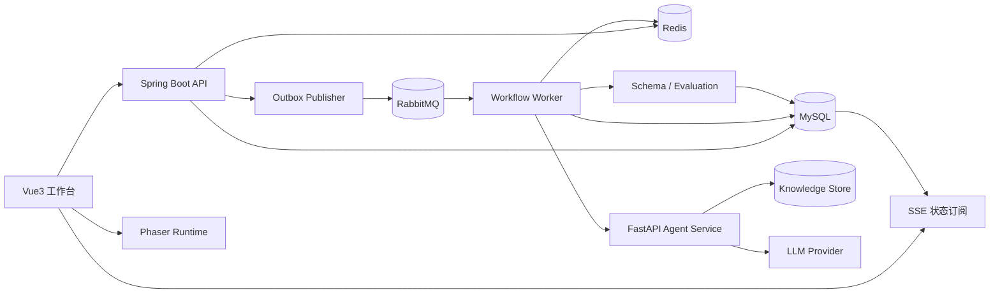
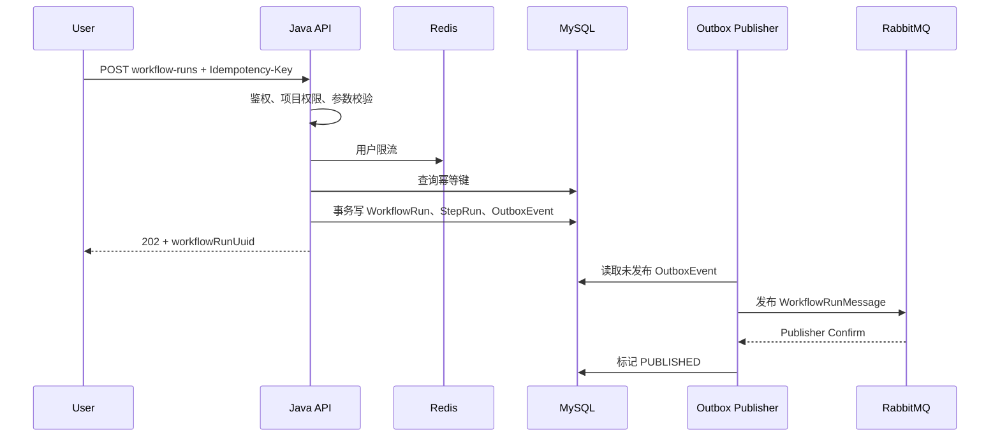
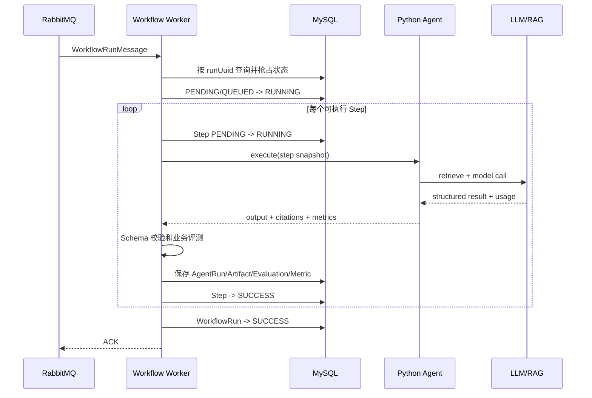
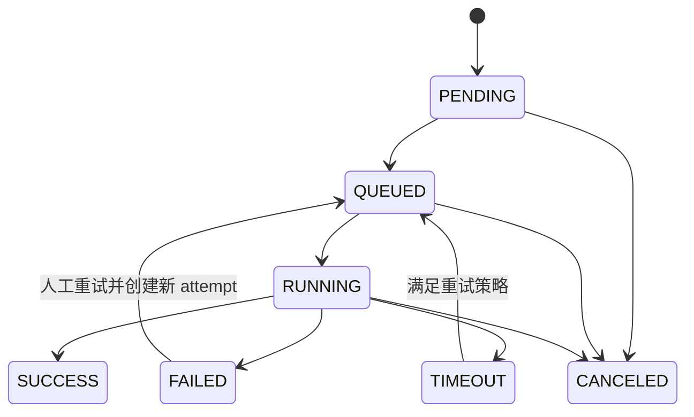
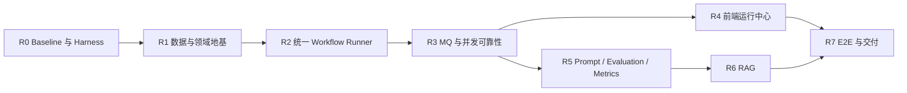

# GameDev Agent Workbench 工程化改造总纲

> 文档状态：`DRAFT`
>
> 适用分支：`refactor-v2`
>
> 改造方式：在现有系统上演进，不推倒重写
>
> 协作规范：[AI_COLLABORATION.md](./AI_COLLABORATION.md)
>
> 小白教程：[VIBE_CODING_TUTORIAL.md](./VIBE_CODING_TUTORIAL.md)

本文档是本轮重构的唯一总入口，用于回答五个问题：

1. 现有项目已经有什么，不再重复建设什么。
2. 当前实现为什么仍然像 Demo，具体问题在哪里。
3. 最终要改造成什么系统，各模块边界是什么。
4. 如何在保持现有功能可运行的前提下逐步迁移。
5. 每一阶段怎样验收、测试、回滚和形成面试材料。

项目的新定位是：

> **AI 游戏原型研发流水线平台**：将自然语言创意转化为版本化设计产物、结构化 GameSpec、自动评测报告和可试玩 Phaser 原型，并通过 Java 后端完成工作流编排、异步任务、并发控制、状态追踪和运行治理。

游戏是本项目的业务场景，不是工程能力的全部。项目真正要展示的是：

```text
Java 业务建模
+ Workflow 状态机
+ Redis 并发控制
+ RabbitMQ 异步任务
+ MySQL 可靠持久化
+ Python Agent / RAG
+ Prompt 版本与自动评测
+ SSE 实时状态
+ 可观测性和 Harness
```

---

## 1. 改造需求契约

### 1.1 背景

当前项目已经跑通：

```text
用户输入创意
-> Java 调用 Python Agent
-> 多步生成设计内容
-> 保存 AgentRun 和 Artifact
-> SSE 推送进度
-> 前端加载 GameConfig
-> Phaser 运行可试玩 Demo
```

问题不在于“功能太少”，而在于这些能力仍然以同步调用和演示链路为中心：

- Workflow 步骤写死在 Service 中，普通流程与 SSE 流程重复实现。
- SSE 请求同时承担“创建任务、执行任务、推送状态”，连接断开会影响业务语义。
- WorkflowRun 只记录最终概要，不能追踪每一步输入、输出、版本和重试。
- Redis 防重复逻辑尚不可靠，缺少锁所有权、原子释放和测试。
- 没有消息队列、消费幂等、重试队列和死信处理。
- Prompt 只有当前模板，没有不可变版本快照和实验对比。
- AI 输出缺少统一 Schema 校验、自动评测和失败样例沉淀。
- 没有模型调用耗时、Token、成本、成功率等指标闭环。
- 自动化测试接近空白，重构是否破坏旧功能主要靠人工判断。
- 前端 `App.vue` 承担过多职责，业务状态、请求、SSE 和展示耦合。

因此，本次不是再做一个 MVP，而是把已有闭环改造成可治理、可追踪、可恢复、可评测的工程系统。

### 1.2 总目标

改造完成后，系统应支持：

```text
提交一次工作流
-> 幂等校验与用户限流
-> 创建 WorkflowRun 和步骤快照
-> 可靠投递异步任务
-> Worker 按依赖执行 Agent Step
-> RAG 注入可追踪上下文
-> PromptVersion 固定本次运行版本
-> 结构化输出校验
-> Artifact 版本化保存
-> 自动评测并记录模型指标
-> SSE/查询接口展示持久化状态
-> 生成可试玩 Phaser 原型
-> 失败后可诊断、可重试、可恢复
```

### 1.3 改造范围

- 改造 Java Workflow 执行模型和领域模型。
- 引入 RabbitMQ、Redis 并发控制和可靠消息处理。
- 建立 Prompt 不可变版本、输入输出快照和调用指标。
- 建立 Python Agent 的结构化输出、RAG 和评测接口。
- 将 SSE 改造成状态订阅通道。
- 拆分 Vue3 前端职责，建立运行中心和评测展示。
- 建立数据库迁移、自动化测试和一键 Harness。
- 保留并迁移现有鉴权、项目、Agent、Artifact 和 Phaser 能力。

### 1.4 非目标

本轮不做：

- 通用低代码工作流设计器。
- Kubernetes、服务网格和大规模微服务拆分。
- 自研游戏引擎、物理引擎或关卡编辑器。
- 多租户计费平台和复杂 RBAC。
- 自研大模型、训练平台或模型微调平台。
- 为了“技术更多”而引入多个功能重叠的中间件。
- 一次性删除所有旧接口和旧数据。

### 1.5 核心验收标准

- [ ] 现有“输入创意到 Phaser Demo”链路仍可运行。
- [ ] 提交接口在 500 ms 内返回 `workflowRunUuid`，不等待 LLM 完成。
- [ ] 同一幂等键并发提交时只产生一个有效 WorkflowRun。
- [ ] RabbitMQ 重复投递不会重复执行已成功步骤或重复生成 Artifact。
- [ ] 每次 WorkflowRun 都能追踪 Workflow、Prompt、输入和检索上下文版本。
- [ ] 每个步骤拥有独立状态、重试次数、耗时和错误信息。
- [ ] 非法 AI 输出不会进入 Phaser Runtime，而是生成明确评测失败报告。
- [ ] SSE 断开不会中断 Workflow，重连后可以恢复当前状态。
- [ ] 系统可查询成功率、P95 耗时、Token、成本和失败类型。
- [ ] 核心并发、状态机、契约和主链路具有自动化测试。
- [ ] 新环境能够通过 Docker Compose 启动全部必要组件。

---

## 2. 现状审计：As-Is

### 2.1 已有能力

| 模块 | 当前实现 | 改造决定 |
| --- | --- | --- |
| 认证 | Spring Security + JWT | 保留，补安全配置和测试 |
| 项目管理 | `GameProject` CRUD 与用户归属 | 保留，作为 Workflow 聚合边界 |
| Agent 调用 | Java `PythonAgentClient` 调 FastAPI | 保留接口方向，增强契约与指标 |
| Agent 记录 | `agent_run` 保存输入、输出、状态、耗时 | 扩展版本、步骤和模型指标 |
| Prompt | `prompt_template` 按 AgentType 选择 ACTIVE | 演进为 Template + 不可变 Version |
| Workflow | `WorkflowServiceImpl` 同步串行执行三步 | 替换为通用 Runner |
| Demo Workflow | `DemoStreamServiceImpl` 异步线程执行四步并推 SSE | 迁移到同一 Runner，SSE 只订阅 |
| Artifact | 设计内容与 GameConfig 落库 | 增加版本、Schema 和来源关系 |
| Python Agent | FastAPI + LangChain + mock fallback | 增加统一执行协议、RAG 和评测 |
| 前端 | Vue3 工作台 + SSE + Phaser | 拆分 Store/API/页面，保留 Phaser Runtime |
| 部署 | MySQL、Java、Python、Vue Docker Compose | 增加 Redis、RabbitMQ 和健康检查 |

### 2.2 当前关键技术债

#### P0：会导致错误行为

- `DemoStreamServiceImpl` 的 Redis 抢锁判断方向存在错误风险。
- 锁释放没有校验 owner，可能删除其他请求持有的锁。
- 用户校验发生在构造 Redis key 之后，空用户路径不清晰。
- 旧 SSE 链路没有持久化完整 WorkflowRun，断线后无法可靠恢复。
- 测试只覆盖 Spring Context，关键流程没有回归保护。

#### P1：限制工程演进

- `WorkflowServiceImpl` 与 `DemoStreamServiceImpl` 重复步骤编排、上下文拼接和 Artifact 创建。
- 步骤定义写死，无法保存 WorkflowDefinition 版本和运行快照。
- 同步 HTTP 请求跨越多次 LLM 调用，超时和资源占用不可控。
- Workflow、AgentRun、Artifact 之间缺少明确的 StepRun 关联。
- 数据库脚本以初始化 SQL 为主，缺少可增量执行的迁移体系。
- Mock fallback 与真实 LLM 成功缺少显式区分，可能影响评测可信度。

#### P2：缺少岗位亮点

- 无 MQ、消费幂等、可靠投递和失败恢复。
- 无 Prompt 实验、Schema 评测、RAG 追踪。
- 无模型成本、Token 和 P95 指标。
- 无并发测试、契约测试和 E2E Harness。
- 前端缺少独立运行详情、步骤详情、评测报告和指标页。

### 2.3 Baseline 保护

改造前必须固定以下行为，避免重构过程中丢失现有功能：

```text
用户注册与登录
项目创建与查询
单 Agent 执行
三步设计 Workflow
四步 Demo Workflow
AgentRun 查询
Artifact 查询
GameConfig 解析
Phaser Demo 运行
```

Baseline 不是“当前实现都正确”，而是记录哪些用户行为必须被兼容，以及哪些缺陷会被测试明确暴露。

---

## 3. 目标架构：To-Be



### 3.1 架构职责

#### Spring Boot API

负责：

- 鉴权和项目权限。
- 工作流提交、查询、取消和重试。
- 幂等键、限流和状态机。
- WorkflowDefinition 和 PromptVersion 选择。
- MySQL 事务与 Outbox 事件。
- SSE 状态订阅和 Dashboard 查询。

不负责：

- 在 Controller 请求线程内执行完整 LLM Workflow。
- 拼装复杂 Prompt。
- 实现向量检索算法。
- 解释或执行不可信模型代码。

#### Workflow Worker

第一版仍位于 Spring Boot 工程中，以独立 package 和 RabbitMQ Consumer 运行，不急于拆成新微服务。

负责：

- 领取 WorkflowRun。
- 根据快照执行步骤依赖。
- 原子推进 StepRun 和 WorkflowRun 状态。
- 调用 Python Agent。
- 幂等、重试、超时和失败分类。
- 保存 Artifact、EvaluationReport 和 Metric。

#### Python Agent Service

负责：

- Prompt 渲染。
- RAG 检索和上下文组装。
- LLM Provider 适配。
- 结构化输出解析与 normalize。
- 返回 Token、模型、耗时和检索引用。

不负责：

- 用户权限。
- Workflow 业务状态机。
- 最终任务状态持久化。
- MQ 消费与业务幂等。

#### Vue3 工作台

负责：

- 项目和工作流操作。
- WorkflowRun/StepRun 状态展示。
- SSE 订阅和断线恢复。
- Artifact、评测和指标展示。
- GameConfig 预览和 Phaser 试玩。

不负责：

- 在浏览器中决定后端状态是否合法。
- 通过 SSE 连接是否存在判断任务是否运行。
- 自己维护一份独立 Workflow 状态机。

### 3.2 架构决策

| 决策 | 选择 | 理由 |
| --- | --- | --- |
| 重构方式 | 演进式替换 | 保持 Demo 随时可运行 |
| 主业务后端 | Spring Boot | 对齐 Java 岗并承载状态与并发 |
| AI 执行 | FastAPI | 保留现有 Python/LLM 生态 |
| 异步队列 | RabbitMQ | 路由、确认、重试和 DLQ 清晰 |
| 并发与短状态 | Redis | 锁、限流、短期事件缓存 |
| 最终业务状态 | MySQL | 不能用 Redis 代替可靠状态 |
| 可靠投递 | Transactional Outbox | 解决数据库成功但消息丢失 |
| 前端进度 | SSE 订阅持久化状态 | 断线不影响任务执行 |
| Workflow 定义 | 版本化定义 + 运行快照 | 历史运行可复现 |
| Prompt | Template + immutable Version | 支持追踪和实验 |
| RAG | Provider 接口后接知识库 | 不阻塞 Workflow 地基建设 |

---

## 4. 目标业务流程

### 4.1 提交工作流



要求：

- `Idempotency-Key` 由客户端生成，服务端绑定 user、project、workflow type。
- Redis 用于快速拒绝和限流，MySQL 唯一约束是最终幂等防线。
- API 返回时 WorkflowRun 至少已可靠写入 MySQL。
- 不在提交接口中调用 Python Agent。

### 4.2 执行工作流



### 4.3 查询和订阅

- `GET WorkflowRun` 永远从持久化状态读取。
- SSE 建连后先发送当前快照，再发送后续事件。
- SSE 事件带递增 `sequence`，前端可去重和检测乱序。
- SSE 断开只影响展示，不改变 WorkflowRun。
- 页面刷新后使用 `workflowRunUuid` 恢复。

---

## 5. 状态机设计

### 5.1 WorkflowRun



规则：

- 旧状态必须参与更新条件，禁止无条件覆盖状态。
- `SUCCESS` 是终态，不允许重复执行。
- 重试保留原 WorkflowRun，增加 `attempt` 和新的 StepRun attempt。
- 取消是协作式取消：未开始步骤不再执行，正在进行的外部调用尽力终止。
- 服务重启后，超出 heartbeat 阈值的 `RUNNING` 进入恢复扫描。

### 5.2 WorkflowStepRun

```text
PENDING
-> RUNNING
-> SUCCESS / FAILED / TIMEOUT / CANCELED / SKIPPED
```

规则：

- 只有依赖步骤全部 `SUCCESS` 才可运行。
- 已 `SUCCESS` 的相同 attempt 不重复调用 LLM。
- 不可重试错误直接 `FAILED`。
- 可重试错误先记录失败 attempt，再按策略创建下一 attempt。

### 5.3 状态更新示例

```sql
UPDATE workflow_run
SET status = 'RUNNING',
    started_at = NOW(),
    version = version + 1
WHERE workflow_run_uuid = ?
  AND status = 'QUEUED'
  AND version = ?;
```

受影响行数为 0 表示状态已被其他消费者抢占或不允许转换，当前消费者不得继续执行。

---

## 6. 模块改造方案

### 6.1 Java：Workflow Core

从现有：

```text
WorkflowServiceImpl
DemoStreamServiceImpl
各自写死步骤和上下文拼接
```

改造成：

```text
workflow/
├─ domain/
│  ├─ WorkflowDefinition
│  ├─ WorkflowStepDefinition
│  ├─ WorkflowRun
│  ├─ WorkflowStepRun
│  └─ WorkflowStatusPolicy
├─ application/
│  ├─ WorkflowCommandService
│  ├─ WorkflowQueryService
│  ├─ WorkflowRunner
│  └─ WorkflowRecoveryService
├─ execution/
│  ├─ WorkflowStepExecutor
│  ├─ AgentStepExecutor
│  └─ EvaluationStepExecutor
├─ messaging/
│  ├─ WorkflowMessagePublisher
│  ├─ WorkflowMessageConsumer
│  └─ OutboxPublisher
└─ infrastructure/
   ├─ WorkflowRepository
   ├─ WorkflowLockService
   └─ WorkflowEventPublisher
```

迁移要求：

- 先抽取 Runner，再接 MQ，不能同时重写全部链路。
- 旧 `WorkflowServiceImpl` 先作为适配器调用新 Runner。
- 旧 `DemoStreamServiceImpl` 在前端迁移完成前保留，但内部不得再复制步骤。
- 新旧路径产生相同 Artifact 语义。

### 6.2 Java：并发与可靠消息

新增能力：

- Redis 用户限流。
- 幂等提交。
- WorkflowRun 执行抢占。
- RabbitMQ publisher confirm。
- 手动 ACK。
- 指数退避重试队列。
- Dead Letter Queue。
- Transactional Outbox。
- 卡住任务恢复扫描。

重要边界：

- Redis 锁不是最终一致性保证。
- 不持有数据库事务等待 LLM。
- 消费者 ACK 必须发生在业务状态可靠持久化之后。
- 所有重试都必须评估是否会重复计费。

### 6.3 Python：统一 Agent 执行协议

现有多个 Agent 路由保留为兼容入口，新增统一内部协议：

```json
{
  "run_uuid": "agent-run-uuid",
  "step_key": "game_config",
  "agent_type": "GAME_CONFIG_GENERATE",
  "prompt": {
    "template_uuid": "template-uuid",
    "version": 3,
    "system_prompt": "...",
    "user_prompt": "..."
  },
  "input": {},
  "context": {
    "previous_artifacts": [],
    "retrieved_chunks": []
  },
  "output_schema": "game-config-v1"
}
```

统一响应：

```json
{
  "status": "SUCCESS",
  "output": {},
  "raw_output_ref": "optional-reference",
  "model": "model-name",
  "provider": "provider-name",
  "usage": {
    "input_tokens": 0,
    "output_tokens": 0,
    "estimated_cost": 0
  },
  "latency_ms": 0,
  "retrievals": [],
  "mock": false,
  "trace_id": "trace-id"
}
```

约束：

- `mock=true` 必须显式返回并落库。
- 输出必须由 Pydantic Model 校验。
- 原始模型文本与规范化结构分离。
- Python 不直接修改 Java 业务表。
- Provider 超时、限流、内容错误使用不同错误类型。

### 6.4 Prompt 版本

现有 `prompt_template.version` 不足以保证历史可追溯，改为：

```text
prompt_template
- template_uuid
- agent_type
- name
- active_version_id

prompt_version
- id
- template_id
- version
- system_prompt
- user_prompt_template
- output_schema_key
- model_parameters
- created_by
- created_at
```

规则：

- PromptVersion 创建后不可修改，只能创建下一版本。
- WorkflowRun 创建时冻结每个步骤的 PromptVersion。
- 切换 ACTIVE 只影响之后创建的 WorkflowRun。
- 历史 WorkflowRun 永远可以查到当时使用的完整 Prompt。
- A/B 实验按 PromptVersion 聚合成功率、耗时和成本。

### 6.5 RAG

RAG 在 Workflow、PromptVersion 和评测稳定后接入。

第一版范围：

- 上传 Markdown/TXT/PDF 文档。
- 文档切块和 Embedding。
- 按项目隔离检索。
- 为每次 AgentRun 保存 topK、score、chunkId 和文档来源。
- 支持关闭 RAG 做对照实验。

第一批知识：

- Phaser Runtime 能力和限制。
- GameConfig Schema。
- 项目已有设计文档。
- 游戏原型范围和性能约束。

非目标：

- 全网搜索。
- 自动执行文档中的代码。
- 复杂 GraphRAG。

### 6.6 Evaluation

每个关键 Artifact 至少经过三层评测：

1. **结构评测**：JSON/Pydantic/JSON Schema 是否通过。
2. **规则评测**：字段范围、引用完整性、Runtime 能力是否匹配。
3. **运行评测**：GameConfig 能否被 Phaser 加载并完成 smoke test。

`EvaluationReport` 至少记录：

- `workflowRunUuid`
- `stepRunUuid`
- `artifactUuid`
- `evaluatorType`
- `status`
- `score`
- `violations`
- `promptVersion`
- `schemaVersion`
- `createdAt`

LLM-as-Judge 只能作为补充，不替代确定性 Schema 和运行测试。

### 6.7 Vue3 前端

从单体 `App.vue` 改造为：

```text
src/
├─ api/
│  ├─ httpClient.js
│  ├─ workflowApi.js
│  └─ artifactApi.js
├─ stores/
│  ├─ authStore.js
│  ├─ projectStore.js
│  └─ workflowRunStore.js
├─ views/
│  ├─ WorkbenchView.vue
│  ├─ WorkflowRunView.vue
│  ├─ ArtifactView.vue
│  └─ EvaluationView.vue
├─ components/
└─ game/
```

运行页需要展示：

- 当前 WorkflowRun 状态。
- 步骤依赖和每步状态。
- attempt、耗时和错误类型。
- PromptVersion、模型和 Token。
- RAG 引用。
- Artifact 和 EvaluationReport。
- 重试、取消和打开 Demo 操作。

前端迁移规则：

- 先抽 API 与状态，再拆页面，避免一次性重写 UI。
- SSE 事件只触发 Store 更新，不能直接散落修改多个组件。
- 重连后以 GET 快照为准，事件只做增量更新。

---

## 7. 数据模型与迁移

### 7.1 保留表

- `sys_user`
- `game_project`
- `agent_run`
- `agent_artifact`
- `workflow_run`
- `prompt_template`

### 7.2 新增表

| 表 | 用途 |
| --- | --- |
| `workflow_definition` | 工作流稳定身份 |
| `workflow_definition_version` | 版本化步骤定义 |
| `workflow_step_run` | 每一步的状态、输入输出和 attempt |
| `prompt_version` | 不可变 Prompt 内容 |
| `model_call_metric` | 模型、Token、成本、耗时 |
| `evaluation_report` | 结构、规则和运行评测 |
| `knowledge_document` | 项目知识文档 |
| `knowledge_chunk` | 切块与 Embedding 引用 |
| `retrieval_record` | 每次检索证据 |
| `outbox_event` | 可靠消息投递 |

### 7.3 现有表扩展

`workflow_run` 增加：

```text
definition_version_id
idempotency_key
input_snapshot
current_step_key
attempt
trace_id
version
queued_at
started_at
finished_at
cancel_requested
```

`agent_run` 增加：

```text
workflow_run_id
step_run_id
prompt_version_id
model_name
provider
mock
input_tokens
output_tokens
estimated_cost
trace_id
```

`agent_artifact` 增加：

```text
step_run_id
schema_key
schema_version
content_hash
version
parent_artifact_id
```

### 7.4 数据库迁移策略

引入 Flyway：

```text
V1__baseline.sql
V2__add_workflow_step_run.sql
V3__add_prompt_version.sql
V4__add_outbox_and_metrics.sql
V5__add_knowledge_and_evaluation.sql
```

规则：

- 不再通过修改旧初始化 SQL 升级已有数据库。
- 每个迁移只前进，不在生产式数据上执行破坏性回滚。
- 新增非空字段先允许空、回填、验证，再加约束。
- 删除旧字段至少跨一个兼容阶段。
- Docker 新环境和已有本地数据库都必须验证。
- 所有业务唯一语义最终由数据库约束兜底。

---

## 8. API 演进

### 8.1 新 API

```http
POST /api/v1/projects/{projectUuid}/workflow-runs
GET  /api/v1/workflow-runs/{workflowRunUuid}
GET  /api/v1/workflow-runs/{workflowRunUuid}/steps
GET  /api/v1/workflow-runs/{workflowRunUuid}/events
POST /api/v1/workflow-runs/{workflowRunUuid}/cancel
POST /api/v1/workflow-runs/{workflowRunUuid}/retry
GET  /api/v1/workflow-runs/{workflowRunUuid}/evaluations
GET  /api/v1/dashboard/workflows
```

提交请求：

```http
POST /api/v1/projects/{projectUuid}/workflow-runs
Idempotency-Key: 7f3...
```

```json
{
  "workflowKey": "GAME_PROTOTYPE_PIPELINE",
  "title": "像素地牢探索",
  "input": {
    "idea": "玩家收集宝石并抵达出口",
    "targetPlatform": "WEB"
  }
}
```

返回：

```http
HTTP/1.1 202 Accepted
```

```json
{
  "code": 0,
  "data": {
    "workflowRunUuid": "uuid",
    "status": "PENDING"
  },
  "traceId": "trace-id"
}
```

### 8.2 兼容策略

旧接口：

```text
POST /api/workflow/game-design/run
POST /api/demo/game/stream
```

迁移顺序：

1. 旧接口行为先由测试固定。
2. 旧接口内部改为调用新 CommandService。
3. 前端切换新提交和订阅 API。
4. 旧接口增加 deprecated 日志和文档标记。
5. 新链路稳定后再决定是否删除，不在本轮前半程删除。

---

## 9. 并发、异常与恢复

### 9.1 重复提交

业务键：

```text
userId + projectId + workflowKey + Idempotency-Key
```

处理：

- Redis 快速判重和短期锁。
- MySQL 唯一索引保证最终只有一条有效提交记录。
- 相同幂等键返回第一次创建的 WorkflowRun，不创建第二条。
- 不同幂等键是否允许并行由项目运行策略决定。

### 9.2 用户与系统限流

- 用户维度：令牌桶或滑动窗口。
- 全局维度：RabbitMQ consumer concurrency。
- Provider 维度：按模型配置并发信号量。
- 队列积压超过阈值时拒绝新任务或降级到低优先级。

### 9.3 Redis 锁规范

```text
key   = workflow:execute:{workflowRunUuid}
value = unique-owner-token
ttl   = 大于单次抢占窗口，并支持必要续期
```

- 只有抢锁成功者执行。
- 解锁使用 Lua 比较 owner 后删除。
- 不允许 `finally` 无条件删除。
- Redis 异常时默认不执行高成本任务，避免重复计费。
- 锁失效不代表任务一定可以重跑，仍须检查 MySQL 状态。

### 9.4 MQ 重复消息

- 消费者首先读取 WorkflowRun 与 StepRun 状态。
- `SUCCESS` 直接 ACK。
- 可抢占状态通过条件更新变为 `RUNNING`。
- 抢占失败说明已有消费者执行，当前消息 ACK 或短暂延迟。
- Artifact 使用 StepRun + attempt 唯一约束防止重复写。

### 9.5 错误分类

| 类型 | 示例 | 默认策略 |
| --- | --- | --- |
| 参数错误 | Schema 不合法 | 不重试 |
| 权限错误 | 项目不属于用户 | 不重试 |
| Prompt 配置错误 | 版本不存在 | 不重试，等待人工修复 |
| Provider 限流 | HTTP 429 | 退避重试 |
| 网络超时 | Python/LLM timeout | 有上限重试 |
| 输出解析失败 | 非法 JSON | 可进行一次修复调用，再失败 |
| Runtime 评测失败 | GameConfig 无法加载 | 标记评测失败，可人工重试 |
| 系统异常 | DB/MQ 不可用 | 按基础设施策略重试或恢复 |

### 9.6 服务重启恢复

定时扫描：

- `QUEUED` 且长时间未收到消息：重新写 Outbox。
- `RUNNING` 且 heartbeat 超时：标记异常 attempt，并根据策略重排队。
- `PENDING` 超时：检查 Outbox 发布状态。
- `CANCEL_REQUESTED`：阻止新步骤开始。

所有恢复动作必须记录审计事件，避免“自动修好但无法解释”。

---

## 10. 可观测性与安全

### 10.1 日志关联

统一字段：

```text
traceId
userId
projectUuid
workflowRunUuid
stepRunUuid
agentRunUuid
messageId
promptVersion
model
```

禁止记录：

- JWT。
- 密码和 API Key。
- 未脱敏用户隐私。
- 默认记录完整 Prompt 和模型原始输出。

### 10.2 指标

最低指标集：

- Workflow 提交数、成功数、失败数。
- Workflow 排队时间、执行时间、P50/P95。
- 每步骤成功率、重试率、超时率。
- RabbitMQ queue depth、消费速率、DLQ 数。
- LLM 调用次数、Token 和估算成本。
- PromptVersion 成功率和 Schema 通过率。
- RAG 命中率与引用数。
- Phaser smoke test 通过率。

### 10.3 安全改造

- 所有 secret 只从环境变量读取。
- 删除可用于真实环境的默认 JWT secret 和数据库密码。
- Prompt 输入和 Artifact 输出限制大小。
- 模型输出作为不可信输入处理。
- GameConfig 只允许 Schema 内字段，禁止任意脚本。
- 上传知识文档限制类型、大小和项目归属。
- 管理类接口增加权限检查和审计日志。

---

## 11. 分阶段改造计划

任务必须按依赖推进：



### 阶段模型选择

默认使用 `gpt-5.4`。只有涉及状态机、并发、事务、迁移和关键架构审查时使用 `gpt-5.5`。

| 阶段 | 推荐模型 | 使用说明 |
| --- | --- | --- |
| R0 Baseline | `gpt-5.4` | Harness、普通测试和配置整理 |
| R0 Redis Lock | `gpt-5.5` | 锁所有权、原子释放和并发测试 |
| R1 数据与领域 | `gpt-5.5` | 状态机、Flyway、兼容迁移 |
| R2 Workflow Runner | `gpt-5.5` 设计，`gpt-5.4` 搬运 | 核心抽象先确定，再做重复重构 |
| R3 MQ 与可靠性 | `gpt-5.5` | 幂等、Outbox、重试、DLQ、恢复 |
| R4 前端运行中心 | `gpt-5.4` | API Client、Store、页面和组件拆分 |
| R5 Prompt 与评测 | `gpt-5.5` 设计，`gpt-5.4` 实现 | 版本一致性用 5.5，DTO/页面用 5.4 |
| R6 RAG | `gpt-5.5` 设计，`gpt-5.4` 实现 | 隔离和评测用 5.5，导入流程用 5.4 |
| R7 交付 | `gpt-5.4`，最终审查用 `gpt-5.5` | E2E、文档、报告和高风险终审 |

详细判断规则见 [VIBE_CODING_TUTORIAL.md](./VIBE_CODING_TUTORIAL.md) 第 13 节。

### R0：固定 Baseline 与修复高风险缺陷

目标：

> 在继续重构前，让现有行为可重复验证。

范围：

- 建立 `tools/verify.ps1`。
- 增加 Redis 锁测试。
- 修复锁判断和 owner release。
- 增加 Workflow 成功/失败状态测试。
- 增加 GameConfig Schema 测试。
- 增加 Java-Python 基础契约样例。
- 清理重复依赖和不安全默认配置。

非目标：

- 不接 RabbitMQ。
- 不调整 Workflow 表结构。
- 不重写前端。

验收：

- [ ] 锁成功、失败、过期和错误 owner 都有测试。
- [ ] 修改前能暴露锁缺陷，修改后测试通过。
- [ ] Maven、Python、Vue、Compose 由一个命令验证。
- [ ] Baseline 主链路有最小 smoke test。

建议任务卡：

| ID | 任务 | 依赖 | 交付 |
| --- | --- | --- | --- |
| R0-01 | 一键 Harness | 无 | `tools/verify.ps1` |
| R0-02 | Redis Lock 测试与修复 | R0-01 | 单测、PITFALL |
| R0-03 | Workflow 状态测试 | R0-01 | Service tests |
| R0-04 | GameConfig 契约测试 | R0-01 | Schema fixtures |
| R0-05 | 安全配置清理 | 无 | example env、配置测试 |

### R1：数据迁移与领域地基

目标：

> 建立可版本化、可追踪的 Workflow 数据基础，不改变用户入口。

范围：

- 接入 Flyway 并建立 baseline。
- 新增 WorkflowDefinitionVersion、WorkflowStepRun。
- 扩展 WorkflowRun。
- 新增 PromptVersion 初始结构。
- 定义状态枚举和合法转换策略。
- 为已有 Prompt 生成 version 1。

约束：

- 现有本地数据可以升级。
- 旧 Entity 和 API 暂不删除。
- 数据迁移必须可在空库和已有库验证。

验收：

- [ ] 空数据库可完整初始化。
- [ ] 已有数据库可无损升级。
- [ ] 状态机非法转换被拒绝。
- [ ] 新 WorkflowRun 保存定义和 Prompt 快照。

### R2：统一 Workflow Runner

目标：

> 消除两套 Workflow 逻辑，建立可测试的步骤执行内核。

范围：

- 抽取 WorkflowRunner。
- 抽取 StepExecutor。
- 抽取 ArtifactWriter 和 Evaluation hook。
- 使用执行上下文传递前置产物，替代散落字符串拼接。
- 普通 Workflow 和 Demo Workflow 复用 Runner。
- 保持旧 API 可用。

约束：

- 本阶段仍可同步执行，先验证 Runner 语义。
- 不同时引入 MQ，避免无法定位回归来源。
- 新旧路径输出语义保持一致。

验收：

- [ ] 两条旧 Workflow 路径不再复制步骤实现。
- [ ] 任一步骤失败时 Workflow 与 StepRun 状态正确。
- [ ] 已成功步骤不会因查询或 SSE 重连重复执行。
- [ ] 四步 GameConfig Demo 仍可试玩。

### R3：异步任务、幂等与可靠性

目标：

> 把 Workflow 从 HTTP 长请求改造成可靠异步任务。

范围：

- Docker Compose 增加 Redis、RabbitMQ。
- 新提交 API 返回 `202`。
- Transactional Outbox。
- Publisher Confirm。
- Consumer 手动 ACK。
- 重试队列和 DLQ。
- 用户限流、幂等提交、执行抢占。
- 恢复扫描。

验收：

- [ ] 提交接口不等待 LLM。
- [ ] 10 个并发相同幂等请求只创建一个 WorkflowRun。
- [ ] 同一消息投递两次只产生一次有效执行。
- [ ] Consumer 在步骤落库前崩溃，重启后可恢复。
- [ ] 不可重试错误进入 FAILED，可重试错误按上限执行。
- [ ] DLQ 中的消息可以关联原 WorkflowRun。

### R4：前端运行中心和 SSE 订阅

目标：

> 前端围绕持久化 WorkflowRun 工作，不再依赖一条长 SSE 请求。

范围：

- 抽取 API Client 和 Store。
- 新建 WorkflowRun 详情页。
- SSE 改为订阅。
- 支持刷新恢复、断线重连和事件去重。
- 展示步骤、错误、重试、取消和 Artifact。
- 拆分 `App.vue`。

验收：

- [ ] 提交后立即进入运行详情页。
- [ ] 关闭页面不影响任务。
- [ ] 刷新后恢复当前状态。
- [ ] SSE 重复事件不会重复追加步骤。
- [ ] 手机和桌面视口内容不重叠。

### R5：Prompt、评测与模型指标

目标：

> 从“模型返回了内容”升级到“输出质量可以比较和解释”。

范围：

- PromptVersion 不可变版本。
- WorkflowRun 冻结 Prompt 快照。
- ModelCallMetric。
- Schema、规则、Runtime 三层评测。
- PromptVersion 对比查询。
- 明确标记 mock 输出。

验收：

- [ ] 修改 ACTIVE Prompt 不影响运行中的任务。
- [ ] 每个 AgentRun 可追踪模型、Prompt 和 Token。
- [ ] 非法 GameConfig 无法进入 Runtime。
- [ ] Dashboard 可比较两个 PromptVersion 的成功率、耗时和成本。

### R6：RAG 知识库

目标：

> 让 Agent 基于项目规则和 Runtime 约束生成，并保留检索证据。

范围：

- KnowledgeDocument/Chunk。
- 文档导入、切块和 Embedding。
- 项目级检索隔离。
- RetrievalRecord。
- 有 RAG/无 RAG 对照评测。

验收：

- [ ] 不同项目不能检索到彼此文档。
- [ ] AgentRun 可查看引用的 chunk、score 和来源。
- [ ] 删除或失效文档后新任务不再引用。
- [ ] 对照报告能展示 RAG 对 Schema 通过率的影响。

### R7：E2E、性能与投递材料

目标：

> 形成可运行、可压测、可讲解的最终项目。

范围：

- Docker 一键启动。
- 主链路 E2E。
- 并发测试和报告。
- 故障注入：Redis、RabbitMQ、Python 超时。
- Demo 数据和录屏脚本。
- README、架构图、面试问答和简历描述。

验收：

- [ ] 新环境按文档启动成功。
- [ ] E2E 从提交创意到 Phaser Demo 通过。
- [ ] 并发、重复消息和恢复场景有报告。
- [ ] 3 到 5 分钟演示可以稳定复现。
- [ ] 能用代码和指标回答 JD 中的工程问题。

---

## 12. Worktree 与多 Agent 计划

当前工作区尚有未提交改动时，不立即开启大量 worktree。先完成 R0 baseline，并形成可解释 commit。

建议分支：

| 分支 | 目标 | 启动条件 |
| --- | --- | --- |
| `codex/harness-foundation` | R0 Harness | 可立即开始 |
| `codex/workflow-domain` | R1 数据和状态机 | R0 baseline 完成 |
| `codex/workflow-runner` | R2 Runner | R1 模型稳定 |
| `codex/async-reliability` | R3 MQ/Redis/Outbox | R2 Runner 稳定 |
| `codex/frontend-run-center` | R4 前端 | 新 API 契约冻结 |
| `codex/evaluation-metrics` | R5 评测 | StepRun/Artifact 契约冻结 |
| `codex/rag-pipeline` | R6 RAG | Agent 协议冻结 |

可并行关系：

- R4 与 R5 可以在 R3 API 冻结后并行。
- R6 的文档模型可提前设计，执行接入必须等 R5。
- 测试 Agent 和实现 Agent 可并行，但不能同时修改同一测试文件。
- 审查 Agent 默认只读，不与实现 Agent共享结论偏见。

每个 Agent 必须收到：

- 一个任务 ID。
- 明确的允许修改目录。
- 禁止修改范围。
- 输入契约和输出契约。
- 验收标准。
- Harness 命令。
- 完成后 diff 审查要求。

详细协作方式见 [AI_COLLABORATION.md](./AI_COLLABORATION.md)。

---

## 13. Harness 设计

### 13.1 本地快速验证

目标时间：5 分钟内。

```powershell
.\tools\verify.ps1 -Profile quick
```

包含：

- Java compile + unit tests。
- Python compile + unit tests。
- Vue build。
- Docker Compose config。
- 数据库 migration 校验。

### 13.2 集成验证

```powershell
.\tools\verify.ps1 -Profile integration
```

包含：

- Testcontainers MySQL/Redis/RabbitMQ。
- Java-Python 契约测试。
- Outbox 发布与重复消费。
- Workflow 四步集成测试。

### 13.3 E2E 验证

```powershell
.\tools\verify.ps1 -Profile e2e
```

包含：

- Docker Compose 启动。
- 注册、登录、创建项目。
- 提交 Workflow。
- 等待最终状态。
- 校验 Artifact 和 Evaluation。
- 打开 Phaser Demo 并执行 smoke test。

### 13.4 并发验证

必须覆盖：

- 相同 Idempotency-Key 并发提交。
- 不同用户并发提交。
- 相同 MQ 消息重复投递。
- 两个 Consumer 同时抢占同一 WorkflowRun。
- Redis 锁过期与错误 owner 解锁。
- Python 超时后的有限重试。
- Consumer 崩溃后的恢复。

测试报告记录：

```text
并发数
请求数
成功/拒绝/失败数
有效 WorkflowRun 数
实际 LLM 调用数
重复 Artifact 数
P50/P95
队列最大积压
```

---

## 14. 每阶段开发格式

每个阶段开始前，在 `docs/requirements/` 创建对应 RFC：

```text
R0-harness-foundation.md
R1-workflow-domain.md
R2-workflow-runner.md
R3-async-reliability.md
R4-frontend-run-center.md
R5-evaluation-metrics.md
R6-rag-pipeline.md
R7-release-hardening.md
```

每份 RFC 必须包含：

```text
背景
目标
范围
非目标
现有行为
目标行为
接口与数据
状态机
并发与异常
兼容和迁移
约束
验收标准
验证命令
风险与回滚
```

实现会话统一使用：

```text
探索
-> 计划
-> 小步实现
-> 相关 Harness
-> AI 自审 diff
-> 人工边界审查
-> 修正
-> PITFALLS/文档沉淀
```

---

## 15. 风险与回滚

| 风险 | 控制方式 | 回滚方式 |
| --- | --- | --- |
| Runner 重构破坏旧流程 | 旧接口契约测试、适配器 | 切回旧 Service 实现 |
| Flyway 影响已有数据 | 备份、双环境迁移测试 | 恢复备份，不执行反向破坏 SQL |
| MQ 引入后任务丢失 | Outbox、confirm、恢复扫描 | 暂时切同步 Runner |
| 重复消费导致重复计费 | 状态抢占、Step 幂等 | 禁用 Consumer，人工核对 Run |
| SSE 迁移导致前端状态错乱 | 快照优先、sequence 去重 | 保留轮询查询 |
| Prompt 新版本质量下降 | 版本冻结、对照评测 | 切回旧 ACTIVE Version |
| RAG 检索污染输出 | 项目隔离、引用追踪、开关 | 单任务关闭 RAG |
| 架构范围失控 | 阶段非目标、验收门禁 | 推迟后续阶段，不扩大当前任务 |

---

## 16. 项目级完成定义

只有满足以下条件，本轮改造才算完成：

- 新旧能力映射清楚，没有用“重写”掩盖迁移问题。
- 核心 Workflow 通过版本化定义执行。
- HTTP、MQ、Redis、MySQL 各自职责明确。
- 重复提交、重复消费、超时、重试和重启恢复都有验证。
- AI 输入、Prompt、RAG、输出、评测和模型指标可以完整追踪。
- SSE 与任务生命周期解耦。
- Phaser Demo 仍是最终可见产物，但不再是唯一验收依据。
- 项目可以通过一键 Harness 验证。
- 关键设计、踩坑和测试报告进入仓库。
- 你能够解释每个中间件解决的真实问题，以及不用它会怎样。

---

## 17. 文档导航

### 当前重构主线

- [AI 协作开发规范](./AI_COLLABORATION.md)
- [Vibe Coding 小白开发教程](./VIBE_CODING_TUTORIAL.md)

### 已有专题设计

- [Redis 接入计划](./redis-integration-plan.md)
- [GameConfig Schema](./game-config-schema.md)
- [Docker 一键启动](./docker-one-click-start.md)

### 历史文档

已经删除的 `week-*`、早期执行计划和 MVP 文档如需回顾，应从 Git 历史读取，不再作为当前实现依据。历史内容与本总纲冲突时，以本总纲和当前阶段 RFC 为准。

---

## 18. 下一步唯一入口

不要同时启动 R1 到 R6。

当前只执行：

```text
R0：固定 Baseline 与修复高风险缺陷
```

R0 的第一张任务卡：

```text
任务：R0-01 一键 Harness

目标：
建立 tools/verify.ps1，统一执行 Java、Python、Vue 和 Compose 基础验证。

范围：
- 验证脚本。
- 最少量使用说明。
- 不修改业务逻辑。

验收：
- 任一子命令失败时脚本返回非 0。
- 输出能指出失败模块。
- 支持 quick profile。
- 在当前项目上真实执行并记录结果。
```

完成 R0-01 后，再通过测试暴露并修复 Redis 锁问题。这样本轮重构从第一天开始就遵循：

```text
先建立证据
-> 再修改行为
-> 最后把经验固化为长期规则
```
