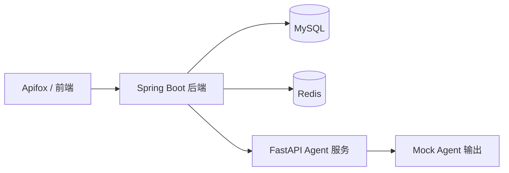
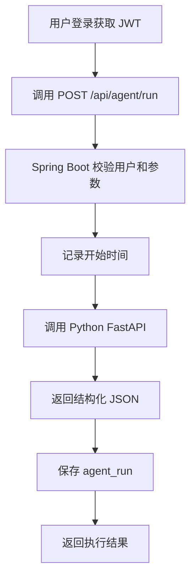

# GameDev Agent Workbench

GameDev Agent Workbench 是一个面向小游戏开发流程的 AI Agent 工作台。当前阶段先做 MVP，不追求一次做成大平台，而是优先跑通一条可演示、可讲清楚的核心链路。

MVP 的核心目标是：

```text
用户登录
-> 提交 Agent 请求
-> Java 后端调用 Python FastAPI mock Agent
-> Python 返回结构化结果
-> Java 保存 agent_run 执行记录
-> 通过 Apifox 或前端查看结果
```

## 当前阶段定位

本项目用于暑期实习求职展示，重点展示：

- Java 后端开发能力
- Spring Boot 分层设计能力
- RESTful API 设计能力
- MySQL 表设计和执行记录落库能力
- Java 调用 Python AI 服务的跨服务编排能力
- Agent / Prompt Template / Trace / Tool Calling 的工程理解

第一版不做复杂 AI 平台，而是先做一个能运行、能演示、能讲清楚的 Agent MVP。

## MVP 必做功能

第一版只保留最核心的闭环。

### 1. 用户登录注册

- 用户注册
- 用户登录
- JWT 鉴权
- 获取当前用户

### 2. Agent 执行接口

核心接口：

```http
POST /api/agent/run
```

请求内容包括：

- Agent 类型
- 用户输入内容
- 可选会话 ID
- 可选模板 ID

第一版支持的 Agent 类型：

- `REQUIREMENT_BREAKDOWN`：需求拆解
- `API_DESIGN`：接口设计
- `BUG_ANALYSIS`：Bug 分析
- `PROMPT_GENERATE`：Prompt 生成

### 3. Python FastAPI mock Agent

Python 服务第一阶段只返回 mock 结构化结果，不急着接真实 LLM。

这样做的原因：

- 先验证 Java 到 Python 的调用链路
- 先确定输入输出结构
- 先完成执行记录落库
- 后续再平滑替换成真实 LLM 调用

### 4. Agent 执行记录

每次 Agent 调用都保存到 `agent_run`。

需要记录：

- 用户 ID
- Agent 类型
- 输入内容
- 输出内容
- 执行状态
- 耗时
- 错误信息
- 创建时间

### 5. Apifox 调试闭环

MVP 第一阶段可以先不做完整前端。

优先用 Apifox 调通：

- 注册
- 登录
- 获取当前用户
- 发起 Agent 执行
- 查询 Agent 执行记录

## MVP 暂缓功能

以下功能放到 MVP 跑通之后再做：

- Vue3 完整前端工作台
- 真实 LLM API 调用
- SSE 流式输出
- LangGraph 工作流编排
- RAG 知识库
- Prompt A/B 测试
- 失败案例库
- 旧项目 AIGC-GameFlow 真实联动
- 复杂权限系统

这些不是不做，而是后做。先把主链路做出来，项目才会真正进入可控节奏。

## 推荐技术栈

### Java 主后端

- Java 21
- Spring Boot 3
- Spring MVC
- MyBatis-Plus
- MySQL
- Redis
- Spring Security + JWT

### Python AI 服务

- Python 3.11+
- FastAPI
- Pydantic
- httpx / requests

### 调试和文档

- Apifox
- Markdown 文档
- Docker Compose 后续补充

## MVP 架构



## MVP 主流程



## 第一版核心表

MVP 优先实现这两张表：

- `sys_user`
- `agent_run`

后续再补：

- `agent_session`
- `prompt_template`
- `external_task_ref`

这样可以降低第一阶段复杂度，先保证登录和 Agent 执行闭环跑通。

## 第一版接口

### 认证模块

- `POST /api/auth/register`
- `POST /api/auth/login`
- `GET /api/auth/me`

### Agent 模块

- `POST /api/agent/run`
- `GET /api/agent/runs`
- `GET /api/agent/runs/{runUuid}`

### Python Agent 服务

- `POST /agent/requirement-breakdown`
- `POST /agent/api-design`
- `POST /agent/bug-analysis`
- `POST /agent/prompt-generate`

## 后续增强路线

MVP 跑通后，再按下面顺序增强：

1. Prompt 模板管理
2. Agent 执行评分
3. AIGC-GameFlow 联动
4. Vue3 工作台页面
5. 真实 LLM API
6. Tool Calling
7. agent_run_step 执行步骤记录
8. SSE 流式输出
9. RAG 知识库

## 面试表达重点

这个项目第一版可以这样介绍：

> 我做了一个面向小游戏开发流程的 AI Agent MVP。Java 后端负责登录鉴权、接口编排和执行记录落库，Python FastAPI 负责 Agent 结果生成。第一阶段先用 mock Agent 跑通从请求、调用、结构化输出到 trace 落库的闭环，后续再接入真实 LLM、Tool Calling 和旧项目 AIGC-GameFlow。

这比直接说“我做了一个 AI 聊天项目”更像真实工程项目。
