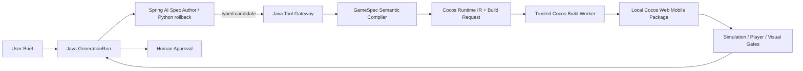
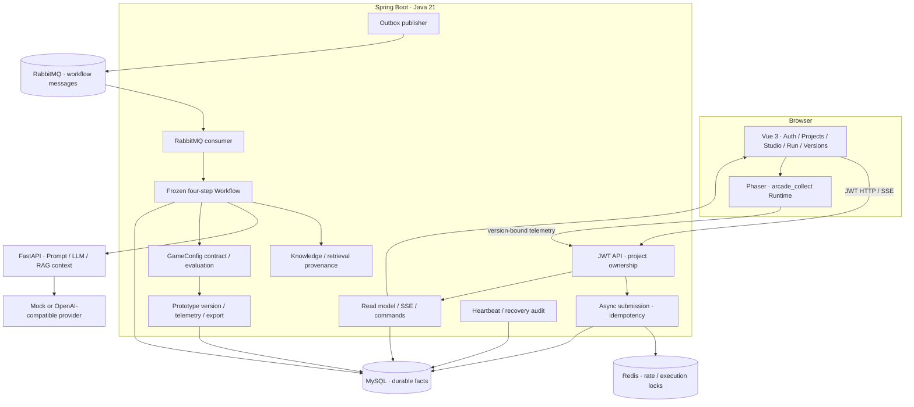
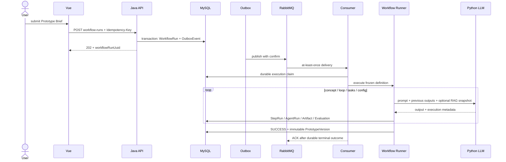
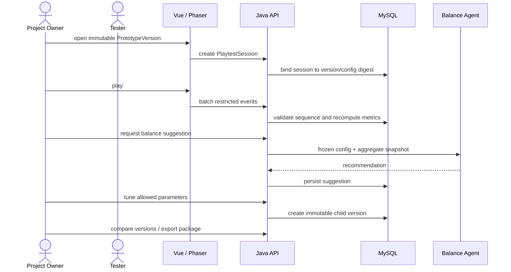
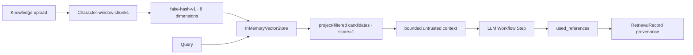
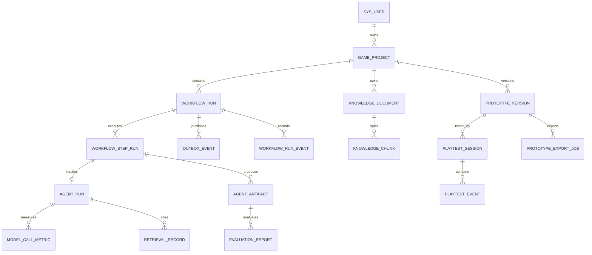

# 系统架构与核心链路

本文描述当前代码事实和下一阶段边界。历史 R0–R7/V3 报告记录当时环境与验收结果，不自动代表生产能力。

> 版本边界：本文主体描述 V3/V4 稳定架构，并标注 V5 已落地的首个垂直切片。V5 完整目标以 [V5 文档入口](../requirements/v5/README.md) 和 [ADR-001](decisions/ADR-001-java-gamespec-authority.md) 为准；未关闭的 Gate、Director/Player 与 RAG 目标不得被解读为当前能力。

## 产品边界

V3 当前系统只支持 `arcade_collect`：模型生成受白名单约束的 GameConfig，固定 Phaser Runtime 负责执行。旧四步“Agent”是冻结定义驱动的串行 LLM Workflow。V4 已新增 Director、类型化工具、逐步 Player、实验与 DRAFT 审批，但其公开对照数据仍是 mock 小样本，不能外推真实模型收益。

V5 不继续把平衡实验或 RAG 作为唯一主线，而引入 GameSpec 作者层 DSL。当前首个切片已实现 GenerationRun、GameSpec 语义/能力/安全校验、Spring AI 结构化 Spec Author 的 diagnostics 修复循环，以及由持久化 Java Worker 控制的 Spring AI Director Tool Calling。模型只选择工具，Java 仍负责检查点、预算、权限、幂等、工具执行和证据落库。Phaser 仅保留为 V4 历史实现；统一发布门禁、Player Spring AI 切流、正式 Asset Pack 和生产级 RAG 仍在后续里程碑。

### V5 演进架构（首个切片已实现）

完整目标的详细约束见 [V5 文档入口](../requirements/v5/README.md)。图中的规格编译、构建与 Spec Author 路径已经落地；Simulation/Player/Visual Gate 和人工审批仍未形成完整不可绕过闭环。

## 当前组件

| 边界 | 当前责任 | 主要代码入口 |
| --- | --- | --- |
| Vue/Phaser | 登录、项目、Brief、Run/SSE、可玩预览、版本、遥测与导出 | [`frontend-vue/src/features`](../../frontend-vue/src/features) |
| Java API | 鉴权、归属、请求契约、read model 和下载 | [`controller`](../../backend-java/src/main/java/com/example/gameworkbench/controller) |
| 异步执行 | 幂等提交、Outbox、Consumer claim、重试和恢复 | [`AsyncWorkflowSubmissionServiceImpl.java`](../../backend-java/src/main/java/com/example/gameworkbench/service/impl/AsyncWorkflowSubmissionServiceImpl.java)、[`WorkflowMessageConsumer.java`](../../backend-java/src/main/java/com/example/gameworkbench/messaging/WorkflowMessageConsumer.java) |
| Workflow | 读取冻结定义，串行执行四个预定义 LLM Step | [`application/workflow`](../../backend-java/src/main/java/com/example/gameworkbench/application/workflow) |
| Python | Prompt、OpenAI-compatible 调用、GameConfig 解析和 RAG 上下文 | [`python-agent/app`](../../python-agent/app) |
| 原型实验 | GameConfig、不可变版本、试玩复算、建议和导出 | [`PrototypeVersionServiceImpl.java`](../../backend-java/src/main/java/com/example/gameworkbench/service/impl/PrototypeVersionServiceImpl.java)、[`PlaytestTelemetryServiceImpl.java`](../../backend-java/src/main/java/com/example/gameworkbench/service/impl/PlaytestTelemetryServiceImpl.java) |
| RAG 基线 | 文档/Chunk、项目隔离、候选协议和 RetrievalRecord | [`service`](../../backend-java/src/main/java/com/example/gameworkbench/service) |

## 生成与可靠执行时序

关键语义：

- 投递是 at-least-once，业务幂等依赖数据库 claim、attempt、状态和唯一约束；
- Redis 锁只减少昂贵重复执行，不能代替 durable correctness；
- Workflow/Prompt/输入快照在运行开始后不可被 ACTIVE 配置改写；
- Python 返回模型结果，Java 决定业务成功和可玩资格；
- 当前执行图是固定串行链，不是模型动态编排。

## 原型与平衡实验时序

当前缺口：公开 `/demo/play` 尚未把外部测试者安全绑定到项目和版本遥测。下一阶段需要可撤销、限时、限权的分享 token，并区分外部玩家、所有者和机器人样本。

## RAG 当前事实

已经成立的能力：

- 文档和 Chunk 绑定项目与版本；
- RAG-on/off/empty/unavailable/mock 显式区分；
- 运行后读取持久化 RetrievalRecord，而不是展示时重新检索；
- 历史引用不会因为文档后来失效而被改写。

尚未成立的能力：

- 真实 embedding 和 cosine similarity；
- 稳定的语义 topK 与质量指标；
- 重启后可恢复的持久化向量索引；
- 受限 PDF 文本提取；
- 按实际注入文本/token 计算 context budget；
- RAG-on/off 对生成质量的可信增益结论。

目标架构和验收指标见[B 路线与 RAG 升级路线图](../roadmap-balance-lab-rag.md)。

## 核心持久化关系

## 下一阶段架构约束

- 只选择一个正式向量后端，避免维护多套半成品实现；
- 索引 job 必须有持久状态、attempt、错误分类、重建和失效语义；
- 公开试玩 token 只能读取一个冻结版本并提交受限遥测；
- 建议只创建 DRAFT 候选，不得自动覆盖已测试版本；
- RAG 质量、生成质量和系统性能分别评测，不能用一个通过率互相替代；
- 新旧同步/异步 API 应明确 canonical path，并逐步弃用重复入口；
- 在单玩法实验闭环完成前，不增加第二 Runtime 或新的基础设施组件。
