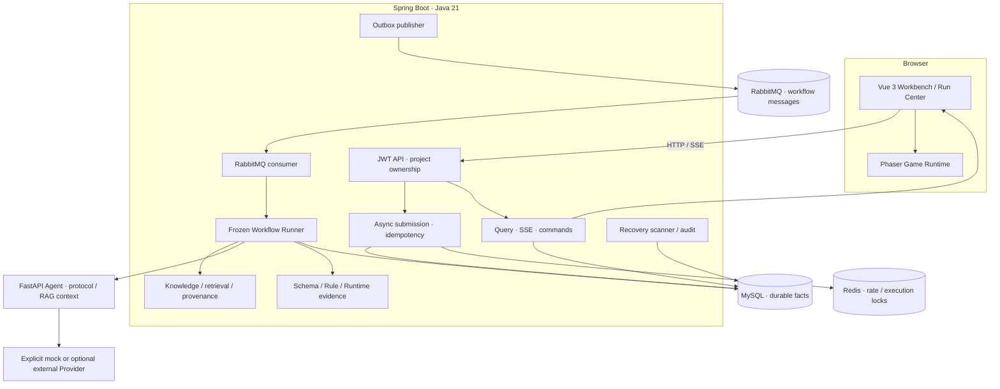
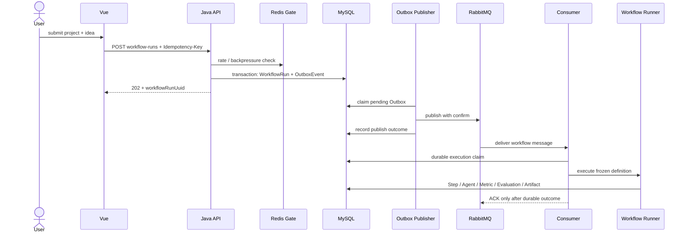
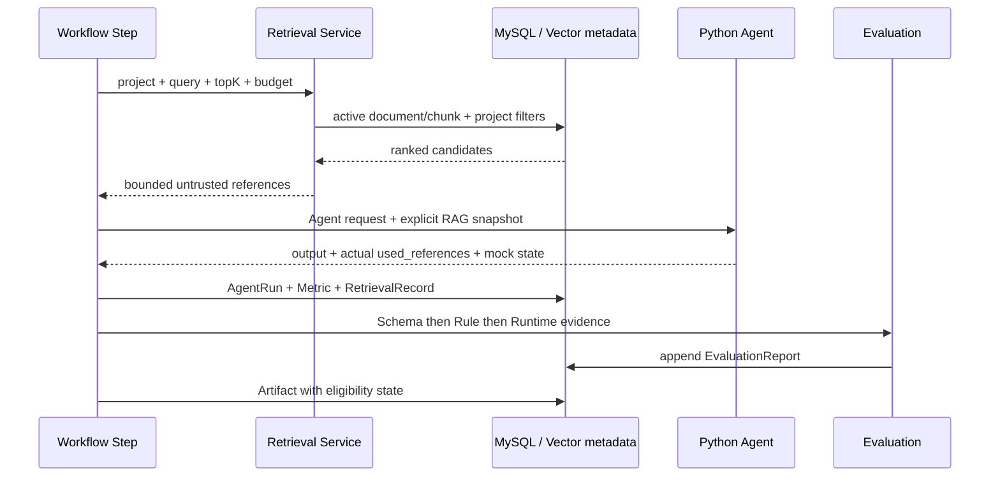
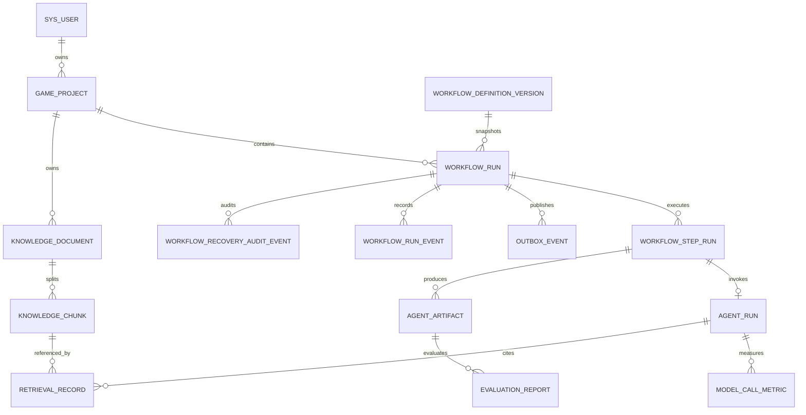

# 系统架构与核心链路

本文只描述当前仓库中存在的组件和持久化事实。设计目标与已通过发布 gate 不是同一概念；运行结论以[报告索引](../reports/README.md)为准。

## 组件边界



| 边界 | 责任 | 代码入口 |
| --- | --- | --- |
| Vue | 登录、提交、Run 快照/SSE、知识/RAG 证据、指标与 Phaser 页面 | [`frontend-vue/src/views`](../../frontend-vue/src/views)、[`workflowRunStore.js`](../../frontend-vue/src/stores/workflowRunStore.js) |
| Java API | 鉴权、项目归属、请求契约和安全 read model | [`controller`](../../backend-java/src/main/java/com/example/gameworkbench/controller) |
| 提交与消息 | 幂等创建 Run/Outbox，confirm 后发布，Consumer claim/执行 | [`AsyncWorkflowSubmissionServiceImpl.java`](../../backend-java/src/main/java/com/example/gameworkbench/service/impl/AsyncWorkflowSubmissionServiceImpl.java)、[`OutboxPublisher.java`](../../backend-java/src/main/java/com/example/gameworkbench/service/impl/OutboxPublisher.java)、[`WorkflowMessageConsumer.java`](../../backend-java/src/main/java/com/example/gameworkbench/messaging/WorkflowMessageConsumer.java) |
| Runner | 只读取冻结定义，按依赖执行 Step，写 Agent/Artifact/Evaluation | [`application/workflow`](../../backend-java/src/main/java/com/example/gameworkbench/application/workflow) |
| Python Agent | 校验 Java 协议、构造受控上下文、调用显式 mock/Provider | [`python-agent/app`](../../python-agent/app) |
| 持久化 | Flyway V1–V26；Run/Step/Outbox/Event/Metric/Evaluation/Knowledge/Retrieval | [`db/migration`](../../backend-java/src/main/resources/db/migration) |

## 核心时序

### 幂等提交与可靠投递



当前 R7 运行在 `A -> R` 处返回业务码 `50302`，所以图中后续链路是实现边界，不是当前候选已通过的 E2E 事实。参见[R7 主链路报告](../reports/R7-main-workflow-e2e-report.md)。

### 快照、SSE 与命令

```mermaid
sequenceDiagram
    participant V as Vue Run Center
    participant Q as Query API
    participant E as SSE API
    participant D as MySQL

    V->>Q: GET workflow-runs/{uuid}
    Q->>D: owner-scoped read model
    Q-->>V: snapshot + steps + artifacts + allowedActions
    V->>E: GET events, Last-Event-ID
    E->>D: ownership check + persisted sequence
    E-->>V: snapshot, then ordered events
    Note over V,E: duplicate/old sequence ignored; gap triggers snapshot refresh
    V->>Q: cancel or retry only when allowed
    Q->>D: versioned state update + event/outbox/audit
```

浏览器断线只影响展示连接，不改变后台执行事实；状态以服务端快照和持久化事件为准。证据见[R4 报告](../reports/R4-run-center-report.md)。

### RAG、Agent 与评测



`RetrievalRecord` 只记录 Python 成功响应中实际声明使用的引用；RAG-off、empty、unavailable 与 mock 是不同状态。当前 fake embedding/vector 仅用于确定性验证，PDF/索引恢复与完整 Runtime 持久化仍是阻断项，见[R5](../reports/R5-prompt-evaluation-metrics-report.md)和[R6](../reports/R6-rag-knowledge-report.md)。

## 数据关系



关键不变量：

- 同一用户/项目/幂等键只允许一个有效 `WorkflowRun`。
- Step 成功事实必须关联唯一有效 AgentRun、Metric 与 Artifact；重复消息读取终态而不是重复成功。
- WorkflowRun 保存定义与 PromptVersion 快照，运行中 ACTIVE 版本变化不改写历史。
- Artifact 可展示不代表可试玩；GameConfig 需要结构与评测证据满足 eligibility。
- 新检索排除失效文档，但历史 RetrievalRecord 不被改写。

## 故障与恢复边界

- Redis 不可用时高成本提交 fail-closed；错误 owner 不能释放其他执行者的锁。
- RabbitMQ publish/confirm 失败时 Outbox 不得假标已发布。
- Consumer 只在持久化结果后 ACK；重复投递通过 durable claim/终态读取消重。
- Python timeout/429/非法输出应有限重试并留下分类错误，不写虚假成功。
- SSE 断开不取消 Workflow；恢复依赖不能靠手工改数据库终态。

这些是实现与测试目标。当前故障矩阵只有 Redis fail-closed/owner-token 子项通过，其余被 R3 提交门阻断，见[R7 故障报告](../reports/R7-fault-injection-recovery-report.md)。

## 安全与可观测边界

- 外部端口仅绑定 loopback；Redis/RabbitMQ 管理面不发布到主机。
- Java 到 Python 使用内部认证；生产 profile 关闭 Java Demo/Swagger，Python 生产 mock 关闭证据仍缺失。
- 日志使用 trace/run/step/agent/message 关联字段，不记录完整 Prompt、文档正文或 Provider 原始输出。
- UUID 不进入 metrics 标签；health、readiness 与 Prometheus 暴露分开控制。

详情见[运维 Runbook](../operations-runbook.md)、[可观测报告](../reports/R7-observability-operations-report.md)和[安全审计](../reports/R7-security-release-audit.md)。
