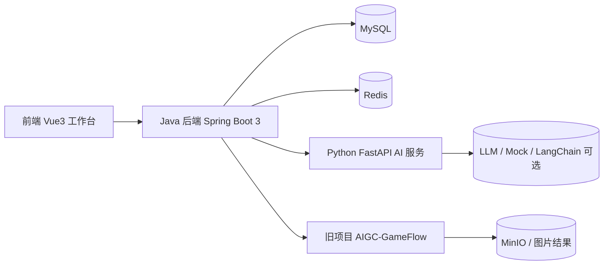
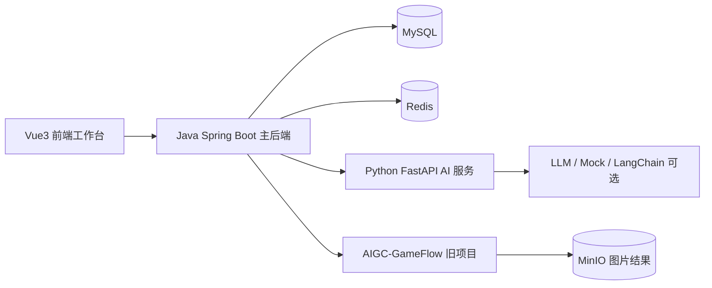
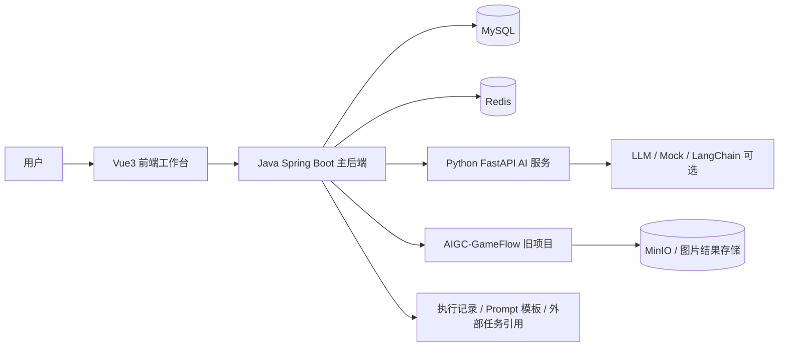
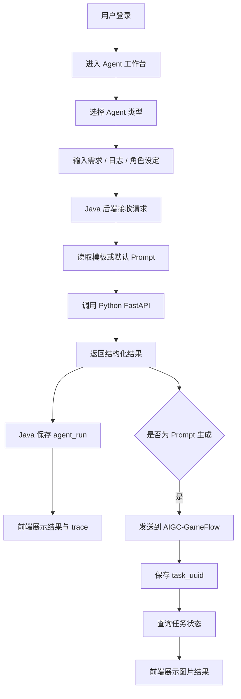

# Codex Session 019dd42f-ba75-7a41-8177-d256d29752d7

- Modified: 2026-05-01 20:28:44
- CWD: `C:\Users\MECHREVO\Documents\New project`
- Source: `vscode`
- Original JSONL: `C:\Users\MECHREVO\.codex\sessions\2026\04\28\rollout-2026-04-28T21-03-10-019dd42f-ba75-7a41-8177-d256d29752d7.jsonl`
- User messages: 28
- Assistant messages: 47

## Transcript

### 1. User

我要从 0 开始开发一个用于暑期实习求职的项目，项目名叫 GameDev Agent Workbench。

一、项目背景

我已有一个旧项目 AIGC-GameFlow，技术栈是 Java 21、Spring Boot 3、MySQL、Redis、RabbitMQ、Neo4j、MinIO、LangChain4j、ComfyUI。

旧项目主要负责：
1. 游戏世界观和角色设定生成。
2. Agent 自然语言交互。
3. 图片生成任务提交。
4. RabbitMQ 异步生图。
5. MinIO 存储生成结果。

现在我要做一个新项目，不重复造旧项目的生图能力，而是作为旧项目的上游和配套工具。

二、项目定位

新项目叫 GameDev Agent Workbench，是一个面向小游戏开发流程的 AI Agent 工作台。

目标是模拟公司小游戏团队里的 AI 工作流，帮助开发者完成：
1. 需求拆解。
2. 接口设计。
3. Prompt 生成。
4. Bug 日志分析。
5. Agent 执行记录追踪。
6. 和旧项目 AIGC-GameFlow 联动生成素材。

这个项目用于广州中小厂暑期实习投递，重点展示：
1. Java 后端开发能力。
2. 接口设计能力。
3. 数据库设计能力。
4. Python AI 服务调用能力。
5. Agent / Tool Calling / Workflow 理解。
6. 实际工作中使用 AI 工具提效的能力。

三、项目参考方向

项目不要做成通用聊天机器人，也不要做成纯游戏客户端。

请参考以下真实产品或开源项目的局部思想：
1. Dify：参考 AI Workflow、Prompt 模板、执行记录的思想。
2. Langfuse：参考 AI 调用 trace，记录输入、输出、耗时、工具调用和失败原因。
3. promptfoo：参考 Prompt 测试和效果评估思想。
4. Bruno / Postman：参考接口调试和接口文档组织方式。
5. LangChain4j / Spring AI：参考 Java 后端接入 LLM 和 Tool Calling 的工程方式。

四、推荐技术栈

主后端：
- Java 21
- Spring Boot 3
- Spring MVC
- MyBatis-Plus
- MySQL
- Redis
- Spring Security + JWT

Python 服务：
- Python 3.11+
- FastAPI
- Pydantic
- requests / httpx
- 可选：LangChain / LangGraph，前期不要强依赖

AI 能力：
- LLM API
- Prompt Template
- Tool Calling
- Workflow 执行记录

前端：
- Vue3
- Vite
- Element Plus 或 Naive UI

工程化：
- Maven
- Docker Compose
- Apifox 或 Bruno
- README
- docs 目录
- application-example.yml

五、核心业务功能

请把 MVP 控制在一个月内可完成，不要设计成大平台。

MVP 必须包含以下功能：

1. 用户登录注册
- JWT 鉴权
- 当前用户上下文
- 基础权限控制

2. Agent 工作台
用户可以选择不同 Agent 类型：
- 需求拆解 Agent
- 接口设计 Agent
- Bug 分析 Agent
- Prompt 生成 Agent

3. 需求拆解 Agent
输入：
- 一段小游戏功能需求，例如“做一个每日登录奖励功能”

输出：
- 功能说明
- 用户故事
- 后端接口清单
- 数据表建议
- 开发任务拆分
- 测试点

4. 接口设计 Agent
输入：
- 功能描述或需求拆解结果

输出：
- RESTful API 设计
- 请求方式
- URL
- 请求参数
- 响应示例
- 异常情况
- 可直接整理成 Apifox 文档的结构

5. Bug 分析 Agent
输入：
- Java 报错日志
- 接口返回错误
- RabbitMQ / Redis / MySQL 常见错误日志

输出：
- 错误类型
- 关键报错行
- 可能原因
- 排查步骤
- 修复建议
- 是否需要人工确认

6. Prompt 生成 Agent
输入：
- 游戏类型
- 角色设定
- 美术风格
- 场景描述

输出：
- 生图 Prompt
- Negative Prompt
- 风格标签
- 可复用 Prompt 模板

7. Workflow 执行记录
每次 Agent 调用都要保存：
- 用户 ID
- Agent 类型
- 输入内容
- 输出内容
- 执行状态
- 耗时
- 错误信息
- 创建时间

8. Prompt 模板管理
支持：
- 新增 Prompt 模板
- 修改 Prompt 模板
- 按 Agent 类型查询模板
- 启用 / 禁用模板

9. 和旧项目 AIGC-GameFlow 联动
新项目可以把 Prompt 生成 Agent 的结果发送给旧项目。
联动方式优先用 HTTP 接口：
- 新项目生成图片 Prompt
- 用户点击“发送到 AIGC-GameFlow”
- 调用旧项目的任务提交接口
- 保存旧项目返回的 task_uuid
- 支持查看任务状态

六、加分功能

MVP 完成后再做：

1. Agent 执行评分
用户可以对每次输出打分：
- 有用
- 一般
- 无用

2. Prompt A/B 测试
同一输入使用两个 Prompt 模板生成结果，让用户比较哪个更好。

3. SSE 流式输出
Agent 生成内容时，前端可以逐字显示。

4. 失败案例库
保存 Agent 输出失败或用户评分低的案例，用于后续优化 Prompt。

5. GitHub 风格 Markdown 导出
把需求拆解、接口设计、Bug 分析结果导出成 Markdown。

七、数据库设计要求

请先设计核心表，不要过度复杂。

建议至少包含：

1. sys_user
- id
- username
- password
- role
- create_time
- update_time
- is_deleted

2. agent_session
- id
- session_uuid
- user_id
- title
- agent_type
- create_time
- update_time
- is_deleted

3. agent_run
- id
- run_uuid
- session_id
- user_id
- agent_type
- input_text
- output_text
- status
- duration_ms
- error_msg
- score
- create_time
- update_time

4. prompt_template
- id
- template_name
- agent_type
- template_content
- enabled
- version
- create_time
- update_time

5. external_task_ref
- id
- run_id
- source_project
- external_task_uuid
- external_status
- external_result_url
- create_time
- update_time

八、后端接口设计要求

请按照 RESTful 风格设计接口。

至少包含：

用户模块：
- POST /api/auth/register
- POST /api/auth/login
- GET /api/auth/me

Agent 模块：
- POST /api/agent/run
- GET /api/agent/runs
- GET /api/agent/runs/{runUuid}
- POST /api/agent/runs/{runUuid}/score

Prompt 模板模块：
- POST /api/prompts
- PUT /api/prompts/{id}
- GET /api/prompts
- GET /api/prompts/{id}
- POST /api/prompts/{id}/enable
- POST /api/prompts/{id}/disable

旧项目联动模块：
- POST /api/integrations/aigc-gameflow/submit
- GET /api/integrations/aigc-gameflow/tasks/{taskUuid}

九、Python FastAPI 服务设计

Python 服务负责更偏 AI 编排和文本处理的部分。

至少包含：

- POST /agent/requirement-breakdown
- POST /agent/api-design
- POST /agent/bug-analysis
- POST /agent/prompt-generate

每个接口都应该有：
- Pydantic 请求模型
- Pydantic 响应模型
- 错误处理
- 日志打印
- 可替换的 LLM 调用层

前期可以先用 mock 结果，后续再接真实 LLM API。

十、前端页面设计

前端不要做复杂后台，只做清晰可演示的工作台。

页面包括：

1. 登录页
2. Agent 工作台
- 左侧选择 Agent 类型
- 中间输入需求 / 日志 / 游戏设定
- 右侧展示结构化输出

3. 执行记录页
- 查看历史 Agent 运行记录
- 按 Agent 类型筛选
- 查看耗时、状态、评分

4. Prompt 模板管理页
- 新增模板
- 编辑模板
- 启用 / 禁用模板

5. AIGC-GameFlow 联动页
- 展示 Prompt 生成结果
- 一键发送到旧项目
- 查看旧项目任务状态

十一、分阶段开发路线

第一阶段：项目骨架
目标：把 Java 后端、Python 服务、前端跑起来。
任务：
1. 创建 Spring Boot 项目。
2. 创建 FastAPI 项目。
3. 创建 Vue3 项目。
4. 配置 MySQL、Redis。
5. 写基础 README。
6. 完成登录注册。

第二阶段：Agent MVP
目标：完成最核心的 Agent 调用闭环。
任务：
1. 实现 agent_run 表。
2. 实现 POST /api/agent/run。
3. Java 根据 agent_type 调用 Python 对应接口。
4. Python 返回 mock 结构化结果。
5. Java 保存执行记录。
6. 前端展示输入和输出。

第三阶段：Prompt 模板
目标：让 Agent 输出不再是硬编码。
任务：
1. 实现 prompt_template 表。
2. 完成模板 CRUD。
3. Agent 调用时读取启用模板。
4. 支持按 Agent 类型选择模板。

第四阶段：旧项目联动
目标：和 AIGC-GameFlow 形成闭环。
任务：
1. Prompt 生成 Agent 输出生图 Prompt。
2. 新项目调用旧项目任务提交接口。
3. 保存 task_uuid。
4. 查询旧项目任务状态。
5. 前端展示任务状态和结果图片。

第五阶段：求职打磨
目标：让项目适合投简历和面试展示。
任务：
1. 完善 README。
2. 画架构图。
3. 写接口文档。
4. 录制 Demo GIF。
5. 写简历项目描述。
6. 写面试问答文档。
7. 整理 GitHub 仓库结构。

十二、代码风格要求

请遵循以下原则：
1. 使用清晰的 Controller、Service、Mapper、DTO、VO 分层。
2. 不要把业务逻辑写在 Controller。
3. 统一返回结构。
4. 统一异常处理。
5. DTO 做参数校验。
6. 数据库字段命名使用下划线。
7. Java 类名和方法名保持语义清晰。
8. Python 代码保持模块化，不要把所有逻辑写在 main.py。
9. 重要流程加日志。
10. 不要过度封装。

十三、请你先输出

请先不要写代码。
请先输出以下内容：
1. 项目整体架构说明。
2. 推荐目录结构。
3. 数据库表设计 SQL。
4. Java 后端接口设计。
5. Python FastAPI 接口设计。
6. 前端页面结构。
7. MVP 和加分项划分。
8. 一个月开发计划。
9. 如何和旧项目 AIGC-GameFlow 一起展示。
10. 这个项目写到简历上应该怎么描述。

### 2. Codex

我先把方案按“能在一个月内做完、又适合暑期实习展示”的标准收拢成一版。接下来我会直接给出架构、表设计、接口和排期，不写代码，重点帮你把这个项目定成一个清晰的求职作品。

### 3. Codex

**项目定位**
GameDev Agent Workbench 建议做成一个“小游戏开发 AI 工作台”，而不是聊天机器人或游戏客户端。它的核心价值是把需求拆解、接口设计、Bug 分析、Prompt 生成、执行记录、模板管理串成一条可演示的工程化工作流，并且把 `AIGC-GameFlow` 作为下游素材生成系统接起来，形成完整闭环。

**1. 项目整体架构说明**

推荐采用“三端两服务一存储”的形态：



职责划分建议如下：
- `Java 后端`负责登录鉴权、权限控制、业务编排、执行记录落库、Prompt 模板管理、对外联动 `AIGC-GameFlow`。
- `Python FastAPI`负责 AI 编排和文本生成，前期先返回 mock 结构化结果，后续替换真实 LLM。
- `Vue3 前端`负责工作台、执行记录、模板管理、联动页展示。
- `MySQL`存业务数据和 trace 记录。
- `Redis`放登录态辅助信息、验证码、限流、热点模板缓存。
- `AIGC-GameFlow`作为生图下游，只接收 Prompt，不重复建设生图能力。

这个项目的面试表达重点，不是“我做了一个 AI 聊天”，而是“我做了一个面向小游戏开发流程的 AI Agent 编排工作台”。

---

**2. 推荐目录结构**

建议做成单仓库，方便演示和联动：

```text
gamedev-agent-workbench/
├─ backend-java/
│  ├─ src/main/java/com/xxx/gamedev/
│  │  ├─ common/
│  │  ├─ config/
│  │  ├─ controller/
│  │  ├─ dto/
│  │  ├─ vo/
│  │  ├─ entity/
│  │  ├─ mapper/
│  │  ├─ service/
│  │  ├─ service/impl/
│  │  ├─ security/
│  │  ├─ integration/
│  │  └─ GamedevApplication.java
│  │
│  └─ src/main/resources/
│     ├─ mapper/
│     ├─ application-example.yml
│     └─ db/migration/
│
├─ backend-python/
│  ├─ app/
│  │  ├─ api/
│  │  ├─ schemas/
│  │  ├─ services/
│  │  ├─ core/
│  │  ├─ clients/
│  │  ├─ utils/
│  │  └─ main.py
│  ├─ tests/
│  ├─ requirements.txt
│  └─ README.md
│
├─ frontend-web/
│  ├─ src/
│  │  ├─ api/
│  │  ├─ assets/
│  │  ├─ components/
│  │  ├─ layouts/
│  │  ├─ pages/
│  │  ├─ router/
│  │  ├─ store/
│  │  └─ utils/
│  ├─ index.html
│  └─ vite.config.ts
│
├─ docs/
│  ├─ architecture.md
│  ├─ api.md
│  ├─ database.md
│  ├─ demo-flow.md
│  └─ interview-qa.md
│
├─ docker-compose.yml
├─ README.md
└─ .env.example
```

如果你想更偏“求职展示”，`docs/` 一定要留好，因为它能直接变成面试讲解材料。

---

**3. 数据库表设计 SQL**

下面是适合 MVP 的核心表设计，保持简洁但足够支撑演示。

```sql
CREATE TABLE sys_user (
    id BIGINT PRIMARY KEY AUTO_INCREMENT,
    username VARCHAR(64) NOT NULL COMMENT '用户名',
    password_hash VARCHAR(255) NOT NULL COMMENT '密码哈希',
    role VARCHAR(32) NOT NULL DEFAULT 'USER' COMMENT '角色',
    create_time DATETIME NOT NULL DEFAULT CURRENT_TIMESTAMP,
    update_time DATETIME NOT NULL DEFAULT CURRENT_TIMESTAMP ON UPDATE CURRENT_TIMESTAMP,
    is_deleted TINYINT NOT NULL DEFAULT 0,
    UNIQUE KEY uk_username (username)
) ENGINE=InnoDB DEFAULT CHARSET=utf8mb4 COMMENT='系统用户表';

CREATE TABLE agent_session (
    id BIGINT PRIMARY KEY AUTO_INCREMENT,
    session_uuid VARCHAR(64) NOT NULL COMMENT '会话UUID',
    user_id BIGINT NOT NULL COMMENT '用户ID',
    title VARCHAR(128) NOT NULL COMMENT '会话标题',
    agent_type VARCHAR(32) NOT NULL COMMENT 'Agent类型',
    create_time DATETIME NOT NULL DEFAULT CURRENT_TIMESTAMP,
    update_time DATETIME NOT NULL DEFAULT CURRENT_TIMESTAMP ON UPDATE CURRENT_TIMESTAMP,
    is_deleted TINYINT NOT NULL DEFAULT 0,
    UNIQUE KEY uk_session_uuid (session_uuid),
    KEY idx_user_id (user_id),
    KEY idx_agent_type (agent_type)
) ENGINE=InnoDB DEFAULT CHARSET=utf8mb4 COMMENT='Agent会话表';

CREATE TABLE agent_run (
    id BIGINT PRIMARY KEY AUTO_INCREMENT,
    run_uuid VARCHAR(64) NOT NULL COMMENT '运行UUID',
    session_id BIGINT NOT NULL COMMENT '会话ID',
    user_id BIGINT NOT NULL COMMENT '用户ID',
    agent_type VARCHAR(32) NOT NULL COMMENT 'Agent类型',
    input_text TEXT NOT NULL COMMENT '输入内容',
    output_text LONGTEXT COMMENT '输出内容',
    status VARCHAR(32) NOT NULL COMMENT '执行状态',
    duration_ms BIGINT DEFAULT NULL COMMENT '耗时毫秒',
    error_msg TEXT COMMENT '错误信息',
    score TINYINT DEFAULT NULL COMMENT '评分',
    create_time DATETIME NOT NULL DEFAULT CURRENT_TIMESTAMP,
    update_time DATETIME NOT NULL DEFAULT CURRENT_TIMESTAMP ON UPDATE CURRENT_TIMESTAMP,
    UNIQUE KEY uk_run_uuid (run_uuid),
    KEY idx_session_id (session_id),
    KEY idx_user_id (user_id),
    KEY idx_agent_type (agent_type),
    KEY idx_status (status),
    KEY idx_create_time (create_time)
) ENGINE=InnoDB DEFAULT CHARSET=utf8mb4 COMMENT='Agent执行记录表';

CREATE TABLE prompt_template (
    id BIGINT PRIMARY KEY AUTO_INCREMENT,
    template_name VARCHAR(128) NOT NULL COMMENT '模板名称',
    agent_type VARCHAR(32) NOT NULL COMMENT 'Agent类型',
    template_content TEXT NOT NULL COMMENT '模板内容',
    enabled TINYINT NOT NULL DEFAULT 1 COMMENT '是否启用',
    version INT NOT NULL DEFAULT 1 COMMENT '版本号',
    create_time DATETIME NOT NULL DEFAULT CURRENT_TIMESTAMP,
    update_time DATETIME NOT NULL DEFAULT CURRENT_TIMESTAMP ON UPDATE CURRENT_TIMESTAMP,
    KEY idx_agent_type (agent_type),
    KEY idx_enabled (enabled)
) ENGINE=InnoDB DEFAULT CHARSET=utf8mb4 COMMENT='Prompt模板表';

CREATE TABLE external_task_ref (
    id BIGINT PRIMARY KEY AUTO_INCREMENT,
    run_id BIGINT NOT NULL COMMENT 'Agent运行ID',
    source_project VARCHAR(64) NOT NULL COMMENT '来源项目',
    external_task_uuid VARCHAR(64) NOT NULL COMMENT '外部任务UUID',
    external_status VARCHAR(32) DEFAULT NULL COMMENT '外部任务状态',
    external_result_url VARCHAR(255) DEFAULT NULL COMMENT '结果地址',
    create_time DATETIME NOT NULL DEFAULT CURRENT_TIMESTAMP,
    update_time DATETIME NOT NULL DEFAULT CURRENT_TIMESTAMP ON UPDATE CURRENT_TIMESTAMP,
    UNIQUE KEY uk_external_task_uuid (external_task_uuid),
    KEY idx_run_id (run_id),
    KEY idx_source_project (source_project)
) ENGINE=InnoDB DEFAULT CHARSET=utf8mb4 COMMENT='外部任务引用表';
```

补充建议：
- `agent_run.output_text` 直接存结构化 JSON 字符串，前期最省事。
- `score` 先做 `1/0/-1` 或 `1/2/3` 都行，MVP 阶段别复杂化。
- `status` 建议固定为 `PENDING / RUNNING / SUCCESS / FAILED`。
- `agent_type` 建议固定枚举：`REQUIREMENT_BREAKDOWN / API_DESIGN / BUG_ANALYSIS / PROMPT_GENERATE`。

---

**4. Java 后端接口设计**

建议统一返回结构：

```json
{
  "code": 0,
  "message": "success",
  "data": {},
  "traceId": "xxx"
}
```

接口设计建议如下：

| 模块 | 接口 | 说明 | 关键请求字段 | 关键返回字段 |
|---|---|---|---|---|
| 用户 | `POST /api/auth/register` | 注册 | `username`, `password` | 用户信息 |
| 用户 | `POST /api/auth/login` | 登录并签发 JWT | `username`, `password` | `token`, `userInfo` |
| 用户 | `GET

[Truncated in migration transcript; original JSONL keeps the full text.]

### 4. User

你能为我设计一份apifox的接口文档吗

### 5. Codex

可以。下面我直接按 **Apifox 接口文档** 的方式，帮你整理成一份可落地的接口设计稿，你可以据此在 Apifox 里按模块创建接口、参数、示例和环境变量。

---

# GameDev Agent Workbench API 文档设计

## 1. 基础信息

**项目名**
`GameDev Agent Workbench`

**Base URL**
- 测试环境：`http://localhost:8080`
- Python 服务：`http://localhost:8000`

**鉴权方式**
- `JWT Bearer Token`
- 请求头统一携带：
```http
Authorization: Bearer <token>
Content-Type: application/json
```

**统一返回结构**
```json
{
  "code": 0,
  "message": "success",
  "data": {},
  "traceId": "trace_20260428_xxx"
}
```

**通用状态码**
- `0`：成功
- `40001`：参数错误
- `40101`：未登录或 token 无效
- `40301`：无权限
- `50000`：系统异常
- `60001`：外部服务调用失败

---

## 2. Apifox 目录结构建议

建议你在 Apifox 里按下面的目录来建：

```text
GameDev Agent Workbench
├─ 01-认证模块
│  ├─ 注册
│  ├─ 登录
│  └─ 获取当前用户
├─ 02-Agent模块
│  ├─ 发起Agent执行
│  ├─ 查询执行记录列表
│  ├─ 查询执行详情
│  └─ 评分Agent结果
├─ 03-Prompt模板模块
│  ├─ 新增模板
│  ├─ 修改模板
│  ├─ 模板列表
│  ├─ 模板详情
│  ├─ 启用模板
│  └─ 禁用模板
├─ 04-旧项目联动模块
│  ├─ 提交到AIGC-GameFlow
│  └─ 查询外部任务状态
└─ 05-Python AI服务
   ├─ 需求拆解
   ├─ 接口设计
   ├─ Bug分析
   └─ Prompt生成
```

---

## 3. 通用数据模型

### 3.1 用户对象 `UserVO`
```json
{
  "id": 1,
  "username": "alice",
  "role": "USER",
  "createTime": "2026-04-28 10:00:00"
}
```

### 3.2 Agent 执行记录 `AgentRunVO`
```json
{
  "runUuid": "run_20260428_xxx",
  "sessionUuid": "session_20260428_xxx",
  "agentType": "REQUIREMENT_BREAKDOWN",
  "inputText": "做一个每日登录奖励功能",
  "outputText": "{...}",
  "status": "SUCCESS",
  "durationMs": 1823,
  "errorMsg": null,
  "score": 1,
  "createTime": "2026-04-28 10:10:00"
}
```

### 3.3 Prompt 模板对象 `PromptTemplateVO`
```json
{
  "id": 1,
  "templateName": "每日登录奖励模板",
  "agentType": "PROMPT_GENERATE",
  "templateContent": "请根据角色设定生成适合生图的 Prompt...",
  "enabled": true,
  "version": 1,
  "createTime": "2026-04-28 10:00:00"
}
```

### 3.4 外部任务对象 `ExternalTaskVO`
```json
{
  "taskUuid": "task_xxx",
  "sourceProject": "AIGC-GameFlow",
  "externalStatus": "RUNNING",
  "externalResultUrl": null
}
```

---

# 4. 认证模块

## 4.1 注册

**POST** `/api/auth/register`

### 请求体
```json
{
  "username": "alice",
  "password": "123456"
}
```

### 响应体
```json
{
  "code": 0,
  "message": "success",
  "data": {
    "id": 1,
    "username": "alice",
    "role": "USER"
  },
  "traceId": "trace_xxx"
}
```

### 备注
- `username` 不能为空，长度建议 4-20。
- `password` 建议最少 6 位。
- 注册后默认角色 `USER`。

---

## 4.2 登录

**POST** `/api/auth/login`

### 请求体
```json
{
  "username": "alice",
  "password": "123456"
}
```

### 响应体
```json
{
  "code": 0,
  "message": "success",
  "data": {
    "token": "eyJhbGciOiJIUzI1NiJ9.xxx",
    "user": {
      "id": 1,
      "username": "alice",
      "role": "USER"
    }
  },
  "traceId": "trace_xxx"
}
```

### 备注
- 登录成功后前端把 `token` 存到 `localStorage`。
- 后续接口统一带 `Authorization` 头。

---

## 4.3 获取当前用户

**GET** `/api/auth/me`

### 请求头
```http
Authorization: Bearer <token>
```

### 响应体
```json
{
  "code": 0,
  "message": "success",
  "data": {
    "id": 1,
    "username": "alice",
    "role": "USER",
    "createTime": "2026-04-28 10:00:00"
  },
  "traceId": "trace_xxx"
}
```

---

# 5. Agent 模块

## 5.1 发起 Agent 执行

**POST** `/api/agent/run`

### 请求体
```json
{
  "sessionUuid": "session_20260428_001",
  "agentType": "REQUIREMENT_BREAKDOWN",
  "inputText": "做一个每日登录奖励功能",
  "templateId": 1
}
```

### 字段说明
- `sessionUuid`：会话 ID，没有则前端可先生成或由后端自动创建
- `agentType`：Agent 类型
- `inputText`：用户输入内容
- `templateId`：可选，指定 Prompt 模板

### 响应体
```json
{
  "code": 0,
  "message": "success",
  "data": {
    "runUuid": "run_20260428_001",
    "sessionUuid": "session_20260428_001",
    "agentType": "REQUIREMENT_BREAKDOWN",
    "status": "SUCCESS",
    "durationMs": 1520,
    "outputText": {
      "summary": "每日登录奖励功能用于提升留存",
      "userStories": [
        "作为用户，我希望每日登录后领取奖励"
      ],
      "apiList": [
        {
          "method": "GET",
          "path": "/api/login-reward/today"
        }
      ]
    }
  },
  "traceId": "trace_xxx"
}
```

### 备注
- 这是核心接口。
- Java 后端负责落库 `agent_run`。
- Java 调 Python 服务获取结构化结果。

---

## 5.2 查询执行记录列表

**GET** `/api/agent/runs`

### Query 参数
| 参数 | 类型 | 必填 | 说明 |
|---|---|---:|---|
| `agentType` | string | 否 | 按 Agent 类型筛选 |
| `status` | string | 否 | SUCCESS / FAILED / RUNNING / PENDING |
| `page` | int | 否 | 默认 1 |
| `size` | int | 否 | 默认 10 |

### 示例
```http
GET /api/agent/runs?page=1&size=10&agentType=BUG_ANALYSIS
```

### 响应体
```json
{
  "code": 0,
  "message": "success",
  "data": {
    "total": 2,
    "list": [
      {
        "runUuid": "run_20260428_001",
        "agentType": "BUG_ANALYSIS",
        "status": "SUCCESS",
        "durationMs": 1200,
        "score": 1,
        "createTime": "2026-04-28 10:00:00"
      }
    ]
  },
  "traceId": "trace_xxx"
}
```

---

## 5.3 查询执行详情

**GET** `/api/agent/runs/{runUuid}`

### 响应体
```json
{
  "code": 0,
  "message": "success",
  "data": {
    "runUuid": "run_20260428_001",
    "sessionUuid": "session_20260428_001",
    "agentType": "BUG_ANALYSIS",
    "inputText": "java.lang.NullPointerException at ...",
    "outputText": {
      "errorType": "空指针异常",
      "possibleCauses": [
        "对象未初始化",
        "接口返回为空"
      ]
    },
    "status": "SUCCESS",
    "durationMs": 1200,
    "errorMsg": null,
    "score": 1,
    "createTime": "2026-04-28 10:00:00"
  },
  "traceId": "trace_xxx"
}
```

---

## 5.4 评分 Agent 结果

**POST** `/api/agent/runs/{runUuid}/score`

### 请求体
```json
{
  "score": 1
}
```

### 评分建议
- `1`：有用
- `0`：一般
- `-1`：无用

### 响应体
```json
{
  "code": 0,
  "message": "success",
  "data": {
    "runUuid": "run_20260428_001",
    "score": 1
  },
  "traceId": "trace_xxx"
}
```

---

# 6. Prompt 模板模块

## 6.1 新增模板

**POST** `/api/prompts`

### 请求体
```json
{
  "templateName": "生图 Prompt 模板 v1",
  "agentType": "PROMPT_GENERATE",
  "templateContent": "请根据以下角色设定生成适合二次元小游戏的生图提示词...",
  "enabled": true
}
```

### 响应体
```json
{
  "code": 0,
  "message": "success",
  "data": {
    "id": 1
  },
  "traceId": "trace_xxx"
}
```

---

## 6.2 修改模板

**PUT** `/api/prompts/{id}`

### 请求体
```json
{
  "templateName": "生图 Prompt 模板 v2",
  "agentType": "PROMPT_GENERATE",
  "templateContent": "请根据以下角

[Truncated in migration transcript; original JSONL keeps the full text.]

### 6. User

这个项目可以用python写吗

### 7. Codex

可以，但我建议你分两种情况看：

**结论先说：**
- **可以全用 Python 写**，比如 `FastAPI + SQLAlchemy/SQLModel + Redis + JWT + Vue3`，完全能做出这个项目。
- 但如果你的目标是 **暑期实习简历展示 Java 后端能力**，那就 **不建议整个项目都用 Python**。更好的方案是：
  - **Java 做主后端**
  - **Python 做 AI 编排服务**
  - 前端还是 `Vue3`

这样最符合你这个项目的定位。

---

**为什么可以全 Python 写**
Python 方案很适合：
- 接 LLM 很方便
- FastAPI 写接口快
- Pydantic 做数据校验很顺手
- 后续接 LangChain / LangGraph 也更自然
- 做原型速度快，适合一个月内完成

如果你想把项目做成：
- 一个轻量 AI 工具台
- 重点展示 Agent / Prompt / Workflow 思维
- 不特别强调 Java 工程能力

那 Python 全栈是完全可行的。

---

**为什么我不建议你全 Python**
因为你前面已经明确了，这个项目是拿去投 **广州中小厂暑期实习**，而你想重点展示：
- Java 后端开发能力
- 接口设计能力
- 数据库设计能力
- Spring Boot 工程化能力
- Python AI 服务调用能力

如果全用 Python，项目会变成“一个不错的 AI Web 项目”，但会少掉你想突出的 Java 价值点。

---

**更推荐的两种方案**

### 方案 A：Java 主后端 + Python AI 服务
这是我最推荐的。

- Java：登录、权限、数据库、执行记录、模板管理、联动旧项目
- Python：需求拆解、接口设计、Bug 分析、Prompt 生成
- 前端：Vue3

优点：
- 最贴合你的求职目标
- 能展示 Java 和 Python 双技能
- 架构更像真实公司项目
- 面试时更好讲“服务拆分”和“工作流编排”

### 方案 B：全 Python
适合你如果：
- 时间非常紧
- 更想快速做出成品
- 不太在意 Java 展示

技术栈可以是：
- FastAPI
- PostgreSQL/MySQL
- Redis
- JWT
- Vue3

缺点是：
- 不突出 Java
- 和你旧项目 `AIGC-GameFlow` 的技术叙事会弱一些
- 简历上的“后端工程能力”亮点会少一点

---

**我的建议**
如果你这个项目是为了简历，我建议你保持现在这套设计：

- **主项目用 Java**
- **AI 能力用 Python**
- **不要全改成 Python**

因为这样你的项目故事最完整：
- Java 负责业务平台
- Python 负责智能编排
- 旧项目负责生图素材
- 前端负责演示闭环

这会比“纯 Python 做一个 AI 工具站”更适合面试。

---

如果你愿意，我可以下一步直接帮你出一版：

1. **全 Python 方案的技术架构**
2. **Java + Python 混合方案的分工对比**
3. **如果你坚持全 Python，推荐的项目目录结构和表设计**

你只要回我一个数字就行。

### 8. User

前后端文档在项目开发中一般是第一步吗

### 9. Codex

不一定是“第一步”，但**应该尽早做**，尤其是你这种要做前后端分离、还要接 Python 服务和旧项目联动的项目。

更准确地说，开发顺序通常是：

1. **先定需求和边界**
2. **再定接口文档**
3. **再定数据库和核心流程**
4. **然后前后端并行开发**
5. **最后联调和补文档**

---

**为什么接口文档要早做**
因为它是前后端协作的契约。

如果你先写代码再补文档，常见问题是：
- 前端不知道接口长什么样
- 后端参数改来改去
- 字段命名不统一
- 返回结构不稳定
- 联调时才发现缺字段、缺状态码

所以更合理的做法是：
- 先把核心接口写成一版“可执行文档”
- 再按文档开发
- 开发中允许小幅调整
- 但不要等到最后才补

---

**对你这个项目来说，推荐顺序是**
1. 项目定位和 MVP 范围
2. 核心业务流
3. 数据库表设计
4. 接口文档
5. 前端页面原型
6. 后端和前端并行开发
7. Python AI 服务接入
8. 联调、测试、补充 README

---

**你可以把文档分成三层**
- **需求文档**：做什么，为什么做
- **接口文档**：怎么调用，输入输出是什么
- **设计文档**：表结构、流程图、架构图

其中最先落地的通常是：
- **MVP 需求**
- **核心接口**
- **核心表结构**

---

**一句话总结**
接口文档不是绝对第一步，但在项目开发里通常属于**最早完成的核心工作之一**，最好在真正写代码前就先定下来，这样前后端和 Python 服务才能并行推进。

如果你愿意，我可以直接帮你把这个项目的开发顺序整理成一份**“从 0 到上线的标准开发流程”**。

### 10. User

那项目的第一步一般是什么

### 11. Codex

一般不是先写代码，**第一步通常是先定清楚“你到底要做什么”**。

对你这个项目来说，第一步我建议是：

1. **确定项目目标**
   - 这个项目是给谁看的
   - 解决什么问题
   - 最想展示什么能力

2. **收敛 MVP 范围**
   - 先只做最核心的 3 到 5 个功能
   - 明确哪些功能放到后面做

3. **梳理核心业务流**
   - 用户怎么登录
   - 怎么发起 Agent
   - Agent 怎么调用 Python
   - 结果怎么落库
   - 怎么展示执行记录
   - 怎么联动旧项目

如果说得更实战一点，**你这个项目的第一步其实应该是写一页“项目说明 + MVP 列表”**，也就是：
- 项目定位
- 核心功能
- 角色分工
- 数据流
- 交付边界

---

**最适合你的顺序**
1. 明确项目定位和 MVP
2. 画核心流程图
3. 设计数据库表
4. 设计接口文档
5. 再开始前后端开发

---

**一句话总结**
项目的第一步，不是写页面，也不是建表，而是**先把需求和边界定下来**，这样后面的接口、数据库、前后端实现才不会反复改。

如果你愿意，我可以下一步直接帮你把这个项目的**第一步输出物**整理成一份可直接开工的清单，比如：
- 项目定位
- MVP 范围
- 核心流程图
- 第 1 周任务表

### 12. User

好的

### 13. Codex

下面我直接把这个项目的**第一步输出物**整理成一份你可以马上开工的版本。

**1. 项目定位**

`GameDev Agent Workbench` 是一个面向小游戏开发流程的 AI Agent 工作台，核心不是聊天，而是帮助开发者完成：

- 需求拆解
- 接口设计
- Bug 分析
- Prompt 生成
- Agent 执行记录追踪
- 与旧项目 `AIGC-GameFlow` 联动生成素材

它的求职价值在于展示：
- Java 后端工程能力
- 接口设计能力
- 数据库设计能力
- Python AI 服务调用能力
- Agent / Workflow / Tool Calling 理解

---

**2. MVP 范围**

建议第一版只做这些：

- 用户登录注册
- Agent 工作台
- 需求拆解 Agent
- 接口设计 Agent
- Bug 分析 Agent
- Prompt 生成 Agent
- Agent 执行记录
- Prompt 模板管理
- 旧项目联动提交

先别做：
- 流式输出
- A/B 测试
- 失败案例库
- 复杂权限体系
- 多租户
- 大型后台管理系统

---

**3. 核心业务流**

建议你先把主流程定成下面这条：

```text
用户登录
  -> 选择 Agent 类型
  -> 输入需求 / 日志 / 设定
  -> Java 后端接收请求
  -> 调用 Python FastAPI
  -> Python 返回结构化结果
  -> Java 保存执行记录
  -> 前端展示结果
  -> 如是 Prompt 生成，则可一键发送到 AIGC-GameFlow
  -> 保存外部 task_uuid
  -> 查询任务状态
```

这条链路就是你项目的主线。

---

**4. 第一周要做什么**

第一周目标不是“功能做完”，而是“项目跑起来”。

### 第 1 周交付清单
- 建好 Java 后端项目
- 建好 Python FastAPI 项目
- 建好 Vue3 前端项目
- 配好 MySQL、Redis
- 完成登录注册
- 完成统一返回结构
- 完成统一异常处理
- 完成 JWT 鉴权
- 跑通最小接口联调

### 第 1 周最小目标
只要做到下面这件事，就算成功：
- 用户能注册登录
- 前端能拿到 token
- 后端能识别当前用户

---

**5. 第一版文档应该写什么**

你现在最该先写的不是代码，而是这 4 个文档：

1. `README.md`
   - 项目一句话介绍
   - 技术栈
   - 核心功能
   - 运行方式

2. `docs/architecture.md`
   - 系统架构图
   - Java / Python 分工
   - 数据流

3. `docs/api.md`
   - 核心接口定义
   - 请求响应格式
   - 错误码

4. `docs/database.md`
   - 核心表结构
   - 字段说明
   - 表关系

---

**6. 你现在就可以开始做的顺序**

我建议你按这个顺序推进：

1. 写项目定位和 MVP
2. 画核心流程图
3. 定数据库表
4. 定接口文档
5. 开 Java 登录注册
6. 开 Python mock 服务
7. 开前端工作台
8. 联调 Agent run 主流程

---

**7. 我帮你总结成一句最适合开工的话**

> 这个项目的第一步，不是写代码，而是先把“项目定位 + MVP + 主流程 + 核心表 + 核心接口”定下来。

---

如果你愿意，我下一步可以直接继续帮你做下面任意一项：

1. 把这个项目的**第一周任务拆成每日计划**
2. 帮你画一版**项目架构图**
3. 直接整理成一份**可放进 README 的项目介绍**

### 14. User

帮我做吧

### 15. Codex

我先把这三样一起给你：**第一周每日计划、项目架构文字版、README 可直接用的简介**。这样你今天就能开始开工，不用再想从哪一步下手。

## 1. 第一周每日计划

### Day 1：定边界和骨架
- 明确 MVP 范围，只保留 5 个核心能力：登录注册、Agent run、执行记录、Prompt 模板、旧项目联动。
- 定技术分工：Java 主后端、Python AI 服务、Vue3 前端。
- 建仓库目录结构。
- 写 `README.md` 初稿。
- 写 `docs/` 目录下的 `architecture.md`、`api.md`、`database.md` 空文件或草稿。

当天交付目标：
- 你能说清楚这个项目是做什么的。
- 你能说清楚 Java、Python、前端分别负责什么。

### Day 2：定数据库和实体
- 设计核心表：`sys_user`、`agent_session`、`agent_run`、`prompt_template`、`external_task_ref`。
- 明确每张表的字段、索引、状态值、枚举值。
- 统一命名规则。
- 确认 `agent_type` 和 `status` 的枚举值。

当天交付目标：
- 库表定稿。
- 后续开发不再频繁改表。

### Day 3：定接口契约
- 设计 Java 后端接口。
- 设计 Python FastAPI 接口。
- 统一请求体、响应体、错误码。
- 明确哪些接口由 Java 提供，哪些由 Python 提供。

当天交付目标：
- 前后端和 Python 之间的“合同”确定下来。

### Day 4：搭后端骨架
- 创建 Spring Boot 项目。
- 配好 MyBatis-Plus、JWT、统一返回、统一异常。
- 创建 FastAPI 项目骨架。
- 配好 Pydantic、日志、错误处理。
- 前端创建 Vue3 + Vite 项目骨架。

当天交付目标：
- 三个工程都能启动。

### Day 5：做登录注册
- Java 完成注册、登录、当前用户接口。
- 接 JWT 鉴权。
- 前端完成登录页。
- 登录成功后能保存 token。

当天交付目标：
- 能登录，能识别当前用户。

### Day 6：打通最小联调
- Java 调 Python mock 接口。
- Python 返回固定结构化结果。
- Java 保存一次 `agent_run`。
- 前端提交一次 Agent 请求并显示结果。

当天交付目标：
- 跑通“前端 -> Java -> Python -> Java -> 前端”的最小链路。

### Day 7：整理和复盘
- 补 README。
- 补接口文档。
- 补数据库说明。
- 记录本周问题和下周计划。

当天交付目标：
- 项目从“空壳”变成“能演示的骨架”。

---

## 2. 项目架构文字版

你可以把项目理解成 4 层：

### 前端层
- Vue3 工作台。
- 负责登录、Agent 输入、结果展示、记录查询、模板管理、联动页展示。

### 业务层
- Java Spring Boot 主后端。
- 负责 JWT 登录、权限、用户上下文、执行记录、Prompt 模板、外部联动、统一异常处理。

### AI 层
- Python FastAPI 服务。
- 负责需求拆解、接口设计、Bug 分析、Prompt 生成。
- 前期先用 mock，后续可接真实 LLM。

### 数据层
- MySQL 存用户、会话、执行记录、模板、外部任务引用。
- Redis 存 token 辅助、热点模板缓存、限流、临时状态。

### 外部系统
- `AIGC-GameFlow` 作为素材生成下游。
- 新项目先生成 Prompt，再把任务发给旧项目。

---

## 3. 架构图文字版



---

## 4. README 简介可直接用

你可以先把下面这段放进 README 里：

### 项目简介
`GameDev Agent Workbench` 是一个面向小游戏开发流程的 AI Agent 工作台，目标是模拟真实团队中的 AI 协作流程，帮助开发者完成需求拆解、接口设计、Bug 分析、Prompt 生成、执行记录追踪，并支持与旧项目 `AIGC-GameFlow` 联动生成素材。

项目采用 `Java 21 + Spring Boot 3 + MySQL + Redis + JWT` 作为主后端，`Python FastAPI` 负责 AI 编排和文本处理，前端使用 `Vue3 + Vite` 构建工作台界面。项目重点展示后端工程化能力、接口设计能力、数据库设计能力、AI 服务调用能力以及 Agent 工作流理解。

### 核心功能
- 用户登录注册与 JWT 鉴权
- 多类型 Agent 工作台
- 需求拆解、接口设计、Bug 分析、Prompt 生成
- Agent 执行记录追踪
- Prompt 模板管理
- 与 `AIGC-GameFlow` 联动提交任务并查看状态

### 项目亮点
- 支持 AI 工作流编排，而不是单纯聊天
- 有完整的执行记录 trace 思路
- 支持 Java 主后端 + Python AI 服务的工程拆分
- 与旧项目形成“需求到素材”的闭环

---

## 5. 你接下来最该做的事

如果现在就开工，我建议你按这个顺序：
1. 先建仓库目录。
2. 再写 `README.md` 的项目简介。
3. 再定数据库表。
4. 再定接口文档。
5. 然后开始搭后端登录注册。

如果你愿意，我下一步可以直接继续帮你做其中一个：
1. 直接给你出 **第一周的每日详细任务清单**
2. 直接帮你写 **README 完整版**
3. 直接帮你画 **项目架构图 + 数据流图**

### 16. User

1,2,3

### 17. Codex

下面把你要的 `1,2,3` 一次性整理好，尽量直接能拿去开工。

---

## 1. 第一周每日详细任务清单

目标很明确：**第一周不追求功能多，只追求把项目跑通、边界定清、主链路闭环打出来。**

### Day 1：项目定稿和仓库骨架
**目标：把项目“到底做什么”彻底定下来。**

任务：
- 确认 MVP 范围。
- 确认技术分工：
  - Java：主后端
  - Python：AI 服务
  - Vue3：前端
- 创建仓库目录结构。
- 建 `README.md` 初稿。
- 建 `docs/` 目录：
  - `architecture.md`
  - `api.md`
  - `database.md`
  - `demo-flow.md`
- 写一页项目定位说明：
  - 面向谁
  - 解决什么问题
  - 展示什么能力
- 定义核心 Agent 类型：
  - `REQUIREMENT_BREAKDOWN`
  - `API_DESIGN`
  - `BUG_ANALYSIS`
  - `PROMPT_GENERATE`

当天交付物：
- 项目定位文档
- 仓库骨架
- MVP 边界说明

---

### Day 2：数据库设计定稿
**目标：把核心数据模型定下来，后面就少改表。**

任务：
- 设计并确认核心表：
  - `sys_user`
  - `agent_session`
  - `agent_run`
  - `prompt_template`
  - `external_task_ref`
- 确认每张表字段含义。
- 确认主键、唯一键、索引。
- 统一枚举值：
  - `agent_type`
  - `run_status`
  - `score`
  - `external_status`
- 确认逻辑删除字段规范。
- 输出数据库说明文档。

当天交付物：
- 数据表 SQL 草稿
- 字段说明表
- 枚举值定义

---

### Day 3：接口契约定稿
**目标：前后端和 Python 之间先约定好“说什么话”。**

任务：
- 定 Java 主后端接口：
  - 登录注册
  - Agent run
  - 执行记录
  - Prompt 模板
  - 旧项目联动
- 定 Python FastAPI 接口：
  - 需求拆解
  - 接口设计
  - Bug 分析
  - Prompt 生成
- 统一请求和响应结构。
- 定统一错误码。
- 明确哪些字段前端必传，哪些字段后端自动生成。
- 输出 Apifox 目录结构草案。

当天交付物：
- 核心接口清单
- 请求响应模型草案
- 错误码草案

---

### Day 4：三端工程初始化
**目标：把 Java、Python、前端都跑起来。**

任务：
- 创建 Spring Boot 项目。
- 接入 MyBatis-Plus、JWT、统一返回、统一异常。
- 创建 FastAPI 项目。
- 接入 Pydantic、日志、异常处理。
- 创建 Vue3 + Vite 项目。
- 配置基础路由。
- 配置 `.env` / `application-example.yml` / `config.py`。
- 配好本地 MySQL、Redis 连接。

当天交付物：
- 三个项目都能启动
- 基础配置文件齐全

---

### Day 5：登录注册闭环
**目标：先把“用户系统”打通。**

任务：
- Java 完成注册接口。
- Java 完成登录接口。
- Java 完成当前用户接口。
- JWT 鉴权拦截器接入。
- 前端完成登录页。
- 登录态保存到 `localStorage`。
- 受保护页面必须登录后才能访问。
- 简单测试用户上下文获取是否正确。

当天交付物：
- 注册成功
- 登录成功
- 获取当前用户成功

---

### Day 6：Agent 最小主链路联调
**目标：跑通最核心的业务闭环。**

任务：
- Java 创建 `POST /api/agent/run`。
- Java 调 Python mock 接口。
- Python 返回固定结构化结果。
- Java 保存 `agent_run`。
- 前端页面可以提交一次输入并看到结构化结果。
- 记录耗时、状态、错误信息。
- 先不做复杂模板，只做默认提示词。

当天交付物：
- “前端 -> Java -> Python -> Java -> 前端” 跑通
- 第一条执行记录落库

---

### Day 7：整理、复盘、补文档
**目标：把第一周的成果变成可读、可讲、可展示的材料。**

任务：
- 补 README。
- 补 API 文档。
- 补数据库说明。
- 画简单流程图。
- 整理本周问题清单。
- 写下第二周开发计划。
- 统一代码风格和目录命名。

当天交付物：
- 文档初版完成
- 项目有“可讲述性”

---

## 2. README 完整版

下面这版你可以直接作为 README 主体使用，后续再根据实现细节微调。

```md
# GameDev Agent Workbench

GameDev Agent Workbench 是一个面向小游戏开发流程的 AI Agent 工作台，目标是模拟真实团队中的 AI 协作流程，帮助开发者完成需求拆解、接口设计、Bug 分析、Prompt 生成、执行记录追踪，并支持与旧项目 AIGC-GameFlow 联动生成素材。

项目不是通用聊天机器人，也不是纯游戏客户端，而是一个更贴近真实研发场景的 AI 工作流工具台，重点展示 Java 后端工程能力、接口设计能力、数据库设计能力、Python AI 服务调用能力，以及 Agent / Tool Calling / Workflow 的理解。

## 项目特点

- 面向小游戏开发流程的 AI 工作台
- 支持需求拆解、接口设计、Bug 分析、Prompt 生成等 Agent 能力
- 支持执行记录追踪，记录输入、输出、状态、耗时、错误信息
- 支持 Prompt 模板管理，便于后续优化输出效果
- 支持与旧项目 AIGC-GameFlow 联动，将 Prompt 生成结果发送到素材生成系统
- 支持 Java 主后端 + Python AI 服务的工程拆分

## 技术栈

### 主后端
- Java 21
- Spring Boot 3
- Spring MVC
- MyBatis-Plus
- MySQL
- Redis
- Spring Security + JWT

### AI 服务
- Python 3.11+
- FastAPI
- Pydantic
- httpx / requests
- 可选：LangChain / LangGraph

### 前端
- Vue3
- Vite
- Element Plus 或 Naive UI

### 工程化
- Maven
- Docker Compose
- Apifox 或 Bruno
- README
- docs 目录
- application-example.yml

## 核心功能

### 1. 用户登录注册
- JWT 鉴权
- 当前用户上下文
- 基础权限控制

### 2. Agent 工作台
支持多种 Agent 类型：
- 需求拆解 Agent
- 接口设计 Agent
- Bug 分析 Agent
- Prompt 生成 Agent

### 3. 需求拆解 Agent
输入一段小游戏需求，输出：
- 功能说明
- 用户故事
- 后端接口清单
- 数据表建议
- 开发任务拆分
- 测试点

### 4. 接口设计 Agent
根据需求输出：
- RESTful API 设计
- 请求方式
- URL
- 请求参数
- 响应示例
- 异常情况
- 可整理成 Apifox 文档的结构

### 5. Bug 分析 Agent
输入 Java 报错日志、接口错误、RabbitMQ / Redis / MySQL 常见错误日志，输出：
- 错误类型
- 关键报错行
- 可能原因
- 排查步骤
- 修复建议
- 是否需要人工确认

### 6. Prompt 生成 Agent
输入游戏类型、角色设定、美术风格、场景描述，输出：
- 生图 Prompt
- Negative Prompt
- 风格标签
- 可复用 Prompt 模板

### 7. Workflow 执行记录
每次 Agent 调用都会记录：
- 用户 ID
- Agent 类型
- 输入内容
- 输出内容
- 执行状态
- 耗时
- 错误信息
- 创建时间

### 8. Prompt 模板管理
支持：
- 新增 Prompt 模板
- 修改 Prompt 模板
- 按 Agent 类型查询模板
- 启用 / 禁用模板

### 9. 与 AIGC-GameFlow 联动
新项目可以把 Prompt 生成结果发送给旧项目 AIGC-GameFlow：
- 新项目生成图片 Prompt
- 用户点击“发送到 AIGC-GameFlow”
- 调用旧项目任务提交接口
- 保存旧项目返回的 task_uuid
- 支持查看任务状态

## 核心表

- `sys_user`
- `agent_session`
- `agent_run`
- `prompt_template`
- `external_task_ref`

## 推荐目录结构

```text
gamedev-agent-workbench/
├─ backend-java/
├─ backend-python/
├─ frontend-web/
├─ docs/
├─ docker-compose.yml
├─ README.md
└─ .env.example
```

## 项目目标

这个项目主要用于暑期实习求职展示，重点体现：
- Java 后端开发能力
- 接口设计能力
- 数据库设计能力
- Python AI 服务调用能力
- Agent / Workflow / Tool Calling 理解
- 实际工作中使用 AI 工具提效的能力

## 开发计划

### 第一阶段：项目骨架
- 创建 Spring Boot 项目
- 创建 FastAPI 项目
- 创建 Vue3 项目
- 配置 MySQL、Redis
- 写基础 README
- 完成登录注册

### 第二阶段：Agent MVP
- 实现 `agent_run` 表
- 实现 `POST /api/agent/run`
- Java 调用 Python 对应接口
- Python 返回 mock 结构化结果
- Java 保存执行记录
- 前端展示输入和输出

### 第三阶段：Prompt 模板
- 实现 `prompt_template` 表
- 完成模板 CRUD
- Agent 调用时读取启用模板
- 支持按 Agent 类型选择模板

### 第四阶段：旧项目联动
- Prompt 生成 Agent 输出生图 Prompt
- 新项目调用旧项目任务提交接口
- 保存 task_uuid
- 查询旧项目任务状态
- 前端展示任务状态和结果图片

## 项目亮点

- 不做通用聊天，而是做面向开发流程的 AI 工作流
- 有完整的执行记录 trace 思路
- 支持 Java + Python 的工程拆分
- 与旧项目形成“需求到素材”的闭环
- 适合在简历和面试中讲述真实业务协作场景

## 适合的展示方式

- 项目首页展示工作台
- 需求拆解和接口设计结果可直接导出
- 执行记录页展示 trace 和评分
- 联动页展示 Prompt 到图片任务的闭环

## 后续计划

- Agent 执行评分
- Prompt A/B 测试
- SSE 流式输出
- 失败案例库
- Markdown 导出
- 更完整的 trace 追踪

## 免责声明

本项目为个人学习与求职展示用途，前期使用 mock 结果验证业务流程，后续可接入真实 LLM API。
```

---

## 3. 项目架构图 + 数据流图

我把它拆成两张图来讲，会更清楚。

### 3.1 系统架构图



### 3.2 主业务数据流图



---

## 4. 你现在可以怎么用这三份内容

建议你这样落地：

1. 先把 README 放进仓库根目录。
2. 再把第一周任务贴到 `docs/demo-flow.md` 或 `docs/plan.md`

[Truncated in migration transcript; original JSONL keeps the full text.]

### 18. User

你建议哪些代码是自己写，哪些由你来写比较好

### 19. Codex

建议按一个原则来分：

**你写“决定项目价值、面试时必须讲清楚”的部分，我来写“重复、样板、工具化”的部分。**

这样最适合你这个求职项目。

---

## 一、建议你自己写的代码

这些部分最好你亲自参与，至少要能独立讲清楚设计和实现。

### 1. 核心业务编排
- `POST /api/agent/run`
- Java 如何根据 `agentType` 调 Python
- 如何保存 `agent_run`
- 如何处理成功、失败、超时
- 如何串联模板、记录、联动旧项目

这部分最能提现你的工程能力。

### 2. 登录鉴权逻辑
- JWT 登录注册
- 当前用户上下文
- 权限控制
- 登录态校验

这部分很经典，面试常问，最好你自己写一遍。

### 3. 数据库设计
- 核心表结构
- 字段命名
- 索引设计
- 状态枚举
- 表之间关系

这个项目的“思路”很重要，不只是把 SQL 生成出来。

### 4. Agent 输出结构设计
- 需求拆解返回哪些字段
- 接口设计返回哪些字段
- Bug 分析返回哪些字段
- Prompt 生成返回哪些字段

这些是项目灵魂，建议你自己定。

### 5. 联动 AIGC-GameFlow 的核心调用链
- 提交任务
- 保存 `task_uuid`
- 查询状态
- 前端怎么展示结果

这部分是你项目的亮点，建议你至少自己掌握主流程。

### 6. 前端核心交互逻辑
- 工作台页面结构
- Agent 类型切换
- 输入和输出展示
- 执行记录筛选
- 联动页的状态展示

前端不需要你逐行手敲所有 UI，但核心交互最好你参与。

---

## 二、比较适合我来写的代码

这些可以大量交给我，省时间，而且不影响你对项目的理解。

### 1. 工程脚手架
- Spring Boot 项目初始化
- FastAPI 项目初始化
- Vue3 项目目录搭建
- Docker Compose
- `application-example.yml`
- `.env.example`

### 2. 重复性强的样板代码
- DTO / VO / Entity 基础定义
- Mapper 接口
- CRUD Service 模板
- 通用返回体
- 统一异常处理
- 日志封装
- 分页返回结构

### 3. Apifox / 文档类内容
- 接口文档
- 请求响应示例
- 错误码说明
- README
- `docs/architecture.md`
- `docs/database.md`

这些很适合我来帮你快速产出，你再改成自己的表达。

### 4. Python FastAPI mock 服务
- 路由骨架
- Pydantic 请求响应模型
- mock 返回结果
- 日志打印
- 错误处理
- 可替换的 LLM client 抽象

Python AI 服务前期很适合我先帮你写出可运行骨架。

### 5. 前端静态页面和基础布局
- 登录页
- 工作台布局
- 执行记录页
- 模板管理页
- 联动页基础 UI

UI 布局类代码很适合我先出，你再接业务状态和接口。

### 6. 测试数据和示例内容
- mock 输入
- mock 输出
- Demo 文案
- 示例 prompt
- 示例 bug 日志
- 示例需求拆解结果

这些可以快速帮你把演示效果做出来。

---

## 三、建议你和我一起做的部分

这些地方最适合“你定方向，我落代码”。

### 1. 接口设计
你来定：
- 接口语义
- 请求字段
- 返回字段
- 状态码

我来写：
- DTO
- Controller
- OpenAPI / Apifox 文档

### 2. 数据库设计
你来定：
- 表有什么
- 字段什么意思
- 哪些是主键和索引

我来写：
- 正式 SQL
- MyBatis-Plus 实体
- Mapper

### 3. Agent 输出结构
你来定：
- 哪些内容必须出现
- 哪些内容是附加项
- 结果展示顺序

我来写：
- 返回 JSON 结构
- Python response model
- Java VO

### 4. 联动逻辑
你来定：
- 什么时候发给旧项目
- 失败怎么处理
- 前端怎么展示状态

我来写：
- HTTP 调用代码
- 任务状态查询封装
- 外部任务表操作

---

## 四、最实用的分工方式

我建议你按这个比例来：

### 你写 60%
- 架构理解
- 数据库设计
- 核心业务逻辑
- 鉴权逻辑
- Agent 编排逻辑
- 关键页面交互

### 我写 40%
- 项目脚手架
- 重复代码
- 文档
- mock 服务
- UI 初稿
- 接口模板

这样最平衡：
- 你能真的学到东西
- 项目不会慢
- 面试时能讲得出来
- 代码质量也不会差

---

## 五、如果只挑“最该你自己写”的 5 块

这 5 块最关键：

1. `POST /api/agent/run` 的业务流程
2. JWT 登录注册
3. `agent_run` 表设计和落库逻辑
4. Python AI 接口返回结构设计
5. `AIGC-GameFlow` 联动调用流程

这五块你要至少做到：
- 设计你自己能讲
- 代码你自己能改
- 出问题你自己能排

---

## 六、如果只挑“最该我来写”的 5 块

这 5 块我最适合帮你提速：

1. 项目目录骨架
2. 统一返回、统一异常、基础配置
3. FastAPI mock 服务
4. Apifox 文档
5. README 和 `docs/` 里的说明文档

---

## 七、一个很实在的建议

**不要让 AI 替你写“项目灵魂代码”，只让 AI 替你写“项目体力活代码”。**

因为你这个项目是拿去面试的，不是单纯交作业。  
面试官真正想听的是：
- 你为什么这么设计
- 你怎么拆分服务
- 你怎么处理异常
- 你怎么记录执行 trace
- 你怎么联动旧项目

这些都需要你自己能说清楚。

---

如果你愿意，我下一步可以直接帮你列一份更具体的清单：

**按文件维度拆分：哪些 `.java` / `.py` / `.vue` 文件你写，哪些我先帮你生成。**

### 20. User

帮我列成更具体的清单，并生成文档放在仓库

### 21. User

<turn_aborted>
The user interrupted the previous turn on purpose. Any running unified exec processes may still be running in the background. If any tools/commands were aborted, they may have partially executed.
</turn_aborted>

### 22. User

帮我列成更具体的清单，并生成文档放在仓库

### 23. Codex

我先检查一下仓库当前结构，然后把“你写 / 我写”的分工细化到文件级别，并落成一份文档放进仓库里。

### 24. Codex

仓库现在还是空仓库，只有 `.git`，这反而很适合把第一份协作文档定好。`rg` 在当前环境里不可用，我会直接新建 `docs/` 和分工文档，把任务细化到目录、文件和职责。

### 25. Codex

文档已经落到仓库里了，我再快速确认一下路径和内容结构，然后把最值得你先看的部分提炼给你。

### 26. Codex

我已经把更具体的分工清单放进仓库了，路径是 [docs/collaboration-split.md](</C:/Users/MECHREVO/Documents/New project/docs/collaboration-split.md>)。

这份文档已经细化到“哪些模块你应该亲自写、哪些更适合我先生成”，并进一步拆到了文件级别，比如：
- 你优先自己写：`AuthServiceImpl`、`AgentRunServiceImpl`、`PythonAgentClient`、`AigcGameflowClient`、初始化 SQL、核心 Agent 输出 schema、工作台核心页面。
- 更适合我先写：`pom.xml`、`application-example.yml`、通用返回体、异常处理、DTO/VO/entity/mapper、FastAPI mock 服务、README 和 `docs/*` 文档、部分前端骨架页面。

我还在文档里补了两块很实用的内容：
- 一个“文件级 ownership checklist”，你可以直接按文件分配任务。
- 一个“recommended work order”，告诉我们先做哪类文件最省时间、最适合面试准备。

如果你愿意，我下一步可以直接接着做两件最顺手的事之一：
1. 继续生成 [docs/database.md](</C:/Users/MECHREVO/Documents/New project/docs/database.md>) 和正式建表 SQL。
2. 直接把仓库骨架建起来，先创建 `backend-java`、`backend-python`、`frontend-web` 和基础 README。

### 27. User

英文文档我怎么看得懂，把他变成中文的

### 28. Codex

我来把这份协作文档完整改成中文，保留原来的结构和文件级分工，这样你后面直接按文档推进就行。

### 29. Codex

我已经把文档改成中文版了，文件在 [docs/collaboration-split.md](</C:/Users/MECHREVO/Documents/New project/docs/collaboration-split.md>)。

这版保留了原来的结构，但内容已经变成更适合你直接看的中文，包括：
- 哪些代码建议你自己写
- 哪些代码更适合我来生成
- 文件级分工清单
- 推荐开发顺序
- 实际协作时怎么判断某个文件该谁来写

如果你愿意，我下一步可以顺手继续把另外几份文档也一起补成中文，比如：
1. [docs/architecture.md](</C:/Users/MECHREVO/Documents/New project/docs/architecture.md>)
2. [docs/database.md](</C:/Users/MECHREVO/Documents/New project/docs/database.md>)
3. [docs/api.md](</C:/Users/MECHREVO/Documents/New project/docs/api.md>)

### 30. User

直接给我安排一周内任务

### 31. Codex

我来直接把第一周任务排成可执行版本，按“每天做什么、产出什么、完成标准是什么”来写，并放进仓库里方便你照着推进。

### 32. Codex

我已经把第一周任务安排写进仓库了，文档在 [docs/week-1-plan.md](</C:/Users/MECHREVO/Documents/New project/docs/week-1-plan.md>)。

这份文档是按“每天做什么、当天产出、完成标准”来排的，不是空泛计划。你可以直接照着推进，重点会落在：
- Day 1 到 Day 3：定边界、数据库、接口文档
- Day 4 到 Day 6：把 Java、Python、前端骨架和最小 Agent 闭环跑通
- Day 7：补文档、整理成果、准备第二周

如果你想，我下一步可以继续把这周计划再往下拆成更实战的版本，比如：
1. 每天具体到上午/下午做什么
2. 每天要创建哪些文件
3. 哪些任务你自己写，哪些任务我来帮你生成

### 33. User

我该怎么设计表呢，请你用学习者的角度为我解答这个问题

### 34. Codex

设计表这件事，学习者最容易卡住的点，不是“不会写 SQL”，而是**不知道为什么要有这张表、字段为什么这么放**。

你可以先把思路从“我要设计数据库”改成：

**我要把系统里的核心信息，稳定地存下来。**

对你这个项目来说，先不要想着一次设计得很复杂，而是先问 3 个问题：

1. 系统里有哪些“必须长期保存”的信息？
2. 这些信息是谁产生的、给谁用？
3. 它们之间是什么关系？

---

**先用业务倒推表**

你这个项目的核心流程是：

- 用户登录
- 用户选择一个 Agent
- 用户输入一段需求/日志/设定
- 系统生成结果
- 系统保存这次执行记录
- 如果是 Prompt 生成，还可能发到旧项目

那你就能很自然地推出来，最少要存这些东西：

- 谁在用系统
- 用户开启了哪些会话
- 每次 Agent 运行了什么
- Prompt 模板长什么样
- 发给旧项目的任务记录是什么

这就是为什么会有这 5 张核心表：

- `sys_user`
- `agent_session`
- `agent_run`
- `prompt_template`
- `external_task_ref`

所以学习表设计，第一步不是背模板，而是**先从业务动作里找“要存什么”**。

---

**再学会区分“表”和“字段”**

你可以这样理解：

- **表**：一种独立的业务对象
- **字段**：这个对象身上的属性

比如 `sys_user` 这张表，表示“用户”这个对象。  
那用户有哪些属性？

- `id`
- `username`
- `password`
- `role`
- `create_time`

这就是字段。

所以第二步是问：

**这个业务对象本身，最少需要哪些属性才能成立？**

不要一开始就加很多“可能以后要用”的字段。  
学习阶段最重要的是先做到：

- 字段够用
- 含义清晰
- 不重复

---

**你现在最该学的是 4 种表设计思维**

### 1. 主体表
表示“谁”或“什么东西”

比如：
- `sys_user`
- `prompt_template`

特点：
- 数据相对稳定
- 会被别的表引用

你可以把它理解成“基础档案表”。

---

### 2. 过程表
表示“发生了一次什么事”

比如：
- `agent_run`

这张表特别重要，因为它不是存“一个对象”，而是存“一次行为”。

字段就会围绕这次行为展开：
- 谁发起的
- 用了什么 Agent
- 输入了什么
- 输出了什么
- 成功还是失败
- 花了多久

这类表在业务系统里非常常见。  
你的项目里，`agent_run` 就是最核心的过程表。

---

### 3. 关联表 / 附属表
表示“给某个主流程补充信息”

比如：
- `external_task_ref`

它不是独立主角，而是附着在一次 `agent_run` 上。  
只有当你把 Prompt 发给旧项目时，它才有意义。

为什么不把这些字段直接塞进 `agent_run`？

因为不是所有 `agent_run` 都会有外部任务。  
如果硬塞进去，会让主表变臃肿，而且语义不清楚。

所以第三步要学会问：

**这是主流程的通用信息，还是某种特殊场景下的附加信息？**

如果只是附加信息，就可以考虑单独拆表。

---

### 4. 配置表
表示“系统规则”而不是“用户行为”

比如：
- `prompt_template`

它不是用户的一次操作记录，而是给系统提供可配置能力。  
所以这类表通常会有：
- 名称
- 类型
- 内容
- 启用状态
- 版本号

这类表的重点是“便于维护和切换”。

---

**对你这个项目，最好的学习路径不是直接写 SQL，而是先做这件事**

你可以给每张表先写一行中文定义。

比如：

- `sys_user`：存系统登录用户
- `agent_session`：存用户的 Agent 会话
- `agent_run`：存每次 Agent 执行记录
- `prompt_template`：存不同 Agent 的 Prompt 模板
- `external_task_ref`：存发送到旧项目的外部任务引用

如果你能先把这 5 句话写清楚，你的表设计已经成功一半了。

---

**然后再学字段怎么定**

字段设计时，建议你按这个顺序想：

1. 这条数据是谁
2. 这条数据属于谁
3. 这条数据最核心的信息是什么
4. 它的状态是什么
5. 它什么时候创建和更新

比如 `agent_run`：

1. 它是谁  
   `id`, `run_uuid`

2. 它属于谁  
   `session_id`, `user_id`

3. 核心信息是什么  
   `agent_type`, `input_text`, `output_text`

4. 状态是什么  
   `status`, `error_msg`, `score`

5. 时间信息  
   `create_time`, `update_time`

这就是一种非常实用的学习型思路。

---

**你现在要避免的 3 个常见错误**

### 1. 一开始设计得太大
比如先想着：
- 多租户
- 多团队
- 多版本工作流
- 审批流
- 权限树

这些都不是 MVP 第一阶段该考虑的。

### 2. 把所有信息都塞进一张表
比如把外部任务状态、模板内容、评分信息全塞到 `agent_run`。  
这样后面会越来越乱。

### 3. 字段为了“以后可能要用”乱加
学习阶段要练的是“克制”。  
先让表支撑当前业务闭环，再慢慢演进。

---

**如果你想从学习角度真正掌握表设计，我建议你每设计一张表都回答这 5 个问题**

1. 这张表是干什么的？
2. 它存的是“主体信息”还是“过程信息”？
3. 它和哪张表有关系？
4. 哪些字段是最核心、不能少的？
5. 如果以后需求变大，这张表容易怎么扩展？

如果你能回答出来，你就不是在“抄表结构”，而是在真正学设计。

---

**放到你这个项目里，我建议你先按这个顺序学**

1. 先设计 `sys_user`
   因为最简单，适合练手。

2. 再设计 `agent_run`
   因为这是项目最核心的表。

3. 再设计 `agent_session`
   学“会话”和“执行记录”的关系。

4. 再设计 `prompt_template`
   学“配置型表”怎么建。

5. 最后设计 `external_task_ref`
   学“附属表”什么时候拆出去。

---

**一句话总结**

你设计表时，不要先想“SQL 怎么写”，而要先想：

**系统里哪些信息必须被长期保存，这些信息之间是什么关系。**

只要你先把“业务对象”和“业务过程”分清楚，表设计就会越来越顺。

如果你愿意，我下一步可以继续用这种“学习者视角”带你做两件事里的一个：

1. 我带你一张一张地设计这 5 张表，边问边讲为什么这么设计  
2. 我先拿 `agent_run` 这张最核心的表，手把手教你怎么从 0 设计出来

### 35. User

你觉得我这个项目好吗，足够找实习吗

### 36. Codex

我觉得这个项目是**好的，而且方向是对的**。如果你把它做完整、讲清楚，**拿去找暑期实习是够用的**，尤其对中小厂、偏业务开发、偏 AI 应用落地的岗位来说，是有竞争力的。

但我也想很坦诚地告诉你：

**不是“有这个题目”就够了，而是“你能不能把它做成一个像样的工程项目”。**

真正决定它能不能帮你拿实习的，不是名字有多酷，而是这 4 件事。

**第一，它是不是像真实项目，而不是学生作业。**  
你这个题目最大的优点，就是它不像“做个聊天室”那样泛。它有明确场景，有上下游系统，有执行记录，有模板管理，有外部联动，这些都很像真实业务系统。这个非常加分。

**第二，它能不能体现你的后端能力。**  
这也是你这个项目的强项。只要你把下面这些做扎实，就很适合写在简历上：
- 登录注册和 JWT
- 清晰的 Controller / Service / Mapper 分层
- 合理的表设计
- Java 调 Python 服务
- 执行记录落库
- 旧项目联动

这些东西面试官是能问、也愿意问的。

**第三，它有没有“闭环”。**  
你这个项目最值钱的地方，不是某个 Agent 本身，而是这条链路：
- 用户输入需求
- 系统调用 Agent
- 结果结构化返回
- 执行记录保存
- Prompt 发到旧项目
- 查询任务状态

只要这个闭环能跑通，哪怕 Agent 先是 mock 的，这个项目也已经比很多空泛 AI 项目强了。

**第四，你自己能不能讲明白。**  
这个最重要。面试官未必在意你是不是用了最潮的框架，但一定在意：
- 为什么这么拆服务
- 为什么要有 `agent_run`
- 为什么 Python 单独做 AI 服务
- 为什么不直接做成聊天机器人
- 为什么和 `AIGC-GameFlow` 解耦

如果这些你都能讲顺，这项目就会很有说服力。

---

**如果从“够不够找实习”这个角度直接说结论：**

我认为它是**够的**，前提是你至少做到下面这个水平：

1. 项目能运行
2. 有登录注册
3. 有 1 到 2 个核心 Agent 真正跑通
4. 有执行记录落库
5. 有比较清晰的前端演示页
6. 最好能联动旧项目或至少把联动接口做完整
7. README、架构图、接口文档比较完整

如果你能做到这些，这个项目放在暑期实习简历里，已经比“图书管理系统”“外卖管理系统”“普通博客系统”更有辨识度。

---

**不过它现在也有两个风险，你要注意。**

**风险一：容易做大，最后做不完。**  
这个题目挺好，但也很容易越做越大，最后变成：
- 工作流平台
- 多 Agent 平台
- Prompt 平台
- Trace 平台
- 素材平台

这样就失控了。  
所以你一定要守住 MVP，只做最核心闭环。

**风险二：容易看起来很 AI，实际上工程不扎实。**  
比如页面很花，Prompt 写很多，但后端逻辑很空、数据库很乱、接口设计不稳定。  
如果变成这样，面试官会觉得你是在“拼概念”。

所以你的重点应该始终是：

**AI 是项目亮点，工程能力才是项目底盘。**

---

**如果你问我，这个项目最适合投什么样的实习岗位。**

它最适合：
- Java 后端开发实习
- AI 应用开发实习
- 平台工具类开发实习
- 业务系统开发实习
- 有 LLM / AIGC 场景的中小厂研发实习

它不算特别适合那种特别纯的：
- 算法研究岗
- 底层大模型训练岗
- 高强度分布式中间件岗

因为你的项目亮点在“AI 应用工程化落地”，不是模型研究。

---

**如果你想让它更稳地帮你找实习，我建议你至少补齐这 5 个点：**

1. **README 写完整**
   - 项目定位
   - 技术栈
   - 架构图
   - 核心流程
   - 演示截图

2. **架构图和时序图**
   - 前端 -> Java -> Python -> DB
   - Prompt -> 旧项目 -> 状态查询

3. **接口文档**
   - 至少核心接口写清楚

4. **一段可演示 Demo**
   - 最好能现场跑一遍

5. **面试讲稿**
   - 为什么这样设计
   - 做过哪些取舍
   - 遇到过什么问题

---

**一句话评价这个项目：**

**题目是好的，方向是对的，足够找实习；关键不在于再想更大的创意，而在于把它做成一个“能跑、能讲、像真实项目”的作品。**

如果你愿意，我下一步可以直接帮你做最关键的一步之一：

1. 帮你判断这个项目现在的 MVP 是否已经收得足够小  
2. 直接帮你列出“简历上最加分的 3 个核心功能”  
3. 直接帮你写一版“面试时怎么介绍这个项目”

### 37. User

写一个readme文档放在仓库

### 38. Codex

我来先补一版适合求职展示和项目开工的 `README.md`，内容会兼顾项目定位、技术栈、核心功能、架构和开发路线，方便你后面继续扩展。

### 39. Codex

我已经确认仓库里还没有 `README.md`，这版我会直接按“面试能讲、开工能用”的标准来写，尽量让它既像项目主页，也像开发说明。

### 40. Codex

README 已经放进仓库了，在 [README.md](</C:/Users/MECHREVO/Documents/New project/README.md>)。

这版先把最重要的几块补齐了：项目定位、核心功能、技术栈、系统架构、核心流程、接口规划、开发阶段和项目亮点。它现在已经能作为仓库首页和求职展示说明用了，后面我们再随着代码进度补运行方式、截图和接口细节就行。

如果你愿意，我下一步最适合继续补的是这两个之一：
1. 写 [docs/database.md](</C:/Users/MECHREVO/Documents/New project/docs/database.md>)，把 5 张核心表讲清楚。
2. 写 [docs/api.md](</C:/Users/MECHREVO/Documents/New project/docs/api.md>)，把 Apifox 用的接口文档先定下来。

### 41. User

帮我把项目进行springboot初始化

### 42. Codex

我先把仓库现状和你当前打开的文档路径确认一下，然后直接在仓库里搭一版可继续开发的 Spring Boot 初始化骨架，包括 `pom.xml`、主启动类、基础包结构和配置文件。

### 43. Codex

我已经确认仓库还是早期状态，所以这次我会直接搭一个“能继续长大”的 Spring Boot 骨架，而不是只放一个空 `pom.xml`。接下来会补主启动类、基础包结构、统一返回体、异常处理、示例控制器和配置文件。

### 44. Codex

我顺手检查了本机环境：`Java 21` 已经有了，但 `mvn` 现在还不在环境变量里。所以我会先把工程骨架搭好，后面你可以装 Maven 或再让我补 Maven Wrapper。

### 45. Codex

Spring Boot 骨架已经落下去了，我再做一次结构检查，确认关键文件都在正确位置，并把你下一步最适合接着写的部分告诉你。

### 46. Codex

Spring Boot 初始化已经放进仓库了，主工程目录在 [backend-java](</C:/Users/MECHREVO/Documents/New project/backend-java>)。

这次我先搭了一版可继续开发的后端骨架，不是只有空项目。关键内容包括：
- [pom.xml](</C:/Users/MECHREVO/Documents/New project/backend-java/pom.xml>)：Spring Boot 3.3、Java 21、Web、Validation、Security、Redis、MyBatis-Plus、MySQL、JWT、Test 依赖都配好了。
- [启动类](</C:/Users/MECHREVO/Documents/New project/backend-java/src/main/java/com/example/gameworkbench/GameDevAgentWorkbenchApplication.java>)：已经加了 `@SpringBootApplication` 和 `@MapperScan`。
- [统一返回体](</C:/Users/MECHREVO/Documents/New project/backend-java/src/main/java/com/example/gameworkbench/common/ApiResponse.java>)、[业务异常](</C:/Users/MECHREVO/Documents/New project/backend-java/src/main/java/com/example/gameworkbench/common/exception/BusinessException.java>)、[全局异常处理](</C:/Users/MECHREVO/Documents/New project/backend-java/src/main/java/com/example/gameworkbench/common/handler/GlobalExceptionHandler.java>)。
- [安全配置](</C:/Users/MECHREVO/Documents/New project/backend-java/src/main/java/com/example/gameworkbench/config/SecurityConfig.java>)：先放开 `/api/auth/**` 和健康检查，其他接口默认需要认证。
- [认证 DTO/VO](</C:/Users/MECHREVO/Documents/New project/backend-java/src/main/java/com/example/gameworkbench/dto/auth/LoginRequest.java>)、[RegisterRequest](</C:/Users/MECHREVO/Documents/New project/backend-java/src/main/java/com/example/gameworkbench/dto/auth/RegisterRequest.java>)、[UserVO](</C:/Users/MECHREVO/Documents/New project/backend-java/src/main/java/com/example/gameworkbench/vo/auth/UserVO.java>)、[LoginResponse](</C:/Users/MECHREVO/Documents/New project/backend-java/src/main/java/com/example/gameworkbench/vo/auth/LoginResponse.java>)。
- [AuthController](</C:/Users/MECHREVO/Documents/New project/backend-java/src/main/java/com/example/gameworkbench/controller/AuthController.java>) 和 [HealthController](</C:/Users/MECHREVO/Documents/New project/backend-java/src/main/java/com/example/gameworkbench/controller/HealthController.java>)：现在先用 mock 返回，方便你后面替换成真实 Service。
- [application.yml](</C:/Users/MECHREVO/Documents/New project/backend-java/src/main/resources/application.yml>) 和 [application-example.yml](</C:/Users/MECHREVO/Documents/New project/backend-java/src/main/resources/application-example.yml>)：把数据库、Redis、JWT、Python 服务、旧项目联动地址的占位都留好了。

目前还没法帮你本地跑起来验证，因为这台机器上有 `Java 21`，但没有 `mvn`。下一步最顺的是二选一：
1. 我继续把认证从 Controller 里的 mock 拆成 `Service + Entity + Mapper` 真正落地。
2. 我先帮你补 Maven Wrapper 或数据库初始化 SQL，这样你就能更快开始跑项目。

### 47. User

我怎么把new project这个名字改掉？

### 48. Codex

最简单的做法是**直接改项目根目录名**。你现在的工作区路径是：

[New project](</C:/Users/MECHREVO/Documents/New project>)

如果你想改成更正式一点，我建议直接改成：

- `gamedev-agent-workbench`
- `GameDev-Agent-Workbench`
- `gamedev-agent-workbench-monorepo`

对你这个项目，我最推荐：
`gamedev-agent-workbench`

---

你可以这样做：

1. 先关闭正在占用这个目录的程序
   - 比如 IDEA、终端、文件预览窗口
2. 在资源管理器里把文件夹
   - `C:\Users\MECHREVO\Documents\New project`
   - 改名为
   - `C:\Users\MECHREVO\Documents\gamedev-agent-workbench`
3. 重新用 IDE 打开新目录

---

改名后你通常还要顺手检查这几类地方：

- IDEA / VS Code 的打开项目路径
- Git 仓库根目录是否还是原项目
- 文档里是否写了旧路径
- 我之前生成的文档里如果有绝对路径链接，之后会显示成旧路径，需要我帮你更新

---

如果你说的是**不仅改文件夹名，还想改 Java 工程名**，那还要一起改这些：

- [backend-java/pom.xml](</C:/Users/MECHREVO/Documents/New project/backend-java/pom.xml>)
  - `artifactId`
  - `name`
  - `description`

你现在这里已经是：
- `artifactId = gamedev-agent-workbench`
- `name = gamedev-agent-workbench`

所以 **Java 工程名其实已经挺正常了**，主要只是外层文件夹还叫 `New project`。

---

如果你愿意，我可以下一步直接帮你做两件事中的一个：

1. 我告诉你**改目录名后，哪些文件里的路径引用需要一起修**
2. 我直接帮你把仓库里的文档内容从 `New project` 风格统一成正式项目名

### 49. User

你是怎么进行初始化的，如果要人工初始化怎么做

### 50. Codex

我这次的“初始化”本质上是：**按一个标准 Spring Boot 项目的最小可开发骨架，手动帮你把目录、依赖、启动类、基础配置和几个示例接口搭起来。**

你可以把它理解成两部分：

1. **项目结构初始化**
2. **基础工程能力初始化**

---

**我这次具体做了什么**

在 [backend-java](</C:/Users/MECHREVO/Documents/New project/backend-java>) 里，我主要做了这些事：

- 建了 Maven 项目文件 [pom.xml](</C:/Users/MECHREVO/Documents/New project/backend-java/pom.xml>)
- 建了 Spring Boot 启动类 [GameDevAgentWorkbenchApplication.java](</C:/Users/MECHREVO/Documents/New project/backend-java/src/main/java/com/example/gameworkbench/GameDevAgentWorkbenchApplication.java>)
- 建了基础包结构：
  - `common`
  - `config`
  - `controller`
  - `dto`
  - `vo`
- 建了统一返回体 [ApiResponse.java](</C:/Users/MECHREVO/Documents/New project/backend-java/src/main/java/com/example/gameworkbench/common/ApiResponse.java>)
- 建了统一异常处理 [GlobalExceptionHandler.java](</C:/Users/MECHREVO/Documents/New project/backend-java/src/main/java/com/example/gameworkbench/common/handler/GlobalExceptionHandler.java>)
- 建了安全配置 [SecurityConfig.java](</C:/Users/MECHREVO/Documents/New project/backend-java/src/main/java/com/example/gameworkbench/config/SecurityConfig.java>)
- 建了认证相关 DTO / VO：
  - [LoginRequest.java](</C:/Users/MECHREVO/Documents/New project/backend-java/src/main/java/com/example/gameworkbench/dto/auth/LoginRequest.java>)
  - [RegisterRequest.java](</C:/Users/MECHREVO/Documents/New project/backend-java/src/main/java/com/example/gameworkbench/dto/auth/RegisterRequest.java>)
  - [UserVO.java](</C:/Users/MECHREVO/Documents/New project/backend-java/src/main/java/com/example/gameworkbench/vo/auth/UserVO.java>)
  - [LoginResponse.java](</C:/Users/MECHREVO/Documents/New project/backend-java/src/main/java/com/example/gameworkbench/vo/auth/LoginResponse.java>)
- 建了示例控制器：
  - [AuthController.java](</C:/Users/MECHREVO/Documents/New project/backend-java/src/main/java/com/example/gameworkbench/controller/AuthController.java>)
  - [HealthController.java](</C:/Users/MECHREVO/Documents/New project/backend-java/src/main/java/com/example/gameworkbench/controller/HealthController.java>)
- 建了配置文件：
  - [application.yml](</C:/Users/MECHREVO/Documents/New project/backend-java/src/main/resources/application.yml>)
  - [application-example.yml](</C:/Users/MECHREVO/Documents/New project/backend-java/src/main/resources/application-example.yml>)
- 建了测试类 [GameDevAgentWorkbenchApplicationTests.java](</C:/Users/MECHREVO/Documents/New project/backend-java/src/test/java/com/example/gameworkbench/GameDevAgentWorkbenchApplicationTests.java>)

也就是说，我不是调用了什么神秘工具，而是按 Spring Boot 的常规工程结构，把第一版骨架直接搭出来了。

---

**如果你要人工初始化，应该怎么做**

最常见有两种方式：

### 方式一：用 Spring Initializr
这是最推荐的新手方式。

你去 [Spring Initializr](https://start.spring.io/) 创建项目，参数一般这样选：

- `Project`: Maven
- `Language`: Java
- `Spring Boot`: 3.x
- `Group`: `com.example`
- `Artifact`: `gamedev-agent-workbench`
- `Name`: `gamedev-agent-workbench`
- `Package name`: `com.example.gameworkbench`
- `Packaging`: Jar
- `Java`: 21

依赖先选这些：
- Spring Web
- Validation
- Spring Security
- Spring Data Redis
- MySQL Driver
- Lombok

如果 Initializr 没有 MyBatis-Plus 和 JWT：
- 后面自己手动加到 `pom.xml`

下载后解压，导入 IDEA，就完成最初始的项目生成。

---

### 方式二：完全手动建项目
这个更适合你想真正理解“初始化到底在干什么”。

你需要手动做 6 步：

1. **新建目录**
```text
backend-java/
├─ pom.xml
└─ src/
   ├─ main/
   │  ├─ java/
   │  └─ resources/
   └─ test/
      └─ java/
```

2. **写 `pom.xml`**
最少要有：
- Spring Boot parent
- Java 21
- Spring Web
- Validation
- Test

如果你项目要继续做，就再加：
- Security
- Redis
- MySQL
- MyBatis-Plus
- JWT
- Lombok

3. **建启动类**
比如：
```java
@SpringBootApplication
public class GameDevAgentWorkbenchApplication {
    public static void main(String[] args) {
        SpringApplication.run(GameDevAgentWorkbenchApplication.class, args);
    }
}
```

4. **建配置文件**
在 `src/main/resources/` 下建：
- `application.yml`

最简版：
```yml
spring:
  application:
    name: gamedev-agent-workbench

server:
  port: 8080
```

5. **建基础包结构**
建议一开始就建：
- `controller`
- `service`
- `dto`
- `vo`
- `config`
- `common`

这样后面不会乱。

6. **写一个最小接口验证项目是否正常**
比如健康检查：
```java
@RestController
@RequestMapping("/api/health")
public class HealthController {
    @GetMapping
    public String health() {
        return "ok";
    }
}
```

只要你能跑起来并访问 `/api/health`，初始化就算成功。

---

**你可以把“人工初始化”理解成一套固定清单**

每次建 Spring Boot 项目，核心就是这几样：

- 一个 `pom.xml`
- 一个启动类
- 一个 `application.yml`
- 一套包结构
- 一个测试类
- 一个最小接口

后面再逐步补：
- 统一返回
- 统一异常
- 安全配置
- 数据库配置
- 业务模块

---

**对你这个项目，最推荐的人工初始化顺序**

如果你下次想自己从 0 搭，我建议按这个顺序：

1. 先用 Initializr 生成基础项目
2. 再手动补 `pom.xml` 里的 MyBatis-Plus 和 JWT
3. 再手动建包结构
4. 再写统一返回和统一异常
5. 再写 `AuthController`
6. 最后接数据库和真正的 Service

这样最稳，也最适合学习。

---

**一句话总结**

我这次初始化，本质上就是**手动搭了一个可继续开发的 Spring Boot 骨架**；如果你自己人工做，最简单的方式是先用 Spring Initializr 生成基础项目，再手动补依赖、包结构、配置和最小接口。

如果你愿意，我下一步可以直接继续帮你做这两件事里的一个：

1. 我手把手教你“如果现在删掉这个骨架，你自己如何从 0 重新搭一遍”
2. 我继续把这个 Spring Boot 骨架往下补成“登录注册可接数据库”的版本

### 51. User

我之前是使用idea的，我不知道如何使vscode创建一个springboot项目，所以我才问你如何人工初始化一个springboot项目

### 52. Codex

这就说得很清楚了。你其实不是不会 Spring Boot，而是**不熟悉在 VS Code 里怎么从 0 开项目**。这个很正常，因为很多 Java 同学一开始都是在 IDEA 里点向导生成项目，换到 VS Code 就会一下子没抓手。

对你来说，**最稳的方式不是在 VS Code 里“纯手搓一切”**，而是用下面这两种办法之一。

---

**最推荐的办法：先用 Spring Initializr 生成，再用 VS Code 打开**

这是最适合你现在的方式。

### 第一步：去 Spring Initializr
打开：
[https://start.spring.io/](https://start.spring.io/)

参数这样填：

- `Project`: Maven
- `Language`: Java
- `Spring Boot`: 3.x
- `Group`: `com.example`
- `Artifact`: `gamedev-agent-workbench`
- `Name`: `gamedev-agent-workbench`
- `Package name`: `com.example.gameworkbench`
- `Packaging`: Jar
- `Java`: 21

依赖先选：
- `Spring Web`
- `Validation`
- `Spring Security`
- `Spring Data Redis`
- `MySQL Driver`
- `Lombok`

然后点 `Generate` 下载 zip。

### 第二步：解压到你的项目目录
比如解压到：
`C:\Users\MECHREVO\Documents\gamedev-agent-workbench\backend-java`

### 第三步：用 VS Code 打开这个文件夹
在 VS Code 里：
- `File`
- `Open Folder`
- 选择 `backend-java`

### 第四步：安装 Java 扩展
如果还没装，建议装：
- `Extension Pack for Java`
- `Spring Boot Extension Pack`

这两个装完以后，VS Code 对 Java 和 Spring Boot 的支持会好很多。

### 第五步：运行项目
通常你可以：
- 打开启动类
- 点击右上角的 Run
- 或者终端执行：
```bash
./mvnw spring-boot:run
```
Windows 下是：
```powershell
.\mvnw.cmd spring-boot:run
```

---

**第二种办法：直接在 VS Code 里创建 Spring Boot 项目**

这个也可以，但前提是你装好 Java 扩展。

### 先装扩展
在 VS Code 扩展市场安装：
- `Extension Pack for Java`
- `Spring Boot Extension Pack`

### 然后创建项目
按 `Ctrl + Shift + P` 打开命令面板，输入：

```text
Spring Initializr: Create a Maven Project
```

然后按提示一步一步选：
- Spring Boot 版本
- Java
- GroupId
- ArtifactId
- 包名
- Java 版本
- 依赖

最后它会帮你生成一个 Spring Boot 工程。

---

**如果你问“人工初始化”到底是什么意思**

在 VS Code 里，“人工初始化”一般有两种理解：

### 1. 借助工具生成
比如：
- 用官网 `start.spring.io`
- 用 VS Code 的 `Spring Initializr` 命令

这其实已经算是“人工创建项目”了，只是借助了向导。

### 2. 完全手动创建
就是你自己新建：
- `pom.xml`
- `src/main/java/...`
- `src/main/resources/application.yml`
- 启动类
- 控制器

这个当然能做，但对你现在来说没必要从最底层折腾。  
因为你的目标不是证明“我会徒手拼一个 Maven 工程”，而是把项目做出来。

所以我真心建议你：

**用 Spring Initializr 生成基础项目，是最适合你的“人工初始化”方式。**

---

**为什么你在 VS Code 里会觉得不顺手**
因为 IDEA 把很多事情都藏起来了，比如：
- 创建 Maven 项目
- 生成目录结构
- 识别 Spring Boot 启动类
- 管理依赖
- 运行配置

而 VS Code 更像“编辑器 + 扩展”，不是那种大一统 IDE。  
所以在 VS Code 里做 Java，核心前提是：

- JDK 要装好
- Maven 最好装好，或者用 Maven Wrapper
- Java 扩展要装好
- Spring Boot 扩展最好装好

一旦这些准备好了，其实也能用，只是体验和 IDEA 不一样。

---

**如果你现在就想在 VS Code 里正常做这个项目，我建议你按这个顺序准备环境**

1. 安装 `Extension Pack for Java`
2. 安装 `Spring Boot Extension Pack`
3. 确认 `java -version` 正常
4. 安装 Maven，或者让项目带上 `mvnw`
5. 用 `Spring Initializr` 生成项目
6. 用 VS Code 打开项目目录
7. 从启动类直接运行

---

**最实用的一句话建议**

如果你之前一直用 IDEA，现在换 VS Code，不要一上来就“完全手动初始化”；  
**先用 Spring Initializr 生成项目，再在 VS Code 里开发**，这是最省心、最稳的路线。

---

如果你愿意，我下一步可以直接继续帮你做最有用的两件事之一：

1. 我给你写一份 **“VS Code 开发 Spring Boot 环境准备清单”**
2. 我直接告诉你 **现在这个仓库里，如何在 VS Code 里把 `backend-java` 跑起来**

### 53. User

那我为什么不直接在idea上创建一个springboot项目呢

### 54. Codex

你完全可以，而且**这其实是很好的选择**。

如果你本来就熟 IDEA，那**直接在 IDEA 上创建 Spring Boot 项目，往往比在 VS Code 里硬适应更高效**。你的目标是做出项目、找实习，不是证明自己必须用某个编辑器。

---

**为什么直接用 IDEA 创建是合理的**
因为 IDEA 在 Java / Spring Boot 这件事上，体验确实更成熟：

- 创建项目更顺手
- Maven / Gradle 支持更完整
- Spring Boot 识别更稳定
- 运行配置自动化更好
- 调试体验更强
- Java 项目结构可视化更清楚

对于你这个项目这种典型的 Java 后端工程，IDEA 本来就是主场。

---

**那为什么前面我还在讲 VS Code**
因为你前面问的是：

- 怎么在 VS Code 里创建 Spring Boot 项目
- 怎么人工初始化

所以我是在回答“如果你想用 VS Code，该怎么做”。

但这不代表你必须用 VS Code。  
如果你已经熟悉 IDEA，那从实际效率出发，我反而建议：

**Java 后端用 IDEA，完全没问题，甚至更适合你。**

---

**你现在最适合的工具选择，其实可以这样分**

### Java 后端
用 IDEA
因为这是你的主战场，开发效率最高。

### Python 服务
可以用 VS Code，也可以用 IDEA
如果你更习惯轻量编辑 Python，VS Code 很合适。

### 前端 Vue3
VS Code 通常更舒服
前端生态对 VS Code 支持很好。

---

**也就是说，你没必要强行全都放在一个编辑器里**
很多人真实开发就是分工具用：

- Java：IDEA
- 前端 / Python：VS Code

这完全正常，也很常见。

---

**如果你直接在 IDEA 创建 Spring Boot 项目，会更简单**
你只需要：

1. `New Project`
2. 选 `Spring Initializr`
3. 填：
   - GroupId
   - ArtifactId
   - Java 21
4. 勾依赖：
   - Spring Web
   - Validation
   - Spring Security
   - MySQL Driver
   - Redis
   - Lombok
5. 创建完成后再手动补：
   - MyBatis-Plus
   - JWT
6. 然后把它放进你的仓库 `backend-java`

这条路线其实比在 VS Code 里折腾环境更顺。

---

**所以真正的问题不是“能不能直接用 IDEA”**
而是：

**你现在想追求的是开发效率，还是统一工具链？**

如果追求开发效率：
- 直接 IDEA 创建 Spring Boot 项目，最合适

如果追求统一都在 VS Code：
- 也行，但会多花一点环境适配时间

对你这个阶段，我建议明显偏向前者。

---

**我的直接建议**
你这个项目可以这样做：

- `backend-java`：IDEA 创建和开发
- `backend-python`：VS Code 开发
- `frontend-web`：VS Code 开发

这样最符合各自生态，也最省时间。

---

**一句话结论**

你当然可以直接在 IDEA 上创建 Spring Boot 项目，而且从你现在的情况看，**这可能是比 VS Code 更好的选择**。  
因为你已经熟 IDEA，而你的重点应该放在项目实现，不是工具迁移。

如果你愿意，我下一步可以直接帮你做这两个之一：

1. 告诉你**如果改用 IDEA 创建，当前仓库该怎么接上，不会乱**
2. 帮你整理一份**这个项目的推荐开发工具分工方案**

### 55. User

我在看boss上的jd，所谓的agent开发究竟需要什么技术栈呢，我现在还不是很懂

### 56. Codex

所谓 **Agent 开发**，你可以先别把它想得太玄。对实习岗位来说，它通常不是“训练大模型”，而是：

**把大模型接进业务系统里，让它能理解任务、调用工具、执行流程、保存结果、处理失败。**

所以 Agent 开发需要的技术栈，大概分成 5 层。

**1. 后端基础**
这是最重要的底盘。JD 里写 Agent，但很多公司实际还是在招能落地业务的人。

你需要会：
- Java / Python 至少一个主语言
- Spring Boot 或 FastAPI
- RESTful API
- MySQL / Redis
- 登录鉴权、参数校验、异常处理
- HTTP 调用第三方服务
- 日志和执行记录

你现在做的 `GameDev Agent Workbench` 其实正好覆盖这一层。

**2. LLM 调用能力**
Agent 的核心通常是调用大模型 API，而不是自己训练模型。

你需要理解：
- OpenAI / 通义 / DeepSeek / 智谱 / Claude 等 API 调用方式
- Prompt 设计
- System Prompt / User Prompt
- JSON 格式输出
- 流式输出 SSE
- Token、超时、重试、限流
- 多轮上下文管理

实习要求一般不会让你从零训练模型，但会希望你能把模型接到业务里。

**3. Tool Calling**
这是 Agent 和普通聊天机器人的区别之一。

普通聊天机器人：
- 用户问
- 模型答

Agent：
- 用户给任务
- 模型判断要不要调用工具
- 调接口、查数据库、查文档、提交任务
- 再把结果总结给用户

你需要理解：
- 什么是 Tool
- 工具参数怎么定义
- 模型如何选择工具
- 工具调用结果如何返回给模型
- 工具失败怎么处理
- 如何限制工具权限

比如你的项目里：
- Prompt 生成 Agent 可以调用旧项目 `AIGC-GameFlow`
- Bug 分析 Agent 可以分析日志
- 接口设计 Agent 可以生成 Apifox 结构

这些都可以包装成 Tool。

**4. Workflow / 执行编排**
很多 JD 写 Agent，其实更看重“AI 工作流”。

你需要理解：
- 一个任务分几步执行
- 每一步输入输出是什么
- 执行状态怎么保存
- 失败后能不能重试
- 执行记录怎么追踪
- 用户能不能查看历史结果

关键词一般有：
- Workflow
- Chain
- Trace
- Run
- Step
- Session
- Memory

你项目里的 `agent_run`、`agent_session`、`prompt_template` 就是这类能力的雏形。

**5. RAG / 知识库，属于常见加分项**
不是所有 Agent 岗都要求，但很多 JD 会写。

你需要知道：
- 文档切分
- Embedding
- 向量数据库
- 相似度检索
- 检索增强生成
- 召回和重排

常见技术：
- Milvus
- pgvector
- Elasticsearch
- FAISS
- LangChain
- LlamaIndex

但对你现在来说，RAG 可以先放后面。先把 Agent 调用闭环做出来更重要。

---

**JD 里常见词怎么翻译成人话**

- `Agent`：让大模型能调用工具、执行任务的系统
- `Tool Calling`：模型根据任务调用后端接口或函数
- `Function Calling`：Tool Calling 的一种形式
- `Workflow`：把 AI 任务拆成多个步骤执行
- `Prompt Engineering`：设计稳定可控的提示词
- `RAG`：让模型先查资料再回答
- `Memory`：保存用户历史上下文
- `Trace`：记录每次 AI 调用的输入、输出、耗时和错误
- `LangChain / LangGraph`：Python 里常见的 Agent 编排框架
- `Spring AI / LangChain4j`：Java 里接大模型和工具调用的框架

---

**对你找实习，最实用的技术栈路线**

如果你主攻 Java 后端 + AI 应用实习，我建议你按这个顺序学：

1. `Spring Boot + MySQL + Redis + JWT`
2. `HTTP 调用 LLM API`
3. `Prompt Template`
4. `Agent Run 执行记录`
5. `Tool Calling`
6. `Python FastAPI AI 服务`
7. `SSE 流式输出`
8. `RAG / 向量数据库`

你现在这个项目不用一开始就把 8 个全做完。MVP 先做到：
- Java 后端能调 Python
- Python 能 mock 或调用 LLM
- 每次 Agent 执行能落库
- 能查看历史执行记录
- 能调用旧项目作为工具

这已经很像实习 JD 里的 Agent 开发了。

---

**一句话总结**

Agent 开发不是只会写 Prompt，也不是训练大模型。对实习来说，它更像是：

**后端工程能力 + LLM API 调用 + Tool Calling + Workflow 记录 + 一点 Python AI 编排。**

你现在这个项目方向是对的。接下来不要急着追 LangGraph、RAG 这些词，先把 `Agent 调用闭环` 做扎实，这比堆技术名词更有用。

你可以把 Boss 上的 JD 贴一两条给我，我能帮你逐句翻译：哪些是真要求，哪些是包装词，哪些你这个项目可以对应上。

### 57. User

我希望我的项目能使用更多主流的agent技术栈，你能大概为我解释一下怎么实现吗

### 58. Codex

可以，而且这个想法是对的。你现在的项目如果只做“Java 调 Python 返回一段文本”，它是 AI 应用；但如果想更像主流 **Agent 项目**，就要补上这些东西：

**Prompt Template + Tool Calling + Workflow + Trace + Memory/RAG 可选**

不用一次全做，我们可以把它们自然嵌进你的项目里。

**1. Prompt Template**
这是最基础的 Agent 能力。

你现在已经规划了 `prompt_template` 表。实现方式是：

用户选择 Agent 类型  
-> Java 查询启用模板  
-> 把用户输入填进模板  
-> 发给 Python  
-> Python 调 LLM  
-> 返回结构化 JSON

例如需求拆解 Agent 的模板可以是：

```text
你是一个小游戏后端产品分析助手。
请根据用户输入的需求，输出：
1. 功能说明
2. 用户故事
3. 后端接口清单
4. 数据表建议
5. 开发任务拆分
6. 测试点

用户需求：
{{input}}
```

这样你的 Agent 就不是硬编码返回，而是“模板驱动”。

对应技术点：
- Prompt Template
- 变量填充
- 版本管理
- 启用/禁用

---

**2. Tool Calling**
这是 Agent 和普通 LLM 调用的关键区别。

你可以把旧项目 `AIGC-GameFlow` 包装成一个 Tool。

比如工具定义叫：

```text
submit_image_generation_task
```

工具参数：

```json
{
  "prompt": "string",
  "negativePrompt": "string",
  "styleTags": ["string"]
}
```

调用流程是：

Prompt 生成 Agent 输出 prompt  
-> 判断是否需要调用生图工具  
-> 调用 `AIGC-GameFlow` 提交任务  
-> 保存 `task_uuid`  
-> 返回给前端

前期可以不让 LLM 自动决定调用工具，而是你用业务规则触发：

```text
如果 agent_type = PROMPT_GENERATE 且用户点击发送，则调用工具
```

后期再升级成真正 Tool Calling：

```text
LLM 判断需要 submit_image_generation_task
Python 执行工具
把工具结果再交给 LLM 总结
```

对应技术点：
- Tool Definition
- Function Calling
- 外部系统调用
- 工具执行结果保存
- 工具失败处理

---

**3. Workflow**
Workflow 就是把一次 Agent 调用拆成多个步骤，而不是一步出结果。

比如 `Prompt 生成 + 旧项目联动` 可以变成：

```text
Step 1：解析用户输入
Step 2：生成生图 Prompt
Step 3：校验 Prompt 是否完整
Step 4：调用 AIGC-GameFlow
Step 5：保存外部任务引用
Step 6：返回执行结果
```

每一步都可以记录：
- step 名称
- 输入
- 输出
- 状态
- 耗时
- 错误信息

MVP 阶段，你可以先只记录 `agent_run`。  
升级版再加一张表：

```text
agent_run_step
```

这样你的项目就有 Langfuse / Dify 那种 trace 味道了。

对应技术点：
- Workflow 编排
- Step 执行
- Run Trace
- 异常恢复
- 重试机制

---

**4. Trace**
Trace 是 Agent 项目里非常重要的“工程味”。

你现在的 `agent_run` 已经是 trace 的第一版。

你可以保存：
- 用户输入
- Prompt 模板
- 最终 Prompt
- LLM 输出
- Tool 调用
- 错误信息
- 耗时
- token 数量
- 模型名称

表可以慢慢扩展，比如：

```text
agent_run
agent_run_step
agent_tool_call
```

前期先做：
- `agent_run`

后期补：
- `agent_run_step`
- `agent_tool_call`

对应技术点：
- Observability
- Run Log
- Tool Call Log
- Error Trace
- Cost Tracking

---

**5. Structured Output**
这是非常主流、也非常适合你项目的技术点。

不要让 LLM 随便输出一大段自然语言，而是要求它输出 JSON。

比如 Bug 分析 Agent 输出：

```json
{
  "errorType": "NullPointerException",
  "keyLines": [],
  "possibleCauses": [],
  "troubleshootingSteps": [],
  "fixSuggestions": [],
  "needsManualConfirm": true
}
```

Python 用 Pydantic 校验输出结构。

如果 LLM 返回格式不合法：
- 重试一次
- 或返回格式错误
- 或用 fallback mock

对应技术点：
- JSON Mode
- Structured Output
- Pydantic Validation
- Output Parser

这个非常加分，因为它比“AI 随便回答”更工程化。

---

**6. Memory**
Memory 不一定一开始做。

你可以先做轻量版：

```text
agent_session
```

一个 session 下有多次 run。  
用户连续问同一个需求时，可以读取最近几次 run 作为上下文。

例如：
- 第一次：拆解每日登录奖励
- 第二次：基于刚才结果生成接口
- 第三次：基于接口设计生成测试点

对应技术点：
- Session Memory
- Conversation Context
- History Compression

不用上来就做复杂长期记忆。

---

**7. RAG**
RAG 是加分项，不建议 MVP 第一阶段做。

但是你可以后面加一个小功能：

“上传项目接口规范 / 开发规范文档，Agent 回答时先检索规范”。

技术路线：
- 文档上传
- 文本切分
- Embedding
- 向量库
- 检索相关片段
- 拼进 Prompt

可选技术：
- Python + LangChain
- FAISS
- Milvus
- pgvector

但这属于第二阶段，不要现在就堆。

---

**8. LangChain / LangGraph / Spring AI 怎么选**

对你这个项目，我建议这样：

### MVP 阶段
不用强依赖框架，自己写清楚：

- Prompt Template
- LLM Client
- Tool Client
- Run Trace
- Structured Output

这样你更容易理解底层。

### 进阶阶段
Python 服务可以引入：

- `LangChain`：封装 LLM、Prompt、Tool、Output Parser
- `LangGraph`：做多步骤 Workflow / Agent 状态机

Java 侧可以考虑：

- `Spring AI`：Java 侧直接调用模型和工具
- `LangChain4j`：Java 生态下做 Agent / Tool Calling

但我建议你项目里优先这样分工：

- Java：业务系统、权限、数据库、记录、联动
- Python：Agent 编排、LLM 调用、结构化输出、Tool Calling

这样更清晰。

---

**你这个项目怎么升级成“更主流 Agent 技术栈”**

我建议按这个顺序加：

1. `Prompt Template`
   - 你已经设计了表，先做。

2. `Structured Output`
   - Python 用 Pydantic 校验 LLM 输出。

3. `Trace`
   - 先用 `agent_run`，后面加 `agent_run_step`。

4. `Tool Calling`
   - 把 `AIGC-GameFlow` 包成工具。

5. `Workflow`
   - 把 Agent 执行拆成多个 step。

6. `Memory`
   - 用 `agent_session` 做简单上下文。

7. `RAG`
   - MVP 后再做。

---

**对应到你的项目，可以这样讲给面试官**

你可以说：

> 项目中我没有把大模型当成简单聊天接口，而是把 Agent 调用抽象成 Prompt Template、结构化输出、执行记录和 Tool Calling。Java 后端负责业务编排和 trace 落库，Python FastAPI 负责 Agent 执行、LLM 调用和输出校验。对于外部素材生成，我把旧项目 AIGC-GameFlow 封装成一个可调用工具，从而形成从需求到素材任务的闭环。

这句话就已经很像真实 Agent 项目了。

---

**最推荐你的实现路线**

不要一下子做 LangGraph、RAG、复杂多 Agent。  
你先做这个组合：

```text
Spring Boot
+ FastAPI
+ Prompt Template
+ Pydantic Structured Output
+ Tool Calling
+ agent_run trace
+ AIGC-GameFlow integration
```

这已经足够“主流”，也足够适合实习项目。

等 MVP 跑通后，再加：

```text
LangChain / LangGraph
+ agent_run_step
+ SSE
+ RAG
```

这样项目既不会失控，又能和 Boss JD 对得上。

### 59. User

好的，我想着先做一个mvp项目出来，我仓库内的项目文档和周内计划是否需要修改

### 60. Codex

我先看一下当前文档内容，再帮你判断哪些地方需要收紧到 MVP；如果需要，我会直接把 README 和第一周计划改成更聚焦的版本。

### 61. Codex

这次读取文档时路径报了无效目录，像是外层文件夹可能已经改名或 IDE 当前工作区路径变了。我先用当前终端默认位置确认一下真实路径，再继续处理文档。

### 62. Codex

看起来当前沙箱把路径映射到了一个临时目录，而且原来的 `C:\Users\MECHREVO\Documents\New project` 不再可直接作为工作目录使用。我会先在可见目录里找一下 `backend-java` 或项目文档，确定仓库实际位置后再改。

### 63. Codex

需要改，但不是推倒重写。你现在的文档方向是对的，只是它更像“完整项目蓝图”，如果你决定先做 MVP，就应该把文档收紧一点，让它变成“先跑通核心闭环”的版本。

**README 建议改**
把 README 的重心从“完整 Agent 平台”改成“MVP 第一版”。核心表达应该是：

- 当前目标：先实现 `登录注册 + Agent run + 执行记录 + Python mock + Prompt 模板基础版`
- 暂缓内容：SSE、RAG、LangGraph、A/B 测试、失败案例库、复杂 Tool Calling
- Agent 技术栈先写成“逐步演进”，不要一开始写得像都已经实现了

也就是说，README 里可以保留愿景，但要明确区分：

```text
MVP 必做
后续增强
暂不实现
```

这样面试官看起来会觉得你项目规划很稳，不是概念堆太满。

**week-1-plan 建议改**
你现在第一周计划有点偏“又设计又开发又联调”，对真实执行来说稍微紧。建议改成更现实的第一周 MVP 计划：

- Day 1：确认 MVP 范围，整理 README 和表设计
- Day 2：完成数据库 SQL 和实体设计
- Day 3：完成 Spring Boot 登录注册骨架
- Day 4：完成 JWT、统一返回、统一异常
- Day 5：完成 Python FastAPI mock 服务
- Day 6：完成 `POST /api/agent/run` 最小闭环
- Day 7：补文档、联调、修 bug

重点是：第一周只追求一条主链路跑通，不追求 Prompt 模板管理和旧项目联动都完成。

**我建议你把 MVP 定成这样**
第一版只做这些：

- 用户注册登录
- JWT 鉴权
- `POST /api/agent/run`
- Java 调 Python mock
- Python 返回结构化 JSON
- Java 保存 `agent_run`
- 前端暂时可以先不做完整，先用 Apifox 调通

暂时不做：

- 真正 LLM 调用
- LangGraph
- RAG
- SSE
- AIGC-GameFlow 真联动
- Prompt A/B 测试
- 复杂前端后台

一句话：**文档要从“完整项目规划”改成“MVP 优先路线”**。这样你开发压力会小很多，而且项目更容易真的做出来。

我刚才尝试读取仓库文档时，当前工作区路径似乎变了，工具这边没定位到原来的项目目录，所以这次我先给你判断和修改方向，还没有直接改文件。你把当前项目根目录确认一下后，我可以继续直接帮你把 README 和 `week-1-plan.md` 改成 MVP 版本。

### 64. User

帮我修改文档

### 65. Codex

我来直接改文档，不过刚才工具侧已经发现原来的 `New project` 路径可能不再可用。先定位一下当前仓库实际目录，找到 README 和周计划后再做 MVP 收敛修改。

### 66. Codex

现在确认工具能访问的是沙箱映射目录，不是你 IDE 里显示的原路径。我会在这个可见目录里再查找一次项目文件；如果确实不在映射里，我会先给你可直接替换的文档内容。

### 67. Codex

需要改，而且我建议这样收紧成 **MVP 优先版本**：

- README：从“完整 Agent 平台蓝图”改成“先做一个可运行的 MVP”，明确哪些是第一版必做，哪些是后续增强。
- `docs/week-1-plan.md`：从“第一周做很多模块”改成“第一周只打通主链路”。
- `docs/collaboration-split.md`：不用大改，只需要把重点改成“你先掌握核心闭环，我来补脚手架和样板代码”。

我刚才尝试直接修改文件，但当前工具侧已经访问不到你 IDE 里这个仓库路径了。之前的 `C:\Users\MECHREVO\Documents\New project` 看起来已经失效或没有被挂到当前工作区，工具这边找不到 `docs/week-1-plan.md`、`backend-java` 这些文件，所以我现在不能安全地直接写入你的仓库。

你现在应该先做一件事：把 VS Code / Codex 当前工作区重新打开到项目根目录，也就是包含这些内容的目录：

```text
backend-java/
docs/
README.md 或 docs/README.md
```

然后我就可以直接替你改文件。

**我会改成这个 MVP 版本**
第一版 MVP 只保留：

- 用户注册登录
- JWT 鉴权
- 统一返回和异常处理
- `agent_run` 表
- `POST /api/agent/run`
- Java 调 Python FastAPI mock
- Python 返回结构化 JSON
- Java 保存执行记录
- Apifox 能调通主流程

第一版暂缓：

- Vue 完整前端
- 真实 LLM
- LangGraph
- RAG
- SSE
- Prompt A/B 测试
- 失败案例库
- 旧项目真实联动

更准确地说，MVP 的目标应该是：

```text
Apifox 输入需求
-> Java 后端接收
-> 调 Python mock Agent
-> 返回结构化结果
-> Java 保存 agent_run
-> Apifox 查看结果
```

这条链路跑通，你的项目就已经从“想法”变成“可演示的工程雏形”了。

把项目根目录重新作为当前工作区打开后，发我一句“现在可以改了”，我就直接把 README 和 `week-1-plan.md` 改成 MVP 聚焦版。

### 68. User

为什么不能直接修改？F:\coe\java\GameDev Agent Workbench这是项目路径

### 69. Codex

原因是工具当前默认工作区没有挂到你的项目目录，所以我刚才只能看到沙箱里的映射目录，看不到 `F:\coe\java\GameDev Agent Workbench`。你现在给了准确路径，我会直接用这个路径读取并修改文档。

### 70. Codex

已经找到真实项目目录了：`F:\coe\java\GameDev Agent Workbench`。我还看到文档读取出来是乱码，说明原文件编码可能和 PowerShell 默认编码不一致；这次我会直接重写 `docs/README.md` 和 `docs/week-1-plan.md`，内容收敛到 MVP，并保持中文可读。

### 71. Codex

`apply_patch` 不能直接改这个 F 盘路径，它只认当前挂载工作区内的文件；但 PowerShell 能访问你的项目目录。为了不让你卡在工具路径问题上，我会用 PowerShell 直接把这两份文档重写成 MVP 版本。

### 72. Codex

两份文档已经写入了。我再读取开头确认一下内容和编码是否正常，避免又出现乱码。

### 73. Codex

可以直接修改了，刚才不能改的原因只是我一开始不知道真实项目路径，默认工具工作区还停在旧的沙箱映射里；你给出 `F:\coe\java\GameDev Agent Workbench` 后，我已经直接写入了。

我已把这两份文档收敛成 MVP 版本，并确认中文显示正常：

- [docs/README.md](<F:/coe/java/GameDev Agent Workbench/docs/README.md>)
- [docs/week-1-plan.md](<F:/coe/java/GameDev Agent Workbench/docs/week-1-plan.md>)

主要调整是：把项目从“完整 Agent 平台规划”改成“先跑通 MVP 主链路”，明确第一版只做 `登录 -> Agent run -> Java 调 Python mock -> 保存 agent_run -> Apifox 查看结果`。同时把 Vue 完整前端、真实 LLM、LangGraph、RAG、SSE、旧项目真实联动这些都放到后续增强里，避免第一阶段失控。

另外我顺手确认了 `git status`，现在 `backend-java/` 和 `docs/` 都还是未跟踪文件，说明这些内容还没被 Git 管理。下一步很适合继续补 [docs/database.md](<F:/coe/java/GameDev Agent Workbench/docs/database.md>)，先把 MVP 的 `sys_user` 和 `agent_run` 两张表定下来。

### 74. User

我想知道建表的思路是怎么样的，先不要给我代码，从学习者的角度出发教授我，就像老师一样

### 75. Codex

当然可以。我们先不写 SQL，就像老师带你做题一样，把“为什么要这样建表”讲清楚。

你现在要记住一句话：

**建表不是先想字段，而是先想业务里有哪些东西需要被长期保存。**

很多初学者一上来就问：“这个表要哪些字段？”  
但正确顺序应该是：

1. 这个系统发生了什么业务？
2. 哪些业务信息需要保存？
3. 哪些信息应该独立成表？
4. 表和表之间是什么关系？
5. 最后才是字段怎么设计。

---

**第一步：从业务流程里找数据**

你的 MVP 主流程是：

```text
用户登录
-> 用户发起 Agent 请求
-> Java 调 Python
-> Python 返回结果
-> Java 保存执行记录
-> 用户查看历史记录
```

我们从这条流程里找“必须保存”的东西。

这条流程里有两个最核心的对象：

- 用户
- Agent 执行记录

所以 MVP 第一阶段最少只需要两张表：

- `sys_user`
- `agent_run`

你看，这不是凭空想出来的，而是从业务流程里长出来的。

---

**第二步：判断一张表代表什么**

你可以把表分成几种类型。

### 1. 主体表

主体表存的是系统里的“角色”或“资源”。

比如：

```text
sys_user
```

它表示“谁在使用系统”。

用户不是一次行为，而是长期存在的主体，所以它应该单独成表。

### 2. 过程表

过程表存的是“发生过的一次事情”。

比如：

```text
agent_run
```

它表示“用户发起过一次 Agent 执行”。

这条数据不是一个静态对象，而是一条历史行为记录。  
过程表通常会保存：

- 谁做的
- 做了什么
- 输入是什么
- 输出是什么
- 成功还是失败
- 花了多久
- 什么时候发生的

你的 `agent_run` 就是典型过程表。

这点很重要，因为很多业务系统的核心其实都是过程表。订单表、支付表、日志表、任务表，本质上都是“某次行为”的记录。

---

**第三步：不要一开始把所有表都建出来**

你之前规划过 5 张表：

- `sys_user`
- `agent_session`
- `agent_run`
- `prompt_template`
- `external_task_ref`

但现在做 MVP，不一定要一次全做。

我们可以按优先级理解：

### MVP 必须有

`sys_user`  
因为你需要登录，需要知道是谁调用了 Agent。

`agent_run`  
因为你要保存每次 Agent 执行，这是项目主价值。

### 后面再有

`agent_session`  
用于多轮对话或会话归组。第一版如果只是一次请求一次结果，可以先不做。

`prompt_template`  
用于模板管理。第一版可以先把 prompt 写死在代码或 Python mock 里，后面再抽出来。

`external_task_ref`  
用于旧项目联动。第一版还不做真实联动，所以可以先不做。

这就是 MVP 思维：**先建支撑主链路的表，后面的表等业务真的需要时再加。**

---

**第四步：设计字段时，按 5 个问题来想**

每张表都可以用这 5 个问题推字段。

### 1. 这条数据是谁？

也就是主键。

通常是：

```text
id
```

如果这条数据需要对外暴露，还可以加：

```text
uuid
```

比如 `agent_run` 可以有 `run_uuid`，因为前端或 Apifox 查询详情时，用 UUID 比直接暴露数据库自增 ID 更安全、更稳定。

### 2. 这条数据属于谁？

比如 `agent_run` 是某个用户发起的，所以要有：

```text
user_id
```

这就是表之间的关系。

### 3. 这条数据的核心内容是什么？

对 `sys_user` 来说，核心内容是：

```text
username
password_hash
role
```

对 `agent_run` 来说，核心内容是：

```text
agent_type
input_text
output_text
```

### 4. 这条数据有没有状态？

很多业务表都有状态。

比如 `agent_run` 会有：

```text
status
```

可能取值：

```text
PENDING
RUNNING
SUCCESS
FAILED
```

状态字段的意义是：让系统知道这条记录现在处在哪个阶段。

### 5. 这条数据什么时候创建和更新？

几乎所有业务表都建议有：

```text
create_time
update_time
```

如果你做逻辑删除，再加：

```text
is_deleted
```

---

**第五步：用这个方法看 `sys_user`**

我们一问一答。

这张表是干什么的？

```text
保存系统用户。
```

它是主体表还是过程表？

```text
主体表。
```

它和谁有关？

```text
agent_run 会通过 user_id 关联它。
```

最少要存什么？

```text
用户名、密码、角色。
```

所以它自然会长出这些字段：

```text
id
username
password_hash
role
create_time
update_time
is_deleted
```

为什么要 `password_hash`，不是 `password`？

因为数据库里不应该存明文密码。  
后端收到密码后，要加密再存。

为什么要 `role`？

MVP 可以先只有 `USER`，但以后如果有管理员管理模板，就可以扩展 `ADMIN`。

为什么要 `is_deleted`？

以后删除用户时，不一定真的物理删除，可以逻辑删除，保留历史记录。

---

**第六步：用这个方法看 `agent_run`**

这张表是干什么的？

```text
保存每一次 Agent 执行记录。
```

它是主体表还是过程表？

```text
过程表。
```

它和谁有关？

```text
它属于某个用户，所以需要 user_id。
```

它最核心的内容是什么？

```text
用户输入、Agent 类型、Agent 输出。
```

它有没有状态？

```text
有。一次执行可能成功，也可能失败。
```

所以字段自然会变成：

```text
id
run_uuid
user_id
agent_type
input_text
output_text
status
duration_ms
error_msg
create_time
update_time
```

为什么要 `run_uuid`？

因为查询详情时可以用：

```http
GET /api/agent/runs/{runUuid}
```

这样前端不需要知道数据库自增 ID。

为什么要 `duration_ms`？

因为 Agent 项目很重视执行耗时。  
这就是 trace 的雏形。

为什么要 `error_msg`？

因为调用 Python 或 LLM 可能失败。  
失败原因必须保存，否则后面没法排查。

为什么 `input_text` 和 `output_text` 用 text 类型？

因为用户输入和模型输出通常比较长，不适合用短字符串。

---

**第七步：什么时候该拆表？**

这是表设计里很关键的能力。

你可以问：

**这个信息是不是每条记录都有？**

如果不是，就考虑拆表。

比如旧项目任务信息：

```text
external_task_uuid
external_status
external_result_url
```

不是每次 Agent 执行都有。只有 Prompt 生成并发送到旧项目时才有。

所以它不适合一开始塞进 `agent_run`，后面可以拆成：

```text
external_task_ref
```

再比如 Prompt 模板：

```text
template_name
template_content
enabled
version
```

它不是一次执行记录，而是系统配置。  
所以也不应该塞进 `agent_run`，而应该是：

```text
prompt_template
```

这就是拆表的基本判断。

---

**第八步：索引怎么想**

初学者常觉得索引很玄。你先记住一句话：

**经常用来查询的字段，才考虑加索引。**

比如 `sys_user`：

登录时要通过用户名查用户，所以：

```text
username
```

需要唯一索引。

比如 `agent_run`：

用户要查自己的历史记录，所以：

```text
user_id
```

需要索引。

用户可能按 Agent 类型筛选，所以：

```text
agent_type
```

可以加索引。

用户会按时间倒序看记录，所以：

```text
create_time
```

可以加索引。

如果一个字段只是展示用，不参与查询，就不用急着加索引。

---

**第九步：你现在设计表时最该避免什么**

### 1. 不要一开始做太多表

你现在 MVP 先做：

```text
sys_user
agent_run
```

就够了。

### 2. 不要为了“以后可能用”乱加字段

比如一开始就加：

```text
team_id
tenant_id
workflow_id
model_provider
token_cost
retry_count
```

不是不能加，而是 MVP 第一版不需要。

### 3. 不要把配置、过程、外部任务混在一张表里

这会导致表越来越乱。

### 4. 不要用中文字段名

数据库字段统一用英文下划线：

```text
create_time
agent_type
input_text
```

---

**第十步：你设计每张表时可以用这个模板**

以后你设计表，就先写下面这 6 行，不要急着写 SQL：

```text
表名：
业务含义：
表类型：主体表 / 过程表 / 配置表 / 关联表
和谁有关：
核心字段：
查询场景：
```

比如：

```text
表名：agent_run
业务含义：保存每次 Agent 执行记录
表类型：过程表
和谁有关：属于某个 sys_user
核心字段：user_id、agent_type、input_text、output_text、status、duration_ms
查询场景：按用户查询历史记录、按 run_uuid 查详情、按 agent_type 筛选
```

写到这里，你的表设计基本就清楚了。SQL 只是最后的翻译。

---

**最后总结一下**

你现在不要把建表理解成“写 SQL”。

你应该把它理解成：

**把业务里重要的人、东西、行为和状态保存下来。**

对于你的 MVP：

- `sys_user` 保存“谁在用”
- `agent_run` 保存“用户做过哪次 Agent 执行”

先把这两张表设计好，你就已经抓住项目数据库的核心了。下一步再考虑 `prompt_template`、`agent_session`、`external_task_ref`，会自然很多。

