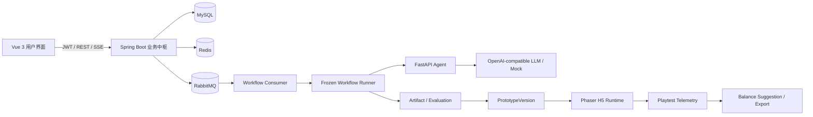

# GameDev Agent Workbench 与 AI 工程实习技术栈对照分析

> 更新时间：2026-07-27  
> 分析范围：当前仓库 `GameDev Agent Workbench`  
> 用途：面试准备、简历表述、项目复盘  
> 原则：只描述仓库中已经存在的实现；对演示级实现、部分实现和未实现能力明确标注。

## 1. 结论摘要

GameDev Agent Workbench 与常见 AI 工程实习技术栈有较高重合度，但项目对外定位已经收缩为“单玩法 LLM 可玩原型与平衡实验平台”。近期不扩展多个半成品 Runtime，而是深化实验闭环，并把 RAG 从检索协议桩升级为可评测的持久化语义检索。具体工作包见 [B 路线与 RAG 升级路线图](roadmap-balance-lab-rag.md)。

当前覆盖：

- HTTP / RESTful API；
- Git 项目开发；
- 完整 Web 项目经历；
- RAG 基本流程；
- 固定工作流式 Agent 任务拆解；
- Spring Boot 与 FastAPI；
- MySQL；
- Redis 与 RabbitMQ；
- LangChain 模型调用；
- Docker Compose。

但是，以下能力目前不能表述为完整实现：

- RAG 的 Embedding 和 Vector Search 是确定性演示实现，不是真实语义向量检索；
- 当前使用 LangChain LCEL 调用模型，但不是 LangChain Agent；
- 当前没有模型自主选择工具的 Tool Calling；
- 当前没有连续对话式的多轮 Agent；
- 当前没有独立的长期/短期 Agent Memory；
- 使用的是 RabbitMQ，不是 Kafka；
- 项目具备工程实践，但不能包装成企业实习经历或生产级高并发系统。

综合判断如下：

| 招聘要求 | 项目覆盖程度 | 判断 |
| --- | --- | --- |
| HTTP / RESTful API | 完整覆盖 | 已实现 |
| Git | 完整覆盖 | 已实现 |
| 实际软件开发经验 | 个人完整项目 | 已实现，但不是企业实习 |
| 完整项目经历 | Java + Python + Vue + 数据库 + 中间件 | 已实现 |
| RAG 基本流程 | 生命周期、协议与 provenance 已实现；检索质量仍为测试桩 | 部分实现 |
| Agent 任务拆解 | 固定四步工作流 | 已实现 |
| Agent Tool Calling | 无模型自主工具调用 | 未实现 |
| 多轮对话管理 | 无 Conversation/Message 主链路 | 未实现 |
| Memory 机制 | 有持久化快照和历史，无 Agent Memory | 部分相关，不应称为已实现 |
| FastAPI / Spring Boot | 两者均使用 | 已实现 |
| MySQL / PostgreSQL | 使用 MySQL | 已实现 |
| Redis / 消息队列 | Redis + RabbitMQ | 已实现 |
| LangChain / LlamaIndex / 自研 Agent | LangChain LCEL + 自研工作流编排 | 部分覆盖 |
| Docker | 多服务 Docker Compose | 已实现 |

## 2. 项目技术架构

项目采用 Java 主导的模块化单体架构，Python 作为 AI 推理服务，Vue 和 Phaser 作为 Web 工作台与游戏运行端。



各模块的职责：

| 模块 | 主要技术 | 职责 |
| --- | --- | --- |
| `backend-java` | Java 21、Spring Boot、MyBatis-Plus | 鉴权、项目、事务、工作流、MQ、RAG 编排、产物、版本、遥测、导出 |
| `python-agent` | Python、FastAPI、LangChain | Prompt 组装、模型调用、GameConfig 解析、平衡建议 |
| `frontend-vue` | Vue 3、Pinia、Vite、Phaser | 用户界面、运行中心、SSE、游戏试玩、版本调参、导出 |
| MySQL | MySQL 8.4、Flyway | 持久化业务事实和执行证据 |
| Redis | Redis 7.4 | 限流、执行锁、成本保护 |
| RabbitMQ | RabbitMQ 3.13 | 异步任务、延迟重试、死信 |

相关入口：

- [`README.md`](../README.md)
- [`docker-compose.yml`](../docker-compose.yml)
- [`backend-java/pom.xml`](../backend-java/pom.xml)
- [`python-agent/requirements.txt`](../python-agent/requirements.txt)
- [`frontend-vue/package.json`](../frontend-vue/package.json)

## 3. HTTP / RESTful API

### 3.1 是否涉及

**已实现。**

项目使用 Spring MVC 和 FastAPI 提供 HTTP API，目前 Java 侧包含认证、项目、工作流、产物、知识库、版本、遥测和导出等 Controller。

典型接口包括：

```http
POST /api/auth/register
POST /api/auth/login

POST /api/v1/projects/{projectUuid}/workflow-runs
GET  /api/v1/workflow-runs/{workflowRunUuid}
GET  /api/v1/workflow-runs/{workflowRunUuid}/steps
GET  /api/v1/workflow-runs/{workflowRunUuid}/artifacts
GET  /api/v1/workflow-runs/{workflowRunUuid}/events
POST /api/v1/workflow-runs/{workflowRunUuid}/cancel
POST /api/v1/workflow-runs/{workflowRunUuid}/retry

GET  /api/projects/{projectUuid}/prototype-versions
POST /api/projects/{projectUuid}/prototype-versions/{versionUuid}/playtest-sessions
POST /api/projects/{projectUuid}/prototype-versions/{versionUuid}/exports
```

### 3.2 项目是怎么实现的

以前端提交工作流为例：

1. Vue 整理 Prototype Brief；
2. 前端生成 `Idempotency-Key`；
3. 使用 JSON Body 调用 Spring Boot；
4. Spring Security 从 JWT 中解析用户；
5. Controller 使用 `@Valid` 校验请求；
6. Service 校验项目归属并创建异步工作流；
7. 返回 HTTP `202 Accepted` 和 `workflowRunUuid`；
8. 前端跳转运行中心，通过查询接口和 SSE 获取状态。

核心实现：

- [`AsyncWorkflowController.java`](../backend-java/src/main/java/com/example/gameworkbench/controller/AsyncWorkflowController.java)
- [`workflows.js`](../frontend-vue/src/shared/api/workflows.js)
- [`submission.js`](../frontend-vue/src/shared/presentation/submission.js)

### 3.3 体现的 HTTP 知识

- GET、POST 等 HTTP Method；
- Path Variable、Query Parameter、Header、JSON Body；
- JWT Bearer Token；
- `202 Accepted` 表示任务已受理但尚未完成；
- `Idempotency-Key` 防止重复提交；
- SSE 使用 `text/event-stream`；
- 统一响应结构与业务错误码；
- CORS；
- 文件上传与 ZIP 下载；
- 前后端超时和错误处理。

### 3.4 面试表述

> 项目的 API 不只是 CRUD。耗时的 AI 生成接口返回 202，并通过工作流 UUID 查询状态；提交使用 Idempotency-Key 保证重复请求语义；运行进度通过 SSE 通知，最终状态仍以服务端快照为事实源。

## 4. Git 使用与项目开发经历

### 4.1 是否涉及

**已实现。**

仓库有连续的需求、实现、测试、验收和版本提交历史，例如：

- GameConfig 2.0 契约；
- Phaser H5 Runtime；
- AI 产物闭环；
- 不可变 PrototypeVersion；
- 试玩遥测与评估；
- 确定性 ZIP 导出；
- 前端导出闭环。

### 4.2 能证明什么

该项目可以证明你具备：

- 按需求卡分阶段实现功能；
- 使用 Git 组织增量提交；
- 在数据库、后端、Python 和前端间维护契约；
- 通过测试与验收报告验证提交；
- 处理跨模块改动和回归。

但应当准确描述为：

> 独立完成的全栈/AI 工程个人项目。

不能描述为：

> 企业实习经验、生产环境商业项目或多人团队协作成果。

## 5. 完整项目经历

### 5.1 是否涉及

**已实现。**

该项目不是一个单独的模型调用 Demo，而是包含了：

- 注册、登录和 JWT；
- 用户项目管理；
- REST API；
- MySQL 数据模型；
- Flyway 数据库迁移；
- Redis；
- RabbitMQ；
- Java/Python 内部服务调用；
- AI 工作流；
- RAG；
- 结构化产物校验；
- Vue Web 应用；
- Phaser 游戏运行时；
- 试玩数据分析；
- Docker Compose；
- 单元测试、集成测试和浏览器 E2E。

### 5.2 典型业务闭环

```text
创建项目
→ 提交游戏 Brief
→ 异步执行四步 Agent 工作流
→ 生成并校验 GameConfig
→ 创建不可变原型版本
→ Phaser 试玩
→ 上传原始事件
→ Java 复算指标
→ 调参创建子版本
→ 生成平衡建议
→ 导出离线 H5 ZIP
```

V3 当前验收状态见：

- [`V3-release-acceptance.md`](reports/V3-release-acceptance.md)

## 6. RAG 基本流程

### 6.1 总体判断

**流程完整，但 Embedding 和 Vector Search 为演示级实现。**

项目覆盖了招聘要求中的四个基本环节：

```text
Document
→ Chunking
→ Embedding
→ Vector Search
→ Prompt Context
→ LLM Generation
→ Retrieval Evidence
```

### 6.2 文档上传与生命周期

知识文档绑定具体项目，系统会进行：

- 用户和项目归属校验；
- 文件类型、大小和内容检查；
- 文档版本管理；
- 文档状态管理；
- 删除或失效后排除新检索；
- 保留历史引用记录。

主要入口：

- [`KnowledgeDocumentController.java`](../backend-java/src/main/java/com/example/gameworkbench/controller/KnowledgeDocumentController.java)
- [`KnowledgeIndexingService.java`](../backend-java/src/main/java/com/example/gameworkbench/service/KnowledgeIndexingService.java)

### 6.3 Chunking

项目通过 `KnowledgeChunker` 进行固定窗口切分：

- 每个 Chunk 最多 400 个字符；
- 相邻 Chunk 重叠 40 个字符；
- Chunking 版本为 `v1-400-40`；
- 每个 Chunk 保存 UUID、顺序、文本摘要、Token 估算、版本和索引状态。

```text
第 1 块：0   ～ 399
第 2 块：360 ～ 759
第 3 块：720 ～ ...
```

重叠的作用是避免一句话或一条规则正好被截断在两个 Chunk 边界。

实现：

- [`KnowledgeChunker.java`](../backend-java/src/main/java/com/example/gameworkbench/service/KnowledgeChunker.java)

局限：

- 使用字符窗口，不是语义切分；
- 没有按标题、段落、Markdown 层级或句子边界切分；
- Token 数量是字符长度估算，不是模型 tokenizer 的精确结果。

### 6.4 Embedding

项目定义了可替换的 `EmbeddingProvider` 接口，但当前注入的是 `FakeEmbeddingProvider`：

- 模型名为 `fake-hash-v1`；
- 维度为 8；
- 根据字符值累加生成确定性向量。

实现：

- [`EmbeddingProvider.java`](../backend-java/src/main/java/com/example/gameworkbench/service/EmbeddingProvider.java)
- [`FakeEmbeddingProvider.java`](../backend-java/src/main/java/com/example/gameworkbench/service/FakeEmbeddingProvider.java)

它的作用是：

- 验证文档索引流程；
- 验证元数据和项目隔离；
- 让自动化测试不依赖外部 Embedding API；
- 保证测试结果可重复。

它不具备真实语义理解能力。因此面试时不能说：

> 项目使用高质量向量模型完成了语义检索。

准确说法是：

> 我抽象了 EmbeddingProvider，但当前仓库为了确定性验收使用 fake embedding，后续可替换为真实 Embedding 服务。

### 6.5 Vector Search

当前向量存储为 `InMemoryVectorStore`：

- 使用 `ConcurrentHashMap` 保存向量和元数据；
- 按 `projectId` 做隔离；
- 支持 upsert 和 delete；
- 进程重启后向量数据不会保留。

更重要的限制是：当前 `search` 并没有真正计算余弦相似度，所有命中的 score 都是 `1.0`。

实现：

- [`InMemoryVectorStore.java`](../backend-java/src/main/java/com/example/gameworkbench/service/InMemoryVectorStore.java)
- [`ProjectRetrievalService.java`](../backend-java/src/main/java/com/example/gameworkbench/service/ProjectRetrievalService.java)

因此项目当前真正验证的是：

- 项目隔离；
- 文档是否为 READY；
- 文档版本是否匹配；
- Chunk 是否仍为 INDEXED；
- 去重；
- TopK；
- Context Budget；
- 历史引用证据。

没有验证：

- 真实语义相似度质量；
- 大规模向量索引性能；
- 向量数据库持久化；
- HNSW/IVF 等近似检索算法。

### 6.6 LLM 生成与引用证据

Java 检索候选 Chunk 后，把受预算限制的引用发送给 Python。Python 将引用渲染成受控上下文：

```text
[reference rank=1 source=documentUuid/chunkUuid]
文档片段内容
```

模型生成完成后，Python 返回 `used_references`。Java 只把实际声明使用的引用保存到 `retrieval_record`，包括：

- document UUID/version；
- chunk UUID；
- rank；
- score；
- chunking version；
- embedding model；
- query hash；
- mock 状态。

相关实现：

- [`rag_context.py`](../python-agent/app/services/rag_context.py)
- [`AgentRunServiceImpl.java`](../backend-java/src/main/java/com/example/gameworkbench/service/impl/AgentRunServiceImpl.java)
- [`RetrievalRecordService.java`](../backend-java/src/main/java/com/example/gameworkbench/service/RetrievalRecordService.java)

这部分的亮点是：

> UI 展示的是执行时已经持久化的引用证据，而不是页面打开时重新检索一次，所以历史结果不会随着知识库变化而被改写。

### 6.7 面试表述

> 我实现了 RAG 的文档生命周期、固定重叠切分、EmbeddingProvider 抽象、项目隔离检索、TopK/Context Budget 和引用证据持久化。当前为了测试确定性使用 fake embedding 和内存 VectorStore，因此流程和数据边界完整，但不把它包装成生产级语义检索。

## 7. Agent 基本流程

### 7.1 任务拆解

**已实现，但属于固定工作流拆解。**

`GAME_GENERATE` 被拆成四个有依赖关系的步骤：

```text
GAME_CONCEPT
    ↓
CORE_LOOP_DESIGN
    ↓
TASK_BREAKDOWN
    ↓
GAME_CONFIG_GENERATE
```

每一步都有：

- `stepKey`；
- `stepOrder`；
- `agentType`；
- `artifactType`；
- 上游依赖；
- PromptTemplate；
- StepRun 状态；
- AgentRun；
- Artifact。

工作流定义存储在数据库并冻结到 WorkflowRun。Runner 根据定义按依赖执行，上游输出会作为下游上下文。

相关实现：

- [`V27__add_game_generate_workflow_definition.sql`](../backend-java/src/main/resources/db/migration/V27__add_game_generate_workflow_definition.sql)
- [`SynchronousWorkflowRunner.java`](../backend-java/src/main/java/com/example/gameworkbench/application/workflow/SynchronousWorkflowRunner.java)
- [`AgentStepExecutor.java`](../backend-java/src/main/java/com/example/gameworkbench/application/workflow/AgentStepExecutor.java)

它解决的是：

- 大任务拆成可观察步骤；
- 每一步独立记录状态；
- 上游结果传递给下游；
- 已成功步骤可恢复；
- 某一步失败时阻止无效下游执行。

但这不是模型动态规划。当前步骤由系统预先定义，而不是 LLM 根据用户请求临时决定。

### 7.2 Tool Calling

**未实现真正的 Agent Tool Calling。**

当前 Python 使用：

```python
prompt | ChatOpenAI | StrOutputParser
```

没有出现：

- `bind_tools`；
- OpenAI function/tool schema；
- 模型返回 `tool_calls`；
- Tool Executor；
- 工具结果回填模型；
- ReAct 循环；
- Agent 自主选择工具。

当前 Java Runner 调用 Python、RAG、Evaluation 和 ArtifactWriter，是后端预先编排的服务调用，不是模型决定调用哪个工具。

准确区分：

| 当前能力 | 是否属于 Tool Calling |
| --- | --- |
| Java 固定调用 Python Agent | 否 |
| Runner 固定执行四个步骤 | 否 |
| Java 在调用模型前固定检索 RAG | 否 |
| 模型根据目标自主选择 `inspect_metrics` | 当前没有 |
| 模型返回结构化 tool call，由系统执行后继续推理 | 当前没有 |

后续可以把已有业务能力封装成工具：

- `inspect_project`；
- `inspect_game_config`；
- `list_runtime_capabilities`；
- `patch_game_config`；
- `create_prototype_version`；
- `compare_versions`；
- `inspect_playtest_metrics`；
- `generate_balance_suggestion`；
- `export_prototype`。

### 7.3 多轮对话管理

**未实现。**

当前请求以一次 WorkflowRun 为单位：

```text
一次 Prototype Brief
→ 一次冻结工作流
→ 四个步骤
→ 一组产物
```

虽然步骤之间会传递上游输出，但它是工作流上下文，不是用户与 Agent 的多轮聊天。

当前没有：

- Conversation；
- Message；
- role = user/assistant/tool；
- conversationId；
- 上下文窗口裁剪；
- 对话摘要；
- 用户继续追问并继承同一会话；
- 多轮中的工具调用和结果回填。

PrototypeVersion 的调参也属于独立 REST 操作，不是自然语言对话。

### 7.4 Memory 机制

**存在“可追溯状态”，但没有独立 Agent Memory。**

项目已持久化：

- Prototype Brief 快照；
- WorkflowDefinitionVersion 快照；
- PromptVersion 快照；
- Step 输出；
- AgentRun；
- RAG Context Snapshot；
- RetrievalRecord；
- Artifact；
- PrototypeVersion；
- Playtest Aggregate。

这些数据使系统具备执行历史和项目上下文，但不等同于 Agent Memory。

Agent Memory 通常还包括：

- 短期对话记忆；
- 长期用户偏好；
- 项目事实提取；
- Memory 检索；
- 记忆写入策略；
- 记忆合并、过期与冲突处理。

因此面试时建议表述：

> 当前系统有持久化执行上下文和版本历史，可以作为未来 Agent Memory 的数据基础，但还没有实现独立的 Memory 读写策略。

## 8. Spring Boot

### 8.1 是否涉及

**完整使用。**

项目使用 Java 21 和 Spring Boot 3.3.5，主要包括：

- Spring Web；
- Spring Validation；
- Spring Security；
- Spring Data Redis；
- Spring AMQP；
- Spring Actuator；
- MyBatis-Plus；
- Flyway；
- Micrometer Prometheus；
- Testcontainers；
- Springdoc OpenAPI。

### 8.2 Spring Boot 在项目中的职责

#### API 与参数校验

Controller 接收 REST 请求，通过 DTO 和 `@Valid` 完成输入校验。

#### 认证与授权

使用 JWT 标识用户，并在 Service 层检查用户、项目、Workflow、Artifact、Version 和 ExportJob 的归属。

#### 事务

工作流提交时使用一个短事务同时写入：

```text
WorkflowRun
+ WorkflowStepRun
+ WorkflowRunEvent
+ OutboxEvent
```

事务中不调用模型和 RabbitMQ。

#### 消息

通过 Spring AMQP：

- 创建 Exchange、Queue 和 Binding；
- 配置 Publisher Confirm；
- 消费 Workflow 消息；
- 手动 ACK/NACK；
- 配置延迟重试队列和死信队列。

#### Redis

通过 `StringRedisTemplate` 和 `RedisTemplate` 实现：

- 固定窗口限流；
- 执行锁；
- owner-token 安全释放；
- 其他短期状态。

#### 可观测性

通过 Actuator、Micrometer 和 Prometheus 提供：

- health；
- readiness；
- workflow/message/retry 等指标；
- traceId 和业务 UUID 日志关联。

### 8.3 面试表述

> Spring Boot 是系统的业务事实中心。Python 只负责模型推理，用户权限、事务、工作流状态、消息可靠性、产物校验和版本管理均由 Java 管理，避免把核心业务状态放进不可控的 Agent 进程。

## 9. FastAPI

### 9.1 是否涉及

**完整使用。**

Python Agent 使用 FastAPI 提供以下端点：

```text
/agent/game-concept
/agent/core-loop-design
/agent/task-breakdown
/agent/game-config-generate
/agent/balance-evaluation
```

同时提供：

```text
/health
/health/live
/health/ready
```

### 9.2 服务边界

FastAPI 负责：

- Pydantic 请求校验；
- Prompt 构造；
- RAG 上下文渲染；
- LangChain 模型调用；
- GameConfig JSON 解析；
- Python 侧 GameConfig 2.0 校验；
- Mock/真实 Provider 明确标记；
- 返回模型、耗时和引用信息。

Java 调用 `/agent/*` 时需要携带 `X-Internal-Token`，Python 使用常量时间比较验证 Token，并传播 `X-Trace-Id`。

相关实现：

- [`main.py`](../python-agent/app/main.py)
- [`agent.py`](../python-agent/app/routers/agent.py)
- [`langchain_agent.py`](../python-agent/app/services/langchain_agent.py)

## 10. MySQL

### 10.1 是否涉及

**完整使用。**

项目使用 MySQL 8.4、MyBatis-Plus 和 Flyway。仓库包含 32 个 Migration 文件，数据库 schema 当前升级到 V32。

### 10.2 数据分组

#### 用户和项目

- `sys_user`
- `game_project`

#### 工作流可靠性

- `workflow_definition_version`
- `workflow_step_definition`
- `workflow_run`
- `workflow_step_run`
- `workflow_run_event`
- `outbox_event`
- `workflow_recovery_audit_event`

#### Agent 和产物

- `agent_run`
- `agent_artifact`
- `prompt_template`
- `prompt_version`
- `model_call_metric`
- `evaluation_report`

#### RAG

- `knowledge_document`
- `knowledge_chunk`
- `retrieval_record`

#### 游戏原型

- `prototype_version`
- `prototype_version_sequence`
- `playtest_session`
- `playtest_event_batch`
- `playtest_event`
- `prototype_playtest_aggregate`
- `balance_suggestion_request`
- `prototype_export_job`

### 10.3 MySQL 不只是 CRUD

项目利用数据库保证：

- 幂等唯一约束；
- Workflow 状态机；
- `statusVersion` 乐观并发控制；
- Consumer durable claim；
- Artifact 重试一致性；
- 不可变 PrototypeVersion；
- Outbox 最终一致性；
- 事件序号单调递增；
- 历史快照不可被 ACTIVE 配置改写。

### 10.4 面试表述

> MySQL 是系统唯一事实源。Redis 锁和 MQ 消息都可能丢失或重复，因此最终正确性依赖数据库状态条件更新、唯一约束、事务和持久化终态。

## 11. Redis

### 11.1 是否涉及

**已实现。**

Redis 不是用来保存最终 Workflow，而是用于临时协调。

### 11.2 工作流提交限流

`WorkflowSubmissionGateImpl` 使用 Lua Script 完成固定窗口计数：

```text
workflow:submit:rate:{policyVersion}:user:{userId}
```

用于：

- 限制单用户短时间重复提交；
- 防止恶意或误操作产生大量模型费用；
- 在积压过多时执行背压保护。

### 11.3 执行锁

Consumer 执行前通过 `SET NX EX` 获取锁，并为锁设置 owner token。

释放时使用 Lua Script：

```text
只有 value == ownerToken 才删除 key
```

这可以防止：

1. Consumer A 的锁过期；
2. Consumer B 获取同名新锁；
3. Consumer A 恢复后错误删除 B 的锁。

### 11.4 正确性边界

Redis 锁主要防止重复模型调用和浪费成本，不能作为最终业务正确性的唯一保障。

真正的执行权通过 MySQL CAS 获取：

```text
Redis = 成本保护
MySQL = 正确性
```

### 11.5 面试表述

> Redis 在项目中承担固定窗口限流和带 owner token 的执行锁。锁用于降低重复调用模型的成本，但 Workflow 是否可以执行仍由 MySQL 条件更新决定，避免把正确性完全建立在可能过期的分布式锁上。

## 12. 消息队列

### 12.1 是否涉及

**已实现 RabbitMQ，但没有使用 Kafka。**

项目使用 RabbitMQ 的原因是工作流属于：

- 单任务处理；
- 需要明确 ACK；
- 需要有限重试；
- 需要延迟队列；
- 需要死信；
- 不要求事件流长期回放。

### 12.2 Outbox

HTTP 提交不直接发送 MQ，而是在数据库事务中写入 `OutboxEvent`。

```text
业务事实 + OutboxEvent
→ 同一 MySQL 事务提交
→ 后台 Publisher 扫描
→ RabbitMQ Publisher Confirm
```

这样避免：

```text
数据库提交成功
→ 进程宕机
→ MQ 消息未发送
→ 任务永久丢失
```

核心实现：

- [`AsyncWorkflowSubmitCommandService.java`](../backend-java/src/main/java/com/example/gameworkbench/service/impl/AsyncWorkflowSubmitCommandService.java)
- [`OutboxPublisher.java`](../backend-java/src/main/java/com/example/gameworkbench/service/impl/OutboxPublisher.java)

### 12.3 Consumer

Consumer 收到消息后：

1. 校验消息 schema；
2. 读取 WorkflowRun；
3. 终态消息直接视为重复；
4. 获取 Redis 执行锁；
5. 使用 MySQL CAS 抢占；
6. 执行工作流；
7. 确认终态已经持久化；
8. 最后 ACK。

核心实现：

- [`WorkflowMessageConsumer.java`](../backend-java/src/main/java/com/example/gameworkbench/messaging/WorkflowMessageConsumer.java)

### 12.4 重试与死信

项目定义三个重试队列：

- 30 秒；
- 5 分钟；
- 30 分钟。

队列通过 TTL 到期后 dead-letter 回原工作队列。超过重试次数或错误不可重试时，消息进入 DLQ。

适合重试：

- Python/Provider 临时不可用；
- 网络超时；
- Provider 429；
- 暂时性基础设施错误。

不适合重试：

- 参数非法；
- GameConfig 合同永久不满足；
- 明确的权限错误；
- 确定性业务冲突。

配置：

- [`MessagingConfiguration.java`](../backend-java/src/main/java/com/example/gameworkbench/config/MessagingConfiguration.java)

### 12.5 Kafka 对比

面试时不应说项目使用 Kafka。可以解释：

> 当前任务更适合 RabbitMQ 的 ACK、路由、延迟重试和 DLQ 模型。如果未来需要保存大量试玩事件流、多个消费者独立回放或构建实时分析管道，再考虑 Kafka。

## 13. LangChain 与 AI 项目实践

### 13.1 是否涉及

**使用了 LangChain，但没有使用 LangChain Agent。**

Python 使用：

- `ChatPromptTemplate`；
- `ChatOpenAI`；
- `StrOutputParser`；
- LCEL 管道；
- 异步 `ainvoke`。

典型链路：

```python
chain = prompt | build_chat_model() | StrOutputParser()
result = await chain.ainvoke(input)
```

模型通过 OpenAI-compatible API 调用，默认配置兼容 DeepSeek：

- `LLM_API_KEY`
- `LLM_BASE_URL`
- `LLM_MODEL`

### 13.2 为什么不应称为 LangChain Agent

LangChain 在这里主要作为模型调用和 Prompt 编排库，尚未使用：

- AgentExecutor；
- Tool；
- Planner；
- ReAct；
- Tool Call Loop；
- LangGraph。

更准确的技术定位：

> LangChain LCEL 模型调用 + Java 自研可靠工作流编排。

### 13.3 自研 Agent 工程部分

虽然不是自主 Agent，项目仍具有较完整的 AI 工程能力：

- PromptTemplate/PromptVersion；
- Prompt 快照；
- 多种 AgentType；
- 模型 Provider 与 Mock 明确区分；
- AgentRun 状态；
- 模型耗时和错误分类；
- RAG Context；
- Retrieval Evidence；
- 模型结构化输出；
- GameConfig 契约验证；
- Artifact eligibility；
- 失败重试；
- 可观测性。

项目的核心价值不是“调用了一次 LLM”，而是：

> 把一次不稳定的模型调用包装成可追踪、可重试、可评估、可版本化的业务过程。

## 14. Docker

### 14.1 是否涉及

**完整使用。**

Docker Compose 管理：

- MySQL；
- MySQL Bootstrap；
- RabbitMQ；
- Redis；
- Python Agent；
- Java Backend；
- Vue Frontend。

### 14.2 已实现的工程配置

- 服务依赖和健康检查；
- MySQL/Redis Volume；
- 环境变量注入；
- 必填密码检查；
- loopback 端口绑定；
- CPU/内存限制；
- `no-new-privileges`；
- `cap_drop: ALL`；
- Java/Python/Frontend 独立镜像；
- 后端等待 MySQL、Redis、RabbitMQ 和 Python healthy；
- Actuator readiness；
- Python 和前端 healthcheck。

### 14.3 Docker 在项目中的价值

- 减少本地环境差异；
- 一次启动完整依赖；
- 验证 Java/Python/前端之间的真实网络调用；
- 提供浏览器 E2E 环境；
- 避免只在 IDE 中能运行；
- 为后续部署和 CI 奠定基础。

### 14.4 当前边界

- 当前是单机 Docker Compose；
- 不是 Kubernetes；
- 没有自动扩缩容；
- 没有生产高可用数据库；
- 当前验收结果不能视为生产 SLA。

## 15. 图片中未直接列出、但项目额外具备的能力

### 15.1 幂等设计

工作流提交、Artifact 写入、PrototypeVersion 调参、Telemetry Batch 和 ExportJob 都有不同层次的幂等控制。

### 15.2 结构化 AI 产物

模型生成的 GameConfig 不会直接执行，而是经过：

```text
JSON Parse
→ Schema
→ Business Rule
→ Brief Consistency
→ Runtime Capability
→ Resource Manifest
```

### 15.3 不可变版本

调参不会覆盖原 GameConfig，而是创建子版本，使版本和试玩指标保持可追溯。

### 15.4 SSE 运行中心

SSE 负责通知，MySQL 快照负责事实。断线不会取消后台任务，重连后可以基于事件序号恢复。

### 15.5 可观测性

日志关联：

- traceId；
- workflowRunUuid；
- stepRunUuid；
- agentRunUuid；
- messageId。

指标使用有限枚举标签，避免把 UUID 放入 Prometheus label 造成高基数。

### 15.6 测试

仓库已有：

- Java Maven 测试；
- Python pytest；
- 前端单元测试；
- GameConfig 契约测试；
- Playwright 浏览器测试；
- Docker Compose 主链路验收；
- ZIP 确定性和安全测试；
- 移动端 375px 验收。

当前 V3 报告记录：

- 后端完整 Maven 测试 PASS；
- 前端 32 个单元/契约测试 PASS；
- 前端生产构建 PASS；
- Docker Compose 常驻服务 healthy；
- V3 浏览器主链路 PASS；
- 导出安全与确定性 PASS。

## 16. 面试中推荐的项目介绍

### 16.1 一分钟版本

> 我的主项目是 GameDev Agent Workbench，它是一个面向轻量游戏原型生产的 AI 工作流平台。前端使用 Vue 和 Phaser，Java Spring Boot 负责用户、项目、事务、工作流状态、可靠消息、RAG 编排和产物版本，Python FastAPI 使用 LangChain 调用 OpenAI-compatible 模型。
>
> 用户提交游戏 Brief 后，Java 通过 Idempotency-Key 和 Outbox 在一个短事务中创建 WorkflowRun 和待发送事件，再由 RabbitMQ Consumer 执行冻结的四步 Agent 工作流。模型结果不会直接执行，而是转换成 GameConfig 2.0，并经过 Schema、业务规则和 Runtime capability 校验后才能进入 Phaser 试玩。
>
> 试玩事件绑定不可变 PrototypeVersion，由 Java 根据原始事件复算指标，再支持调参、版本比较、平衡建议和离线 ZIP 导出。项目的重点不是简单调用模型，而是把不稳定的 AI 生成过程变成可追踪、可重试、可评估和可交付的工程流程。

### 16.2 RAG 问题回答

> 项目实现了上传、切分、向量化接口、项目隔离检索、Context Budget、LLM 上下文和引用证据持久化。当前 Embedding 和 VectorStore 是确定性测试实现，没有真实语义排序，因此我会把它定义成 RAG 工程骨架，而不是生产级向量检索。

### 16.3 Agent 问题回答

> 当前所谓 Agent 是固定的四步 LLM Workflow：系统把原型生成拆成概念、核心循环、任务和 GameConfig，每一步的状态、Prompt 和产物可追踪。近期不为了 Agent 名词优先增加 Tool Calling 或多轮 Memory，而是先完成真实 RAG 评测和试玩数据驱动的平衡实验闭环；只有在固定流程无法表达明确用户需求时，再引入动态工具选择。

### 16.4 Redis 与 MQ 问题回答

> Redis 用于提交限流和执行锁，主要保护模型调用成本；MySQL CAS 才是最终执行权边界。RabbitMQ 用于把 HTTP 提交和耗时模型执行解耦，并配合 Outbox、Publisher Confirm、手动 ACK、延迟重试和 DLQ 保证任务不会轻易丢失。

## 17. 不建议使用的夸大表述

以下说法不符合当前实现：

| 不建议说 | 准确说法 |
| --- | --- |
| 实现了生产级 RAG | 实现了 RAG 流程和证据链，Embedding/VectorStore 为演示级 |
| 使用向量数据库完成高质量相似度检索 | 当前是内存 VectorStore，且没有真实相似度排序 |
| 使用 LangChain Agent | 使用 LangChain LCEL 调用模型，自研 Java 工作流编排 |
| 实现了 Tool Calling | 当前是固定服务编排，尚无模型自主工具调用 |
| 支持多轮 Agent 对话 | 当前以一次 WorkflowRun 为单位 |
| 实现了 Agent 长期记忆 | 有持久化快照和历史，但没有 Memory 策略 |
| 使用 Kafka | 使用 RabbitMQ |
| 是生产级高并发系统 | 具备异步可靠性骨架，当前仅有单机 Compose 验收 |
| 可以生成任意游戏 | 当前只支持 `arcade_collect` |
| AI 会生成并执行游戏代码 | AI 生成受约束 GameConfig，固定 Runtime 负责解释执行 |

## 18. 面向 AI 工程实习的升级优先级

如果目标是提高实习求职可信度，应优先补齐可验证价值，而不是机械匹配招聘关键词。

### P0：替换真实 Embedding 和 VectorStore

可选方案：

- OpenAI-compatible Embedding + pgvector；
- BGE 系列 Embedding + Milvus/Qdrant；
- Elasticsearch dense vector。

同时补充：

- 余弦相似度；
- 真实 TopK；
- score threshold；
- rerank；
- 语义/结构化 Chunking；
- 检索评估数据集。

必须用固定样本报告 Recall@K/MRR、错误项目命中、RAG-on/off 约束满足率、延迟、token 和成本。没有对照数据时，不把“接入向量数据库”本身当作完成。

### P0：接通公开试玩与匿名遥测

为冻结 PrototypeVersion 提供可撤销、限时、限权的分享 token，让外部测试者无需账号即可贡献受限事件。产品侧展示样本量、胜率、失败原因、耗时和重试漏斗，并区分所有者、外部玩家和机器人样本。

### P1：建议、候选版本与 A/B 对比

平衡建议必须记录证据窗口、样本量、目标指标、建议参数和不确定性；用户确认后创建不可变 DRAFT 子版本，再通过分享分流和同口径指标验证建议是否有效。

### P2：把项目知识演进为可检索的实验记忆

把历史对话和版本变化提取为：

- 用户偏好；
- 游戏设计约束；
- 已拒绝方案；
- 当前设计目标；
- 已验证玩法结论。

Agent 在下一轮修改前检索这些项目记忆。

这里的 Memory 应先表现为有来源、有版本、可删除、可评测的知识事实，而不是简单把全部对话塞入 Prompt。

### P2：自动 Playtest 与参数仿真

让 Agent 或 Playwright 自动操作 Phaser Runtime：

- 检查能否开始；
- 检查能否胜利；
- 检查是否存在死局；
- 记录通关时间；
- 对比 Brief 目标；
- 把结果反馈给 Builder Agent。

这一能力最能体现项目的游戏特色，同时形成：

```text
Plan
→ Build
→ Playtest
→ Evaluate
→ Revise
```

### 暂缓：Tool Calling 与多轮对话

Tool Calling、多轮对话和自主规划只有在以下条件满足时再实施：

- 固定 Workflow 无法表达已经验证的用户场景；
- 每个工具具备幂等、权限、审计和可撤销边界；
- 有评测可以证明动态决策优于固定流程；
- 不会绕过 GameConfig、版本不可变和遥测事实源。

否则它们只会增加演示复杂度，不会提高项目可信度。

## 19. 最终评价

从图片中的 AI 工程实习要求看，这个项目已经能够证明你具备：

- Java 全栈项目能力；
- Python AI 服务能力；
- REST API 和系统集成能力；
- MySQL、Redis、RabbitMQ 实践；
- Docker 多服务部署能力；
- 基础 RAG 认知；
- 固定工作流 Agent 编排；
- AI 输出契约化和可追溯工程能力。

当前最明显的短板不是 Java 工程部分，而是 Agent 的自主性：

```text
已有：固定任务拆解、状态机、RAG 上下文、结构化输出
缺少：Tool Calling、多轮对话、Memory、自主计划与反馈循环
```

因此最准确的项目定位是：

> 一个具备可靠工作流、RAG 工程骨架和可玩原型闭环的 AI 游戏开发工作台，正在从固定 Workflow 向 Tool-Using Agent 演进。
