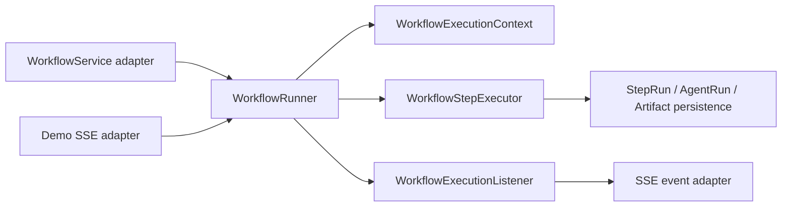

# R2 Workflow Runner Design

## Boundary



`WorkflowRunner` is a synchronous Java application service. It receives an already-persisted run, reads only that run's frozen snapshots, schedules steps, and summarizes final state. It never depends on HTTP, `SseEmitter`, Redis, RabbitMQ, controller DTOs, or current ACTIVE definitions.

## Core contracts

```java
interface WorkflowRunner {
  WorkflowRunnerResult run(WorkflowRunnerCommand command, WorkflowExecutionListener listener);
}

interface WorkflowStepExecutor {
  boolean supports(WorkflowStepPlan stepPlan);
  StepExecutionResult execute(WorkflowExecutionContext context, WorkflowStepPlan stepPlan);
}

interface WorkflowExecutionListener {
  void onEvent(WorkflowExecutionEvent event);
}
```

- `WorkflowExecutionContext` owns immutable run input/definition/prompt snapshots and controlled completed outputs keyed by stable `stepKey`.
- `WorkflowStepExecutor` executes one claimed step only. It does not order steps, short-circuit a workflow, send SSE, or construct HTTP responses.
- `WorkflowExecutionListener` is observational. Listener failures are logged and cannot change persisted workflow or step state.
- `ArtifactWriter` maps an Agent result to a StepRun/Artifact reference. `WorkflowEvaluationHook` may reject a structured result before downstream Demo GameBuild.

## Scheduling and state

1. The runner rejects terminal WorkflowRuns.
2. It parses `workflowDefinitionSnapshot` into stable ordered plans and restores prior `SUCCESS` StepRuns into Context.
3. A `PENDING -> RUNNING` claim is validated through `WorkflowStatusPolicy` before an Agent call.
4. A step can run only when every dependency is a completed `SUCCESS` output in Context. Missing output, duplicate key, cycle, invalid JSON, or unknown AgentType fails before an Agent call.
5. `SUCCESS` steps are skipped and never call the Agent again. A failed step stops later steps and the WorkflowRun becomes `FAILED`.
6. The workflow uses `RUNNING -> SUCCESS/FAILED`; no unconditional state overwrite is allowed.

There is no transaction spanning Agent I/O. State is persisted before and after an Agent call in short database operations.

## Old-entry adapters

- `WorkflowServiceImpl` remains responsible for authorization, project lookup, frozen-run creation, and legacy `WorkflowRunVO` conversion. It delegates all three-step ordering/context construction to Runner.
- `DemoStreamServiceImpl` remains responsible for Redis owner lock, executor thread, emitter lifetime, and GameBuild. It invokes Runner with a listener that converts domain events into existing SSE event VOs. An SSE send error is non-fatal to Runner execution.

## GameConfig and evaluation

`GAME_CONFIG_GENERATE` produces a `game-config` / `1.0` artifact candidate. The R2 hook validates required structure and supported aliases before the result is considered buildable. A failed hook fails the step and prevents GameBuild. The hook is not an R5 quality scorer or report writer.

## R2 / R3 boundary and rollback

R2 is synchronous and single-process: no Outbox, broker consumer, ACK, retry queue, distributed claim, submission idempotency, or recovery scanner. R3 adds those capabilities around this Runner rather than replacing its step contracts.

Adapters can be rolled back independently to the legacy services while preserving R1 snapshots and StepRuns. No R2 migration rewrites historical records.

## Task file and test plan

| Task | Primary files | Test focus |
| --- | --- | --- |
| R2-01 | context, plan parser | malformed plan, dependencies, immutable input |
| R2-02 | executor, writer, hook port | success/failure/no executor/repeat |
| R2-03 | runner and persistence port | order, short-circuit, terminal/replay |
| R2-04 | WorkflowService adapter | legacy API response and query-only path |
| R2-05 | Demo listener adapter | SSE order, lock, listener failure |
| R2-06 | GameConfig hook | aliases, invalid result, GameBuild gate |
