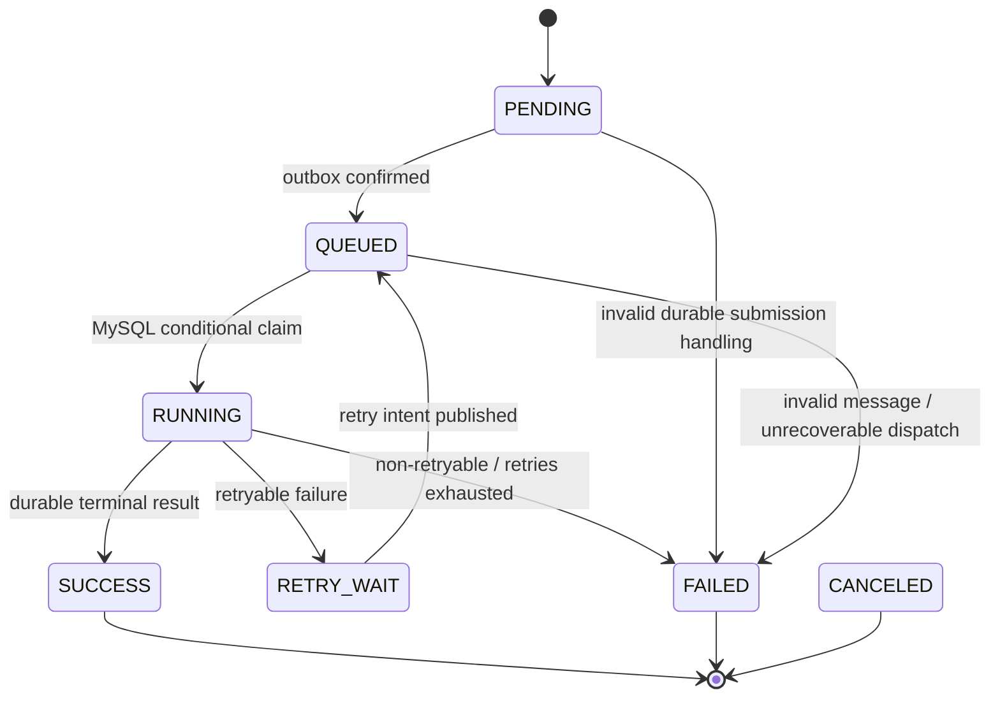
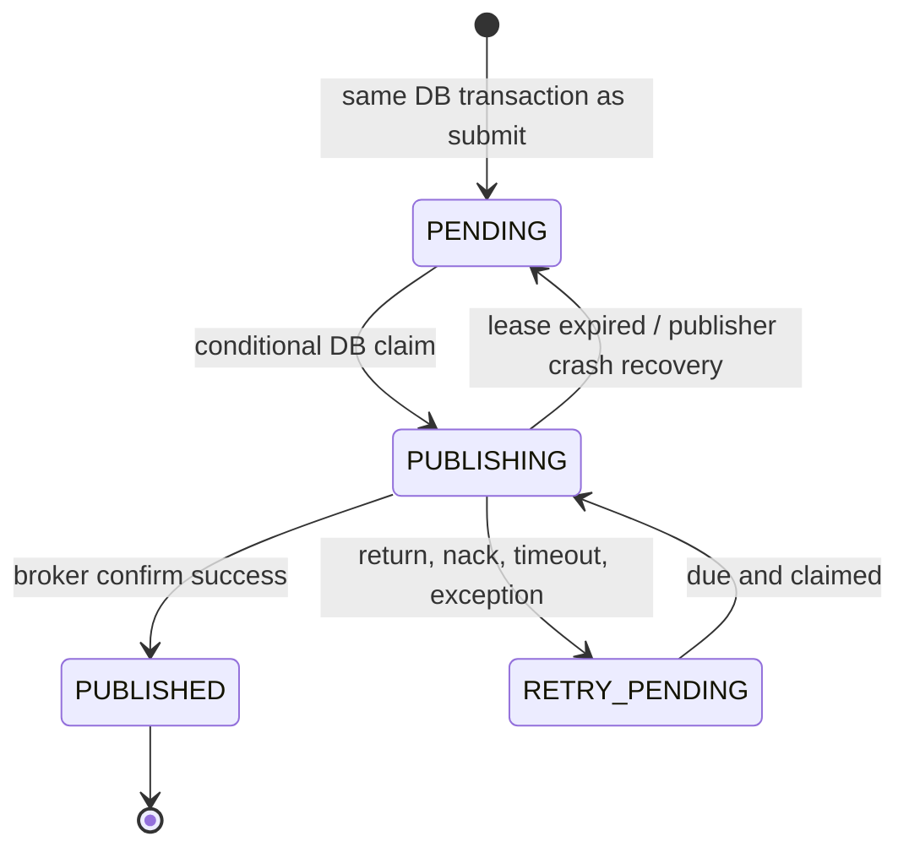
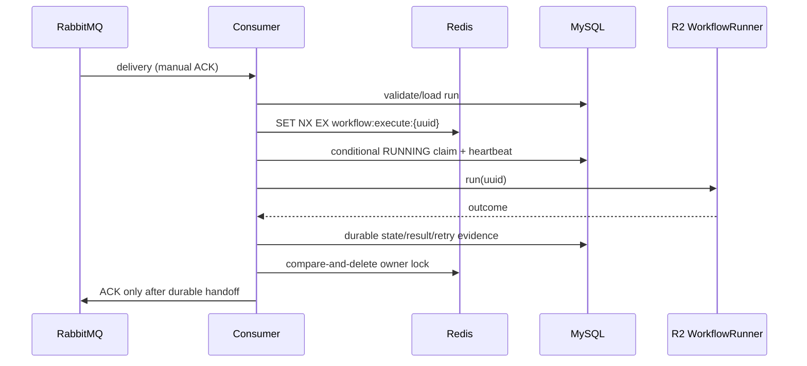

# R3 异步可靠执行设计

> 状态：`FROZEN`
>
> 对应任务卡：`R3-00`
>
> 范围：本文只冻结 R3 的契约；实现分别由 `R3-01` 至 `R3-08` 完成。

## 1. 不变量与边界

```text
HTTP submit
  -> MySQL transaction: WorkflowRun + StepRun + OutboxEvent
  -> Outbox publisher + RabbitMQ publisher confirm
  -> Consumer claim + R2 WorkflowRunner
  -> durable result, then manual ACK
```

- MySQL 是 `WorkflowRun`、`StepRun`、`OutboxEvent` 和恢复审计的最终事实来源；Redis 只作快速互斥/限流，RabbitMQ 只作至少一次投递。
- 提交事务绝不调用 Agent、`WorkflowRunner` 或等待 RabbitMQ confirm/消费；返回 `202 Accepted` 不代表已执行。
- R2 `WorkflowRunner` 仍是同步、无 HTTP/RabbitMQ/SSE 依赖的执行内核；Consumer 在其外层完成锁、抢占、持久化与 ACK。
- 目标是“至少一次投递 + 持久化幂等/抢占的一次有效执行”，不宣称跨 MySQL 与 RabbitMQ 的 exactly-once。
- 所有发布、重试、恢复、拒绝和终态变更均须留下可查询的持久化证据；错误与消息不得含密码、Token、Authorization、API Key 或完整私密 Prompt。

## 2. 提交契约与幂等

`POST /api/v1/projects/{projectUuid}/workflow-runs` 必须提供 `Idempotency-Key`。该键的业务范围为：

```text
userId + projectId + workflowKey + Idempotency-Key
```

| 情况 | 行为 |
| --- | --- |
| key 缺失、空白、非法或过长 | 创建任何记录前拒绝，返回 400 |
| 首次合法提交 | 一个短事务写入 Run、冻结的 StepRun 计划和 OutboxEvent；提交后返回 202 与 `workflowRunUuid` |
| 相同 key、相同规范化请求 | 返回第一次的 Run（202）；不新建 StepRun 或 Event |
| 相同 key、不同 `workflowKey`、输入或定义快照 | 返回 409 `IDEMPOTENCY_KEY_CONFLICT` |
| 并发首次提交 | MySQL 唯一约束获胜者创建；冲突方读取既有记录并按上两项语义返回 |

`request_fingerprint` 是对规范化的 workflow key、冻结定义版本、输入和相关提交语义计算的摘要，用于冲突检测，不能存入明文敏感输入。数据库唯一索引至少为 `(user_id, project_id, workflow_key, idempotency_key)`；应用层的先读仅是优化，唯一约束才是最终保证。

## 3. 持久化模型与状态机

### 3.1 WorkflowRun / StepRun

| 字段 | 用途 |
| --- | --- |
| `uuid`, `status`, `state_version` | 稳定标识、状态和条件更新并发控制 |
| `attempt`, `retry_count`, `max_retries` | 当前执行尝试和有限重试事实 |
| `idempotency_key`, `request_fingerprint` | 提交去重与冲突判断 |
| `heartbeat_at`, `last_activity_at` | 活跃 Consumer 的恢复判定 |
| `last_error_code`, `last_error_message`, `next_retry_at`, `failed_at` | 脱敏后的失败与后续动作 |
| `trace_id`, `definition_snapshot` | 跨系统追踪和可重放的冻结输入 |



只有类似 `UPDATE ... WHERE uuid=? AND status IN (...) AND state_version=?` 的条件更新可授予执行权；受影响行数为零即失去执行权，不得调用 Runner。`SUCCESS`、`FAILED`、`CANCELED` 是终态，重复消息一律不再执行。

### 3.2 OutboxEvent

| 字段 | 含义 |
| --- | --- |
| `id`, `event_id`, `event_type`, `aggregate_uuid` | 主键、稳定业务事件、事件种类与 WorkflowRun 关联 |
| `payload_json`, `schema_version`, `trace_id` | 版本化且脱敏的发布载荷与追踪 |
| `status`, `publish_attempt`, `next_attempt_at` | 可恢复的发布状态与调度 |
| `claim_owner`, `claim_until` | 多 Publisher 的数据库租约 |
| `message_id`, `published_at`, `confirmed_at` | 发送身份及 broker 确认审计 |
| `last_error_code`, `last_error_message` | 脱敏失败证据 |



Publisher 只扫描已提交且 `next_attempt_at <= now` 的 `PENDING`/`RETRY_PENDING`。先以短事务取得租约，网络发布与等待 confirm 不在数据库事务内；只有 confirm 成功才写 `PUBLISHED`。return、nack、超时和连接异常均保留失败证据并退回可重试状态。相同 `event_id` 重发，`message_id` 稳定；`publish_attempt` 递增。

## 4. 消息拓扑与载荷

| 资源 | 名称/路由 | 作用 |
| --- | --- | --- |
| topic exchange | `workflow.events` | Outbox 的主发布交换机 |
| main queue | `workflow.run.execute` / `workflow.run.requested` | Consumer 接收执行意图 |
| retry queues | `workflow.run.retry.30s`、`5m`、`30m` | TTL 后死信回主 exchange 的有限退避 |
| DLX/DLQ | `workflow.dlx` / `workflow.run.dlq` | 最终人工诊断入口 |

队列、exchange、routing key、TTL 和最大投递次数必须配置化；管理端口仅用于本地 Compose，不能由生产默认暴露。消息体为版本化 JSON：

```json
{
  "schemaVersion": 1,
  "messageId": "stable-message-id",
  "eventId": "stable-outbox-event-id",
  "workflowRunUuid": "run-uuid",
  "attempt": 1,
  "traceId": "trace-id",
  "createdAt": "2026-07-11T00:00:00Z"
}
```

Headers 至少镜像 `messageId`、`eventId`、`workflowRunUuid`、`attempt`、`traceId`、`schemaVersion`、`retryCount` 和 `lastErrorCode`。DLQ 保留这些关联字段及 broker death metadata；不得携带原始密钥或完整 Prompt。

## 5. Consumer、锁与 ACK



- Redis key 固定为 `workflow:execute:{workflowRunUuid}`，owner token 每次唯一，以 Lua compare-and-delete 释放。Redis 是快速互斥；任何 Redis 获取/释放异常都不得继续高成本执行。
- Redis 锁成功后仍必须取得 MySQL 条件 claim；claim 失败、终态 Run、未知 Run、无效 schema 或 attempt 不匹配时不可调用 Runner。终态或不可重试无效消息在写入审计后 ACK。
- Runner 成功时，先持久化所有 StepRun/WorkflowRun 终态，再 ACK。进程在落库前中断时不 ACK，重复投递/恢复扫描继续处理；进程在落库后 ACK 前中断时，重复消息只会读取终态并 ACK。
- Consumer 不得用长数据库事务覆盖 Runner/Agent 调用，也不得把 `Channel`、ACK 或 MQ DTO 注入 R2 Runner。

## 6. 错误、退避与 DLQ

| 类别 | 示例 | 可重试 | 最终去向 |
| --- | --- | --- | --- |
| 请求/权限/定义 | 参数、权限、Prompt 配置 | 否 | 持久化 FAILED，ACK |
| 业务校验 | 输出解析、GameConfig 校验 | 否（除非明确修复策略） | FAILED，ACK |
| 临时 Provider | 429、可识别的 5xx | 是 | retry queue，超过上限后 FAILED + DLQ |
| 网络/超时 | Agent/MQ 临时网络错误 | 是 | retry queue，超过上限后 FAILED + DLQ |
| 基础设施 | Redis/DB 不可用 | 是；安全地不执行 | 保留可恢复证据；按策略重试/DLQ |
| 消息协议 | schema/字段非法 | 否 | FAILED + DLQ，ACK |

退避等级为 `30s -> 5m -> 30m`，默认最多 3 次；实际阈值必须配置化。每次失败先以短事务写入 `retry_count`、错误码、`next_retry_at`、attempt 与审计记录，再可靠地转交 retry/DLQ；原消息只在该持久化交接完成后 ACK。若转交失败，保留可扫描的 Outbox/失败意图，不能盲目 ACK 或无限立即 requeue。

## 7. 限流、背压与恢复

限流位于新提交入口，使用 Redis 原子脚本，key 至少为策略版本与稳定 `userId`。同一幂等键命中既有 Run 的读取语义优先于创建；仅新提交才消耗限额。超过用户阈值或系统积压阈值时返回可重试的稳定错误和 `Retry-After`，不创建 Run、StepRun 或 Outbox。Redis 限流不可用时，对新高成本提交默认拒绝；它不替代 MySQL 幂等或 Consumer claim。

恢复扫描器仅处理超过配置阈值的记录，并用状态/version 条件更新获取恢复权：

| 发现状态 | 恢复动作 |
| --- | --- |
| PENDING + 未发布/过期 Outbox | 重新启用或新建可审计的 Outbox 发布意图 |
| QUEUED + 超期投递 | 通过 Outbox 创建再投递意图 |
| RUNNING + stale heartbeat | 条件标记中断 attempt；遵循重试策略或最终 FAILED |
| 终态、活跃 heartbeat、cancel requested | 不自动处理 |

心跳由 Consumer 外层及步骤边界短事务更新，不绑定在长执行事务。每个恢复动作写入 `RecoveryAuditEvent`（run、旧/新状态、原因、恢复次数、eventId、traceId）；扫描器不得直接调用 Runner 或无条件重置 RUNNING，也不得重做已 SUCCESS StepRun。

## 8. 子任务边界、验证与回退

| 任务 | 允许修改目录 | 核心验证 | 回退 |
| --- | --- | --- | --- |
| R3-01 | Compose、示例配置、Spring messaging、测试基础 | compose config、MQ smoke test | 移除未启用的配置/依赖 |
| R3-02 | API/DTO/service、migration、测试 | 并发幂等与原子提交 | 保留旧同步 API；新入口 feature/config gate |
| R3-03 | outbox/publisher/topology、测试 | confirm、重启扫描 | 停止 publisher；MySQL Event 保留 |
| R3-04 | consumer/claim/lock、测试 | 重复消息与并发 Consumer | 停止 consumer；不破坏 Run 事实 |
| R3-05 | classifier/retry/DLQ、测试 | 有限重试和 DLQ 关联 | 停止重试调度；保留审计 |
| R3-06 | rate limit/backpressure、测试 | 原子阈值与故障拒绝 | 仅调整配置阈值，不绕过幂等 |
| R3-07 | recovery/heartbeat/audit、测试 | stale/并发恢复 | 停止扫描器；人工依据审计处理 |
| R3-08 | integration harness/report | Testcontainers 并发矩阵 | 不改变生产语义 |

每一子任务至少运行其任务卡所列 Maven 测试、`git diff --check` 和 `tools/verify.ps1 -Profile quick`；涉及 MQ/Redis/MySQL 的链路另运行 `tools/verify.ps1 -Profile integration`。R3-00 本身只验证本文档：

```powershell
git diff --check
rg -n "Idempotency|Outbox|publisher confirm|ACK|DLQ|heartbeat|WorkflowRunner" docs\requirements\r3\R3-async-reliability-design.md
```

## 9. R4/R5/R6 边界

- R3 不实现 SSE 订阅、运行中心、取消页面、DLQ 管理 UI 或前端迁移；R4 只消费已持久化的 Run/StepRun 状态。
- R3 不实现质量评测、成本计算或自动 Prompt 修复；这些属于 R5。
- R3 不实现 RAG 或检索链路；这些属于 R6。
