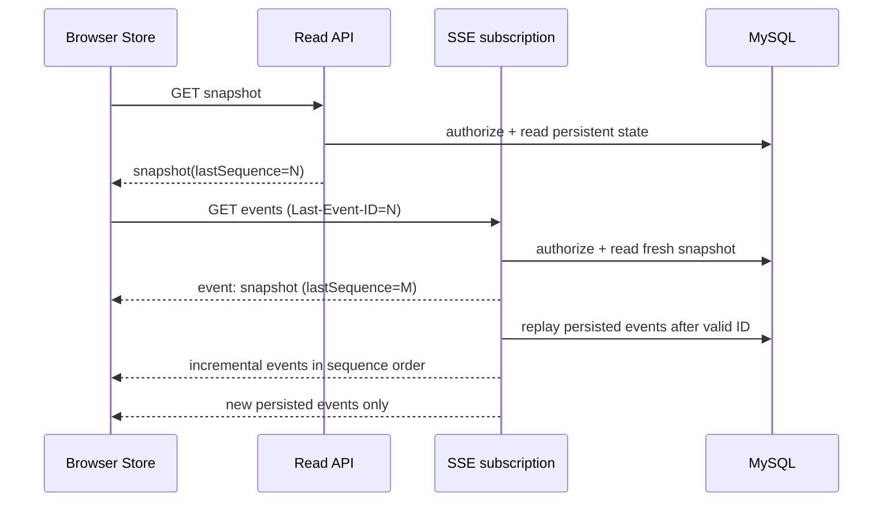
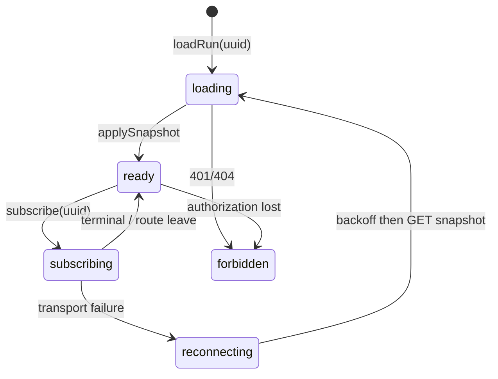

# R4：运行中心与 SSE 订阅契约

> 状态：`FROZEN`
>
> 依据：`R4-00`；后续实现任务：`R4-01` 至 `R4-08`

## 1. 不变量与边界

- MySQL 中的 `WorkflowRun`、`WorkflowStepRun`、Artifact 和持久化 `WorkflowRunEvent` 是唯一事实来源。浏览器 Store、`EventSource`、内存 Emitter、Redis 和 RabbitMQ 都不是运行状态的事实来源。
- 新工作流通过 R3 异步提交创建；成功提交返回 `202 Accepted` 与服务端生成的 `workflowRunUuid`。UI 只据此跳转 `/workflow-runs/{workflowRunUuid}`，不等待 Agent 或 SSE 完成。
- 查询和订阅严格只读；取消、重试只经命令 API。页面卸载、订阅断开、发送失败或重连不得写 Run、影响 Consumer，或调用 R2 Runner。
- 后端决定状态与 `allowedActions`；前端不复制状态机，也不以连接状态推断任务存活或成功。
- R4 不实现 EvaluationReport、Prompt/Token/成本比较、RAG 引用详情或 Dashboard 聚合；这些分别属于 R5/R6/后续 Dashboard。

## 2. 安全与字段脱敏

所有 v1 API 和 SSE payload 均只返回下表字段。认证凭据仅由既有认证层处理，禁止放入 URL、DTO、事件、日志或浏览器 Store。

| 模型 | 可读字段 | 禁止字段 |
| --- | --- | --- |
| `WorkflowRun` | `workflowRunUuid`、`status`、`attempt`、`definitionVersion`、`createdAt`、`startedAt`、`finishedAt`、`lastSequence`、脱敏 `error`、`allowedActions` | 用户密钥、Authorization、完整 Prompt、未脱敏输入、内部异常/堆栈、模型原始输出 |
| `StepRun` | `stepKey`、`stepOrder`、`status`、`attempt`、时间、耗时、脱敏错误摘要、Artifact 摘要 | 私密 Prompt、连接/模型凭据、未脱敏步骤输入输出、堆栈 |
| Artifact | `artifactUuid`、`type`、`displayName`、`status`、`createdAt`、服务端安全 URL（可用时） | 任意 Secret、私有存储路径、未授权下载 URL、可执行 HTML/模型原始内容 |
| Event | `eventType`、`workflowRunUuid`、`sequence`、`occurredAt`、可选 `stepKey`/`artifactUuid`、状态和上述安全摘要 | 上述所有禁止字段、Trace ID 以外的内部诊断细节 |

错误对客户端使用稳定的 `code` 和可展示 `message`；内部根因仅写受控日志/审计。所有读取、命令与订阅都先按当前认证用户和项目归属授权；未知 UUID 与无权资源返回一致的非泄露响应（推荐 `404`）。未认证返回 `401`。`403` 只在既有安全策略明确允许暴露资源存在性时使用。

## 3. HTTP API

| 操作 | 方法与 URL | 成功响应 | 失败/兼容语义 |
| --- | --- | --- | --- |
| 提交（R3） | `POST /api/v1/workflow-runs` | `202`，含 `workflowRunUuid` 和详情 URL | 保持 R3 幂等语义；不等待执行；旧同步 API 保留不变 |
| 详情快照 | `GET /api/v1/workflow-runs/{workflowRunUuid}` | `200`，Run、排序后的 steps、Artifact 摘要、`lastSequence`、`allowedActions` | 只读；历史 nullable 字段以 `null`/空数组表示，不得 500 |
| 步骤/Artifact（可选拆分） | `GET .../steps`、`GET .../artifacts` | `200`，稳定 `stepOrder` 或服务端顺序 | 主详情嵌套返回时仍可保留为兼容读取端点 |
| 订阅 | `GET .../events`，`Accept: text/event-stream` | `200 text/event-stream`，见第 4 节 | 不创建/取消/重试/执行 Run |
| 取消 | `POST .../cancel` | `202` 或既有幂等成功响应，返回最新命令可见快照 | 后端裁定合法性；重复请求不得创建额外效果 |
| 重试 | `POST .../retry` | `202`，返回新 attempt 的可见快照/定位信息 | 仅后端策略允许的终态可重试；不得重跑已成功步骤 |

客户端只使用 v1 端点作为运行中心数据源。旧 `/api/workflow/{workflowRunUuid}`、旧同步入口与 `POST /api/demo/game/stream` 不删除、不改变语义；它们不是新详情页的提交或订阅来源。v1 的字段新增保持向后兼容，删除/改名、改变状态含义或改变错误码需新版本协商。

推荐快照形状：

```json
{
  "workflowRunUuid": "8b3d...",
  "status": "RUNNING",
  "attempt": 1,
  "lastSequence": 12,
  "createdAt": "2026-07-12T09:00:00Z",
  "startedAt": "2026-07-12T09:00:03Z",
  "finishedAt": null,
  "error": null,
  "allowedActions": ["cancel"],
  "steps": [{"stepKey": "design", "stepOrder": 1, "status": "SUCCESS", "attempt": 1}],
  "artifacts": [{"artifactUuid": "a21c...", "type": "GAME_CONFIG", "displayName": "Game config", "status": "AVAILABLE", "url": "/api/v1/artifacts/a21c..."}]
}
```

## 4. 持久化事件与 SSE 协议

事件在相应 Run/Step/Artifact 状态可靠落库后产生。`sequence` 以 `workflowRunUuid` 为作用域，由数据库原子分配，严格单调递增且不可重复；它不是全局序号，也不能来自进程内计数器。事件至少包括：`run.created`、`run.status-changed`、`step.status-changed`、`artifact.available`、`run.cancel-requested`、`run.retry-requested`、`run.recovered`、`run.terminal`。

```text
GET /api/v1/workflow-runs/{workflowRunUuid}/events
Accept: text/event-stream
Last-Event-ID: 12                 # 可选，值为该 Run 的 sequence
```

建连顺序固定如下：



首连和每次重连都必须发送/拉取持久化 snapshot；SSE 增量不能用于填补未知缺口。服务端发送 `snapshot` 事件（完整安全 read model，含 `lastSequence`）后，才按有效 `Last-Event-ID` 回放其后的事件并订阅新事件。`id` 必须等于 `sequence`；`event` 为事件名；`data` 为 JSON。heartbeat 使用 SSE comment，不改变 sequence。

```text
id: 13
event: step.status-changed
data: {"workflowRunUuid":"8b3d...","sequence":13,"occurredAt":"2026-07-12T09:01:00Z","stepKey":"design","status":"SUCCESS","attempt":1}

id: 14
event: artifact.available
data: {"workflowRunUuid":"8b3d...","sequence":14,"occurredAt":"2026-07-12T09:01:02Z","artifact":{"artifactUuid":"a21c...","type":"GAME_CONFIG","status":"AVAILABLE","url":"/api/v1/artifacts/a21c..."}}
```

缺失、非整数、负数、未来或超出保留窗口的 `Last-Event-ID` 均不报错推测状态：服务端发送最新 snapshot，并从该 snapshot 的 `lastSequence` 开始观察后续事件；客户端也以此重置本地基准。网络可能导致重复递送，协议允许重复。终态 Run 仍可读取详情和获得 snapshot；发送 snapshot 与可用回放后服务端完成连接，不保留无意义 Emitter。timeout、completion、error、客户端断开和发送失败都清理该订阅；失败只影响该连接。

## 5. Store 合并规则

`workflowRunStore` 是按 `workflowRunUuid` 索引的唯一可变前端事实源，拥有 `snapshot`、`steps`、`artifacts`、`lastSequence`、`connectionState`、`loading`、`error` 与受服务端 `allowedActions` 驱动的命令状态。组件只能读取 selector 和调用 Store action；不得在 `App.vue`、步骤组件或详情页保留另一份可变 Run 副本，也不得直接 `fetch` 或拼接 Authorization。



- `applySnapshot(snapshot)` 原子替换该 Run 的 Run/steps/artifacts，并把 `lastSequence` 设为 snapshot 的 `lastSequence`；snapshot 始终优先于旧内存增量。
- `applyEvent(event)` 先验证 UUID 与 payload schema。仅当 `event.sequence > lastSequence` 时按事件语义更新相应字段并推进 `lastSequence`；`<=` 的重复/乱序事件丢弃，绝不回退状态。
- 若事件 sequence 大于 `lastSequence + 1`、无法解析，或无法安全局部合并，停止当前订阅并立即重新 `GET` snapshot；不得猜测缺失转换。
- 每次连接前关闭同一 Run 的旧 `EventSource`、listener 和 retry timer；单浏览器 session 每个 Run 至多一个活动订阅。路由离开、切换 Run、终态、卸载时释放它们。
- 重连采用有上限的指数退避；每次尝试先 `GET` snapshot，再用其 `lastSequence` 建订阅。`401/404` 不自动重连，清空受保护数据并呈现稳定错误。连接失败不改变后台状态。

## 6. 路由、页面与可访问性

提交页为 Workbench；成功后跳转 `/workflow-runs/:workflowRunUuid`。详情页从 URL 参数调用 `loadRun`，因此刷新、直达链接和断线恢复不依赖上一页内存。页面按服务端快照显示状态、步骤顺序、attempt、时间、脱敏错误、Artifact 和仅服务器声明可用的取消/重试/Demo 动作；Artifact 内容不作为 HTML 注入。

桌面端优先呈现 Run 摘要、状态/动作、步骤时间线、错误和 Artifact；移动端优先状态、当前/失败步骤、可用动作、错误摘要和 Artifact，次要元数据折叠且不依赖 hover。所有状态变化使用文本而非仅颜色，操作有可访问名称和键盘焦点，错误以 `role="alert"` 或等价 live region 宣读；触控目标、窄屏换行和长错误文本不得重叠或截断关键信息。

## 7. 实施顺序、测试与回退

后续任务仅在各自任务卡声明的目录内改动：R4-01 至 R4-04 负责 `backend-java` 的查询、事件、订阅和命令；R4-05 至 R4-07 负责 `frontend-vue` API/Store/路由/页面/SSE；R4-08 负责端到端与响应式验证。它们不得重写 R3 Outbox、Consumer、重试、DLQ、限流或恢复扫描。

测试至少覆盖：授权/未知 Run、历史空字段、刷新、断线、无效或过期 `Last-Event-ID`、重复和乱序事件、sequence 缺口、快速路由切换、终态断连、取消/重试幂等、空 Artifact、桌面与移动布局，以及“关闭订阅不影响 Consumer/Runner”。日志、fixtures、截图和断言不得含 Secret、Authorization、完整 Prompt 或原始敏感输入。

如新订阅出现问题，详情页回退为周期性 v1 GET 快照读取；不回退到长 SSE POST 执行链路，不改变后台运行，也不删除旧 Demo 入口。R5/R6 内容继续留在其阶段，避免运行中心成为评测或检索 Dashboard。
