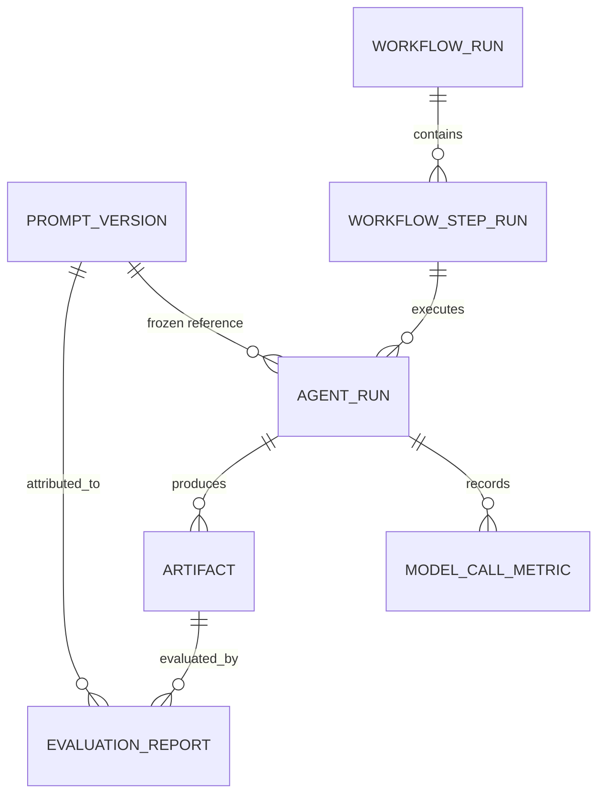
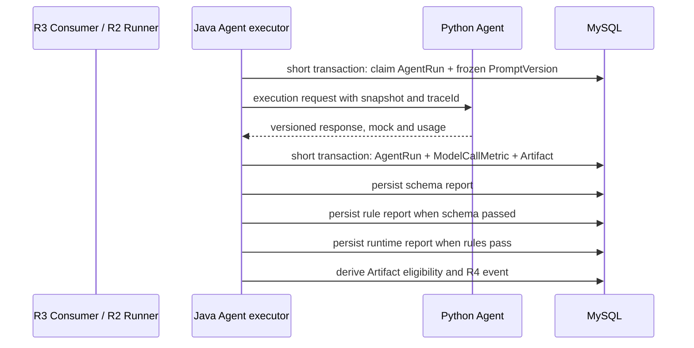

# R5 Prompt、评测与模型指标契约

> 状态：`FROZEN`
>
> 依据：`R5-00-prompt-evaluation-metrics-rfc.md`
>
> 实施顺序：`R5-01` 至 `R5-08`

## 1. 目标、事实来源与阶段边界

R5 将一次生成的来源、质量门禁和版本指标冻结为可追溯证据链：

```text
immutable PromptVersion snapshot
-> Python execution response
-> AgentRun + ModelCallMetric
-> Artifact
-> schema -> rule -> runtime evaluation
-> immutable EvaluationReport
-> permission-scoped aggregate comparison
```

MySQL 中持久化的 `WorkflowRun`、`WorkflowStepRun`、`AgentRun`、`Artifact`、`ModelCallMetric` 和 `EvaluationReport` 是唯一事实来源。R4 Read Model/SSE 与 R5 前端只读取安全投影；浏览器、日志、缓存、Python 进程内状态和图表不是事实来源。

R5 不改 `docs/game-config-schema.md` 的结构契约，不引入 R6 retrieval/RAG/Embedding，不以 LLM-as-Judge 作为通过条件，也不实现真实结算、配额或 R7 性能压测。

## 2. 不变量

1. PromptVersion 的提示词、schema 和模型参数创建后不可更新；ACTIVE 只影响未来 Run。已创建 Run、StepRun 与 AgentRun 永远引用创建时的版本快照。
2. `mock` 是逐次调用的显式布尔事实。缺失、未知或旧记录不得推断为 `false`，而是 `UNKNOWN`，且默认不进入真实模型指标。
3. 一次 Agent 调用及其每次 retry 都产生独立的 AgentRun/Metric 证据；任何重试不得覆盖旧指标或报告。
4. Schema、rule、runtime 是确定性三层门禁。`PASSED` 不等于“文本生成成功”；只有三层 blocking 条件都通过的受控 GameConfig Artifact 才能 `runtimeEligible=true`。
5. EvaluationReport 只追加。规则、schema 或 runtime 升级后的重评测创建新 attempt，保留旧报告和其依据版本。
6. 成功率、评测通过率、成本、token、延迟、时间窗与过滤条件仅由服务端计算，并随 API 返回；页面不得自行聚合或补零。

## 3. 领域模型与不可变边界



| 记录 | 必须字段 | 不可变字段/规则 |
| --- | --- | --- |
| `PromptVersion` | `id`、`versionUuid`、`templateId`、`agentType`、`version`、系统/用户 prompt、`outputSchemaKey/version`、`modelParameters`、`status` | prompt、schema、参数不可修改；同 template/version 唯一；归档后不可供新 Run 选择 |
| `AgentRun` | `workflowRunId`、`stepRunId`、`promptVersionId`、`attempt`、`status`、`provider`、`model`、`mockState`、`traceId`、时间 | 调用开始即冻结 prompt ref；完成后只追加结果，禁止以 retry 覆盖 |
| `ModelCallMetric` | `agentRunId`、`provider`、`model`、`inputTokens`、`outputTokens`、`estimatedCost`、`latencyMs`、`mockState`、`status`、`usageState`、`createdAt` | 一次调用一条；数值未知存 `null` 和原因，不写 `0` |
| `Artifact` | `agentRunId`、`stepRunId`、`schemaKey/version`、`contentHash`、受控内容引用、`runtimeEligible` | 内容版本不可就地替换；eligibility 由已持久化报告推导 |
| `EvaluationReport` | `artifactId`、`evaluationAttempt`、`evaluatorType`、`status`、依据版本、`violations`、证据引用、时间 | 仅插入；同 artifact/evaluator/attempt 唯一 |

历史记录没有 `promptVersionId`、`mockState` 或 usage 时必须保留 `null`/`UNKNOWN`，读取端显示“历史数据缺失”，不得将其伪装为真实调用、零成本或通过。

## 4. Java–Python 执行协议

R5-01 将 Python 现有 `ApiResponse.data` 演进为以下受版本控制的执行结果；Java 只接受白名单字段并对错误类别、长度和脱敏重新校验。

```json
{
  "status": "SUCCESS",
  "output": {"gameConfig": {}},
  "raw_output_ref": "restricted://agent-output/sha256:...",
  "model": "provider-model-name",
  "provider": "provider-name",
  "usage": {"input_tokens": 120, "output_tokens": 340, "estimated_cost": 0.001234},
  "latency_ms": 812,
  "mock": false,
  "trace_id": "trace-id"
}
```

`status` 只允许 `SUCCESS`、`FAILED`。调用失败必须仍返回（或由 Java 合成）`mock`、`trace_id` 和受控 `errorCategory`。类别至少为 `PROVIDER_CONFIG`、`PROVIDER_TIMEOUT`、`PROVIDER_TRANSIENT`、`PROVIDER_REJECTED`、`PROTOCOL_INVALID`、`OUTPUT_INVALID`、`INTERNAL`；Python 自由文本、HTTP body 和堆栈不能透传给浏览器。

`mock=true` 仅表示 Python 在明确启用 fallback 后返回的 mock；真实 Provider 成功为 `mock=false`；旧/缺失为 `UNKNOWN`。若 usage 不可得，`usageState=UNAVAILABLE|PARTIAL`、相应数值为 `null`，并从所有需要该字段的平均/分位数分母排除。



网络调用和浏览器 smoke 均不得位于长数据库事务中。

## 5. 三层 Evaluation

所有报告状态为 `PASSED`、`FAILED`、`SKIPPED`、`ERROR`。`SKIPPED` 必须携带稳定 `skipReason`；`ERROR` 表示 evaluator 无法可靠得出结论，绝不是 `PASSED`。

| 层 | 输入与版本 | PASSED 条件 | FAILED / ERROR 证据 | 执行门禁 |
| --- | --- | --- | --- | --- |
| `SCHEMA` | 原始 Artifact、冻结 `schemaKey/version`、输入 hash | JSON/结构、required fields、类型、已冻结 aliases/wrapper 合法；先校验后 normalization | `violationCode`、JSON path、expected/actual 摘要；解析器/registry 故障为 ERROR | 失败后 rule/runtime `SKIPPED(SCHEMA_NOT_PASSED)` |
| `RULE` | schema-passed canonical GameConfig、`ruleVersion`、`RuntimeCapabilityRegistry` 版本 | 支持 gameType、边界、尺寸/速度、唯一 ID、target/item、player/exit、引用和能力匹配 | 稳定 code、path、`BLOCKING|WARNING`、期望/实际摘要 | 有 blocking 失败后 runtime `SKIPPED(RULE_NOT_PASSED)` |
| `RUNTIME` | 通过前两层的受控 Artifact、runtime build/version、viewport | Phaser 初始化、canvas 与关键对象存在、ready/running、无未捕获错误且未超时 | 浏览器错误摘要、超时、screenshot/trace 受控引用、viewport | 仅这一层 PASSED 才可设 `runtimeEligible=true` |

Schema 失败不删除 Artifact 受控证据；规则 warning 不阻止后续层。Runtime 只接受已验证 Artifact/fixture，禁止执行模型生成的 HTML/JavaScript 或任意 URL。

### 报告样例

```json
{
  "artifactUuid": "artifact-uuid",
  "evaluationAttempt": 1,
  "evaluatorType": "RULE",
  "status": "FAILED",
  "schemaVersion": "1.0",
  "ruleVersion": "runtime-rules-1",
  "inputHash": "sha256:...",
  "violations": [{"code":"WORLD_BOUNDS","path":"items[2].x","severity":"BLOCKING","expected":"0..800","actualSummary":"912"}],
  "evidenceRef": null,
  "createdAt": "2026-07-12T00:00:00Z"
}
```

## 6. Artifact eligibility 与 Workflow 语义

`runtimeEligible` 是 Artifact 的派生门禁状态，不是 Agent 文本成功、WorkflowRun `SUCCESS` 或浏览器页面颜色。它只能由同一 Artifact 最新一次完整且已持久化的评测链得出：Schema PASSED、Rule PASSED（允许 warning）、Runtime PASSED。

评测失败默认不重写 AgentRun 的调用成功事实；每个 `workflowKey` 后续在自己的策略中决定它是否让 WorkflowRun 终止为 `FAILED`。R5-06 必须显式配置该策略，并把 Artifact eligibility 与评测事件写入 R4 Read Model；SSE 仅发布安全摘要和报告引用，不塞完整 violation/evidence payload。

## 7. 指标字典与固定口径

聚合作用域为：授权用户可读的项目集合 + `agentType` + PromptVersion + `[from,to)` UTC 时间窗 + 明示的 `includeMock`。API 同时返回这些条件、数据新鲜度、样本数与缺失数。

| 指标 | 分子 / 分母 | null、mock 与零样本 |
| --- | --- | --- |
| `callCount` | 过滤后 AgentRun 数 | `mock=false` 为默认；UNKNOWN 不进入真实结果 |
| `successRate` | `status=SUCCESS` / 所有终态调用 | 无终态样本为 `null`、`sampleCount=0` |
| `schemaPassRate` | Schema PASSED 报告数 / 有终态 Schema 报告数 | SKIPPED、ERROR、未评测不进分母，分别计数 |
| `rulePassRate`、`runtimePassRate` | 同层 PASSED / 同层终态报告 | 仅已实际执行该层的报告进分母 |
| `meanLatencyMs` | `sum(latencyMs)` / 有 latency 调用数 | latency null 不当 0；返回 `latencyMissingCount` |
| `p50/p95LatencyMs` | 有 latency 的升序 nearest-rank：`ceil(p*N)` | `N=0` 为 null；`N<20` 返回 `insufficientSample=true`，数值仍按算法可得 |
| `input/outputTokens` | 有相应 usage 的 sum/mean | partial usage 分字段计数，未知不补 0 |
| `estimatedCost` | 有 cost 的 sum/mean，货币精度固定 Decimal(12,6) | null 排除；返回 `costMissingCount`；不是财务结算 |

`includeMock=false`（默认）只选 `mock=false`；`includeMock=true` 仍必须返回 `realSampleCount`、`mockSampleCount` 和 `unknownMockCount`，并在 UI 标识混合。两个版本对比必须复用完全相同的过滤条件和口径，不能因一侧零样本改变另一侧分母。

## 8. 只读查询 API 与展示边界

| API | 行为 |
| --- | --- |
| `GET /api/v1/workflow-runs/{uuid}` | 在 R4 安全 read model 中增加 prompt 版本元数据、mock、受控 metric 摘要、各层状态、eligibility 与 violation 摘要 |
| `GET /api/v1/artifacts/{uuid}/evaluations` | 授权后按 evaluator/attempt 返回安全报告摘要和受控 evidence URL；完整敏感证据需额外权限 |
| `GET /api/v1/analytics/prompt-versions?...` | 服务端固定口径聚合；默认 `includeMock=false` |
| `GET /api/v1/analytics/prompt-versions/{id}/comparison?against={id}` | 返回相同过滤条件下两版指标、样本/缺失/不足状态 |

认证、项目归属与资源存在性遵守 R4：未认证 `401`，无权/未知资源使用既有非泄露语义。不得返回完整 Prompt、原始输出、API key、Authorization、用户私密上下文、内部 stack trace 或私有存储路径。前端只展示服务端数值、单位、样本和过滤条件；对零样本、未评测、usage 缺失、无权限和网络失败显示明确状态，绝不显示为 `0` 或绿色成功。

## 9. 脱敏、保存与审计

| 数据级别 | 保存方式 | 浏览器可见性 |
| --- | --- | --- |
| Prompt、原始输出、用户上下文、provider 原始错误 | 加密/受控存储引用 + hash；日志仅脱敏摘要 | 默认禁止；仅诊断授权的受控读取 |
| token、cost、latency、model、provider、mock、状态 | 持久化 metric | 所有者有权的安全摘要 |
| violation code/path、期望/实际摘要、截图/trace 引用 | 持久化报告；证据文件受访问控制 | 安全摘要；证据 URL 必须鉴权、短时且不可猜测 |

任何写入前都须移除 `Authorization`、API key、password、secret、token 和完整私密上下文。日志/队列/SSE/测试 fixture/截图均不得含这些数据。`traceId` 可关联诊断但不替代授权。

## 10. 迁移、子任务与回退

迁移只新增、兼容并可分步部署：先加 nullable 字段/新表与索引；再回填可确定的 PromptVersion 与 artifact 元数据；随后双写新运行；读取端兼容历史 null；确认后再使新运行必填。绝不删除旧 Prompt/Artifact/Run 或回写历史快照。

| 任务 | 可修改目录 | 交付与重点验证 |
| --- | --- | --- |
| R5-01 | `python-agent`、`backend-java`、迁移、相关测试 | 执行协议、Metric、mock/usage/超时契约；quick + integration |
| R5-02 | `backend-java`、迁移、相关测试 | immutable PromptVersion、ACTIVE 并发与运行快照 |
| R5-03 | `backend-java`、`python-agent`、`frontend-vue` GameConfig 测试 | schema 跨层 fixture；quick |
| R5-04 | `backend-java`、Runtime capability/规则测试 | deterministic rule 与 blocking/warning |
| R5-05 | `frontend-vue` runtime harness、`backend-java` 报告适配 | browser smoke、desktop/375px；e2e |
| R5-06 | `backend-java`、迁移、R4 read-model/event 测试 | 编排、append-only 报告、eligibility |
| R5-07 | `backend-java`、聚合/API 测试 | 权限隔离、时间边界、P95、null/mock |
| R5-08 | `frontend-vue`、E2E/截图测试 | 安全展示、响应式、无前端聚合 |

发生问题时，按 feature/config gate 停止新 evaluator、analytics 或 UI 入口；保留所有 AgentRun、Metric、Artifact 和 Report 以便诊断。R4 可退回只读详情/周期 GET，R3 不因 R5 回退而停止投递或重试；不得通过删除记录或把失败改为成功回退。

## 11. R5-00 验证与审查

```powershell
git diff --check
rg -n "PromptVersion|mock|ModelCallMetric|EvaluationReport|schema|rule|runtime|aggregate" docs\requirements\r5\R5-prompt-evaluation-metrics-design.md
```

审查结论必须确认：mock 不混入真实指标；三层均有持久化证据；ACTIVE 不回写历史；Dashboard 不自行计算；R6 retrieval 与 R7 压测未进入 R5。
