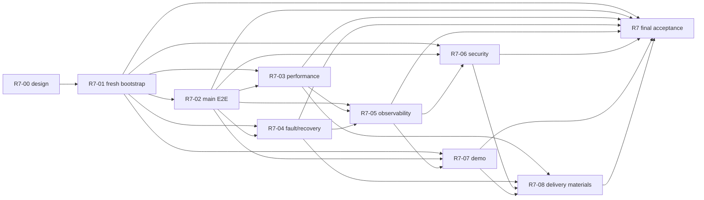

# R7 发布加固与最终交付设计

> 状态：`FROZEN`
>
> 依据：`R7-00-release-hardening-rfc.md`
>
> 适用对象：执行 R7-01 至 R7-08 的 Agent、验收者和发布候选（release candidate）审查者。

## 1. 目的、边界与不变量

R7 的产出不是新的产品能力，而是一条可审计的交付证据链：陌生环境可启动、主用户链路可自动验证、可靠性和安全边界有量化证据、演示与投递材料如实引用这些证据。README、录屏和口头说明只能解释证据，不能代替 Harness、日志、测试报告或持久化事实。

```text
fresh environment bootstrap
        -> full E2E
        -> concurrency/performance baseline ----+
        -> dependency fault injection/recovery --+-> observability/security audit
                                                    -> reproducible demo
                                                    -> README/architecture/interview/resume package
                                                    -> final acceptance and release decision
```

### 1.1 R7 的禁止事项

- 不新增工作流类型、Provider、RAG 算法、游戏类型、业务字段或独立产品模块。
- 不以“发布加固”为理由重写 R0-R6 已验收的架构，或用关闭幂等、评测、审计、授权和可靠投递来换取更好的数字。
- 不使用个人密钥、付费模型、历史数据库或本机残留 volume 作为测试、CI 或 demo 的唯一前提。
- 不自动推送、创建 tag、GitHub Release、部署生产环境或删除用户/volume 数据；这些动作均须用户另行授权。

### 1.2 回归归属与最小修复规则

R7 发现问题时先记录最小复现、影响的 release gate、`workflowRunUuid`/`traceId`（如适用）和证据，再按下表归属。仅当问题阻断当前候选、修复极小且能补回归测试时，R7 子任务可以修复；结构性问题必须回到对应阶段任务卡，R7 结论保持 `BLOCKED`。

| 现象或责任边界 | 归属阶段 | R7 的动作 |
| --- | --- | --- |
| 配置、密钥、迁移、鉴权基线、Docker 基础启动 | R0 | 记录并回派 R0；仅修复候选阻断的最小配置缺陷 |
| 领域状态、版本、工作流定义和 Prompt 生命周期 | R1 | 回派 R1，不在 R7 改写领域语义 |
| Runner、步骤执行、Artifact 写入和同步执行语义 | R2 | 回派 R2；R7 仅提供 E2E 复现 |
| 幂等、Outbox、MQ、锁、重试、DLQ、恢复和背压 | R3 | 回派 R3；故障/performance 报告保留失败时间线 |
| Run 查询、SSE、取消/重试命令和运行中心 UI | R4 | 回派 R4；R7 不以轮询或伪状态绕过 SSE |
| GameConfig、评测、指标、成本和 mock 统计 | R5 | 回派 R5；R7 不改评测口径以通过门禁 |
| 文档、向量、检索隔离、RAG 协议和检索证据 | R6 | 回派 R6；R7 不把 RAG-off 或 fake 引用伪装为成功 |

所有修复必须在报告中写明：问题归属、修复 commit、受影响 gate、补充测试和重新执行的 gate。任何无法定位到上述项的变更默认禁止。

## 2. Release candidate、证据与数据纪律

### 2.1 候选冻结规则

1. 每轮验证从干净工作区的候选 commit（`RC_SHA`）开始；先记录完整 SHA、分支、`git status --short`、`git diff --check`、`docker compose config` 和环境清单。
2. 同一份 R7 报告只能引用一个 `RC_SHA`。脚本、配置、镜像标签、fixture 或源码任一项变更后，必须生成新的候选并重跑所有受影响 gate；不得把旧的 PASS 迁移到新 SHA。
3. 候选允许新增脱敏报告、任务状态和证据索引；最终报告提交后再次检查工作区干净。报告不得只写“本机已通过”。
4. release tag 只建议、不自动创建。命名为 `v<major>.<minor>.<patch>-rc.<n>`，最终 tag 为 `v<major>.<minor>.<patch>`；均应为 annotated tag，消息包含 `RC_SHA`、最终报告路径和 `PASS` 结论。最终 tag 必须指向最终验收报告所在 commit，且需用户明确授权后才执行。
5. 任一阻断 gate 失败、发现真实 Secret/跨项目越权、证据缺失或报告与 `RC_SHA` 不一致时，候选结论为 `BLOCKED`，不能用“已知限制”降级为 PASS。

### 2.2 统一证据目录

每次执行创建不可复用的运行目录，名称使用 ISO-8601 UTC 时间去掉冒号和候选短 SHA：

```text
docs/reports/evidence/r7/<YYYYMMDDTHHMMSSZ>-<short-sha>/
  manifest.json                 # RC_SHA、分支、操作者、时间、OS、工具版本、Docker 资源、Provider mode
  commands/                     # 每条命令、参数、退出码、开始/结束时间
  console/                      # stdout/stderr，已脱敏
  compose/                      # config、ps、inspect 摘要、服务健康快照
  fresh/ e2e/ performance/ fault/ observability/ security/ demo/
  screenshots/ traces/ metrics/ # 失败截图、Playwright trace、结构化指标快照
  checksums.sha256              # 已保存文件的 SHA-256 清单
```

- 人可读的结论进入 `docs/reports/R7-*.md`；报告必须链接到上述相对路径、命令和退出码。大体积 trace、视频和完整原始日志可以作为 CI/本地构建产物保存，但其 URI、SHA-256、保留期和脱敏状态必须在 `manifest.json` 与报告中可查。
- `manifest.json` 至少记录：`RC_SHA`、运行编号、开始/结束时间（含时区）、Windows/Docker/Compose/Java/Python/Node 版本、CPU/内存/磁盘、Docker CPU/内存限额、镜像 digest、profile、fixture 版本、Provider mode 和执行者。不得记录 Token、密码、完整 Prompt、文档正文或用户个人数据。
- 失败与 PASS 同样保存命令、退出码和脱敏证据。失败证据不得被清理或用后一次成功运行覆盖；重新运行创建新目录并在报告中并列说明。
- 任何写入 Git 的截图、trace、日志和报告须先过 Secret/隐私检查。真实 Provider 请求的原始 payload、Authorization、密钥和完整检索正文不进入仓库或通用 CI 工件。

### 2.3 受控数据、Provider 和命名空间

| 数据/模式 | 允许用途 | 强制标记 | 隔离与清理 |
| --- | --- | --- | --- |
| `fixture` | quick、integration、E2E、performance、fault | `providerMode=fake` 或 `mock`，fixture 版本 | 使用每次运行唯一的 user/project、Idempotency-Key、run UUID 前缀；结束后按该前缀清理 |
| `demo` | 3-5 分钟演示和录屏 | UI、脚本和口播均写明 `DEMO / MOCK`；若真实则写明 `REAL PROVIDER` | 仅操作专用 demo user/project/namespace；reset 不得删除其他数据或 volume |
| `real-provider` | 可选人工体验检查 | `providerMode=real`、Provider/模型版本、成本上限和日期 | 与 fake 指标分表；禁止把密钥、Prompt/文档原文和响应正文纳入证据 |

mock/fake 是合格的可重复测试前提，但不是模型质量或线上容量结论。所有 AgentRun、Metric、RetrievalRecord、API 结果、页面徽标、脚本输出和报告均要可辨认地展示 `mock/fake/real`。RAG-on、RAG-off、空候选、检索失败和 mock fallback 是不同状态，不得互相替代。

## 3. 环境、前置检查与统一执行约定

### 3.1 环境等级

| 等级 | 用途 | 最低条件 | 通过时必须记录 |
| --- | --- | --- | --- |
| Fresh | R7-01、R7-02 的无历史环境验证 | Windows 10/11 + PowerShell 7、Git、Docker Engine/Compose v2；主机至少 4 逻辑 CPU、8 GiB 内存、20 GiB 可用磁盘；无本项目容器、网络、image 以外的 volume 和 `.env` | 清理前检查、Docker/Compose 版本、空 volume 证据、`.env` 来源（不含值） |
| Reference | R7-03 的可比较 performance 基线 | Fresh 条件外，主机至少 8 逻辑 CPU、16 GiB 内存、30 GiB 可用磁盘；Docker 固定为 6 CPU/8 GiB；交流电、关闭明显后台负载 | 硬件、Docker 限额、镜像 digest、资源空闲快照、fixture/延迟配置 |
| Compose integration | R7-02、R7-04、R7-05、R7-06 | MySQL 8.4、RabbitMQ 3.13、Redis、Java 21、Python 3.13、Node 22 与仓库 Compose/lockfile 所声明版本兼容 | `docker compose config`、服务 `ps`、健康/readiness、profile 与端口 |
| Optional real | 不作为发布门禁的真实 Provider 体验 | 以上环境 + 外部安全注入的临时密钥、明确成本和速率上限 | 仅记录 Provider/模型、配额、日期和脱敏结果；与 fake 报告分离 |

Fresh 环境允许 Docker 拉取基础镜像，但不得复用本项目数据库、Redis、RabbitMQ、浏览器 profile、fixture、`.env` 或已生成 artifact。无法满足 Reference 条件时可运行功能验证，但 performance 结论只能标记为 `NON-BASELINE`，不能与 Release gate 的基线比较。

### 3.2 统一前置和结束命令

从仓库根目录执行。R7-03、R7-04、R7-07 所列脚本由相应任务创建；在脚本尚不存在时，R7-00 只定义其接口，不假装已经执行。

```powershell
git status --short
git diff --check
git rev-parse HEAD
docker version
docker compose version
docker compose config

.\tools\verify.ps1 -Profile quick
.\tools\verify.ps1 -Profile integration
.\tools\verify.ps1 -Profile e2e
```

每条脚本必须：从仓库根目录运行；使用 `Set-StrictMode` 与非零退出码；在开始时创建本次 evidence run；在失败时输出 evidence 路径、候选 SHA、关联 ID 和下一步非破坏性诊断命令；在超时或 Ctrl+C 时停止本项目启动的负载，不执行 `docker system prune`、`docker compose down -v` 或全库清理。

默认停止为 `docker compose down`。任何会删除数据的命令（包括 `docker compose down -v`）只能出现在单独的“破坏性、本地、需人工确认”章节；它不能是 CI、默认脚本或 demo reset 的实现。

## 4. 最终 gate 矩阵与量化阈值

下表中的阈值是 R7 release gate，不是生产 SLA 或容量宣传。每个数据点必须附带环境和 `RC_SHA`；外部 Provider 限制、网络抖动和测试机资源不足必须单列，不能归因给系统本身。

| Gate | 环境与受控输入 | PASS 阈值 | 失败时必须保留 | 主报告与安全回退 |
| --- | --- | --- | --- | --- |
| Fresh bootstrap | Fresh；空 volume；仅 `.env.example` 的占位值替换为本地 Secret；fake/mock Provider | `docker compose config` 成功；`up -d --build` 后 20 分钟内 MySQL、Redis、RabbitMQ、Java、Python、Vue 均健康或 ready；Flyway 全量迁移一次成功；`quick` 通过；重启后专用 seed/core query 仍存在 | config、build/up 输出、`ps`、各服务 health/readiness、migration 摘要、日志尾部和失败服务 | `docs/reports/R7-fresh-environment-bootstrap-report.md`；`docker compose down`，保留 volume 和证据；失败时阻断后续 gate |
| Main E2E | Compose integration；固定 fake Agent、两份可审查知识 fixture（RAG-on/off）、合法/非法 GameConfig | 连续 3 次从登录到 Phaser ready 均在 120 秒内完成；每次 API/DB/UI 均关联同一 run/trace；RAG-on/off 与 mock 标记正确；非法 Config 被门禁阻止；刷新/SSE 重连不重复步骤 | Playwright screenshot/trace、请求响应摘要、run/step/Agent/Metric/Retrieval/Evaluation/Artifact 关联快照、队列与日志摘要 | `docs/reports/R7-main-workflow-e2e-report.md`；停止测试用户会话并只清理本次 fixture；不直接写终态绕过链路 |
| Concurrency/performance | Reference；fake Agent 固定 300 ms 成功延迟；1 分钟 warm-up + 5 分钟 measurement | 20 并发 unique-key 提交：API 202 P95 ≤ 1 s、错误率 ≤ 1%、完成 P95 ≤ 20 s；10 并发 same-key：恰有 1 个有效 WorkflowRun、每一步至多 1 个成功 AgentRun/Artifact；20 SSE/query 连接 P95 ≤ 1 s；停止负载后 90 秒内队列归零且无容器 OOM/restart | 负载配置、原始摘要、P50/P95/P99、吞吐、错误、队列峰值、CPU/内存/连接池、重复业务事实和调用次数 | `docs/reports/R7-concurrency-performance-baseline-report.md`；停止负载、保留数据和证据；可回退限流/worker 配置，不可关闭幂等/评测/审计 |
| Fault/recovery | Compose integration；专用 fault profile；固定 fake Python 失败模式 | Redis 故障时高成本新提交 fail-closed 或按策略重试，绝不无锁执行；MQ confirm 失败时 Outbox 不标 `PUBLISHED`；恢复依赖后 120 秒内可达预期终态；Python timeout/429/非法输出有限重试（默认最多 3 次）并进入失败/DLQ；安全可复现的 MySQL 瞬断不产生虚假 SUCCESS；Consumer 重启、重复消息、SSE 断开均不制造重复成功 Agent/Metric/Artifact | 故障开始/恢复命令和时间线、dependency 状态、Outbox/message/Step/Run 前后快照、trace/log、重试/DLQ、恢复耗时 | `docs/reports/R7-fault-injection-recovery-report.md`；先恢复依赖/停止 fault profile，再按持久化状态恢复；不得删 volume 或手改终态 |
| Observability/operations | Compose integration；至少一个成功 run、一个受控失败 run 和一个恢复 run | 同一 `traceId` 可从 HTTP 到 Outbox、MQ、Consumer、Python、评测/RAG 与 Artifact；日志含关联 ID 和安全错误码；指标有单位、标签、分母和计数时机；UUID 不作 metrics 标签；health/readiness 能区分进程与关键依赖；脱敏扫描为 0 个未处置泄露 | 关联查询输出、日志样本、指标快照、health/readiness、runbook 演练记录和脱敏扫描结果 | `docs/reports/R7-observability-operations-report.md` 与 `docs/operations-runbook.md`；关闭新增诊断暴露或回退配置，不通过日志改业务状态 |
| Security release audit | 干净候选 + Compose integration；攻击者/所有者两套 fixture；生产 profile | tracked 文件、镜像、配置、日志、报告中 0 个真实 Secret/弱默认凭证；所有跨 user/project 的 API、SSE、命令、Artifact、Metric、Document、Vector、RetrievalRecord 均拒绝且不返回数据；上传/路径/MIME/大小、Prompt injection、模型输出执行、生产测试/fault endpoint 受门禁；无未处置 Critical 依赖/镜像问题 | 脱敏扫描摘要、攻击用例及状态码/零行证据、依赖/镜像扫描及人工分级、配置/profile 证据、修复/风险决定 | `docs/reports/R7-security-release-audit.md`；撤销候选/禁用危险 profile/回退最小安全修复；禁止在报告复制 Secret 原文 |
| Reproducible demo | Compose integration；独立 demo namespace；deterministic mock，真实 Provider 仅可选片段 | `prepare-demo` 在 90 秒内幂等完成；操作者按脚本 3-5 分钟完成主链路；mock/real、实时/预录、报告数据均显式标记；Provider/网络失败可在 30 秒内切换离线 mock；reset 只删除 demo namespace | seed/reset 日志、预检查、时间表、截图/录屏清单、切换演练和脱敏检查 | `docs/reports/R7-demo-reproducibility-report.md` 与 `docs/demo-script.md`；停止 demo/仅 reset demo namespace；不删全局数据 |
| Delivery materials | `RC_SHA` 已有上述报告；无本机绝对路径或未验证数字 | README 首屏含定位/启动/限制；架构图反映 Java、Python、Vue、MySQL、Redis、RabbitMQ、SSE、RAG 与评测的真实边界；每个性能/故障/安全说法链接报告和复现命令；链接/命令检查通过；无 TODO、Secret、夸大生产结论 | link/check 输出、事实对照表、敏感词扫描、报告索引和审阅记录 | `docs/reports/R7-project-delivery-materials-report.md`、`README.md`、架构/面试/简历文档；回退不实文案，不改测试或业务实现 |

### 4.1 强制故障场景矩阵

R7-04 的脚本必须只针对本项目 Compose 的服务和专用 fixture。每次注入前记录关联 ID 和持久化快照；每次恢复后都运行相应查询/Harness。故障导致业务最终失败是有效结果，前提是失败状态可解释、可恢复且没有重复成功事实；任何“假成功”、静默丢失或手工改终态都是 `FAIL`。

| 场景 | 注入与输入 | 通过断言 | 失败证据与恢复 |
| --- | --- | --- | --- |
| Redis unavailable / lock expiry / wrong owner | 暂停或隔离本项目 Redis；对同一高成本步骤模拟锁过期与错误 owner 解锁 | 新高成本执行按策略拒绝或重试；未持锁者不能执行；错误 owner 不能删除他人锁；恢复后仅合法 owner/恢复者继续 | 锁 key 脱敏摘要、Run/Step/Audit、错误码、日志和恢复时间；先恢复 Redis，再依持久化状态重试 |
| RabbitMQ unavailable / confirm timeout | 停止 broker 或对 publisher 注入连接/confirm 超时，随后恢复 | Outbox 保持 `PENDING`/`RETRY_PENDING`，从不假标 `PUBLISHED`；恢复后投递一次有效执行，重复消息安全 ACK | Outbox 及 publish attempt、broker 状态、message/event ID、队列前后快照；恢复 broker/publisher，不删除消息 |
| Consumer restart / duplicate delivery | 在业务落库前后分别重启 Consumer，并投递相同 message ID | 落库前不 ACK 且可恢复；落库后重投只读取终态并 ACK；每个成功 Step 的 AgentRun/Metric/Artifact 均唯一 | Step 状态/版本、ACK 时序、delivery/message ID、重启日志；恢复 Consumer/扫描器 |
| Python timeout / 429 / invalid output / restart | fake Agent 分别固定超时、429、非法响应和中途重启 | 按错误分类有限重试（默认最多 3 次），进入正确 FAILED/DLQ/评测失败；不写虚假 SUCCESS；恢复后不重复成功/计费 | Agent mode、attempt、分类错误码、DLQ/评测、run/trace；解除 failure mode，按既有 retry/recovery 运行 |
| MySQL transient failure | 仅在专用 fixture 的安全连接/写入边界制造短暂连接失败，随后恢复 | 未提交事务不留下半终态；已提交事实不被重做；恢复后状态机/Outbox 可解释且无重复成功记录 | 连接故障时段、事务/Outbox/Run/Step 前后快照、数据库日志摘要；恢复连接，不执行 migration 回滚或全库清理 |
| SSE/client disconnect | 在 run 中断开浏览器/SSE，刷新后重新订阅 | 展示中断不改变后端执行；重连后的 sequence/snapshot 与持久化状态一致，不重复步骤或丢失终态 | 浏览器 trace、SSE event/sequence、查询快照和 Run/Step 状态；关闭旧连接后按标准订阅恢复 |

### 4.2 指标口径

- API latency 从客户端开始发送到收到 HTTP 202/业务响应；workflow completion 从首次提交到持久化终态。P50/P95/P99 用同一批请求的 nearest-rank 算法，报告请求数和样本不足情况。
- 错误率 = 非预期 HTTP 5xx、客户端超时和错误终态数 / 已发送 unique-key 请求数；业务预期的 same-key 幂等返回和预期非法 Config 拒绝单列，不计为系统错误。
- 吞吐 = measurement 窗口内完成的 unique workflow 数 / 秒；queue peak 为窗口内最大待消费消息，必须注明采样来源和间隔。
- 重复业务事实按持久化记录判定，不只看 HTTP：同 key 只能有一个有效 `WorkflowRun`；同一成功 Step 不得有第二个有效 AgentRun、Metric、Artifact 或可计费调用；重复投递可存在，但必须幂等 ACK/读取终态。
- Resource 至少记录每服务 CPU、RSS/容器内存、重启次数、JVM/连接池（若暴露）和 Docker 限额。fake Provider 的固定延迟必须单列；真实 Provider 的网络/限流/成本不能用来评价 Java/MQ 性能。

### 4.3 标准失败报告格式

每个 `docs/reports/R7-*.md` 至少包含下列字段；未执行或证据缺失必须写 `NOT RUN`/`MISSING`，不能留空或用 PASS 代替。

```markdown
## Execution identity
- Run ID / evidence path:
- Date and timezone:
- Branch / RC_SHA / dirty state:
- Operator / environment manifest / image digest:
- Provider mode: fake | mock | real (model/version when applicable)

## Scenario
- Gate, input fixture, command and timeout:
- Expected threshold and actual result:
- Correlation IDs: traceId / workflowRunUuid / eventId / messageId:

## Evidence
- Command exit code and console artifact:
- API/DB/UI/queue/metric/log evidence (redacted):
- Failure timeline, impact, recovery/rollback action:

## Conclusion
- PASS | FAIL | BLOCKED | NOT RUN:
- Regression owner (R0-R6 or R7 minimal fix):
- Follow-up commit and gates rerun:
```

## 5. R7 子任务依赖、修改范围与完成定义



“允许目录”是本任务的默认写入边界，不限制读取。若真实阻断问题需要跨界修改，停止并请求授权；禁止顺手格式化、依赖大版本升级或重构。所有任务都可写入其专属的 `docs/reports/R7-*.md` 和 `docs/reports/evidence/r7/**`，但后者必须遵守第 2 节脱敏规则。

| 任务 | 前置与默认时限 | 允许目录/文件 | 环境与推荐模型 | 完成定义 |
| --- | --- | --- | --- | --- |
| R7-01 Fresh bootstrap | R7-00；构建+ready 最多 20 分钟 | `docker/`、`docker-compose*.yml`、`.env.example`、`start-docker.ps1`、`tools/bootstrap-*.ps1`、Dockerfile、`docs/docker-one-click-start.md`、对应健康测试 | Fresh；`gpt-5.4` 实现脚本/配置，`gpt-5.5` 审查 | 空 volume 从文档启动、迁移、ready、重启与安全停止均有报告；不依赖历史环境 |
| R7-02 Main E2E | R7-01；每次链路 ≤120 秒，连续 3 次 | `tools/verify.ps1`、`tools/e2e/**`、`frontend-vue/tests/**`、`frontend-vue/src/**` 的测试辅助、受控 fixture/清理脚本、必要测试配置 | Compose integration；`gpt-5.5` | 从登录到 Phaser ready 的 API/DB/UI/SSE 证据贯通，RAG-on/off、mock、非法 Config 和重连均符合第 4 节 |
| R7-03 performance | R7-01、R7-02；1 分钟 warm-up + 5 分钟 measurement，单轮 ≤15 分钟 | `tools/run-performance-baseline.ps1`、`tools/performance/**`、负载 fixture、受控 fake 延迟/测试配置、报告 | Reference；`gpt-5.5` | 生成可重复分层 performance 报告，满足同 key/重复消息正确性和阈值；调优后重跑受影响 Harness |
| R7-04 fault/recovery | R7-01、R7-02；每故障最多 5 分钟，整轮 ≤30 分钟 | `docker-compose*.yml` 的 fault profile、`tools/run-fault-injection.ps1`、`tools/fault/**`、fake Python failure mode、故障测试/报告 | Compose integration；`gpt-5.5` | 每类故障有安全开始/恢复/停止、前后持久化快照和无重复成功证据；恢复后回归通过 |
| R7-05 observability | R7-02、R7-03、R7-04；诊断演练 ≤15 分钟 | Java/Python 的日志/trace/health/metrics 配置和测试、`docker/` 采集配置、`docs/operations-runbook.md` | Compose integration；`gpt-5.5` | 关联 ID 可跨服务诊断，指标口径/脱敏/低基数/health 有自动验证和 runbook 证据 |
| R7-06 security audit | R7-01、R7-02、R7-05；扫描+人工分级 ≤30 分钟 | 安全相关 Java/Python/Vue/Docker 配置、授权/上传/隔离测试、依赖清单、生产 profile、审计报告 | Compose integration；`gpt-5.5` | 第 4 节 security gate 全部通过或明确 BLOCKED；每个风险有影响、缓解和验收决定 |
| R7-07 demo | R7-01、R7-02、R7-05；准备 ≤90 秒、演示 3-5 分钟 | `tools/prepare-demo.ps1`、`tools/verify-demo.ps1`、`tools/reset-demo.ps1`、demo fixture、`docs/demo-script.md`、录屏/截图清单 | Compose integration；`gpt-5.4` | 演示数据可幂等准备/安全 reset，mock/real 明示并有 Provider 故障备用路线 |
| R7-08 delivery materials | R7-02 至 R7-07 全部 PASS；链接检查 ≤15 分钟 | `README.md`、`docs/architecture/**`、`docs/interview-qa.md`、`docs/resume-project-description.md`、报告索引和图片资产 | 已冻结 `RC_SHA`；`gpt-5.4` 整理，`gpt-5.5` 事实审查 | 陌生读者能运行、验证和讲解项目；所有量化主张均回链真实报告，无本机路径/Secret/夸大 |
| R7 final acceptance | R7-00 至 R7-08；全套门禁预留 ≤90 分钟，不含首次镜像拉取 | `docs/reports/R7-final-release-report.md`、R7 任务状态、报告索引；仅用户授权的最小阻断修复 | Fresh + Reference + Compose integration；`gpt-5.5` | 只给出 `PASS` 或 `BLOCKED`，冻结 RC/报告/剩余风险和 tag 建议；不自动 tag/push/release |

R7-01 至 R7-08 的任务卡若和本表在目录或阈值上有更严格规定，以更严格者为准。执行每个子任务前必须阅读本文件和该任务卡。

## 6. 故障、风险与回滚契约

| 风险/触发器 | 立即判定 | 安全处置与回滚 | 数据与证据要求 |
| --- | --- | --- | --- |
| Fresh start 依赖历史 volume、手工环境或真实密钥 | Fresh gate `FAIL` | `docker compose down`，保留 volume 做诊断；修正文档/配置后从新的空环境重跑 | 保存清理前检查、config、`ps`、migration 与日志；不得删除失败证据 |
| performance 超时、资源耗尽或结果不可比 | performance `BLOCKED`，停止负载 | 停止压测进程，等待队列收敛；仅回退本次 worker/限流/资源配置；不要关闭可靠性控制 | 保存参数、资源、队列和 partial result；说明系统、Provider、环境三类瓶颈 |
| Redis/MQ/Python/MySQL 故障使状态不一致 | fault `FAIL` | 先撤销 fault profile/恢复依赖，再按 Outbox、Run、Step、Audit 的持久化事实恢复；必要时回派 R3/R2 | 保存故障前后状态和时间线；禁止手工更新 SUCCESS、删除消息或 volume |
| 日志、报告或截图含 Secret/隐私 | security `BLOCKED` | 立即撤回/删除泄露工件的公开副本、轮换已暴露凭证、生成脱敏新工件；不在报告重印值 | 仅记录位置、类型、处置、轮换确认和新工件 hash |
| 跨 user/project 越权、高危依赖或生产调试端点 | security `BLOCKED` | 阻断 tag；禁用危险 profile/endpoint 或回退最小安全修复；回派所属阶段 | 保存脱敏攻击复现、授权测试、修复 commit 和完整回归结果 |
| demo 不稳定或 Provider 不可用 | demo `FAIL`，不得临场改数据 | 切换明确标记的离线 mock，或停止演示并使用已核验的报告/截图；后续修复后重新演练 | 保存切换时点、模式、seed 版本和脚本结果；禁止伪称 real |
| 文案与代码/报告不一致 | materials `FAIL` | 删除或改为可证明的设计/限制表述；不改业务代码来迁就文案 | 保存事实对照和链接检查结果 |

数据库 migration 只能前进。R7 的“回滚”是停止新脚本/profile、关闭不安全配置、恢复依赖、回退可逆代码/配置，或撤销 release candidate；不允许通过回滚 migration、物理删除历史审计记录、删除整个 Docker volume 或篡改终态实现。

## 7. 最终验收与投递包

R7 final acceptance 按下列顺序执行，且每一步都引用同一个 `RC_SHA`：

1. 确认候选身份、工作区、环境 manifest 和 Secret 扫描输入。
2. 在 Fresh 环境执行 bootstrap，并在同一候选上执行 quick、integration 和 full E2E。
3. 在 Reference 环境执行 performance；在 Compose integration 环境执行 fault、observability 和 security；明确这些不是高可用或生产规模承诺。
4. 运行 demo 预检查和 3-5 分钟脚本，检查离线 fallback 及脱敏。
5. 检查 README、架构图、报告导航、interview Q&A、resume 描述与最终报告链接；数字必须来自本候选报告。
6. 写入 `docs/reports/R7-final-release-report.md`，逐项列为 `PASS`、`FAIL`、`BLOCKED` 或 `NOT RUN`，并给出 tag 建议或拒绝理由。

最终投递包至少包含：根 `README.md`、启动与 demo 文档、架构/时序图、`docs/operations-runbook.md`、R0-R7 报告索引、R7 performance/fault/observability/security/final 报告、`docs/interview-qa.md` 和 `docs/resume-project-description.md`。它们必须让新用户先知道项目解决的问题、如何运行、如何验证和哪些限制仍存在；内部任务卡只作可追溯背景，不是阅读前提。

## 8. R7-00 自身验证

R7-00 只新增并冻结本设计文档，不执行后续发布、压测、故障注入或 tag。提交前运行：

```powershell
git diff --check
rg -n "fresh|E2E|concurrency|performance|fault|observability|security|demo|release" docs\requirements\r7\R7-release-hardening-design.md
```

完成条件：本文已明确 R7 不新增核心功能、回归归属、环境和数据边界、量化阈值、失败证据、报告和保存路径、回滚、R7-01 至 R7-08 的依赖/目录/时限/模型/完成定义，以及 release candidate/tag 的人工授权策略。
