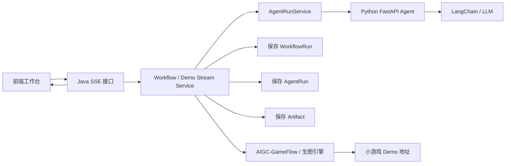

# SSE 游戏 Demo 生成链路设计

## 目标

当前阶段的目标不是先做复杂企业级能力，而是尽快做出一个可以演示的视频 demo：

- 用户输入游戏想法
- 后端启动 AI 工作流
- 前端实时看到每一步进度
- 生成游戏概念、核心循环、任务拆解
- 后续接入旧项目 AIGC-GameFlow 或生图/小游戏生成能力
- 最终展示一个“AI 帮我生成小游戏方案/素材/可运行 Demo”的完整链路

所以这一阶段优先做：

- SSE 实时进度输出
- Workflow 三步过程可视化
- 旧项目联动入口
- 前端演示页面

暂时不优先做：

- 失败重试
- 复杂执行日志
- RabbitMQ 异步队列
- Redis 状态缓存
- 多人协作
- 完整权限体系

这些可以等 demo 跑通后再补。

## SSE 是什么

SSE 全称是 Server-Sent Events，意思是“服务端主动向浏览器推送事件”。

普通 HTTP 请求是：

```text
前端发请求 -> 后端处理完 -> 一次性返回结果
```

SSE 是：

```text
前端发请求 -> 后端保持连接 -> 后端一边处理一边不断返回进度
```

它适合这种场景：

```text
正在生成游戏概念...
正在生成核心循环...
正在拆解开发任务...
正在生成游戏素材...
小游戏 Demo 已完成
```

SSE 不是 WebSocket。它更简单，主要适合“服务端单向推送给前端”的场景。

你的项目现在最适合用 SSE 展示 AI 工作流进度，因为用户不需要频繁给后端发消息，只需要看到 AI 正在一步步生成结果。

## 为什么现在适合做 SSE

你的项目已经具备这些基础：

- Java 后端负责统一入口、鉴权、项目管理、AgentRun、Workflow
- Python FastAPI 负责 Agent 和大模型调用
- 数据库已经保存项目、执行记录、产物、工作流记录
- 前端已经可以调用 Java 接口

现在缺的是“过程感”。

如果没有 SSE，用户点击按钮后只能等一个最终结果，视频 demo 会显得很普通。

加上 SSE 后，演示效果会变成：

```text
点击生成
-> 创建工作流
-> 生成游戏概念
-> 生成核心循环
-> 拆解开发任务
-> 调用旧项目生成小游戏
-> 返回 Demo 地址
```

这会更像一个 AI 工具流平台，而不是普通 CRUD 项目。

## 推荐链路

整体链路建议这样设计：



其中：

- 前端负责展示进度
- Java 负责流程编排和 SSE 推送
- Python 负责真实模型调用
- 数据库负责保存执行过程和结果
- 旧项目或生图引擎负责把结果进一步变成可展示 Demo

## 接口设计建议

### 推荐接口

建议新增一个专门用于 demo 的接口：

```text
POST /api/demo/game/stream
```

请求体：

```json
{
  "projectUuid": "543c8d9d-6387-4763-ad29-fe8cc25daeb7",
  "title": "像素风地牢探索游戏",
  "idea": "我想做一个像素风地牢探索游戏，玩家探索房间、收集装备、击败怪物。",
  "context": "目标平台 PC，先做 MVP，核心玩法优先。"
}
```

为什么建议用 POST：

- 你的请求内容比较长，用 GET query 不合适
- 可以正常放 JSON body
- 可以继续使用 Authorization 请求头

注意：原生浏览器 `EventSource` 只能发 GET，而且不能方便地自定义 Authorization 请求头。

你的项目使用 JWT，所以更推荐前端用 `fetch` 读取 SSE 流，而不是直接用 `EventSource`。

## SSE 返回事件设计

每次后端推送一个事件，建议统一成这样的 JSON：

```json
{
  "stage": "GAME_CONCEPT",
  "status": "RUNNING",
  "message": "正在生成游戏概念",
  "workflowRunUuid": "xxx",
  "agentRunUuid": null,
  "artifactUuid": null,
  "data": null
}
```

常见 stage：

```text
WORKFLOW_STARTED
GAME_CONCEPT
CORE_LOOP_DESIGN
TASK_BREAKDOWN
GAME_ASSET_GENERATE
GAME_DEMO_BUILD
COMPLETED
FAILED
```

常见 status：

```text
RUNNING
SUCCESS
FAILED
```

这样前端很好处理：

- `RUNNING` 显示加载状态
- `SUCCESS` 显示完成
- `FAILED` 显示错误原因
- `COMPLETED` 展示最终 Demo

## Java 后端怎么做

### 1. 新增 Demo Stream Controller

不要直接把 SSE 写进现有 `AgentController` 里。

建议新建：

```text
DemoController
```

负责：

- 接收前端请求
- 获取当前用户
- 创建 `SseEmitter`
- 调用 Demo 流式服务
- 把事件不断推送给前端

### 2. 新增 Demo Stream Service

建议新建：

```text
GameDemoStreamService
```

它的职责是编排流程：

```text
创建工作流记录
-> 推送 WORKFLOW_STARTED
-> 调用 GAME_CONCEPT
-> 推送 GAME_CONCEPT SUCCESS
-> 调用 CORE_LOOP_DESIGN
-> 推送 CORE_LOOP_DESIGN SUCCESS
-> 调用 TASK_BREAKDOWN
-> 推送 TASK_BREAKDOWN SUCCESS
-> 调用旧项目/生图引擎
-> 推送 GAME_DEMO_BUILD SUCCESS
-> 推送 COMPLETED
```

注意：不要一开始就直接复用现有 `workflowService.run()`。

原因是现有 `workflowService.run()` 更像一个黑盒：

```text
调用进去 -> 等全部完成 -> 返回最终结果
```

SSE 需要的是：

```text
每完成一步 -> 立刻推送一次
```

所以你有两个选择：

### 方案 A：先写一个新的 Demo 编排服务

优点：

- 最快
- 最适合视频 demo
- 不影响现有 Workflow 逻辑

缺点：

- 会和 WorkflowService 有一点重复逻辑

这是当前最推荐的方案。

### 方案 B：重构 WorkflowService，加入进度回调

示意：

```text
workflowService.run(userId, request, progressCallback)
```

每完成一步调用：

```text
progressCallback.accept(event)
```

优点：

- 设计更优雅
- 重复代码更少

缺点：

- 改动更大
- 更容易影响原有功能

赶进度阶段不建议先做。

## Python 端要不要改 SSE

第一版不需要。

Python 端继续保持普通 HTTP 调用即可：

```text
Java -> Python /agent/game-concept
Java -> Python /agent/core-loop-design
Java -> Python /agent/task-breakdown
```

SSE 先放在 Java 层做。

原因：

- Java 是你的主入口
- Java 负责鉴权和数据库
- Java 更适合统一推送 Workflow 进度
- Python 只需要专心处理 Agent 和 LLM

后期如果你想做“模型 token 级别流式输出”，再考虑 Python 端接入流式 LLM，然后 Java 转发给前端。

当前 demo 只需要“步骤级流式输出”，不需要 token 级别。

## 前端怎么接

因为你用 JWT，推荐用 `fetch` 读取流：

```javascript
const response = await fetch("/api/demo/game/stream", {
  method: "POST",
  headers: {
    "Content-Type": "application/json",
    "Authorization": `Bearer ${token}`
  },
  body: JSON.stringify({
    projectUuid,
    title,
    idea,
    context
  })
});

const reader = response.body.getReader();
const decoder = new TextDecoder("utf-8");

while (true) {
  const { done, value } = await reader.read();
  if (done) break;

  const chunk = decoder.decode(value, { stream: true });
  console.log(chunk);
}
```

后端 SSE 返回一般长这样：

```text
event: progress
data: {"stage":"GAME_CONCEPT","status":"RUNNING","message":"正在生成游戏概念"}

event: progress
data: {"stage":"GAME_CONCEPT","status":"SUCCESS","message":"游戏概念生成完成"}
```

前端需要把 `data:` 后面的 JSON 解析出来，然后更新页面上的步骤状态。

## 和旧项目 AIGC-GameFlow 怎么联动

建议分三步做。

### 第一步：先 mock 旧项目返回

Java 里先写一个 `GameBuildClient`，但第一版不真的调用旧项目，只返回：

```json
{
  "demoUrl": "http://localhost:5173/demo/mock-game",
  "status": "SUCCESS"
}
```

这样你可以先把 SSE 和前端演示跑通。

### 第二步：HTTP 调用旧项目

旧项目提供接口，例如：

```text
POST /api/game-build/run
```

Java 把三个 Agent 结果传过去：

```json
{
  "projectUuid": "xxx",
  "gameConcept": "...",
  "coreLoopDesign": "...",
  "taskBreakdown": "..."
}
```

旧项目返回：

```json
{
  "demoUrl": "http://localhost:xxxx/games/xxx/index.html",
  "assets": []
}
```

### 第三步：接入生图和小游戏生成

这一步才是真正的视频 demo 亮点：

```text
AI 生成设计文档
-> 生图引擎生成角色/场景
-> 旧项目生成小游戏页面
-> 前端 iframe 展示游戏
```

但不要第一天就做完这一步，先把流式链路跑通。

## 推荐实现顺序

### 第 1 步：只做假进度 SSE

先不调用 Python，只让后端每隔一秒推送：

```text
WORKFLOW_STARTED
GAME_CONCEPT
CORE_LOOP_DESIGN
TASK_BREAKDOWN
COMPLETED
```

目标：确认前端能收到流式消息。

### 第 2 步：接入真实 Workflow 三步 Agent

把假进度替换成真实调用：

```text
agentRunService.run(GAME_CONCEPT)
agentRunService.run(CORE_LOOP_DESIGN)
agentRunService.run(TASK_BREAKDOWN)
```

每一步完成后发送一次 SSE。

### 第 3 步：保存 Artifact

三步完成后，把每一步输出保存成 artifact。

注意：单独调用 `/api/agent/run` 可以不自动保存 artifact。

但是 demo workflow 里应该保存 artifact，因为这个链路就是为了生成项目产物。

### 第 4 步：接旧项目 mock

先返回一个假的 demo 地址。

前端看到：

```text
小游戏 Demo 已生成
点击预览
```

### 第 5 步：接真实旧项目

最后再对接 AIGC-GameFlow 的真实接口。

## Apifox 怎么测

Apifox 对 SSE 的支持不一定稳定。

建议这样测：

1. 先用 Apifox 测普通接口：

```text
POST /api/auth/login
GET /api/auth/me
POST /api/projects
POST /api/agent/run
POST /api/workflows/game-design/run
```

2. SSE 接口优先用前端测。

3. 如果想用命令行测，可以用：

```bash
curl -N -X POST "http://localhost:8080/api/demo/game/stream" ^
  -H "Content-Type: application/json" ^
  -H "Authorization: Bearer your_token" ^
  -d "{\"projectUuid\":\"xxx\",\"title\":\"test\",\"idea\":\"test\",\"context\":\"test\"}"
```

`-N` 的意思是不缓存输出，这样你能实时看到服务端推送。

## 常见坑

### 1. EventSource 不能传 Authorization Header

如果你用：

```javascript
new EventSource("/api/demo/game/stream")
```

它不能方便地加：

```text
Authorization: Bearer xxx
```

所以你的项目更适合用 `fetch` 读取流。

### 2. 不要在 Controller 线程里跑长任务

SSE 会持续连接，如果直接在 Controller 里执行所有 AI 调用，可能占用 Tomcat 请求线程。

推荐：

```text
Controller 创建 SseEmitter
-> 交给线程池异步执行
-> Controller 立刻返回 emitter
```

### 3. 不要太早 complete

如果后端提前调用：

```text
emitter.complete()
```

前端就收不到后续事件。

必须最后一步完成后再 complete。

### 4. 现有 WorkflowService 可能无法逐步推送

如果一个方法内部直接跑完三步再返回，SSE 只能显示最终结果。

要想显示每一步，就需要把三步拆开调用，或者给 WorkflowService 加回调。

### 5. Python 422 通常是字段不匹配

比如 Java 发的是：

```json
{
  "projectUuid": "xxx"
}
```

Python 要的是：

```json
{
  "project_uuid": "xxx"
}
```

这种命名不一致会导致 422。

### 6. 先做步骤级 SSE，不要急着做 token 级流式输出

token 级流式输出是：

```text
模型一个字一个字吐出来
```

步骤级 SSE 是：

```text
每完成一个 Agent 推送一次
```

你的 demo 当前更需要步骤级 SSE。

## 最小可演示版本

最小 demo 达到下面效果就可以录视频：

```text
1. 登录
2. 选择项目
3. 输入游戏想法
4. 点击“生成小游戏 Demo”
5. 前端显示：
   - 创建工作流中
   - 正在生成游戏概念
   - 正在设计核心循环
   - 正在拆解开发任务
   - 正在生成 Demo
   - Demo 已完成
6. 页面展示最终结果或 Demo 链接
```

这个版本已经能体现：

- Spring Boot 后端编排能力
- JWT 鉴权
- Java 调 Python
- LangChain / LLM Agent
- Prompt 模板
- Workflow
- SSE 流式进度
- AI 游戏工具流业务场景

## 建议任务清单

### 后端 Java

- [ ] 新建 `DemoController`
- [ ] 新建 `GameDemoStreamService`
- [ ] 定义 Demo 请求 DTO
- [ ] 定义 SSE 事件 VO
- [ ] 使用 `SseEmitter` 返回 `text/event-stream`
- [ ] 使用线程池异步执行生成流程
- [ ] 每个阶段发送一次进度事件
- [ ] 调用三个核心 Agent
- [ ] 保存三个 artifact
- [ ] mock 一个小游戏 Demo 地址

### Python

- [ ] 保持现有 Agent HTTP 接口
- [ ] 确认三个 Agent 都能正常调用真实 LLM
- [ ] 确认 Python 返回结构稳定
- [ ] 暂时不做 Python SSE

### 前端

- [ ] 新增“生成小游戏 Demo”按钮
- [ ] 使用 `fetch` 调用 SSE 接口
- [ ] 解析服务端返回的 `data:` JSON
- [ ] 显示步骤进度条
- [ ] 显示每一步结果摘要
- [ ] 显示最终 Demo 链接或 iframe

### 旧项目联动

- [ ] 第一版先 mock Demo 地址
- [ ] 第二版再 HTTP 调用 AIGC-GameFlow
- [ ] 第三版接入生图引擎和小游戏生成

## 推荐优先级

最推荐的顺序：

```text
SSE 假进度
-> SSE 接真实三步 Workflow
-> 前端步骤进度条
-> mock Demo 地址
-> 接旧项目
-> 接生图/小游戏生成
```

不要一开始就同时做 SSE、旧项目、真实生图、失败重试、日志增强。

那样会把问题混在一起，很难排查。

你现在最需要的是一个能跑通、能录视频、能讲清楚的 demo 链路。

