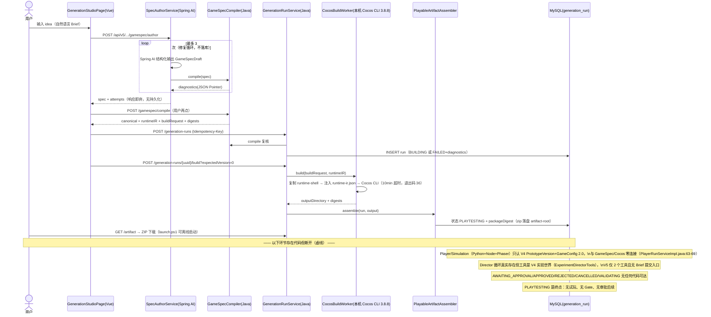
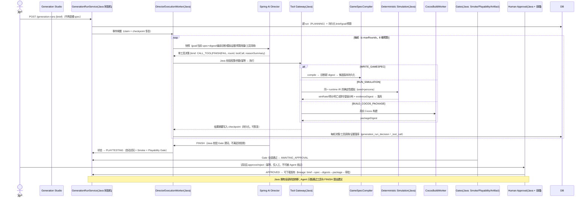
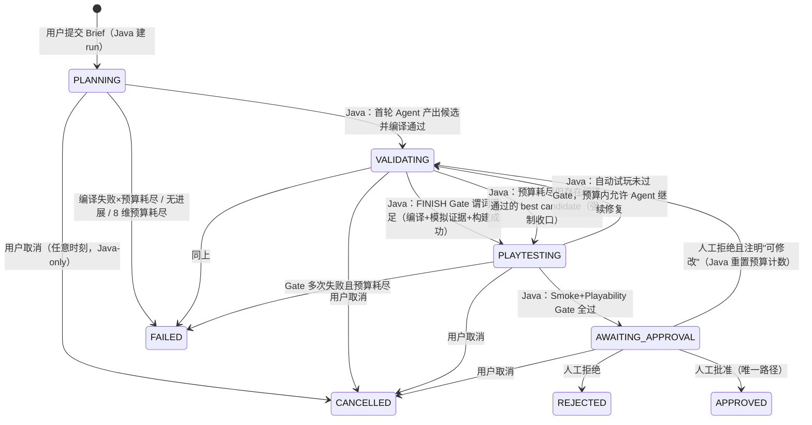

# GameDev Agent Workbench 升级方案：Java 控制核心 + 可验证小游戏生成 Agent（黄金切片版）

> 状态：待人工确认（本轮未修改任何代码）
> 依据：2026-08 对仓库源码的完整核对（docs/requirements/v5、docs/architecture、gamespec、generation、director、PlayerRun、cocos、artifact、cocos-runtime-shell、frontend-vue、db/migration、测试）。所有结论以代码为准；无法从代码确认的已显式标注。

---

## 0. 代码事实核对（8 问速答，先于 12 节方案）

### Q1 当前用户从 Brief 到可玩游戏包，实际能走通哪些步骤？

**已真实连通的链路（代码可证）**：

1. 前端 `GenerationStudioPage.vue` 输入 idea（`frontend-vue/src/features/generation/GenerationStudioPage.vue:36-41`）
2. `POST /api/v5/projects/{p}/gamespec/author`（`GameSpecController.java:41-45`）→ `SpecAuthorService.author`（`SpecAuthorService.java:18-35`）：Spring AI 结构化输出 + **最多 3 次**编译器诊断修复循环（`SpringAiSpecAuthorModel.java:69-109`，temperature 0.2，`StructuredOutputValidationAdvisor`）
3. 前端编辑/编译：`POST .../gamespec/compile` → `GameSpecCompiler.compile`（`GameSpecCompiler.java:39-58`，闭世界校验 + canonical spec + Runtime IR + Build Request + SHA-256）
4. `POST .../generation-runs`（幂等）→ `GenerationRunService.create` 落库（`GenerationRunService.java:47-80`），成功进 `BUILDING`
5. `POST .../generation-runs/{uuid}/build?expectedVersion=` → `CocosBuildWorker.build`（`CocosBuildWorker.java:59-98`）：真实调用本机 Cocos Creator 3.8.8 CLI（`--build platform=web-mobile`，退出码 36=成功），runtime-ir.json 写入隔离工程副本的 `assets/resources/generated/`（:70-73）
6. `PlayableArtifactAssembler` 组装 ZIP（provenance×3 + manifest + launch.ps1 + README，`PlayableArtifactAssembler.java:36-63`）→ 状态转 `PLAYTESTING`（`GenerationRunService.java:111`）
7. `GET .../artifact` 下载（`GenerationRunController.java:43-52`）

真实构建有实物证据：`implementation-core.md:62`（两次 3.8.8 构建，29 文件 3,465,719 bytes）、`tmp/cocos-real-build/web-mobile/`、`tmp/cocos-verified-build/web-mobile/`、构建日志 `cocos-runtime-shell/temp/builder/log/web-mobile2026-8-6 02-18.log`。

**走不通的部分**：自动多轮 Agent 决策、Simulation/Player 试玩证据、Smoke/Playability Gate、人工审批——全部见 Q2。

### Q2 哪些步骤只是模块存在，但没有连接成主链？

| 模块 | 存在证据 | 与主链的连接状态 |
| --- | --- | --- |
| Director 决策循环 | `DirectorExecutionWorker.java:54-107`（claim/checkpoint/预算/恢复，真实且完整） | 工具集是 V4 实验世界（`ExperimentDirectorTools.java:21-26`：CREATE_DRAFT_VERSION / RUN_PLAYER_EXPERIMENT / GENERATE_NEIGHBOR_CANDIDATES…）；V5 工具仅 2 个（`GameSpecDirectorTools.java:15-20`：GET_GAMESPEC_CAPABILITIES、COMPILE_GAME_SPEC），**无任何入口能把 Brief 变成 V5 Director Run**（`DirectorApplicationService.java:24` 的 goal/budget/facts 是 V4 平衡实验语义） |
| Player/Simulation | `PlayerRunServiceImpl.java:57-81`、`PlayerRunWorker.java:39-51`；模拟规则在 `frontend-vue/src/features/demo/runtime/simulation/simulationCore.ts`（Phaser 系）；Node simulation-service（`docker-compose.yml:104-127`）；Python 策略（`python-agent/app/services/player/`） | **只接受 V4 PrototypeVersion + GameConfig 2.0**（`PlayerRunServiceImpl.java:63-69` 强制绑定 `prototypeVersionUuid`/`configDigest`）；对 GameSpec/Cocos 完全不可用 |
| Cocos 构建 | `CocosBuildWorker.java`（真实） | 已连主链，但由前端手动按钮触发（`GenerationStudioPage.vue:240-249`），无编排/无 Gate |
| Artifact | `PlayableArtifactAssembler/Store`（真实，含安全扫描） | 已连主链；无 commit 溯源（全代码无 commit 记录，仅 digest 链） |
| 人工审批 | `PrototypeApprovalService.java:33-41` + `PrototypeApprovalController` + 前端按钮（`DirectorRunPage.vue:16`） | **只挂在 V4 prototype_version 生命周期**；`generation_run` 的 AWAITING_APPROVAL/APPROVED/REJECTED 枚举存在（`GenerationRunStatus.java:4`、V37 CHECK），但**无任何代码可达**（全库 grep 仅枚举定义 + `GenerationRunService.java:111` 的 PLAYTESTING） |
| Gate | `EvaluationOrchestrator.java:53-165`（SCHEMA→RULE→RUNTIME，写 `agent_artifact.runtime_eligible`） | 只服务 GameConfig/Phaser 体系；**主代码无 Smoke、无 Playability 概念**（"playability" 零匹配；Smoke 仅出现在测试注释 `RabbitMqInfrastructureTest.java:14`） |
| Outbox/RabbitMQ/Redis | `OutboxPublisher.java:34-50`、`WorkflowMessageConsumer.java:50`、`WorkflowSubmissionGateImpl.java:28-31`（真实闭环） | 只服务旧 workflow 异步链；Director/Player/Generation **均不走消息**（build 是同步 HTTP 触发） |
| GameBuildClient | `GameBuildClient.java:24-56` | **纯 mock**（只拼 `/demo/play` Phaser URL，不发请求）；仅旧 DEMO SSE 流在用，与 Cocos 无关 |

### Q3 当前 Agent 到底能做哪些真实决策？

两个有限的真实循环，都不是"玩法级动态决策"：

1. **Spec Author 修复循环**（`SpecAuthorService.java:24-34`）：一次生成 + 最多 3 次"读诊断→改 spec→重编译"。决策空间=按诊断码修字段。**attempts 不落库**（只返回响应）。
2. **V4 Director 每轮单工具决策**（`DirectorExecutionWorker.java:67-75` + `SpringAiDirectorDecisionClient.java:68-117`）：每轮模型从快照选一个工具（CALL_TOOL / FINISH / FAIL / REQUEST_APPROVAL），Java 校验、执行、落库、下一轮从持久化 checkpoint 恢复；8 维预算（`DirectorExecutionWorker.java:99`）。但它的领域是**平衡实验**（候选版本、player 实验），不是 GameSpec 游戏设计。
3. **硬伤（本次核对新证实）**：`FINISH` 与 `REQUEST_APPROVAL` 的合法性要求快照里存在 `targetMet=true`（`SpringAiDirectorDecisionClient.java:95-99`），而**全库没有任何生产代码写入 targetMet/approvalRequired**（grep 仅命中决策客户端的读取和测试 `SpringAiDirectorDecisionClientTest.java:98`）。因此 V4 Director 运行**永远无法合法 FINISH 或请求审批**，只会以异常或预算耗尽 FAILED 收场——决策循环在结构上无法成功终止。此外工具完整输出只存内存（`InMemoryDirectorToolResultStore`），重启即丢失。

结论：**"证据驱动地设计玩法并迭代"的闭环当前不存在**——存在的是"结构输出+诊断修复"和一个"无法合法成功终止"的实验编排循环，两者没有桥接。

### Q4 当前 GameSpec 的设计空间是否足以产生玩法明显不同的游戏？

**不足以。** 可变量：布局、数量、速度、尺寸、分值、时限、血量、出生点、巡逻轴/范围（`GameSpecCompiler.java:62-179`）。不可变量：移动方式唯一 `four_way`（:86）、敌人唯一"沿轴往返巡逻"基元（:135-138）、胜利规则唯一模板（`rules` 的 `equals` 硬性 0..0，:168；`exit.unlock` 唯一动作，:179）、7 个 presentation profile 全部单值常量（`ArcadeCollectCapabilityRegistry.java:24-32`）。

对照：被冻结的 V4 GameConfig 2.0 反而有接触伤害、胜负条件、难度（`GameConfigContract.java:179-225`）。当前 GameSpec ≈ "数值 + 布局调参器"，**两种不同 spec 之间的玩法差异 < 两种关卡之间的差异**。

### Q5 当前 Cocos Runtime 是否真正实现了 Asset/Animation/Camera/Feedback/UI/Audio Profile？

**全部没有。** `cocos-runtime-shell/assets` 只有 3 个文件：`main.scene`、`scripts/RuntimeController.ts`（485 行）、`resources/generated/runtime-ir.json`。零图片、零音频、零 prefab、零动画资源。`RuntimeController.ts:142-149` 对 7 个 profile id 只做**精确等值校验，随后从不消费**。已实现：Graphics 矢量绘制全部对象、文字 HUD（:202-210）、tween 呼吸（:253/:357）、手写 8 粒子火花（:384-399）、静态正交相机（`main.scene:163-207`）、键盘+触摸输入（:407-433）。缺失：音频、相机跟随/震动、正式粒子、开始菜单/暂停遮罩、冲刺/护盾、追击 AI、UI 皮肤。IR 的 `rules` 字段运行时根本未读取（解锁被硬编码在 `:331/:344`）。

### Q6 当前 Player 的结果是否能够反馈给 Agent 并驱动下一轮修改？

**V4 内部真实存在、但对 V5 不存在。** V4 闭环：`DirectorExecutionWorker.executePending` 完成后 `appendResult` 写入 checkpoint 的 `recentToolResults`（:93），下一轮 `snapshot` 携带（:92），经 `DirectorExperimentWakeup` 事件唤醒。但摘要被截断到 500 字符（`safe()` :105），且整个链条绑定 prototype_version。**GenerationRun 不消费任何 Player 结果、无法按 run 追溯试玩证据**（`generation_run` 表无 episode 关联列）。

### Q7 当前 GenerationRun 是否能够代表整个生成生命周期？

**不能。** `generation_run`（V37）只有 spec/build/package 事实列，无 rounds/checkpoint/budget/trace/goal；8 个状态中只有 `BUILDING→PLAYTESTING→FAILED` 三条转移可达（`GenerationRunService.java:111,115`）；`VALIDATING/CANCELLED/AWAITING_APPROVAL/APPROVED/REJECTED` 是不可达枚举。**GenerationRun 是"构建任务表"，不是"生成生命周期"。**

### Q8 哪些已有工程能力可以复用，哪些暂时不应继续投入？

复用：`GameSpecCompiler`（诊断码体系）、`CocosBuildWorker`+`PlayableArtifactAssembler/Store`、`DirectorExecutionWorker` 的 claim/checkpoint/预算/恢复模式、`DirectorRunStatus` 的迁移表模式、`PrototypeApprovalService` 的幂等审批模式、Flyway、Outbox/Redis 锁（仅限流/防重）。
暂停：RAG/Qdrant、第二 archetype、平台适配、微服务、mock `GameBuildClient`/DemoStream 旧链、Phaser 新功能。

### 文档与代码冲突核对（抽样，完整 11 项冲突清单见文档层核对报告）

- `docs/requirements/v5/README.md:3` 标"PRODUCT DESIGN"、`:54` 说"只批准产品与契约文档"，而 `implementation-core.md:3` 标"CORE IMPLEMENTED / COCOS 3.8.8 BUILD VERIFIED"（代码支持后者）。
- 四份契约文档（game-spec-language / java-gamespec-compiler / cocos-runtime-target / playable-artifact-contract）全部自标"DRAFT / 待实现"，与 implementation-core 的"已实现"并存。
- Agent 宿主冲突：`v5/README.md:35`"Python 规划和修复" vs PRD `:23`"Spring AI 驱动的 Java Director"（代码现实：Java Spring AI 是主路径，Python LangGraph 仅显式回滚，`HttpDirectorDecisionClient` + `python-agent/app/routers/director.py:9-10`）。
- 工具清单三处不一致：PRD `:194-201` 8 个、java-gamespec-compiler `:82-88` 7 个、implementation-core `:13` 实际 2 个。
- `docs/reports/README.md:33` 标 R7 报告 MISSING 但文件存在；整体停留在 R7 时期，未反映 V4/V5。

**结论：文档只能证明"作者声称什么"，不能证明代码事实；方案以代码为准。**

---

## 1. 一句话项目定位

> **一个以 Java 为事实权威、Spring AI 为模型接入、Cocos Creator 为真实运行与构建目标的"可验证小游戏生成 Agent"：用户提交创意 Brief 后，Agent 在真实 Runtime 能力边界内设计并修复 GameSpec，Java 负责运行状态机、编译诊断、确定性试玩证据、构建编排与门禁审批，最终交付可独立运行、可人工批准的游戏包——Agent 的每一步决策都由持久化证据支撑，且无法绕过 Java 门禁。**

面向面试官的拆解：① Java 不是 CRUD——状态机/语义/工具网关/证据/构建/门禁全部在 Java；② Agent 不是一次性 JSON——受限工具调用 + 持久化检查点 + 预算 + 诊断/试玩证据驱动的迭代；③ 产物不是 demo——真实 Cocos 构建的 ZIP、可离线启动；④ 诚实边界——单 archetype、单机、无虚构规模。

---

## 2. 当前真实主链（以代码为准）



---

## 3. 目标主链



---

## 4. 当前最严重的五个缺口（全部引用代码）

### G1 试玩证据与 GameSpec/Cocos 完全脱节 —— 双事实源已实际存在

- Player 提交强制绑定 V4 对象：`PlayerRunServiceImpl.java:63-69`（`versions.selectByUuid(request.getPrototypeVersionUuid())` + `artifact.getContentDigest()` 比对 + `gameConfigs.process()`），GameSpec 根本进不去。
- 模拟规则引擎是 Phaser 系 TypeScript：`frontend-vue/src/features/demo/runtime/simulation/simulationCore.ts`（TICK_MS=50，移动 :349-364、碰撞 :382-421、收集 :423-435、伤害 :437-451、胜负 :453-458），经 Node 容器暴露（`docker-compose.yml:104-127`，构建自 `frontend-vue/Dockerfile.simulation-service`）。
- 而真实交付物运行的是另一套规则：`cocos-runtime-shell/assets/scripts/RuntimeController.ts`（`update` :96-108、`resolveContacts` :321-342、`updateEnemies` :305-319）。两套引擎的常量/公式独立演进，**已有可量化的不一致**：玩家速度 220 vs 180 px/s（GameConfig valid 样例 vs runtime-ir.json 样例）；收集判定阈值 26px vs 32px（SimulationCore 的 dist≤r1+r2 vs `RuntimeController.ts:401-405`）；受击无敌 1000ms（GameConfig 配置）vs Cocos 硬编码 1.15s（`:334`）；巡逻范围 ±120 vs ±75（`patrolRange/2`，`:313`）——且没有任何 conformance 测试锁定一致性。此外还存在第三套内嵌 playable 规则（`PrototypePackageBuilder.java:84-85` 自绘 canvas 离线包）。
- `GameSpec` 文档承诺的"GameConfig 2.0 simulation projection"（`game-spec-language.md:90-92`）在代码中无法确认存在。
- 后果：`GenerationRunService.java:111` 转 `PLAYTESTING` 后**无任何代码读这个状态去跑试玩**（全库 grep PLAYTESTING 仅 3 处：枚举、两行 service）。

### G2 Capability Registry 是"先有 ID、后有（不存在的）实现"，违反自己的原则

- Registry 每个 profile 只有一个固定值：`ArcadeCollectCapabilityRegistry.java:24-32`（`visualThemeId=forest-01`、`assetPackId=forest-adventure-01`、`audioProfileId=forest-light-01`…）。
- 对应实现全部缺失：`cocos-runtime-shell/assets` 只有 3 个源码文件（glob 证实），无 asset pack、无 audio、无 animation；`RuntimeController.ts:142-149` 只把 7 个 id 当作校验常量，从不加载任何资源。
- 即：注册表条目对应的是"计划中的表现能力"，不是"已实现且测试过的能力"。`cocos-runtime-target.md:20-28` 要求的 profile loader、telemetry/state hash 接口当前代码中无法确认。

### G3 GameSpec 设计空间=数值调参，rules 是语义死配置

- 胜利规则唯一模板：`GameSpecCompiler.java:163-179`（`when=collectible.collected` 唯一、`counter=remainingCollectibles` 唯一、`equals` 范围 0..0、`then.action=exit.unlock` 唯一）。`rules` 数组允许 0..32 条，但任何非模板规则都被 `GS1401` 拒绝——**声明式规则层实质是常量**。
- 移动唯一 `four_way`（:86）；敌人唯一行为基元=沿轴往返（:135-138）；无伤害、无败北条件、无难度、无技能、无道具字段。
- 反例：被冻结的 GameConfig 2.0 反而有 `loseConditions/winCondition/difficulty/winBonus`（`GameConfigContract.java:212-227`）。
- 且 Runtime 不读 `rules`（`RuntimeController.ts` 接口 `:23-33` 未声明，解锁硬编码 `:331/:344`）——Java 校验的规则与 Runtime 行为之间没有传递，校验在"验证一个没人执行的规则"。

### G4 GenerationRun 不承载生命周期，审批状态是空壳

- 表结构：`V37__add_v5_generation_control_plane.sql:1-27`——只有 spec/build/package 列；无 rounds、checkpoint、budget、trace、approval 列。
- 状态机：`GenerationRunStatus.java:4` 8 态，但 `GenerationRunService` 只有 3 条转移（BUILDING→PLAYTESTING / →FAILED，`GenerationRunService.java:111,115`）；`VALIDATING/AWAITING_APPROVAL/APPROVED/REJECTED/CANCELLED` 无任何转换代码、无接口、无前端入口（`GenerationStudioPage.vue` 的 `canDownload` :160 引用了永远不会出现的审批状态）。
- 对比 V4 `DirectorRunStatus.java:10-20` 有显式 TRANSITIONS 表——同一仓库内两代状态的工程完成度差距明显。
- Spec Author 的修复轨迹（`SpecAuthorService.java:25-31` 的 attempts）只在 HTTP 响应里，不落库，无法审计、无法恢复。

### G5 Agent 决策循环与 V5 生成链分居两套世界，且 V4 循环自身无法合法成功终止

- 唯一成熟的 Java 决策循环 `DirectorExecutionWorker` 的工具集是实验世界：`ExperimentDirectorTools.java:21-26`（CREATE_DRAFT_VERSION / REQUEST_HUMAN_APPROVAL / GENERATE_NEIGHBOR_CANDIDATES / RUN_PLAYER_EXPERIMENT / GET_EXPERIMENT_STATUS / COMPARE_CANDIDATE_METRICS）+ 只读工具 `DefaultDirectorReadTools.java:13-16`。V5 的 2 个工具（`GameSpecDirectorTools.java:15-20`）挂在同一 registry（`DirectorToolConfiguration.java:22-25`），但没有"V5 目标"的提交语义（`DirectorApplicationService.java:24` 的 `goal/budget/facts` 是平衡实验字段）。
- V5 唯一 Agent 路径 `SpringAiSpecAuthorModel` 是"提示词 + 结构化输出 + 3 次修复"——没有工具调用、没有每轮决策、没有证据快照（`SpringAiSpecAuthorModel.java:69-109`）。
- **V4 循环的终止路径是断的（已 grep 证实）**：`FINISH`/`REQUEST_APPROVAL` 要求快照 `targetMet=true`（`SpringAiDirectorDecisionClient.java:95-99`），但全库无任何生产代码设置 `targetMet`/`approvalRequired`——每个 Director Run 只能以 `AI_MODEL_INVALID_RESPONSE` 或预算耗尽 FAILED 结束；工具完整输出仅存内存（`InMemoryDirectorToolResultStore`），重启丢失。这说明"决策循环"的最后一个环节（成功收口）从未被验证过。
- 文档层加剧混乱：`v5/README.md:35`"Python 规划和修复" vs PRD `:23`"Spring AI 驱动的 Java Director"，工具清单三处不一致（PRD 8 个 / compiler 文档 7 个 / 实现 2 个）。

---

## 5. 黄金游戏切片设计：arcade_collect ·《Forest Guardian 森林守卫》

一个具体、可完成的游戏设计（不是通用引擎）。目标：同一套 `arcade_collect` 骨架下，Agent 的参数选择能产生**手感明显不同**的游戏。

### 5.1 核心循环

15–60 秒一局：**移动收集水晶 → 躲避守卫 → 集齐打开传送门 → 冲进门**。失败可一键重开，胜利按表现给 1–3 星。

### 5.2 玩家目标

双目标形成张力：①尽快集齐全部水晶（时间压力）；②尽量少受伤（生命有限，受伤会打断连击）。三星条件（Runtime 固定，不由 GameSpec 改）：剩余时间 ≥ 门槛 且 受击 0 次 且 最大连击 ≥ N。

### 5.3 风险收益

- **普通水晶 100 分 / 金水晶 300 分**（金水晶放在巡逻/追击区，布局由 Agent 定）——分值与风险挂钩，而不是均匀分布。
- **连击（combo）**：连续收集不加伤的窗口内，得分 ×1 → ×2 → ×3（窗口时长由 GameSpec 控制）。被击连击清零——"贪连击"与"求稳"是真实决策。

### 5.4 敌人行为（2 种基元，Runtime 固定实现）

1. **巡逻守卫（patrol）**：沿轴往返（现有能力），速度/范围由 spec 控制。
2. **追击守卫（chaser）**：玩家进入感知半径后直线追击，速度恒低于玩家（保证可逃），玩家可用冲刺甩开——把"威胁"从静态布局升级为动态压力。

### 5.5 玩家能力

- **冲刺（dash）**：短位移 + 无敌帧 + 冷却（参数由 GameSpec 控制）。用途：穿越巡逻缝、甩开追击者、抢金水晶。
- 受击无敌窗保留（现有 1.15s，改为 Runtime 常量并进入 Simulation 同一规则）。

### 5.6 胜负条件

- 胜：集齐全部水晶 → 传送门开启 → 玩家到达传送门。
- 负：生命归零，或超时。
- 星级：3 星=满血通关且达到连击门槛；2 星=通关；1 星=勉强通关。星级只影响"重玩动机"，不改变胜负。

### 5.7 难度曲线

单局内由"布局 + 参数"决定（本切片不做波次）：追击者数量与速度、金水晶位置、时限、生命数、冲刺冷却共同决定难度。难度梯度由 Agent 的 spec 选择体现；Simulation 用 winRate/平均受击/星级分布量化验证。

### 5.8 表现与反馈

- UI 状态机完整：开始画面（标题+开始按钮）→ 游戏中（HUD：分数/连击/生命/时间/水晶余量/冲刺冷却）→ 暂停遮罩（继续/重开）→ 胜利/失败面板（星级、统计、再来一局）。触摸按钮 + 键盘。
- 反馈：收集粒子+得分飘字、金水晶更大特效、受击屏幕泛红+短暂震动、冲刺残影、传送门开启动画、连击数字放大。
- 相机：世界大于视口时软跟随 + 受击小震动。
- 第一阶段保留矢量美术但整体重绘（统一配色、形状语言），第二阶段换正式 Asset Pack + 音频。

### 5.9 GameSpec 控制 vs Runtime 固定

| GameSpec 控制（Agent 的设计空间） | Runtime 固定（人工实现、不进 spec） |
| --- | --- |
| 布局与实体参数（现有全部字段） | 移动手感、碰撞公式、dash 行为、追击 AI 状态机、combo 规则、星级规则、UI/表现/相机/音频、胜负判定框架 |

### 5.10 Agent 可以做哪些有意义的设计选择（示例）

- "低生命+快冲刺+慢追击者"→ 紧张刺激的躲避流；"多金水晶+短连击窗口"→ 高风险贪分流；"窄通道布局+长冷却冲刺"→ 规划流。这些组合改变**玩法气质**而非只改数值，且每一项都能被 Simulation 度量（winRate、受击分布、连击达成率、时间压力分布）。

---

## 6. GameSpec 最小升级（只加黄金切片真实需要的字段）

**顺序原则：先在 Cocos Runtime 实现并通过测试 → 再注册进 Java Registry → 再进 GameSpec → 最后暴露给 Agent。本清单是"目标契约"，实施时严格按此顺序合并。**

### 6.1 `player.dash`（对象，缺省 `enabled:false` 时其余字段不校验）

```json
"dash": { "enabled": true, "cooldownMs": 2500, "durationMs": 160, "speedMultiplierPct": 260 }
```

| 维度 | 说明 |
| --- | --- |
| 玩法价值 | 唯一的主动能力：逃逸、抢风险收益、决策节奏 |
| Cocos 执行 | 按键/按钮触发 → 速度乘数 + 无敌帧 → 冷却条（HUD）→ 残影表现；冷却完成前输入无效 |
| Java 校验 | 整数域：cooldownMs 1000..10000、durationMs 80..400、speedMultiplierPct 150..400；`enabled=false` 时禁止其余字段（`forbidden` 模式复用 `GameSpecCompiler.java:295-299`） |
| Simulation 验证 | 同一 dash 规则（速度/位移/无敌帧）进入 Java 确定性模拟，度量"能否用 dash 穿越 N 个巡逻守卫" |
| Agent 控制理由 | dash 冷却/时长 vs 追击者速度/数量的组合决定逃逸可行性——这是玩法平衡的核心耦合，必须由 Agent 权衡 |

### 6.2 敌人行为扩展：`entities[].behavior`（仅 enemy，缺省 `patrol`）

```json
{ "id": "hunter", "type": "enemy", "behavior": "chase", "chaseRadius": 220, "chaseSpeed": 150 }
```

| 维度 | 说明 |
| --- | --- |
| 玩法价值 | 从"静态地形"到"动态威胁"，产生追逐与甩脱 |
| Cocos 执行 | 追击状态机：玩家在 chaseRadius 内 → 直线追击；超出 → 回巡逻点。`patrol` 分支保留现有 `patrolAxis/patrolRange` |
| Java 校验 | `behavior ∈ {patrol,chase}`（Registry 注册）；chase 时 `chaseRadius 16..800`、`chaseSpeed 20..(player.speed-20)`（**新增语义诊断 `GS1602_UNREACHABLE_ESCAPE`：追击速度不得 ≥ 玩家速度**，这是 Java 语义权威的示范）；patrol 时禁止 chase 字段 |
| Simulation 验证 | 同一状态机规则；度量"被追击时长/被迫受伤次数" |
| Agent 控制理由 | 决定威胁构成：纯巡逻（解谜感）vs 巡逻+追击混合（动作感）vs 全追击（逃亡感）——三种明显不同的游戏 |

### 6.3 收集物变体：`entities[].variant`（仅 collectible，缺省 `normal`）+ `world.comboWindowMs`

```json
{ "id": "gold-a", "type": "collectible", "variant": "bonus", "score": 300 }
"world": { ..., "comboWindowMs": 3000 }
```

| 维度 | 说明 |
| --- | --- |
| 玩法价值 | 分值不均+连击窗口=风险收益结构；金水晶的位置由 Agent 决定（放危险区） |
| Cocos 执行 | bonus 用更大/不同色的水晶绘制与特效；combo 计时器、倍率、HUD 连击显示、被击清零 |
| Java 校验 | `variant ∈ {normal,bonus}`；`comboWindowMs 500..10000`；bonus 数量上限 4（防同质化） |
| Simulation 验证 | 度量"连击达成率/金水晶拾取率/被击中断连击率"，评估风险收益是否成立 |
| Agent 控制理由 | 这是"经济设计"的最小载体：分值分布与危险区布局的匹配质量直接决定游戏是否有趣 |

### 6.4 `rules` 修复：从"校验常量"变为"Runtime 真实消费"

不改语法，只修复传递：`RuntimeController` 读取 IR 的 `rules` 来决定出口解锁条件（替代硬编码 `:331/:344`）。价值：消灭死配置，使"Java 校验的规则=Runtime 执行的规则"成立，为未来规则扩展留出真实通路（本阶段仍只支持 `exit.unlock` 一条）。

### 6.5 明确不加的字段（防止过度设计）

波次/关卡数组、掉落物、技能树、双人、存档、平台参数、自定义表达式、多主题/多 asset pack 多值——**第二 archetype 与表现多样性全部推迟**。`presentation` 7 个 id 维持单值，但每个 id 必须有真实实现（见阶段 2）。

---

## 7. Java Agent 循环设计（不是框架默认的无限 Tool Calling）

复用 `DirectorExecutionWorker` 已验证的模式（claim/checkpoint/预算/恢复），把领域从"平衡实验"换成"游戏生成"。

### 7.1 每轮输入快照（Java 组装，模型只读）

```json
{
  "protocolVersion": "generation-director/1.0",
  "runId": "...", "stateVersion": 4,
  "brief": { "idea": "...", "constraints": {} },
  "currentSpec": { "sourceDigest": "...", "canonicalJson": "..." },
  "compileDiagnostics": [ { "code": "GS1401_...", "path": "/entities/3", ... } ],
  "simulationEvidence": { "evidenceDigest": "...", "seeds": 5,
     "winRate": 0.4, "avgScore": 210, "deathReasons": { "health": 2, "timeout": 1 },
     "starDistribution": [1,2,0], "reachability": "all-reachable" },
  "build": { "packageDigest": "..." },
  "usage": { "rounds": 3, "toolCalls": 4, "simulations": 2, "tokens": 8100,
             "costMicros": 0, "wallClockMs": 210000, "failures": 0 },
  "budget": { "maxRounds": 8, "maxToolCalls": 12, "maxSimulations": 6,
              "maxTokens": 60000, "maxCostMicros": 0, "maxWallClockMs": 900000, "maxFailures": 4 },
  "allowedTools": [ { "name": "...", "version": "1", "argumentSchema": {...} } ],
  "recentToolResults": [ /* 最近 20 条：toolName/status/digest/摘要 */ ]
}
```

### 7.2 Director 决策结构（每轮单决策，Java 校验后执行）

```json
{
  "kind": "CALL_TOOL | FINISH | FAIL",
  "round": 4,
  "reasonSummary": "chaseSpeed 180 >= player.speed 180, dash 无法逃离，需要...",
  "decisionDigest": "sha256...",
  "toolCall": { "callId": "run:4", "toolName": "WRITE_GAMESPEC", "toolVersion": "1",
                "idempotencyKey": "run:4", "arguments": { "specJson": "..." } },
  "modelEvidence": { "model": "deepseek-chat", "tokenUsage": 2400, "promptVersion": "..." }
}
```

### 7.3 工具列表（Java Tool Gateway，全部持久化输入/输出 digest）

| 工具 | 权限 | 参数 | 返回 | 备注 |
| --- | --- | --- | --- | --- |
| `GET_GAMESPEC_CAPABILITIES` | READ | 无 | Registry 快照+digest | 已有（`GameSpecDirectorTools.java:16-17`） |
| `COMPILE_GAME_SPEC` | WRITE | `specJson` | 诊断+digest | 已有（:18-19） |
| `WRITE_GAMESPEC` | WRITE | `specJson` | 编译结果+新 sourceDigest+候选版本号 | **新**：编译失败仅回诊断不落候选；成功落 `generation_run_spec_version` |
| `RUN_SIMULATION` | WRITE | `seeds[1..5]`, `maxSteps[200..2000]` | 聚合证据+evidenceDigest（见 7.1 的 simulationEvidence） | **新**：Java 确定性模拟（第 8 节/阶段 3），结果落库 |
| `BUILD_COCOS_PACKAGE` | WRITE | 无 | packageDigest / 失败原因 | **新**：复用 `CocosBuildWorker`；限调用 2 次/run |
| `FINISH` | 控制 | `outcome{summary}` | Java 接受/拒绝 | 接受条件见 7.6 |
| `FAIL` | 控制 | `error{code,reason}` | run → FAILED | 保留最好候选 |
| `REQUEST_HUMAN_APPROVAL` | 控制 | `reason` | → AWAITING_APPROVAL | 仅当 Gate 全过（Java 校验） |

工具执行与 V4 一致：参数闭模式 JSON Schema 校验（`ClosedJsonSchemaValidator`）、权限/风险分级、幂等键、超时、结果摘要（含 500 字截断，完整结果以 digest+落库引用，模型拿摘要）。

### 7.4 预算控制（沿用 `DirectorExecutionWorker.exhausted` 8 维模式，:99）

rounds / toolCalls / simulations / tokens / costMicros / wallClockMs / failures + 新增 `builds ≤ 2`。预算写入 run 创建时的 `budget_json`（Java 默认，用户可收窄）。超限 → `FAILED(BUDGET_X_EXHAUSTED)`，保留 best candidate。

### 7.5 无进展检测（新增，防止空转烧钱）

- 连续 2 轮 `sourceDigest` 与 `simulationEvidenceDigest` 均未变化 且 未发生新工具种类 → `FAILED(STAGNATION)`；
- 编译诊断数在 3 轮内未下降且始终非空 → `FAILED(DIAGNOSTICS_STUCK)`；
- 这些是 Java 判定的终止条件，模型无法阻止。

### 7.6 终止条件

- `FINISH` 被 Java 接受的充要条件（Gate 谓词，全部满足才放行）：① 最新候选编译 SUCCEEDED；② ≥1 次 `RUN_SIMULATION` 成功且 `winRate ∈ [0.05, 0.95]`（可配置，防止"必赢"或"必输"垃圾局）；③ `BUILD_COCOS_PACKAGE` 成功且 packageDigest 存在。不满足 → Java 拒绝 FINISH，把理由写回快照让模型继续（计入 failures）。
- **Gate 事实由 Java 计算并写入快照**（`targetMet`/`approvalRequired` 等布尔由 Java 依据谓词算出，模型只读）——这是对 V4 硬伤（`targetMet` 无人写入导致 FINISH/REQUEST_APPROVAL 永远非法、运行只能 FAILED，`SpringAiDirectorDecisionClient.java:95-99`）的直接修复，阶段 4 的验收负向用例必须覆盖"谓词不满足时 FINISH 被拒"。
- `FAIL` / 预算耗尽 / 无进展 → 终止，保留 best candidate（编译通过且模拟证据最优者）供人工查看。
- 用户在任意时刻可 `CANCELLED`（Java-only 转移）。

### 7.7 诊断修复流程（内嵌于循环，不复用一次性 author 接口）

诊断是快照的一部分：模型看到 `compileDiagnostics` + 当前 spec，用 `WRITE_GAMESPEC` 提交修复。修复不再走独立的 `SpecAuthorService`（该服务保留为"快速起草"捷径，但其结果必须经 `WRITE_GAMESPEC` 落库才进入 run）。每轮 spec 版本化（`generation_run_spec_version`），支持 diff 展示与回滚。

### 7.8 Player 结果如何反馈给下一轮

`RUN_SIMULATION` 的聚合证据（winRate/死亡原因/星级分布/受击分布/连击达成率）落库，按 evidenceDigest 引用；下一轮快照的 `simulationEvidence` 携带**当前 spec digest 对应的**最新证据。模型据此判断"改哪个参数、为何改"（reasonSummary 强制写入，落库可审计）。同一 spec digest 不重复跑模拟（幂等复用证据），修改后才重跑——防烧钱。

### 7.9 状态与证据如何持久化

- `generation_run` 扩展：`brief_json`、`goal_json`、`budget_json`、`checkpoint_json`（usage+recentToolResults+pendingToolCall）、`claim_token/claim_until/execution_attempt`、`best_candidate_digest`。
- 新表 `generation_run_decision`（round/kind/reason_summary/decision_digest/model_evidence/payload/state_version）、`generation_run_tool_call`（call_uuid/tool_name/input_digest/output_digest/result_ref/duration/error_code）、`generation_run_spec_version`（version/source_digest/canonical_json/diagnostics/compile_status）、`generation_simulation_evidence`（spec_digest/seeds/聚合指标/evidence_digest）。
- **工具完整输出落库（不依赖内存 store）**：V4 的 `InMemoryDirectorToolResultStore` 重启即丢完整结果（仅存 digest/摘要）——新链的 `result_ref` 必须指向持久化存储，保证恢复后证据可复查。
- 恢复：claim token + state_version 乐观锁 + `@Scheduled` recover 扫描（完整复制 V4 模式 `DirectorExecutionWorker.java:51-52`、`DirectorRunMapper` 的 claim/release SQL）。

---

## 8. GenerationRun 状态机（统一、不可绕过）

在现有枚举上最小扩展（新增 `PLANNING`，重定义其余语义），DB CHECK 在 V38 同步。**所有转移由 Java 服务执行；Agent 只能通过工具与 FINISH/FAIL 建议。**



| 转移/动作 | Agent 建议 | Java 执行 |
| --- | --- | --- |
| 选工具、提交 spec、触发模拟/构建、FINISH/FAIL | ✅（经工具） | — |
| 编译判定与诊断生成 | — | ✅ `GameSpecCompiler` |
| FINISH 的 Gate 谓词判定 | — | ✅（不满足则拒绝并写回快照） |
| 状态迁移（全部） | ❌ 永远不能 | ✅ `GenerationRunService.transition`（state_version 乐观锁） |
| 预算/无进展判定与终止 | ❌ | ✅ Worker |
| Smoke/Playability Gate | — | ✅ Java（阶段 5） |
| 批准/拒绝 | ❌ | ✅ 仅人工用户（幂等 `prototype_approval` 模式复用） |
| 取消 | ❌ | ✅ 仅用户 |

说明：`VALIDATING` 在此被赋予"Agent 设计与验证阶段"语义（原枚举中它不可达，重定义无兼容成本）；`BUILDING` 保留为 VALIDATING→PLAYTESTING 之间的瞬时构建态；`PLAYTESTING` 从"终点"改为"自动试玩+Gate 阶段"。

---

## 9. 分阶段实施计划（5 个阶段，每阶段结束都可运行可试玩）

### 阶段 1：黄金切片玩法与完整游戏体验（Cocos Runtime 实装）

- 范围：`cocos-runtime-shell/assets/scripts/RuntimeController.ts` 重构（拆出 Player/Enemy/UI/World 模块或保持单文件但按功能分节）；开始/暂停/结算画面；dash；chaser；collectible variant+combo+星级；rules 消费化；矢量美术整体重绘 + 相机跟随/震动；GameSpec 6.1–6.4 的字段实现 → 通过 Cocos 构建测试后 → 注册进 `ArcadeCollectCapabilityRegistry` → 同步 `GameSpecCompiler` 校验 + `GameSpecDraft`；前端表单加 dash/chaser/bonus 控件。
- 数据库：无变化。
- 测试：Cocos 侧新增最小测试钩子（导出纯逻辑函数供 Node 测试，`cocos-runtime-shell` 当前零测试）；Java 侧 `GameSpecCompilerTest` 扩展新字段正反用例；真实 CLI 构建验收。
- 验收：固定 spec 构建的包可玩完整一局（开始→玩→暂停→胜/负→星级→重开），键盘+触摸均可；`README` 记录试玩清单与截图。
- 停止线：不做 Asset Pack/音频（阶段 2）；不动 Agent 循环、审批、消息系统；不加第二 archetype。

### 阶段 2：正式 Asset Pack 与表现 Profile 实装

- 范围：引入 1 套 CC0/自制 sprite（角色 4 向行走帧、2 种敌人、2 种水晶、出口、地板）+ 动画帧切换 + 音效（收集/受击/冲刺/胜利/BGM）+ `audioProfileId` 等 profile 的真实加载路径；7 个 profile id 从"校验常量"变为"真实资源引用"；Java 校验 asset manifest 存在性与 digest；`visualThemeId` 等维持单值。
- 数据库：无。
- 测试：Cocos 资源完整性测试（manifest vs 文件）；Java `ArcadeCollectCapabilityRegistry` 与 asset manifest 一致性测试；人工视觉 Gate 清单。
- 验收：`cocos-runtime-target.md:99-108` 的机器 Visual Gate 项（无占位图、无远程脚本、首屏/游戏中/胜/败截图可生成）本地全过；人工试玩确认"不像管理后台"。
- 停止线：不做第二套主题、不做平台适配。

### 阶段 3：Java 确定性 Simulation（单事实源）+ 证据落库

- 范围：新建 `simulation` 包：以 runtime IR（**不是** GameConfig）为输入的固定步长确定性模拟，实现与 RuntimeController 同构的高层规则（移动/碰撞/dash/chase/combo/胜负/超时）；`RUN_SIMULATION` 工具 + `generation_simulation_evidence` 表；conformance 测试锁定"Java 模拟 vs Cocos 运行"的高层一致性（指标：胜负判定、收集数、超时，参照 `cocos-runtime-target.md:88-97` 的"高层规则可验证、表现层分离"边界，不追求逐帧一致）。
- 数据库：V38 的一部分（simulation evidence 表）。
- 测试：模拟器单测（与 V4 `simulationCore` 同样的种子确定性/回放思想）；conformance fixture（同一 IR 的预期结果表）；集成测试。
- 验收：同一 GameSpec 在 Java 模拟与 Cocos 人工/自动化试玩中的胜负与收集数一致（fixture 级）；证据可查询。
- 停止线：不迁入 Phaser 模拟、不接 Python Player（V4 链保持不动但不再被 V5 引用）；不做视觉模拟。

### 阶段 4：Agent 循环接入 GenerationRun + 状态机落地

- 范围：按第 7/8 节实现：run 表扩展 + 3 张新表（V38）、GenerationDirector 快照/决策客户端（复用 Spring AI 决策客户端模式）、5 个新工具、预算/无进展检测、best candidate、恢复；`POST /generation-runs` 改收 `{brief}`（旧裸 spec 入口保留为手工模式）；前端 GenerationStudio 增加轮次/决策/工具证据视图（复用 `DirectorRunPage.vue:18-21` 的展示模式）。
- 数据库：V38（generation_run 扩展列 + decision/tool_call/spec_version 表 + CHECK 更新）。
- 测试：Worker 单测（仿 `DirectorExecutionWorkerTest`）、决策客户端单测（stub ChatModel，仿 `SpringAiDirectorDecisionClientTest`）、状态机迁移矩阵测试、恢复测试。
- 验收：E2E 演示——"做一个只有 20 秒的紧张追逐收集游戏"→ 自动多轮（含至少一次诊断修复、一次模拟证据驱动的参数修改）→ 可下载包，全部轮次证据在 UI 可查。
- 停止线：不加审批（阶段 5）；不做 RAG 注入。

### 阶段 5：Gate、人工审批、主链收口与降级

- 范围：Smoke Gate（ZIP 结构/manifest/launch.ps1/index.html 校验）、Playability Gate（模拟证据阈值：winRate 区间、星级中位、可达性）、Artifact lineage 完整性校验；AWAITING_APPROVAL 转移 + approve/reject 端点（复用 `PrototypeApprovalService` 幂等模式）+ 前端审批按钮；导航降级（`idea-studio`/`/runs`/`/demo` 从主导航隐藏、保留深链）；文档冲突清单修正（第 0 节 11 项）。
- 数据库：V39（approval 列/表或复用模式）。
- 测试：Gate 单测、审批幂等/并发测试、Controller 测试（补齐当前 v5 Controller 零测试的空白）。
- 验收：未批准不得标记 APPROVED 的负向用例通过；全链 E2E（brief→包→试玩→批准）走通；README/文档与代码一致。
- 停止线：不做平台适配、第二 archetype、RAG。

---

## 10. 第一阶段任务清单（可直接实现）

### T1 Runtime 状态与 UI 完整化
- 目标：开始画面/暂停遮罩/胜利失败面板/星级/重开，按钮支持触摸。
- 范围：`RuntimeController.ts` 的 `finish/showLoading/failClosed` 重构 + 新增 `StartMenu/PauseOverlay/ResultPanel`；`main.scene` 仍只有 Camera+Controller。
- 不做什么：不换美术资产、不加音频。
- 验收：键盘与触摸均可完整走完 开始→暂停/继续→胜负→重开。
- 测试：Node 可测的纯状态机函数单测（首个 Cocos 侧测试钩子）。
- 依赖：T3/T4 的结算数据展示。

### T2 玩家冲刺（dash）
- 目标：dash 行为 + 冷却 HUD + 无敌帧；参数来自 IR（缺省禁用）。
- 范围：`updatePlayer` 扩展、输入（Shift/Space/触摸按钮）、`burst` 残影表现。
- 不做什么：不实现技能树/多技能。
- 验收：冷却期间不可再冲刺；冲刺可穿越巡逻守卫而不受伤（无敌帧生效）。
- 测试：dash 位移/冷却/无敌窗口纯函数测试。
- 依赖：无（T1 并行）。

### T3 追击守卫（chaser）
- 目标：`behavior: chase` 敌人，感知半径+追击+脱战回位。
- 范围：`updateEnemies` 状态机分支；`RuntimeEntitySpec` 扩展。
- 不做什么：不做寻路/避障（直线追击，撞墙即停）；障碍交互保持现状。
- 验收：进入感知半径追击、速度恒低于玩家、脱战后回巡逻。
- 测试：追击状态转移纯函数测试 + 逃逸可行性（速度差）断言。
- 依赖：T2（dash 是甩脱手段，验收一起做）。

### T4 收集物变体 + 连击 + 星级
- 目标：bonus 水晶（分值/外观/特效）、combo 窗口与倍率、三星结算。
- 范围：`createEntity/resolveContacts/createHud/finish` 扩展；IR 读取 `variant/comboWindowMs`。
- 不做什么：不做掉落物/道具。
- 验收：连续收集在窗口内倍率递增，被击清零；结算面板显示星级与统计。
- 测试：计分/连击/星级纯函数测试。
- 依赖：T1（结算面板）。

### T5 rules 消费化（消灭死配置）
- 目标：Runtime 读取 IR.rules 决定出口解锁，替代硬编码（`RuntimeController.ts:331/:344`）。
- 范围：bootstrap 解析 rules；fail-closed 校验仍保留。
- 不做什么：不扩展新规则语法。
- 验收：删除/篡改 rules 的 IR 被拒绝或行为正确，与 Java 校验一致。
- 测试：rules 解析与解锁条件测试。
- 依赖：无。

### T6 GameSpec 契约与 Java 校验升级（严格按"先实现后注册"顺序，T2–T5 完成后合并）
- 目标：6.1–6.4 字段进入 `GameSpecCompiler`/`GameSpecDraft`/`ArcadeCollectCapabilityRegistry`；新诊断码 `GS1602_UNREACHABLE_ESCAPE`。
- 范围：`gamespec` 包 + fixture `arcade-collect-valid.json` 升级 + 前端 `gameSpec.js` 表单同步。
- 不做什么：不新增 archetype、不改规则引擎架构。
- 验收：正反用例全部通过；`chaseSpeed ≥ player.speed` 被拒绝并给出诊断。
- 测试：`GameSpecCompilerTest` 扩展 + `SpecAuthorServiceTest` 回归。
- 依赖：T2/T3/T4/T5（保证注册表只登记真实实现）。

### T7 真实构建与试玩验收
- 目标：升级后 runtime shell 通过 Cocos 3.8.8 CLI 构建（退出码 36），产出可玩 ZIP。
- 范围：`CocosBuildWorker` 无需改动（确认注入路径兼容）；本机构建 + launch.ps1 启动试玩。
- 不做什么：不引入 CI 构建。
- 验收：`tmp/` 下留存构建产物与日志；按试玩清单逐项人工确认。
- 测试：`CocosBuildWorkerTest` 回归 + 人工试玩记录（evidence）。
- 依赖：T1–T6 全部。

### T8 前端表单与新字段接线（可与 T1–T5 并行）
- 目标：Studio 表单支持 dash/chaser/bonus/combo 控件，spec JSON 同步正确。
- 范围：`GenerationStudioPage.vue` + `shared/presentation/gameSpec.js`。
- 不做什么：不做轮次/证据视图（阶段 4）；不做审批 UI（阶段 5）。
- 验收：表单生成的新字段 spec 能一次编译通过；手工构造的非法组合能看到后端诊断。
- 测试：`gameSpec.js` 单测扩展（现有 frontend 测试框架）。
- 依赖：T6（字段契约冻结）。

**阶段 1 完成标准（停止线）**：一个固定设计（例如"20 秒、2 巡逻+1 追击、3 金水晶、dash 冷却 2s"）构建的包，人工试玩达到"有趣、可重玩"；未触碰 Director/审批/消息系统。

---

## 11. 暂停与保留清单

### 立即继续投入
Cocos Runtime 玩法/表现（阶段 1/2）、GameSpec 最小升级（6.1–6.4）、Java 确定性 Simulation（阶段 3）、Agent 循环接入 GenerationRun（阶段 4）、Gate+人工审批+lineage（阶段 5）、主链测试（补 Controller/端到端）。

### 复用但暂不深化
- V4 `DirectorExecutionWorker` 的 claim/checkpoint/预算/恢复模式（作为阶段 4 的工程模板，不为它加新功能）；
- `GameSpecCompiler` 诊断码体系（扩展新码，不重构）；
- `CocosBuildWorker`/`PlayableArtifactAssembler/Store`（原样复用）；
- Outbox/RabbitMQ/Redis（继续服务旧 workflow 链；**不**把新主链迁移过去，除非阶段 5 后证明有必要）；
- `PrototypeApprovalService` 幂等审批模式（复刻到 generation_run，不改 V4 本体）；
- 旧 workflow 异步链（不删、不扩，维持可运行）。

### 暂停开发
正式 RAG/Qdrant、第二 archetype、小游戏平台适配、新 Agent 角色、微服务拆分、新基础设施、更多 Analytics 页面、复杂视觉评分模型、Phaser 历史功能扩展、与主链无关的性能优化。

### 可从首页/主导航降级的历史能力
- `/idea-studio`（旧创作台，v1 工作流提交）→ 从 V5 页头降为二级入口或移除链接（`GenerationStudioPage.vue:11`）；
- `/runs/:workflowRunUuid`（v1 运行详情）→ 保留深链；
- `/demo/play`（Phaser 试玩）→ 当前已无入口链接（grep 证实），保持隐藏；
- `/versions`（版本/调参/导出）与 `/episodes`（V4 证据）→ 保留但标注 "V4 LEGACY"（`GenerationStudioPage.vue:12` 入口文案更新）；
- 主导航与项目中心默认落地 V5 Studio（现状已如此，`AppShell.vue:18`、`ProjectsPage.vue:21`，保持不变并收紧其余入口）。

---

## 12. 风险

1. **游戏表现能力不足（最高风险）**：Graphics 矢量即使重绘仍可能"不像游戏"。缓解：阶段 1 就把相机/震动/粒子/飘字/dash 残影做足 juice；阶段 2 引入真资产；每个阶段以人工试玩为验收门（不依赖 Agent 自评）。若阶段 1 试玩不达标，按用户原则**停止 Agent 建设，继续补表现**，而不是进入阶段 3。
2. **GameSpec 先于 Runtime 过度设计**：本方案已把顺序固化为"Runtime 实现→测试→注册→spec→Agent"（T2–T5 先于 T6），并明确 6.5 不加字段清单。防线：Code Review 检查"新增 spec 字段必须有对应 Runtime 消费点 + Simulation 规则 + 测试"。
3. **Agent 退化为固定工作流**：现有 `SpecAuthorService` 正是"3 次修复"的固定流水线。防线：阶段 4 的每轮决策是模型从证据快照自由选择工具，Java 只做合法性校验；`reasonSummary` 强制且落库；评测用"证据驱动的参数修改是否真实发生"（如：模拟显示 timeout 致死率高 → 模型改 `timeLimitSeconds` 或减速敌人）作为验收用例。
4. **Java 退化为薄 CRUD**：当前 `generation_run` 已接近纯构建任务表。防线：第 7/8 节中编译、Gate 谓词、预算、无进展、状态机全部由 Java 判定；模型输出永远只是"建议"。阶段 4 验收必须包含负向用例（模型请求非法转移/FINISH 不满足谓词被拒）。
5. **Cocos 与 Simulation 双事实源**：今天已存在（V4 Phaser 模拟 vs Cocos 运行）。防线：阶段 3 只新建**以 runtime IR 为单一输入**的 Java 模拟，conformance fixture 锁定与 Cocos 的高层一致性（胜负/收集/超时），明确"表现层状态"不在验证范围内（`cocos-runtime-target.md:97` 的边界）；旧 Phaser/GameConfig 模拟不再被 V5 引用，逐步退出主链。
6. **基础设施继续挤占游戏开发**：Outbox/RabbitMQ/Redis 已有完整闭环，容易继续"完善基建"。防线：本计划零新基建；阶段 1 直接不做任何消息/缓存改动；每阶段停止线明确"不做什么"。
7. **单玩法参数变化被误认为游戏生成**：dash/chaser/combo 仍属同一 archetype 的参数空间。防线：对外表述严格限定"arcade_collect 内的设计空间"；把"玩法气质差异"（躲避流 vs 贪分流 vs 规划流）作为阶段 3 模拟证据的验收案例，而不是宣称多类型游戏；第二 archetype 是未来的独立证明项，本轮不碰。

---

## 附：本方案直接依据的关键代码位置

- 主链：`GameSpecController.java` / `GenerationRunController.java` / `GenerationRunService.java` / `CocosBuildWorker.java` / `PlayableArtifactAssembler.java`
- 校验：`GameSpecCompiler.java`（L60-106 校验、L163-179 rules、L295-299 forbidden）/ `ArcadeCollectCapabilityRegistry.java`（L24-32 单值 profiles）
- Agent：`SpecAuthorService.java` / `SpringAiSpecAuthorModel.java` / `DirectorExecutionWorker.java` / `SpringAiDirectorDecisionClient.java` / `GameSpecDirectorTools.java` / `ExperimentDirectorTools.java`
- Player：`PlayerRunServiceImpl.java`（L63-69 V4 绑定）/ `PlayerRunWorker.java` / `python-agent/app/services/player/runner.py` / `frontend-vue/src/features/demo/runtime/simulation/simulationCore.ts`
- Runtime：`cocos-runtime-shell/assets/scripts/RuntimeController.ts`（L142-149 profile 校验不消费、L331/L344 硬编码解锁）
- 数据：`db/migration/V35-V37`（director 系 / generation_run）/ `GenerationRunStatus.java`
- 前端：`frontend-vue/src/features/generation/GenerationStudioPage.vue` / `shared/api/gameGeneration.js` / `shared/presentation/gameSpec.js`
- 文档冲突：`docs/requirements/v5/README.md:3,54` vs `implementation-core.md:3`；四份 DRAFT 契约 vs 实施说明。
